<div class="cover">


<div class="cover-institution">Universidad Peruana de Ciencias Aplicadas</div>
<div class="cover-career">Carrera de Ingeniería de Software</div>

<div class="cover-course-block">
  <div class="cover-code">1ASI0729</div>
  <div class="cover-course">Diseño de aplicaciones Open Source</div>
  <div class="cover-label">NRC</div>
  <div class="cover-nrc">7737</div>
  <div class="cover-title">Informe del Trabajo Final</div>
  <div class="cover-label">Docente</div>
  <div class="cover-value">Ivan Robles Fernández</div>
  <div class="cover-label">Equipo</div>
  <div class="cover-value">Team Coworkers</div>
  <div class="cover-label">Proyecto</div>
  <div class="cover-value">Hostera</div>
</div>

<div class="cover-members-title">Integrantes</div>

<table class="cover-members">
  <thead>
    <tr>
      <th>Código</th>
      <th>Apellidos y Nombres</th>
    </tr>
  </thead>
  <tbody>
    <tr><td>u202410105</td><td>Cuba Vega, Darnell Yadir</td></tr>
    <tr><td>U202412124</td><td>Flores Rios, Juan Diego</td></tr>
    <tr><td>u202422549</td><td>Leon Naupari, Jorge Mateo</td></tr>
    <tr><td>u202410062</td><td>Rudas Chavarria, Jose Gabriel</td></tr>
    <tr><td>U20241E281</td><td>Santana Luna, José Antonio</td></tr>
  </tbody>
</table>

<div class="cover-period">Período 202620</div>
<div class="cover-date">Septiembre 2026</div>

</div>
<div class="version-history">

# Control de versiones

| Versión |   Fecha    | Autor(es)                                                                                         | Descripción de cambios                                                                                                                                                                  |
| :-----: | :--------: | :------------------------------------------------------------------------------------------------ | :-------------------------------------------------------------------------------------------------------------------------------------------------------------------------------------- |
|  0.6.0  | 19/09/2026 | José Antonio Santana Luna (`JhosBy2005`) | Se alineó el informe con la conformación vigente del equipo: se retiraron los integrantes que ya no participan y se redistribuyeron sus aspectos entre los cinco integrantes actuales. La redistribución se equilibró por story points, dejando la carga entre 18 y 24 puntos por integrante sobre un total de 106. Se actualizaron el Registro de Versiones, el Student Outcome, la matriz de liderazgo y colaboración, el Sprint Backlog y las contribuciones del Sprint 1. |
|  0.5.0  | 19/09/2026 | José Antonio Santana Luna (`JhosBy2005`) | Se completó la identidad de Team Coworkers en el informe, la guía del repositorio, el changelog y el modelo Structurizr. Se estableció `README.md` como archivo principal del informe según el enunciado, se trasladó la guía del repositorio a `docs/repository-guide.md` y se actualizó la relación de colaboradores autorizados con la conformación vigente del equipo. Se completaron las fotografías de los cinco integrantes en la sección 1.1.2, se retiraron las imágenes de integrantes que ya no forman parte del equipo y se optimizaron los retratos para reducir el peso del repositorio. |
|  0.4.0  | 19/09/2026 | Darnell Cuba (`darnell1910`) | Se trasladó el informe al repositorio de Team Coworkers y se actualizaron la portada, los integrantes del equipo, sus perfiles y el Student Outcome con la nueva conformación del equipo. |
|  0.3.0  | 17/09/2026 | Jose Rudas (`josegabriel1604`)                                                                          | Se incorporó la sección Project Report Collaboration Insights para AV1, con el enlace al repositorio, la explicación del trabajo colaborativo y las capturas de analíticos y commits de GitHub. |
|  0.2.0  | 17/09/2026 | Darnell Cuba (`darnell1910`)<br>Juan Diego Flores Rios (`YopoFlores`)<br>Jorge Leon (`mateool10`)<br>Jose Rudas (`josegabriel1604`)<br>José Antonio Santana Luna (`JhosBy2005`) | Se amplió el informe con la documentación de descubrimiento, diseño, arquitectura e implementación de Hostera; se incorporó la evidencia del Sprint 1, el despliegue de la Landing Page en GitHub Pages, los Student Outcomes AV1, los perfiles del equipo y los anexos. |
|  0.1.1  | 03/09/2026 | Jorge Leon (`mateool10`)                                                                          | Se agregó la documentación del repositorio, el script para generar el PDF y la licencia MIT. Se corrigió el diseño de la portada, el tamaño de las imágenes y los bordes de las tablas. |
|  0.1.0  | 03/09/2026 | Darnell Cuba (`darnell1910`)<br>Juan Diego Flores Rios (`YopoFlores`)<br>Jorge Leon (`mateool10`) | Se creó la estructura inicial del informe del proyecto Hostera, se incorporaron los recursos gráficos y se agregó la descripción de la startup.                                         |

</div>

# Project Report Collaboration Insights

| Nombre y Apellidos               | Usuario de GitHub |
| -------------------------------- | ----------------- |
| Cuba Vega, Darnell Yadir         | `darnell1910`     |
| Flores Rios, Juan Diego          | `YopoFlores`      |
| Leon Naupari, Jorge Mateo        | `mateool10`       |
| Rudas Chavarria, Jose Gabriel    | `josegabriel1604` |
| Santana Luna, José Antonio       | `JhosBY2005`      |

**Repositorio del proyecto:** [Ver repositorio en GitHub](https://github.com/Team-Coworkers/Hostera-Project-Report-v2)

## AV1

Durante AV1, el equipo elaboró el informe de forma colaborativa en el
[repositorio del Project Report](https://github.com/Team-Coworkers/Hostera-Project-Report-v2). El trabajo se organizó mediante ramas de features y commits con
mensajes Conventional Commits; la integración y evolución del informe siguieron
Git Flow. Cada integrante aportó contenido, artefactos o evidencias en distintas
secciones del reporte, y estos cambios quedaron registrados en el historial de
GitHub.

La captura de analíticos confirma la participación de **Darnell Yadir Cuba Vega**
(`darnell1910`), **Juan Diego Flores Rios** (`YopoFlores`), **Jorge Mateo Leon
Naupari** (`mateool10`), **Jose Gabriel Rudas Chavarria** (`josegabriel1604`) y
**José Antonio Santana Luna** (`JhosBy2005`) durante el periodo mostrado. La captura
del historial de commits muestra la evolución de la rama `main`, incluyendo los
cambios de documentación, la preparación del changelog y la integración de las
releases del informe. Esta evidencia es coherente
con el Registro de Versiones del Informe y demuestra que la elaboración del reporte
fue una actividad compartida.

<div style="page-break-before: always;"></div>

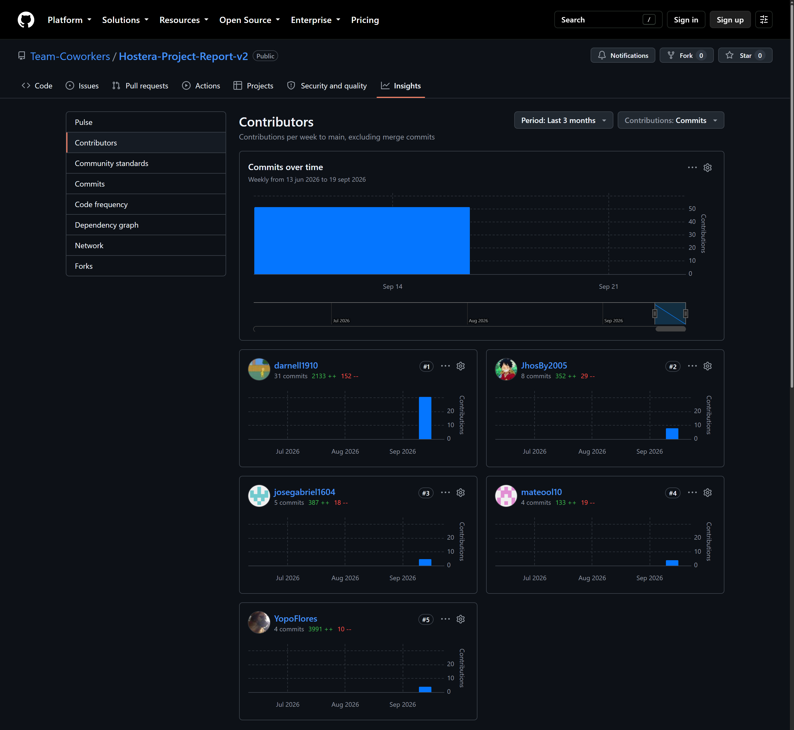

*Evidencia 1. Analíticos de colaboradores del repositorio del Project Report en GitHub durante AV1.*

<div style="page-break-before: always;"></div>

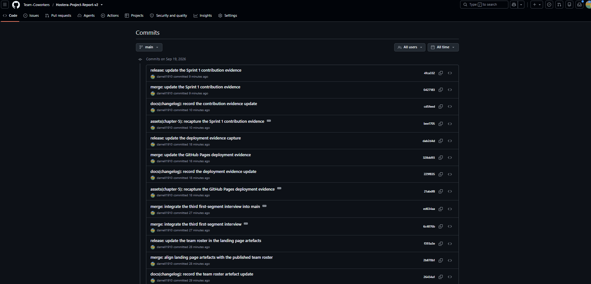

*Evidencia 2. Historial de commits de la rama `main` del repositorio del Project Report durante AV1.*

## TB1

## AV2

## TB2

<div style="page-break-before: always;"></div>

# Contenido

## Tabla de Contenidos

- [Project Report Collaboration Insights](#project-report-collaboration-insights)

- [Student Outcome](#student-outcome)

- [Capítulo I: Introducción](#capítulo-i-introducción)

- [1.1. Startup Profile](#11-startup-profile)
    - [1.1.1. Descripción de la Startup](#111-descripción-de-la-startup)
    - [1.1.2. Perfiles de integrantes del equipo](#112-perfiles-de-integrantes-del-equipo)
- [1.2. Solution Profile](#12-solution-profile)
    - [1.2.1. Antecedentes y problemática](#121-antecedentes-y-problemática)
        - [Técnica de The 5 'W's y 2 'H's](#técnica-de-the-5-ws-y-2-hs)
    - [1.2.2. Lean UX Process](#122-lean-ux-process)
        - [1.2.2.1. Lean UX Problem Statement](#1221-lean-ux-problem-statement)
        - [1.2.2.2. Lean UX Assumptions](#1222-lean-ux-assumptions)
        - [1.2.2.3. Lean UX Hypothesis Statements](#1223-lean-ux-hypothesis-statements)
        - [1.2.2.4. Lean UX Canvas](#1224-lean-ux-canvas)
- [1.3. Segmentos objetivo](#13-segmentos-objetivo)

- [Capítulo II: Requirements Elicitation & Analysis](#capítulo-ii-requirements-elicitation--analysis)

- [2.1. Competidores](#21-competidores)
    - [2.1.1. Análisis competitivo](#211-análisis-competitivo)
    - [2.1.2. Estrategias y tácticas frente a competidores](#212-estrategias-y-tácticas-frente-a-competidores)
- [2.2. Entrevistas](#22-entrevistas)
    - [2.2.1. Diseño de entrevistas](#221-diseño-de-entrevistas)
    - [2.2.2. Registro de entrevistas](#222-registro-de-entrevistas)
    - [2.2.3. Análisis de entrevistas](#223-análisis-de-entrevistas)
- [2.3. Needfinding](#23-needfinding)
    - [2.3.1. User Personas](#231-user-personas)
    - [2.3.2. User Task Matrix](#232-user-task-matrix)
    - [2.3.3. User Journey Mapping](#233-user-journey-mapping)
    - [2.3.4. Empathy Mapping](#234-empathy-mapping)
- [2.4. Big Picture EventStorming](#24-big-picture-eventstorming)
- [2.5. Ubiquitous Language](#25-ubiquitous-language)

- [Capítulo III: Requirements Specification](#capítulo-iii-requirements-specification)

- [3.1. User Stories](#31-user-stories)
- [3.2. Impact Mapping](#32-impact-mapping)
- [3.3. Product Backlog](#33-product-backlog)

- [Capítulo IV: Product Design](#capítulo-iv-product-design)

- [4.1. Style Guidelines](#41-style-guidelines)
    - [4.1.1. General Style Guidelines](#411-general-style-guidelines)
    - [4.1.2. Web Style Guidelines](#412-web-style-guidelines)
- [4.2. Information Architecture](#42-information-architecture)
    - [4.2.1. Organization Systems](#421-organization-systems)
    - [4.2.2. Labeling Systems](#422-labeling-systems)
    - [4.2.3. SEO Tags and Meta Tags](#423-seo-tags-and-meta-tags)
    - [4.2.4. Searching Systems](#424-searching-systems)
    - [4.2.5. Navigation Systems](#425-navigation-systems)
- [4.3. Landing Page UI Design](#43-landing-page-ui-design)
    - [4.3.1. Landing Page Wireframe](#431-landing-page-wireframe)
    - [4.3.2. Landing Page Mock-up](#432-landing-page-mock-up)
- [4.4. Web Applications UX/UI Design](#44-web-applications-uxui-design)
    - [4.4.1. Web Applications Wireframes](#441-web-applications-wireframes)
    - [4.4.2. Web Applications Wireflow Diagrams](#442-web-applications-wireflow-diagrams)
    - [4.4.3. Web Applications Mock-ups](#443-web-applications-mock-ups)
    - [4.4.4. Web Applications User Flow Diagrams](#444-web-applications-user-flow-diagrams)
- [4.5. Web Applications Prototyping](#45-web-applications-prototyping)
- [4.6. Domain-Driven Software Architecture](#46-domain-driven-software-architecture)
    - [4.6.1. Design-Level EventStorming](#461-design-level-eventstorming)
    - [4.6.2. Software Architecture Context Diagram](#462-software-architecture-context-diagram)
    - [4.6.3. Software Architecture Container Diagrams](#463-software-architecture-container-diagrams)
    - [4.6.4. Software Architecture Components Diagrams](#464-software-architecture-components-diagrams)
- [4.7. Software Object-Oriented Design](#47-software-object-oriented-design)
    - [4.7.1. Class Diagrams](#471-class-diagrams)
- [4.8. Database Design](#48-database-design)
    - [4.8.1. Database Diagrams](#481-database-diagrams)

- [Capítulo V: Product Implementation, Validation & Deployment](#capítulo-v-product-implementation-validation--deployment)

- [5.1. Software Configuration Management](#51-software-configuration-management)
    - [5.1.1. Software Development Environment Configuration](#511-software-development-environment-configuration)
    - [5.1.2. Source Code Management](#512-source-code-management)
    - [5.1.3. Source Code Style Guide & Conventions](#513-source-code-style-guide--conventions)
    - [5.1.4. Software Deployment Configuration](#514-software-deployment-configuration)
- [5.2. Landing Page, Services & Applications Implementation](#52-landing-page-services--applications-implementation)
    - [5.2.1. Sprint 1](#521-sprint-1)
        - [5.2.1.1. Sprint Planning 1](#5211-sprint-planning-1)
        - [5.2.1.2. Aspect Leaders and Collaborators](#5212-aspect-leaders-and-collaborators)
        - [5.2.1.3. Sprint Backlog 1](#5213-sprint-backlog-1)
        - [5.2.1.4. Development Evidence for Sprint Review](#5214-development-evidence-for-sprint-review)
        - [5.2.1.5. Execution Evidence for Sprint Review](#5215-execution-evidence-for-sprint-review)
        - [5.2.1.6. Services Documentation Evidence for Sprint Review](#5216-services-documentation-evidence-for-sprint-review)
        - [5.2.1.7. Software Deployment Evidence for Sprint Review](#5217-software-deployment-evidence-for-sprint-review)
        - [5.2.1.8. Team Collaboration Insights during Sprint](#5218-team-collaboration-insights-during-sprint)

- [Conclusiones](#conclusiones)
    - [Conclusiones y recomendaciones](#conclusiones-y-recomendaciones)
    - [Video About-the-Team](#video-about-the-team)

- [Bibliografía](#bibliografía)

- [Anexos](#anexos)
    - [Anexo A. Videos de exposiciones](#anexo-a-videos-de-exposiciones)
    - [Anexo B. Documentos y artefactos complementarios](#anexo-b-documentos-y-artefactos-complementarios)

<div style="page-break-before: always;"></div>

# Student Outcome

| Criterio específico                                                                             | Acciones realizadas                                                                                                                                                                                                                                                                                                                                                                                                                                                                                                                                                                                                                                                                      | Conclusiones                                                                                                                                                                                                                                                                                                                                                                                                                                                                                                                                                                                                                                                                             |
| ----------------------------------------------------------------------------------------------- | ---------------------------------------------------------------------------------------------------------------------------------------------------------------------------------------------------------------------------------------------------------------------------------------------------------------------------------------------------------------------------------------------------------------------------------------------------------------------------------------------------------------------------------------------------------------------------------------------------------------------------------------------------------------------------------------- | ---------------------------------------------------------------------------------------------------------------------------------------------------------------------------------------------------------------------------------------------------------------------------------------------------------------------------------------------------------------------------------------------------------------------------------------------------------------------------------------------------------------------------------------------------------------------------------------------------------------------------------------------------------------------------------------- |
| Trabaja en equipo para proporcionar liderazgo en forma conjunta                                 | **AV1**<br>**Cuba Vega, Darnell Yadir**<br>Lideré US002, definiendo la navegación primaria y secundaria, la página de términos y el menú móvil de la Landing Page, y colaboré en la integración del Sprint 1 mediante Git Flow. Además, documenté el backlog, la matriz de liderazgo y colaboración, la evidencia de ejecución y despliegue, las convenciones de código, el prototipo web, los diagramas de clases y el Design-Level EventStorming.<br>**Flores Rios, Juan Diego**<br>Lideré US004 y US006, definiendo el camino de la cadena hotelera pequeña, el plan Professional, el camino del grupo hotelero, el plan Enterprise y las acciones de cierre de la Landing Page, y participé en la integración mediante Git Flow. También colaboré en el análisis de impactos y en el diseño de los artefactos del producto.<br>**Leon Naupari, Jorge Mateo**<br>Preparé el Sprint Planning 1 y lideré US001, definiendo la propuesta de valor, la vista previa del panel y el relato de la operación fragmentada, además de participar en la integración mediante Git Flow. También contribuí en la definición de segmentos, User Stories, Product Backlog y diseño de la Landing Page.<br>**Rudas Chavarria, Jose Gabriel**<br>Lideré US003 y US007, definiendo el camino del hotel independiente, el plan Free, el contenido de producto y equipo, y la sección de soporte, y participé en la integración mediante Git Flow. También contribuí al análisis competitivo y a la definición del problema, assumptions e hipótesis de Lean UX.<br>**Santana Luna, José Antonio**<br>Lideré US005 y US008, definiendo los beneficios de operaciones conectadas, el flujo operativo y las variantes de idioma de la Landing Page. También participé en la documentación colaborativa de entrevistas, arquitectura y gestión del proyecto.<br><br>**TB1**<br>**Cuba Vega, Darnell Yadir**<br>**Flores Rios, Juan Diego**<br>**Leon Naupari, Jorge Mateo**<br>**Rudas Chavarria, Jose Gabriel**<br>**Santana Luna, José Antonio**<br><br>**AV2**<br>**Cuba Vega, Darnell Yadir**<br>**Flores Rios, Juan Diego**<br>**Leon Naupari, Jorge Mateo**<br>**Rudas Chavarria, Jose Gabriel**<br>**Santana Luna, José Antonio**<br><br>**TB2**<br>**Cuba Vega, Darnell Yadir**<br>**Flores Rios, Juan Diego**<br>**Leon Naupari, Jorge Mateo**<br>**Rudas Chavarria, Jose Gabriel**<br>**Santana Luna, José Antonio** | **AV1**<br>**Cuba Vega, Darnell Yadir**<br>Mi conclusión es que mi participación combinó liderazgo funcional y documentación técnica, ayudando a mantener alineadas las responsabilidades del equipo y la evolución del producto.<br>**Flores Rios, Juan Diego**<br>Mi conclusión es que mi trabajo conectó la estrategia del producto con una experiencia clara para cadenas pequeñas y grupos hoteleros.<br>**Leon Naupari, Jorge Mateo**<br>Mi conclusión es que mi liderazgo combinó coordinación y ejecución técnica, facilitando que el equipo avanzara de forma integrada desde el análisis hasta la implementación.<br>**Rudas Chavarria, Jose Gabriel**<br>Mi conclusión es que mi trabajo conectó el análisis del usuario con una experiencia concreta para hoteles independientes y con el contenido que sustenta la propuesta.<br>**Santana Luna, José Antonio**<br>Mi conclusión es que mi trabajo conectó los beneficios operativos con un flujo comprensible y una base técnica para continuar el producto.<br><br>**TB1**<br>**Cuba Vega, Darnell Yadir**<br>**Flores Rios, Juan Diego**<br>**Leon Naupari, Jorge Mateo**<br>**Rudas Chavarria, Jose Gabriel**<br>**Santana Luna, José Antonio**<br><br>**AV2**<br>**Cuba Vega, Darnell Yadir**<br>**Flores Rios, Juan Diego**<br>**Leon Naupari, Jorge Mateo**<br>**Rudas Chavarria, Jose Gabriel**<br>**Santana Luna, José Antonio**<br><br>**TB2**<br>**Cuba Vega, Darnell Yadir**<br>**Flores Rios, Juan Diego**<br>**Leon Naupari, Jorge Mateo**<br>**Rudas Chavarria, Jose Gabriel**<br>**Santana Luna, José Antonio** |
| Crea un entorno colaborativo e inclusivo, establece metas, planifica tareas y cumple objetivos. | **AV1**<br>**Cuba Vega, Darnell Yadir**<br>Definí y organicé las tareas del Sprint 1 para US002, descomponiendo la navegación primaria y secundaria, la página de términos y el menú móvil. También elaboré evidencias de desarrollo, ejecución y despliegue, y documenté arquitectura, convenciones y prototipos para contribuir al cumplimiento de las ocho User Stories y la publicación de la Landing Page.<br>**Flores Rios, Juan Diego**<br>Definí y organicé las tareas del Sprint 1 para US004 y US006, descomponiendo el camino de la cadena pequeña, la comparación de planes y las acciones de cierre. Además documenté User Stories y servicios de inventario, elaboré mockups de alta fidelidad y contribuí al Impact Mapping y a los sistemas de búsqueda y organización.<br>**Leon Naupari, Jorge Mateo**<br>Definí el objetivo y la métrica del sprint, organicé el backlog y las tareas de US001, y contribuí al cumplimiento de 8/8 User Stories y al despliegue en GitHub Pages. Además, documenté estándares, estructura del informe y evidencias del proceso.<br>**Rudas Chavarria, Jose Gabriel**<br>Definí las tareas y artefactos de US003 y US007; elaboré wireframes y wireflows, documenté User Stories y servicios de habitaciones, y aporté al diseño de la solución.<br>**Santana Luna, José Antonio**<br>Definí las tareas y artefactos de US005 y US008; documenté entrevistas y su análisis, servicios de RFID y reporting, diagramas de arquitectura y la configuración de los repositorios.<br><br>**TB1**<br>**Cuba Vega, Darnell Yadir**<br>**Flores Rios, Juan Diego**<br>**Leon Naupari, Jorge Mateo**<br>**Rudas Chavarria, Jose Gabriel**<br>**Santana Luna, José Antonio**<br><br>**AV2**<br>**Cuba Vega, Darnell Yadir**<br>**Flores Rios, Juan Diego**<br>**Leon Naupari, Jorge Mateo**<br>**Rudas Chavarria, Jose Gabriel**<br>**Santana Luna, José Antonio**<br><br>**TB2**<br>**Cuba Vega, Darnell Yadir**<br>**Flores Rios, Juan Diego**<br>**Leon Naupari, Jorge Mateo**<br>**Rudas Chavarria, Jose Gabriel**<br>**Santana Luna, José Antonio** | **AV1**<br>**Cuba Vega, Darnell Yadir**<br>Mi conclusión es que la planificación y la documentación que realicé hicieron trazable el trabajo del sprint y ayudaron a convertir el backlog en una entrega publicada.<br>**Flores Rios, Juan Diego**<br>Mi conclusión es que los artefactos de impacto, diseño e inventario facilitaron una visión trazable de las necesidades y funcionalidades.<br>**Leon Naupari, Jorge Mateo**<br>Mi conclusión es que mi trabajo ayudó a convertir objetivos y tareas compartidas en artefactos trazables y una entrega funcional.<br>**Rudas Chavarria, Jose Gabriel**<br>Mi conclusión es que los artefactos que elaboré hicieron más clara y trazable la transición desde las necesidades hasta la implementación.<br>**Santana Luna, José Antonio**<br>Mi conclusión es que la documentación de investigación, arquitectura y configuración hizo más trazable la evolución del proyecto.<br><br>**TB1**<br>**Cuba Vega, Darnell Yadir**<br>**Flores Rios, Juan Diego**<br>**Leon Naupari, Jorge Mateo**<br>**Rudas Chavarria, Jose Gabriel**<br>**Santana Luna, José Antonio**<br><br>**AV2**<br>**Cuba Vega, Darnell Yadir**<br>**Flores Rios, Juan Diego**<br>**Leon Naupari, Jorge Mateo**<br>**Rudas Chavarria, Jose Gabriel**<br>**Santana Luna, José Antonio**<br><br>**TB2**<br>**Cuba Vega, Darnell Yadir**<br>**Flores Rios, Juan Diego**<br>**Leon Naupari, Jorge Mateo**<br>**Rudas Chavarria, Jose Gabriel**<br>**Santana Luna, José Antonio** |

# Capítulo I: Introducción

## 1.1. Startup Profile

### 1.1.1. Descripción de la Startup

Team Coworkers es una startup tecnológica enfocada en desarrollar soluciones digitales innovadoras para la gestión y operación del sector hotelero. Nuestro propósito es ayudar a los hoteles a trabajar de manera más ordenada, segura y eficiente mediante herramientas accesibles, centralizadas y escalables que permitan supervisar la operación diaria y tomar decisiones basadas en información actualizada.

Nuestra solución es Hostera, una plataforma web administrativa que centraliza la gestión de reservas, la disponibilidad de habitaciones, el inventario del almacén y el control de accesos físicos. A través de un panel de monitoreo en tiempo real, Hostera permite visualizar el estado de la operación hotelera desde un solo lugar, reduciendo errores de sobreventa, mejorando la visibilidad del stock y facilitando el control de las habitaciones.

Hostera incorpora una solución de Internet de las Cosas (IoT) basada en tarjetas RFID y lectores RFID para gestionar el acceso de huéspedes y personal autorizado. Esta integración permite asociar tarjetas con habitaciones, validar los accesos y mantener un registro de las entradas, fortaleciendo la seguridad y proporcionando mayor control sobre los espacios del hotel.

La propuesta de Team Coworkers se centra en construir un ecosistema de gestión hotelera conectado, intuitivo y preparado para crecer. Hostera puede adaptarse a la operación de un hotel individual y replicarse en distintas sedes de una cadena, manteniendo la información organizada y ofreciendo una visión consolidada de reservas, habitaciones, inventario y accesos.

**Misión:** Desarrollar herramientas digitales accesibles, seguras y eficientes que permitan a los hoteles gestionar sus reservas, habitaciones, inventario y accesos en tiempo real, mejorando la operación diaria y la experiencia de sus equipos y huéspedes.

**Visión:** En los próximos cinco años, consolidar a Team Coworkers como una empresa referente en soluciones de gestión hotelera en Latinoamérica, reconocida por conectar la operación de los hoteles mediante tecnología innovadora, escalable y orientada a la eficiencia y la seguridad.

**Alcance del proyecto:** El alcance inicial de Hostera comprende una plataforma web administrativa para centralizar el monitoreo de reservas, disponibilidad de habitaciones, inventario del almacén y accesos físicos mediante tarjetas y lectores RFID. La solución está diseñada para ofrecer visibilidad en tiempo real, reducir inconsistencias operativas y facilitar la administración de una o varias sedes desde un único panel. A mediano plazo, buscamos ampliar sus capacidades de automatización, análisis y control para acompañar el crecimiento de hoteles y cadenas hoteleras en Latinoamérica.

### 1.1.2. Perfiles de integrantes del equipo

| Foto                                                                                                              | Apellidos y Nombres              | Código     | Carrera                | Habilidades                                                                                                                                                                           |
| ----------------------------------------------------------------------------------------------------------------- | -------------------------------- | ---------- | ---------------------- | ------------------------------------------------------------------------------------------------------------------------------------------------------------------------------------- |
|    | Cuba Vega, Darnell Yadir         | u202410105 | Ingeniería de Software |   Python, HTML, CSS y C++. Dispuesto a trabajar, apoyar y aprender en equipo.                                                                                                                                                                                     |
|       | Flores Rios, Juan Diego          | U202412124 | Ingeniería de Software | HTML, CSS y C++. Me adapto a cualquier entorno de trabajo, siempre brindando el mayor apoyo posible.                                                                                |
|  | Leon Naupari, Jorge Mateo | u202422549 | Ingeniería de Software | HTML, CSS, JavaScript y C++. Dispuesto a trabajar y aprender en equipo, con facilidad para adaptarse a nuevas herramientas. |
|  | Rudas Chavarria, Jose Gabriel | u202410062 | Ingeniería de Software | HTML, CSS, JavaScript y Python. Colaborativo, organizado y dispuesto a aprender nuevas tecnologías. |
|  | Santana Luna, José Antonio       | U20241E281 | Ingeniería de Software | Lean UX, análisis de entrevistas, arquitectura de software, EventStorming, diseño de APIs y documentación técnica. Organizado y orientado a la colaboración y la trazabilidad. |

## 1.2. Solution Profile

### 1.2.1. Antecedentes y problemática

Esta sección describe el problema que Hostera busca atender. El análisis se organizó
con la técnica 5W+2H, una herramienta para describir un problema y concentrarse en
sus causas antes de plantear una solución (Progressa Lean, 2021). Las respuestas se
apoyan en las seis entrevistas en video registradas en la sección 2.2, identificadas con
los códigos `E1` a `E6`, y en las cifras del sector publicadas por el Ministerio de
Comercio Exterior y Turismo.

#### Técnica de The 5 'W's y 2 'H's

**What (¿Qué?)**

**¿Cuál es el problema?**

Los hoteles pequeños registran cada parte de su operación en un lugar distinto. La
reserva se anota en un sistema de reservas o en una hoja de cálculo, el almacén se
controla con inventarios periódicos o por WhatsApp, y los accesos a las habitaciones,
cuando se registran, quedan en papel o en un sistema de tarjetas aparte. Los dos
entrevistados que administran una sola sede concilian parte de su operación en hojas de
Excel (`E1`, `E2`), y el gerente de una cadena de tres sedes combina un PMS básico en dos
sedes con hojas de cálculo en la tercera (`E3`).

El resultado es que nadie tiene a la vista el estado completo del hotel. Para saber
qué habitación está libre, qué insumo falta o quién entró a una habitación, alguien
tiene que reunir esa información a mano.

**When (¿Cuándo?)**

**¿Cuándo se presenta el problema?**

El problema aparece en los momentos en que una parte de la operación depende de otra.
Ante una reserva duplicada, el administrador revisa el sistema de reservas y su hoja de
Excel y corrige la distribución a mano (`E1`). En el cierre de caja se reconstruyen los
reportes del día a partir de registros físicos (`E2`). Cuando el responsable no está en
el hotel, necesita varios minutos de llamadas y mensajes para saber qué está ocurriendo
(`E1`).

En las operaciones de varias sedes el momento crítico es la consolidación diaria, que
toma alrededor de cuarenta minutos y se hace con datos ya desactualizados (`E3`), y la
sobreventa, que obliga a coordinar con otra sede para derivar al huésped (`E5`).

**Where (¿Dónde?)**

**¿En qué lugares o procesos se presenta?**

El problema se ubica en la recepción, donde se registran las reservas y se atiende al
huésped; en el almacén, donde los faltantes se detectan recién en el inventario
periódico o cuando un trabajador avisa (`E1`); y en el control de acceso a las
habitaciones, donde reconstruir un evento exige consultar registros o preguntar al
encargado (`E1`).

Cuando el negocio tiene más de una sede, el problema se traslada al espacio entre
ellas. El inventario se coordina por WhatsApp y las transferencias entre sedes no se
registran, lo que produce diferencias de stock y compras duplicadas, y cada sede
administra sus accesos a su manera, sin un registro centralizado (`E3`).

**Who (¿Quién?)**

**¿A quiénes afecta el problema?**

Afecta en primer lugar a quien responde por la operación: el administrador o
propietario de un hotel independiente de una sede y el responsable de operaciones de
una cadena de dos a cinco sedes. También afecta al personal de recepción, a los
encargados del almacén y al personal autorizado que gestiona los accesos, que
trabajan cada uno con una parte distinta de la información.

Los huéspedes lo sufren de forma indirecta. Como resume uno de los entrevistados, un
problema en reservas, en el almacén o en los accesos termina afectando la experiencia
del huésped (`E1`).

**Why (¿Por qué?)**

**¿Por qué se presenta el problema?**

Porque las herramientas que usan estos hoteles resuelven partes separadas de la
operación. Los sistemas hoteleros disponibles cubren la reserva y la tarifa, pero el
almacén y el acceso físico quedan fuera o se resuelven con plataformas adicionales: el
gerente general entrevistado paga cerca de USD 1 500 al año por propiedad solo por una
plataforma para el área de ama de llaves (`E5`). Quienes no tienen un sistema hotelero
sostienen todo con hojas de cálculo, registros en papel y mensajes (`E2`).

A eso se suma el tamaño de las operaciones. En un equipo de pocas personas, la misma
persona registra reservas, atiende la recepción y controla el almacén, así que cada
traslado manual de información le quita tiempo a la atención.

**How (¿Cómo?)**

**¿Cómo se manifiesta y se diferencia del estado esperado?**

En el estado esperado, registrar una reserva actualiza la disponibilidad de la
habitación, un ingreso o una salida del almacén actualiza las existencias, y cada
acceso queda asociado a una tarjeta, una habitación y una persona.

En la situación actual esos cambios no se propagan. Un administrador con sistema de
reservas mantiene controles adicionales en Excel y concilia ambos a mano (`E1`). En un
hospedaje, los accesos se anotan en papel y luego se pasan a Excel (`E2`). En una cadena
de tres sedes, cada sede usa herramientas distintas y nadie registra las transferencias
de inventario ni desactiva las credenciales de quien deja la empresa (`E3`).

**How Much (¿Cuánto?)**

**¿Cuánto cuesta el problema?**

El problema se mide primero en tiempo. En la cadena de tres sedes, consolidar la
información toma alrededor de cuarenta minutos diarios (`E3`): unas 20 horas al mes de
una sola persona. En el hotel independiente, cada consulta del estado de la operación
desde fuera del hotel cuesta varios minutos de llamadas y mensajes (`E1`).

También se mide en incidentes: reservas duplicadas que se corrigen a mano (`E1`),
diferencias de stock y compras duplicadas por transferencias no registradas, y
decisiones tomadas con datos desactualizados (`E3`).

El alcance del problema lo da el tamaño del sector. En 2024 el Perú tenía 28 050
establecimientos de hospedaje y 329 340 habitaciones, y el 85,1 % de esos
establecimientos no estaba categorizado (MINCETUR, 2025), lo que describe un mercado
formado sobre todo por operaciones pequeñas. Estas operaciones ya pagan por resolver
partes del problema: la plataforma de housekeeping de `E5` cuesta cerca de USD 1 500 al
año por propiedad, y `E2` evalúa financiar con un banco un sistema de reservas para la
temporada 2027.

**Costo de referencia de la solución.** Como referencia para el equipo, se estimó el
costo de desarrollar un producto mínimo viable de software. Los montos son una
estimación de planificación, no una cotización comercial.

| Componente                                                                |            Costo estimado |
| ------------------------------------------------------------------------- | ------------------------: |
| Diseño UX/UI y prototipo del dashboard web                                |       S/ 2,500 a S/ 4,000 |
| Desarrollo frontend del dashboard administrativo                          |       S/ 4,000 a S/ 6,000 |
| Backend, API y base de datos                                              |       S/ 4,000 a S/ 6,500 |
| Integración del software de control de accesos RFID y registro de eventos |       S/ 2,500 a S/ 4,000 |
| Pruebas, documentación y configuración del despliegue                     |       S/ 1,500 a S/ 2,500 |
| Dominio, hosting y servicios de infraestructura (anual)                   |       S/ 1,200 a S/ 2,000 |
| **Total estimado de software**                                            | **S/ 15,700 a S/ 25,000** |

Esta estimación no incluye la compra de tarjetas, lectores RFID u otro hardware
físico, ni los costos de operación del hotel.

Los aspectos principales que la solución propuesta debe resolver son los siguientes:

1. **Centralización de la información:** reunir en un único panel la información de reservas, disponibilidad de habitaciones, inventario y accesos.
2. **Visibilidad operativa:** facilitar la consulta del estado actualizado de la operación para que el personal pueda identificar inconsistencias y actuar oportunamente.
3. **Coordinación entre procesos:** relacionar la asignación de habitaciones con la autorización y el registro de accesos mediante tarjetas y lectores RFID.
4. **Control del inventario:** permitir una supervisión más ordenada de las existencias del almacén y de sus cambios.
5. **Escalabilidad operativa:** permitir que la información de un hotel individual o de varias sedes pueda administrarse desde una plataforma común.

**Objetivo general.** Proponer y validar una plataforma web administrativa que centralice la
gestión de reservas, disponibilidad de habitaciones, inventario y accesos físicos, con el
fin de mejorar la visibilidad y la coordinación de la operación hotelera.

**Objetivos específicos.**

- Organizar en un solo espacio la información relevante para la supervisión diaria del hotel.
- Facilitar el seguimiento de reservas y disponibilidad para reducir inconsistencias operativas y riesgos de sobreventa.
- Integrar el control de accesos mediante tarjetas y lectores RFID, manteniendo un registro de las entradas autorizadas.
- Proporcionar una base que pueda adaptarse a la administración de una o varias sedes.
- Validar posteriormente, con usuarios representativos, si la solución responde a los problemas y necesidades identificados.

**Restricciones y delimitación.**

- El alcance inicial se limita a una plataforma web administrativa para monitorear reservas, habitaciones, inventario y accesos; no contempla reemplazar todos los sistemas comerciales o contables que un hotel pueda utilizar.
- El control físico de accesos depende de la disponibilidad y configuración de tarjetas y lectores RFID compatibles.
- La plataforma debe manejar la información de forma centralizada, pero la definición de reglas detalladas para cada hotel o sede deberá establecerse durante el levantamiento de requisitos.
- Las cifras de tiempo e incidentes provienen de seis entrevistas y describen a los entrevistados, no a todo el sector. La reducción de incidentes que logre la plataforma se medirá con las hipótesis de la sección 1.2.2.3.

### 1.2.2. Lean UX Process

#### 1.2.2.1. Lean UX Problem Statement

Hostera es una iniciativa nueva y no la evolución de un producto existente, por lo que
su enunciado del problema utiliza la plantilla de Lean UX correspondiente a una
*brand new initiative*. El enunciado se apoya en las seis entrevistas registradas en la
sección 2.2 y en las cifras del sector publicadas por el Ministerio de Comercio Exterior
y Turismo.

**Enunciado del problema**

El estado actual de la gestión hotelera en el Perú se ha centrado en resolver por
separado la captación de la reserva, la ocupación de las habitaciones, el
abastecimiento del almacén y el acceso físico a las habitaciones. El sector reúne
28 050 establecimientos de hospedaje y 329 340 habitaciones, y el 85,1 % de esos
establecimientos no está categorizado (MINCETUR, 2025), lo que describe un mercado
dominado por operaciones pequeñas que resuelven su gestión con las herramientas que
tienen a la mano. Las entrevistas lo confirman: los dos responsables de un
establecimiento de una sede concilian reservas, accesos o almacén en hojas de Excel, y
coordinan su operación por mensajes, WhatsApp y llamadas.

Lo que las herramientas existentes no resuelven es la conexión entre el canal por el
que entra la reserva y el registro donde se controla la operación. Los sistemas de
gestión hotelera disponibles atienden la reserva y la tarifa, pero dejan fuera el
almacén y el acceso físico, o los resuelven con plataformas separadas que se contratan
aparte: el gerente general entrevistado paga cerca de USD 1 500 anuales por propiedad
solo por la plataforma de ama de llaves. En las operaciones de varias sedes que
comparten administración, la consecuencia es que consolidar la información cuesta
alrededor de cuarenta minutos diarios y que las decisiones se toman con datos
desactualizados.

Hostera atenderá esta brecha con una plataforma administrativa que mantiene en un
mismo lugar las reservas, la disponibilidad de habitaciones, el inventario del almacén
y los accesos con tarjeta RFID, con la propiedad activa como contexto de trabajo, de
modo que el responsable de la operación deje de reconstruir el estado de su hotel a
partir de registros separados.

Nuestro foco inicial serán los administradores y propietarios de hoteles
independientes de una sede y los responsables de operaciones de cadenas de dos a cinco
sedes, porque son quienes concentran la decisión de compra y sufren directamente el
costo de la conciliación manual.

Sabremos que hemos tenido éxito cuando Team Coworkers alcance 50 suscripciones de pago
activas en el plan Starter durante los primeros cuatro meses de lanzamiento, 20
cadenas pequeñas en el plan Professional en seis meses y una retención mensual del
90 % sostenida por el uso de la plataforma al menos cinco días a la semana.

**Domain:** Gestión y operación hotelera de establecimientos independientes y cadenas
pequeñas, incluyendo reservas, disponibilidad de habitaciones, control de inventario
del almacén y gestión de accesos físicos.

**Customer Segments:**

- Administradores y propietarios de hoteles independientes de una sede.
- Responsables de operaciones de cadenas hoteleras de dos a cinco sedes.
- Personal de recepción, encargados del almacén y personal autorizado que gestiona
  accesos, como usuarios operativos dentro de esas organizaciones.

**Pain Points:**

- La información está repartida entre un sistema, hojas de cálculo, papel y el
  personal, lo que obliga a trasladarla y conciliarla a mano. Los dos entrevistados de
  una sede declaran esa carga.
- Las reservas duplicadas se corrigen a mano y los faltantes del almacén se detectan
  recién en el inventario periódico.
- Consolidar la información de varias sedes toma alrededor de cuarenta minutos diarios,
  y las transferencias de inventario entre sedes no quedan registradas.
- Sin un registro centralizado de accesos, reconstruir quién entró a una habitación
  exige preguntar al personal, y las credenciales de quien deja la empresa no se
  desactivan a tiempo.
- Los sistemas hoteleros disponibles cubren reservas y tarifas, pero el almacén y el
  acceso físico se resuelven con plataformas adicionales que se contratan por separado.

**Gap:** No existe una plataforma que mantenga relacionadas las reservas, las
habitaciones, el inventario y los accesos para una operación de una a cinco sedes a un
precio accesible para ese tamaño de negocio. Las alternativas obligan a elegir entre un
sistema hotelero que deja fuera el almacén y los accesos, o varias herramientas
contratadas por separado cuyo costo es difícil de sostener para una operación de ese tamaño.

**Vision/Strategy:** Hostera centraliza la operación diaria del hotel alrededor de la
propiedad activa y comercializa esa capacidad como suscripción mensual, con un plan
Starter para una sede y un plan Professional por habitación para operaciones de varias
sedes. La estrategia prioriza primero las reservas y la disponibilidad, después el
inventario del almacén y los reportes, y finalmente la trazabilidad de los accesos con
tarjeta RFID.

**Initial Segment:** Los administradores y propietarios de hoteles independientes de
una sede, porque deciden la compra sin intermediarios, cargan con la conciliación
manual de toda la operación y constituyen la base del plan Starter.

**Success Criteria:** Los criterios de éxito de la iniciativa son los objetivos de
negocio de Team Coworkers definidos en la sección 3.2: 50 suscripciones de pago activas
en el plan Starter en cuatro meses, 20 cadenas pequeñas en el plan Professional y un
10 % de clientes Starter que actualicen su plan en seis meses, y una retención mensual
del 90 % con uso de la plataforma al menos cinco días a la semana.

#### 1.2.2.2. Lean UX Assumptions

Los siguientes supuestos representan las creencias del equipo sobre el negocio, los resultados esperados, los perfiles de usuario y las capacidades de Hostera. Se han formulado exclusivamente como enunciados de creencias, omitiendo formatos de pregunta, para alinear la estrategia con nuestro modelo B2B SaaS (planes *Starter* y *Professional*) y nuestros dos segmentos objetivo.

**Business Assumptions**
*Creencias de alto nivel sobre la posición en el mercado, viabilidad, estrategia de monetización y capacidades organizativas.*
1. Creemos que los hoteles independientes y las cadenas pequeñas en Perú tienen la disposición de pagar una suscripción SaaS (Software as a Service) desde el primer día si la plataforma centraliza su operación.
2. Creemos que un modelo de monetización escalonado (plan *Starter* de S/39 para 1 sede y plan *Professional* de S/8 por habitación para cadenas) nos permitirá adquirir, rentabilizar y expandir clientes de forma escalable.
3. Creemos que nuestra principal ventaja competitiva en el mercado será la integración nativa del control de acceso RFID con la gestión de reservas en la nube.
4. Creemos que el equipo de Team Coworkers posee las capacidades organizativas y técnicas para desarrollar, desplegar y mantener una arquitectura web segura orientada al sector hotelero.
5. Creemos que adquiriremos la mayoría de los clientes del plan *Starter* a través de la Landing Page, con un flujo de registro automatizado que les permita comprender los planes y configurar su propiedad inicial sin depender de un equipo de ventas.

**Business Outcome Assumptions**
*Cambios o métricas medibles que indican el éxito de la empresa.*
1. Creemos que lograremos 50 suscripciones activas de pago en el plan *Starter* a través de nuestra Landing Page durante los primeros 4 meses de lanzamiento.
2. Creemos que 20 cadenas hoteleras pequeñas contratarán el plan *Professional*, y que el 10% de nuestros clientes *Starter* actualizarán a este plan en un periodo de 6 meses.
3. Creemos que mantendremos una tasa de retención mensual del 90% asegurando que el producto sea indispensable en el uso diario.
4. Creemos que reduciremos significativamente nuestro costo de adquisición de clientes (CAC) al permitir un flujo de registro y *onboarding* automatizado (Self-Service) para los hoteles de una sola sede.

**User Assumptions**
*Perfiles de usuario específicos, segmentos de clientes o actores que interactúan con el sistema.*
1. Creemos que nuestro usuario principal para el plan *Starter* es el administrador o propietario de un hotel independiente (ej. Steven Huarcaya), quien supervisa directamente la continuidad diaria de una sola sede.
2. Creemos que nuestro usuario principal para el plan *Professional* es la gerente de operaciones de una pequeña cadena (ej. Anyeli Cárdenas), cuya responsabilidad es coordinar el rendimiento y recursos de 2 a 5 locaciones.
3. Creemos que estos usuarios operan actualmente en un ecosistema fragmentado, resolviendo su coordinación mediante WhatsApp, Excel y registros físicos propensos a errores.
4. Creemos que estos usuarios interactuarán con Hostera diariamente, empleando la plataforma web tanto en computadoras de escritorio (recepción) como en dispositivos móviles (supervisión remota).

**User Outcome and Benefit Assumptions**
*Objetivos específicos que los usuarios desean alcanzar y el valor que obtienen.*
1. Creemos que los administradores de hoteles independientes obtendrán el valor de reducir el tiempo que dedican a conciliar manualmente la disponibilidad de habitaciones y la caja diaria.
2. Creemos que los gerentes de cadenas obtendrán el beneficio de tomar decisiones operativas seguras basándose en reportes analíticos consolidados por cada propiedad, sin riesgo de cruzar información.
3. Creemos que el personal operativo logrará brindar mayor seguridad y rapidez a los huéspedes al emitir, auditar y revocar llaves físicas (RFID) directamente desde el detalle de la reserva.
4. Creemos que los encargados de almacén evitarán el desabastecimiento repentino de suministros de limpieza y comodidades gracias a la visibilidad anticipada de sus existencias.

**Feature Assumptions**
*Soluciones funcionales, herramientas o mejoras del producto a desarrollar.*
1. Creemos que un **panel de la propiedad activa** que reúna ocupación, habitaciones, inventario y accesos permitirá a los administradores conocer el estado actual de su hotel sin consultar otros registros.
2. Creemos que un **módulo de reservas y estancias sobre un mismo calendario** permitirá registrar la reserva, el pago y el check-in del huésped en un mismo flujo y evitará las dobles reservas.
3. Creemos que un **sistema de control de inventario con alertas automáticas** notificará los niveles críticos de stock a los administradores antes de que afecten la operatividad del hotel.
4. Creemos que un **módulo de analítica y reportes operativos multi-sede** permitirá a los gerentes de cadenas filtrar y comparar el rendimiento (ocupación, ingresos, accesos) respetando la separación de datos de cada establecimiento.
5. Creemos que una **API de codificación RFID integrada con la estancia** permitirá relacionar la identidad del huésped, el pago y su acceso físico a la habitación en un solo paso durante el check-in, y conservar el historial de cada acceso.

Cada Feature Assumption se convierte en uno de los Hypothesis Statements de la
siguiente sección, en el mismo orden. Los supuestos de mayor riesgo son los de
resultado de negocio, porque dependen de un comportamiento que todavía no se ha
observado.

#### 1.2.2.3. Lean UX Hypothesis Statements

Cada hipótesis aplica la plantilla de Lean UX: relaciona un resultado de negocio de
Team Coworkers con la persona que obtiene el beneficio y con la característica que lo
produce. Las personas corresponden a los arquetipos de la sección 2.3.1, las métricas
provienen de los objetivos de negocio de la sección 3.2 y las señales de confirmación
parten de lo que los entrevistados describieron en la sección 2.2.

**Hipótesis 1: Panel de la propiedad activa**

Creemos que lograremos **50 suscripciones de pago activas en el plan Starter durante
los primeros cuatro meses** si **Steven Huarcaya**, administrador de un hotel
independiente de una sede, obtiene **el estado actual de su propiedad sin abrir su
hoja de cálculo ni llamar a recepción** con **el panel de la propiedad activa**.

*Señal que lo confirma:* consultar el estado de la operación deja de requerir los
varios minutos de llamadas y mensajes que describe `E1` y se resuelve en el panel en
menos de un minuto, y la hoja de cálculo de apoyo deja de usarse durante el periodo de
prueba.

**Hipótesis 2: Reservas y disponibilidad sobre un mismo calendario**

Creemos que lograremos **una retención mensual del 90 % con uso de la plataforma al
menos cinco días a la semana** si **el personal de recepción de Steven** obtiene
**la disponibilidad y el estado de una reserva en el momento de atender al huésped**
con **la consulta y el registro de reservas sobre un mismo calendario**.

*Señal que lo confirma:* las reservas duplicadas que `E1` corrige a mano comparando su
sistema con su hoja de Excel dejan de registrarse durante un mes completo de operación.

**Hipótesis 3: Control de existencias por ubicación de almacén**

Creemos que lograremos **que el 10 % de los clientes del plan Starter actualicen al
plan Professional en seis meses** si **Steven** obtiene **la alerta de un insumo por
debajo de su umbral antes de que falte** con **el control de existencias por ubicación
de almacén**. Las alertas automáticas de stock crítico forman parte del plan
Professional, por lo que esta capacidad es la que motiva el cambio de plan.

*Señal que lo confirma:* los faltantes dejan de descubrirse en el inventario periódico,
como hoy ocurre en el hotel de `E1`, porque cada insumo bajo su umbral genera una alerta
antes de agotarse, y los clientes Starter que activan las alertas pasan al plan
Professional.

**Hipótesis 4: Reportes por propiedad y cambio de propiedad activa**

Creemos que lograremos **20 cadenas hoteleras pequeñas en el plan Professional en seis
meses** si **Anyeli Cárdenas**, responsable de operaciones de una cadena de dos a cinco
sedes, obtiene **el consolidado de todas sus sedes ya construido** con **los reportes
por propiedad y periodo y el cambio de propiedad activa**.

*Señal que lo confirma:* los alrededor de cuarenta minutos diarios que `E3` dedica a
consolidar la información de sus tres sedes bajan a una consulta de menos de cinco
minutos dentro de la plataforma, y las transferencias de inventario entre sedes quedan
registradas.

**Hipótesis 5: Trazabilidad de los accesos con credenciales RFID**

Creemos que lograremos **una retención mensual del 90 % con uso diario del control
de accesos RFID** si **Steven y el personal autorizado** obtienen **la identificación
de quién accedió a una habitación y en qué momento** con **la relación entre credencial
RFID, habitación y persona y su historial de eventos**.

*Señal que lo confirma:* reconstruir un evento de acceso deja de requerir preguntar al
encargado, como describe `E1`, porque cada acceso del periodo de prueba queda asociado
a una credencial, una habitación y una persona, y las credenciales de quien deja la
empresa se revocan el mismo día, la falta que señala `E3`.

Las hipótesis 1 y 4 son las de mayor riesgo, porque sostienen directamente los
objetivos de adquisición y de expansión del negocio. Son las que deben contrastarse
primero en las sesiones de validación.

#### 1.2.2.4. Lean UX Canvas

El Lean UX Canvas sintetiza en una sola vista el resultado de las secciones
anteriores. Esta es la segunda iteración del lienzo: la primera se elaboró antes de
contar con las entrevistas, por lo que sus resultados de negocio todavía describían la
operación del hotel. La versión actual, fechada el 8 de octubre de 2026, después de
elaborar las personas de la sección 2.3.1, incorpora el problema descrito con datos del
sector y de las entrevistas, los resultados de negocio de Team Coworkers definidos en la
sección 3.2, las dos personas y las cinco hipótesis de la sección anterior. Las casillas
7 y 8 fijan el aprendizaje pendiente y el experimento mínimo para obtenerlo, que
corresponde al alcance del Sprint 2.

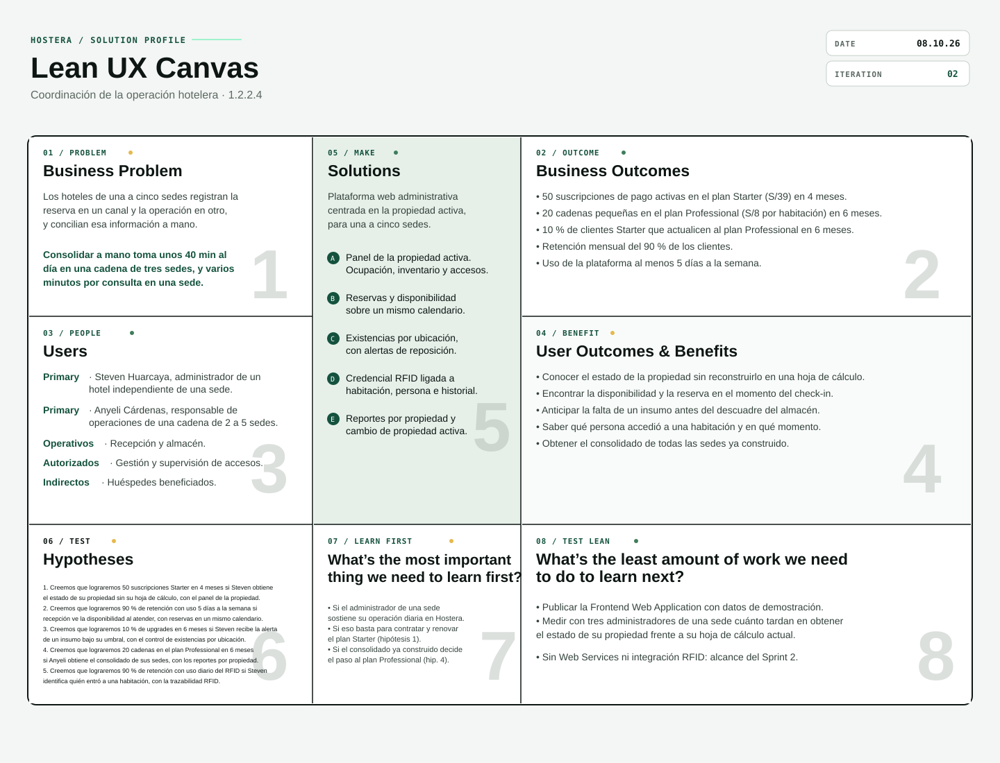

*Figura 1.1. Lean UX Canvas de Hostera, segunda iteración.*

## 1.3. Segmentos objetivo

Hostera está orientada a organizaciones del sector hotelero que necesitan coordinar
reservas, disponibilidad de habitaciones, inventario y accesos desde una plataforma
administrativa común. La segmentación considera el tipo de operación del hotel y el
rol de las personas responsables de tomar decisiones o supervisar estos procesos.
Debido a que se trata de una solución B2B, se consideran tanto características del
perfil de las personas como características empresariales del establecimiento, tales
como el número de sedes, el nivel de responsabilidad y la complejidad operativa.

Como contexto del mercado peruano, el Ministerio de Comercio Exterior y Turismo
(MINCETUR) reportó para 2024 una oferta promedio de 28 050 establecimientos de
hospedaje, 329 340 habitaciones y 567 292 plazas-cama. El 85,1 % de los
establecimientos no estaba categorizado y el 14,9 % estaba categorizado. Durante el
mismo año se registraron 57,6 millones de arribos, de los cuales el 88,4 % correspondió
a visitantes nacionales [4]. Estas cifras muestran la amplitud y diversidad del
sector, pero no clasifican directamente los establecimientos según propiedad
independiente o pertenencia a una cadena.

### 1.3.1. Administradores y propietarios de hoteles independientes

Este segmento está conformado por personas propietarias o administradoras que toman
decisiones y supervisan directamente la operación de un hotel independiente de una
sola sede. En este contexto, pueden participar en la gestión de reservas, la consulta
de disponibilidad, el control del almacén y la autorización o revisión de accesos.
Su necesidad principal es disponer de una visión consolidada de la operación sin
depender de registros separados o de conciliaciones manuales entre áreas.

Entre sus características relevantes se encuentran las siguientes:

- Responsabilidad directa sobre la continuidad y organización de la operación diaria.
- Gestión de un establecimiento ubicado en una única sede.
- Participación en decisiones administrativas y en la supervisión de varias áreas
  operativas.
- Necesidad de consultar información actualizada sin requerir sistemas independientes
  para cada proceso.

La importancia de este segmento se relaciona con la composición de la oferta peruana:
MINCETUR registró que el 85,1 % de los establecimientos de hospedaje no estaba
categorizado en 2024 [4]. Este indicador describe la estructura de categorización del
sector y no demuestra por sí solo que todos esos establecimientos sean independientes.
Las entrevistas muestran el perfil del segmento: Domínguez (`E1`) administra un hotel
independiente en Lima con un sistema de reservas apoyado en hojas de Excel, y Otto Cuba
(`E2`), accionista de un hospedaje de una sola sede en Huarmey, gestiona reservas,
habitaciones y accesos con registros manuales que luego traslada a Excel.

### 1.3.2. Gerentes o responsables de operaciones de pequeñas cadenas hoteleras

Este segmento está conformado por personas que supervisan la operación de una cadena
hotelera pequeña de dos a cinco sedes. Su responsabilidad consiste en coordinar y
comparar información de reservas, disponibilidad, inventario y accesos entre los
establecimientos, manteniendo la visibilidad de cada sede y una visión consolidada
del negocio.

Entre sus características relevantes se encuentran las siguientes:

- Responsabilidad sobre la coordinación operativa de varias sedes.
- Necesidad de comparar indicadores y estados sin mezclar la información de cada
  establecimiento.
- Supervisión de procesos que pueden ser ejecutados por equipos diferentes en cada
  sede.
- Interés en una plataforma que pueda crecer junto con la incorporación de nuevos
  establecimientos.

Para clasificar a los entrevistados se considera el grupo de establecimientos en cuya
operación participa la persona, y no el tamaño total de la marca. Forman parte del
segmento quienes trabajan en un grupo de dos a cinco establecimientos de un mismo
propietario, complejo o grupo inversionista, aunque esos hoteles lleven la marca de una
cadena internacional. Quedan fuera quienes administran seis o más establecimientos, como
las franquicias de gran tamaño.

Este segmento se relaciona con la concentración geográfica de la oferta hotelera
peruana. En 2024, Lima concentró el 27,6 % de los establecimientos de hospedaje,
seguida por Cusco (8,1 %), Arequipa (5,9 %), Junín (5,7 %) y La Libertad (4,6 %); estas
cinco regiones reunieron el 52,0 % de la oferta nacional [4]. La concentración no
confirma por sí misma la existencia de cadenas pequeñas, pero evidencia un contexto
en el que la coordinación entre sedes es relevante. Las entrevistas lo confirman: Odar
Quispe (`E3`) dedica alrededor de cuarenta minutos diarios a consolidar a mano la
información de las tres sedes que coordina, y Pier Paolo Spigno (`E5`) deriva huéspedes
entre sus dos sedes cuando hay sobreventa.

Los perfiles de recepción, almacén y control de accesos se consideran usuarios
operativos relacionados con estos dos segmentos. Los huéspedes son beneficiarios
indirectos de una operación más coordinada y no constituyen el usuario administrativo
principal del producto mínimo viable.

# Capítulo II: Requirements Elicitation & Analysis

## 2.1. Competidores

En esta sección se identifican y describen tres competidores directos de Hostera en
el mercado peruano. La selección considera proveedores que ofrecen productos
digitales para la gestión de establecimientos de hospedaje y que cubren, total o
parcialmente, los procesos que Hostera busca centralizar: reservas, disponibilidad de
habitaciones, inventario y supervisión de la operación. La información se basa en la
oferta pública de cada proveedor; por ello, la selección no pretende establecer un
ranking de participación de mercado.

**Nexus PMS de HotelClick.**

Nexus PMS es una plataforma web en la nube orientada a hoteles en Perú. Su propuesta
incluye la gestión de reservas, check-in y check-out, la sincronización con canales
como Booking.com, Airbnb, Expedia y Agoda, y la facturación electrónica integrada con
SUNAT. También ofrece control de inventarios con registro de entradas y salidas,
alertas de stock mínimo, usuarios con permisos y acceso desde computadoras y
dispositivos móviles (HotelClick, s.f.).

El proveedor ofrece una demostración inicial y contratación mediante un pago anual
que incluye los módulos, las actualizaciones y el soporte técnico. La plataforma
integra facturación, POS y distribución por OTAs, de acuerdo con la información
pública del proveedor (HotelClick, s.f.).

**OkFac.**

OkFac se presenta como un PMS hecho para hoteles peruanos. Incluye un calendario de
reservas, vista del estado de las habitaciones, check-in y check-out, housekeeping,
conexión con OTAs y emisión de comprobantes electrónicos mediante SUNAT (Montalvo Soluciones Tecnológicas S.A.C., s.f.). En su
plan Pro incorpora inventario, compras y gastos; el plan Enterprise añade reportes y
operación multi-sucursal, además de roles y permisos avanzados (Montalvo Soluciones Tecnológicas S.A.C., s.f.). Estas funciones
se ofrecen para hoteles y hostales de distintos tamaños.

Su modelo comercial es de suscripción mensual o anual por planes. El proveedor
publica planes para hoteles y hostales pequeños, medianos y grandes, desde S/ 140 al
mes, con implementación y capacitación incluidas; el plan Enterprise contempla
funciones multi-sucursal (Montalvo Soluciones Tecnológicas S.A.C., s.f.). También ofrece facturación electrónica y módulos de
restaurante dentro de la misma cuenta (Montalvo Soluciones Tecnológicas S.A.C., s.f.).

**SysHotel.**

SysHotel es una plataforma PMS y ERP desarrollada para el mercado peruano, dirigida
desde hostales pequeños hasta cadenas con varias sedes. Su oferta pública incluye
reservas, check-in y check-out, disponibilidad de habitaciones, housekeeping,
facturación electrónica SUNAT, channel manager y un ERP con inventario
multi-almacén y kardex (SysHotel, s.f.). Además, el proveedor declara que puede cotizar
integraciones con cerraduras inteligentes y sistemas de control de acceso, aunque no
especifica que estas integraciones utilicen RFID (SysHotel, s.f.).

El servicio se comercializa como suscripción con precios publicados desde S/ 100 al
mes, demostración guiada e integraciones personalizadas según el alcance. SysHotel
declara tener más de 150 hoteles activos en Perú (SysHotel, s.f.).

### 2.1.1. Análisis competitivo

El objetivo del análisis es responder: **¿cómo se posiciona Hostera frente a las
soluciones digitales que ya pueden utilizar los hoteles peruanos para administrar su
operación?** La siguiente tabla compara el perfil, el valor ofrecido, el mercado,
las acciones de marketing, el producto, el modelo de precios, los canales y el
análisis SWOT de Hostera y de los tres competidores seleccionados.

<table class="competitive-landscape">
<tr><th colspan="6">Competitive Analysis Landscape</th></tr>
<tr>
  <td colspan="2"><strong>¿Por qué llevar a cabo este análisis?</strong></td>
  <td colspan="4">Comparar las alternativas digitales disponibles para la operación hotelera peruana y definir una posible ventaja competitiva para Hostera.</td>
</tr>
<tr>
  <th colspan="2">Criterio</th>
  <th>Su startup<br><strong>Hostera</strong></th>
  <th>Competidor 1<br><strong>Nexus PMS</strong><br>(HotelClick, s.f.)</th>
  <th>Competidor 2<br><strong>OkFac</strong> (Montalvo Soluciones Tecnológicas S.A.C., s.f.)</th>
  <th>Competidor 3<br><strong>SysHotel</strong> (SysHotel, s.f.)</th>
</tr>
<tr>
  <td class="group-label" rowspan="2"><span class="vertical-label">Perfil</span></td>
  <td>Overview</td>
  <td>Plataforma web administrativa en desarrollo para reservas, disponibilidad, inventario y accesos RFID.</td>
  <td>PMS web en la nube para reservas, habitaciones, inventario, facturación y OTAs en Perú.</td>
  <td>PMS para hoteles y hostales peruanos con recepción, reservas, housekeeping y facturación electrónica.</td>
  <td>PMS + ERP desarrollado en Perú para recepción, housekeeping, inventario y back-office.</td>
</tr>
<tr>
  <td>Ventaja competitiva<br>¿Qué valor ofrece a los clientes?</td>
  <td>Integra reservas, habitaciones, almacén y accesos RFID en un mismo panel para una o varias sedes.</td>
  <td>Integra facturación SUNAT, POS, channel manager, acceso remoto y alertas de stock mínimo.</td>
  <td>Combina operación hotelera, cumplimiento SUNAT, implementación incluida y planes multi-sucursal.</td>
  <td>Combina PMS y ERP con inventario multi-almacén, kardex e integraciones de cerraduras y control de acceso.</td>
</tr>
<tr>
  <td class="group-label" rowspan="2"><span class="vertical-label">Perfil de Marketing</span></td>
  <td>Mercado objetivo</td>
  <td>Administradores y propietarios de hoteles independientes; gerentes o responsables de pequeñas cadenas.</td>
  <td>Hoteles que operan en Perú; no limita públicamente el servicio a un tamaño específico.</td>
  <td>Hoteles y hostales pequeños, hoteles medianos y establecimientos grandes con necesidades multi-sucursal.</td>
  <td>Hostales pequeños, hoteles medianos y hoteles grandes o cadenas con varias sedes.</td>
</tr>
<tr>
  <td>Estrategias de marketing</td>
  <td>Landing Page en inglés y español con un camino por escala de operación, planes y precios publicados, acceso directo a la aplicación y una página de contacto comercial.</td>
  <td>Demo gratuita, cobertura nacional, testimonios de clientes y promoción de una solución 100 % web.</td>
  <td>Demo gratuita, contacto por WhatsApp, planes publicados e implementación y capacitación incluidas.</td>
  <td>Demo guiada, precios de entrada publicados, contenidos comparativos e integraciones a medida.</td>
</tr>
<tr>
  <td class="group-label" rowspan="3"><span class="vertical-label">Perfil de Producto</span></td>
  <td>Productos &amp; Servicios</td>
  <td>Panel administrativo, reservas, disponibilidad, inventario, registro de eventos y control RFID.</td>
  <td>PMS, channel manager, reservas, check-in/out, inventarios, POS, SUNAT, usuarios y permisos.</td>
  <td>PMS, calendario, habitaciones, check-in/out, housekeeping, OTAs, inventario, compras, reportes y SUNAT.</td>
  <td>PMS, ERP, reservas, disponibilidad, housekeeping, channel manager, SUNAT, multi-almacén, kardex e integraciones.</td>
</tr>
<tr>
  <td>Precios &amp; Costos</td>
  <td>Suscripción mensual publicada: plan Starter a S/ 39 por propiedad para una sede de hasta 10 habitaciones y plan Professional a S/ 8 por habitación para cadenas de 2 a 5 sedes; contacto comercial para grupos mayores.</td>
  <td>Pago anual; el precio no se publica en la página consultada y se solicita una demostración.</td>
  <td>Planes de S/ 140, S/ 210 y S/ 350 mensuales; descuento anual e implementación incluida.</td>
  <td>Suscripción desde S/ 100 mensuales; integraciones específicas cotizadas según alcance.</td>
</tr>
<tr>
  <td>Canales de distribución<br>(Web y/o Móvil)</td>
  <td>Plataforma web administrativa y lectores RFID instalados en los puntos de acceso.</td>
  <td>Aplicación web en la nube para PC, laptop, tableta o celular; demo en línea.</td>
  <td>Servicio web, demo y atención comercial por WhatsApp.</td>
  <td>Acceso desde computadora, tableta o móvil; demo guiada y soporte local.</td>
</tr>
<tr>
  <td class="group-label" rowspan="5"><span class="vertical-label">Análisis SWOT</span></td>
  <td colspan="5">Fortalezas, debilidades, oportunidades y amenazas de Hostera y de cada competidor. Las fortalezas de Hostera sustentan su ventaja competitiva frente a las oportunidades identificadas.</td>
</tr>
<tr>
  <td>Fortalezas</td>
  <td>Centralización de reservas, inventario y accesos RFID; alcance para una o varias sedes.</td>
  <td>Plataforma en la nube, inventario, SUNAT, POS y conexiones con OTAs.</td>
  <td>Planes escalables, implementación incluida y adaptación a SUNAT y multi-sucursal.</td>
  <td>PMS + ERP, multi-almacén, kardex y posibilidad de integraciones de acceso.</td>
</tr>
<tr>
  <td>Debilidades</td>
  <td>Producto en su primera versión, sin integraciones con PMS ni con agencias en línea; las hipótesis de negocio aún no se han medido con clientes.</td>
  <td>Pago anual y precio no publicado; no documenta RFID en la información consultada.</td>
  <td>Inventario y multi-sucursal dependen de planes superiores; no documenta RFID.</td>
  <td>Las integraciones de acceso requieren cotización y no especifican RFID.</td>
</tr>
<tr>
  <td>Oportunidades</td>
  <td>Atender hoteles independientes y pequeñas cadenas que requieren operación y accesos en un mismo contexto.</td>
  <td>Ampliar la gestión remota y multi-propiedad en un mercado hotelero que continúa digitalizándose.</td>
  <td>Captar hoteles pequeños y hostales que buscan formalizar reservas y facturación.</td>
  <td>Escalar desde establecimientos pequeños hacia cadenas y proyectos con integraciones a medida.</td>
</tr>
<tr>
  <td>Amenazas</td>
  <td>Competidores con productos activos, precios publicados y mayor trayectoria; adopción adicional de hardware RFID.</td>
  <td>Competidores locales con adaptación normativa y precios en soles.</td>
  <td>Otros PMS locales y soluciones internacionales con mayor ecosistema de integraciones.</td>
  <td>Competencia de PMS locales de menor precio y de plataformas internacionales consolidadas.</td>
</tr>
</table>

La tabla muestra que los tres competidores cubren la gestión de reservas y
habitaciones, y que también ofrecen funciones de inventario en distinto nivel. La
oportunidad preliminar de Hostera está en tratar el control de accesos RFID como parte
del mismo contexto operativo.

### 2.1.2. Estrategias y tácticas frente a competidores

Las siguientes estrategias y tácticas son preliminares y se derivan del _Competitive
Analysis Landscape_. Su propósito es aprovechar las capacidades diferenciales de
Hostera, responder a las fortalezas de los competidores y reducir los riesgos
identificados en el análisis SWOT. No representan decisiones comerciales definitivas;
deberán validarse con administradores y responsables de operaciones hoteleras.

#### Estrategias preliminares

| Estrategia                                                       | Justificación                                                                                                                                                                                                                                      | Tácticas iniciales                                                                                                                                                                                                                                                                                      |
| ---------------------------------------------------------------- | -------------------------------------------------------------------------------------------------------------------------------------------------------------------------------------------------------------------------------------------------- | ------------------------------------------------------------------------------------------------------------------------------------------------------------------------------------------------------------------------------------------------------------------------------------------------------- |
| **Enfoque en la coordinación operativa y la trazabilidad RFID**  | Nexus PMS, OkFac y SysHotel cubren buena parte de las reservas, habitaciones e inventarios. Hostera puede diferenciarse al relacionar esos procesos con la autorización y el historial de accesos RFID en un mismo contexto.                       | Priorizar en el MVP el panel de operación, la relación entre habitación, usuario y tarjeta, y la consulta del historial de eventos. Comunicar la propuesta como coordinación operativa y seguridad, sin afirmar todavía una ventaja comprobada.                                                         |
| **Especialización en hoteles independientes y pequeñas cadenas** | Los segmentos objetivo necesitan una solución que funcione en una sede y pueda crecer a varias. Los competidores ofrecen coberturas amplias, por lo que competir inicialmente por cantidad de módulos aumentaría el alcance y el costo de Hostera. | Diseñar flujos simples para administradores y responsables de operación; validar primero escenarios de una sede y luego escenarios multi-sede. Usar una arquitectura que permita replicar la configuración sin mezclar la información de cada hotel.                                                    |
| **Producto modular e interoperable**                             | Nexus, OkFac y SysHotel ya ofrecen facturación, OTAs, POS u otros módulos. Hostera no debe asumir que reemplazará todas las herramientas comerciales y contables que utiliza un hotel.                                                             | Mantener el alcance inicial en reservas, disponibilidad, inventario y accesos RFID. Levantar como requisitos de integración los sistemas de facturación, canales de reserva y cerraduras que los hoteles ya utilicen, empezando por los escenarios de mayor valor.                                      |
| **Entrada gradual mediante demostraciones y pilotos**            | El producto y sus supuestos todavía están en validación, mientras que los competidores ofrecen demos, implementación o soporte de incorporación (HotelClick, s.f.; Montalvo Soluciones Tecnológicas S.A.C., s.f.; SysHotel, s.f.).                                                                                         | Preparar una demostración guiada con datos representativos y proponer un piloto controlado en un hotel. Comparar antes y después el tiempo para consultar reservas o habitaciones, la proporción de movimientos de inventario registrados, la trazabilidad de accesos y las inconsistencias detectadas. |
| **Precio y despliegue transparentes**                            | OkFac y SysHotel publican planes de entrada, mientras que Nexus comunica un pago anual sin publicar el precio (HotelClick, s.f.; Montalvo Soluciones Tecnológicas S.A.C., s.f.; SysHotel, s.f.). Hostera publica en su Landing Page el plan Starter a S/39 por propiedad y el plan Professional a S/8 por habitación.                                                                                   | Mantener los precios publicados y la estimación por habitación del plan Professional, y validar con los segmentos objetivo si el cobro por propiedad o por habitación les resulta comprensible. Separar en la propuesta el costo del software, la configuración y el hardware RFID, y ofrecer una estimación clara antes del piloto.                                                                   |
| **Confianza mediante adaptación local y soporte**                | Los competidores resaltan SUNAT, soporte en español y conocimiento del mercado peruano (HotelClick, s.f.; Montalvo Soluciones Tecnológicas S.A.C., s.f.; SysHotel, s.f.). Esa expectativa debe considerarse aunque la facturación no forme parte del MVP de Hostera.                                                       | Usar terminología y flujos comprensibles para equipos hoteleros peruanos, documentar la compatibilidad del hardware RFID y ofrecer acompañamiento inicial. Cuando una función dependa de un sistema externo, explicitar esa dependencia en lugar de prometer cobertura no validada.                     |

#### Tácticas frente a los competidores seleccionados

| Competidor    | Fortaleza a afrontar                                                                                         | Táctica de Hostera                                                                                                                                                                                                                                                                             |
| ------------- | ------------------------------------------------------------------------------------------------------------ | ---------------------------------------------------------------------------------------------------------------------------------------------------------------------------------------------------------------------------------------------------------------------------------------------- |
| **Nexus PMS** | Plataforma en la nube con reservas, inventario, facturación SUNAT, POS y channel manager (HotelClick, s.f.).                | Evitar una comparación basada en amplitud de módulos. Mostrar cómo Hostera añade la relación entre reserva, habitación, tarjeta RFID y evento de acceso, y evaluar integraciones para que el hotel no tenga que reemplazar sus herramientas de facturación o distribución desde el primer día. |
| **OkFac**     | Planes escalables, implementación incluida, housekeeping, inventario y operación multi-sucursal (Montalvo Soluciones Tecnológicas S.A.C., s.f.).         | Enfocar la propuesta en la supervisión transversal de reservas, almacén y accesos físicos. Ofrecer una experiencia administrativa simple para los dos segmentos objetivo y validar si el control RFID resuelve un problema que sus planes actuales no cubren.                                  |
| **SysHotel**  | PMS + ERP con inventario multi-almacén, kardex y posibilidad de integrar cerraduras o control de acceso (SysHotel, s.f.). | Diferenciar el control RFID como capacidad central del producto, no solo como una integración personalizada. Mantener un alcance inicial más acotado y fácil de adoptar, y evaluar compatibilidad con los dispositivos que cada hotel ya posee.                                                |

#### Criterios para validar la estrategia

La estrategia se considerará viable solo si los experimentos con usuarios muestran que
Hostera facilita la supervisión de la operación y aporta trazabilidad sin introducir
una carga de configuración desproporcionada. La validación utilizará los indicadores
ya propuestos para la iniciativa: tiempo de consulta del estado de una reserva o
habitación, porcentaje de movimientos de inventario registrados, porcentaje de accesos
relacionados con una tarjeta RFID, una habitación y un usuario, y número de
inconsistencias detectadas. Los valores de referencia y las metas se definirán luego
de obtener una línea base con usuarios reales.

## 2.2. Entrevistas

### 2.2.1. Diseño de entrevistas

El objetivo de las entrevistas es comprender cómo los representantes de los dos
segmentos objetivo realizan actualmente la supervisión de reservas, habitaciones,
inventario y accesos, qué dificultades encuentran y qué criterios utilizarían para
adoptar una solución digital. La investigación buscará describir comportamientos y
experiencias reales, no confirmar de antemano las hipótesis de Hostera ni presentar
la solución como respuesta durante las primeras preguntas.

#### Enfoque y participantes

Se utilizarán entrevistas individuales semiestructuradas, con preguntas abiertas y
repreguntas adaptables. Se planificarán entre tres y cinco entrevistas por segmento,
tal como solicita el Project Statement para el registro posterior. La selección será
intencional y buscará variación en tamaño del establecimiento, experiencia en el
puesto, ubicación en el Perú y uso de herramientas digitales. No se considerarán como
representantes del segmento los proveedores de software, consultores o personas que
no participen en la operación del establecimiento.

| Segmento                                                                 | Criterios de selección del participante                                                                                                        | Contexto que se buscará cubrir                                                                                                                     |
| ------------------------------------------------------------------------ | ---------------------------------------------------------------------------------------------------------------------------------------------- | -------------------------------------------------------------------------------------------------------------------------------------------------- |
| **Administradores y propietarios de hoteles independientes**             | Propietario, administrador o responsable de un hotel de una sola sede que participe directamente en decisiones y supervisión operativa.        | Gestión de reservas, disponibilidad, almacén y accesos desde la perspectiva de quien coordina varias áreas en un establecimiento individual.       |
| **Gerentes o responsables de operaciones de pequeñas cadenas hoteleras** | Persona que coordine o supervise de dos a cinco sedes de una cadena hotelera pequeña y que compare información o resultados entre establecimientos. | Consolidación de reservas, disponibilidad, inventario y accesos; coordinación de equipos y necesidad de mantener separados los datos de cada sede. |

La participación será voluntaria. Antes de iniciar se explicará el propósito académico,
la duración, el uso del registro y la posibilidad de no responder cualquier pregunta o
retirarse. La grabación en video solo se realizará con autorización explícita. En el
informe se utilizarán los nombres y datos que el participante autorice; cualquier
información adicional se presentará de forma anonimizada y se solicitará permiso
separado para publicar capturas o enlaces del video.

#### Protocolo de entrevista

Cada sesión seguirá una estructura común de aproximadamente 30 a 45 minutos:

1. **Introducción y consentimiento (3 a 5 minutos):** presentación del entrevistador,
   propósito, confidencialidad, autorización de grabación y permiso para tomar notas.
2. **Contexto del participante (5 minutos):** rol, establecimiento, experiencia y
   responsabilidades dentro de la operación.
3. **Relato de la operación actual (15 a 20 minutos):** descripción de actividades
   recientes y herramientas utilizadas para reservas, habitaciones, inventario y
   accesos.
4. **Problemas, objetivos y criterios (7 a 10 minutos):** dificultades, consecuencias,
   prioridades y señales de una mejora valiosa.
5. **Cierre (3 a 5 minutos):** oportunidad para agregar información, confirmar si se
   puede contactar nuevamente y agradecer la participación.

#### 1. Primer segmento objetivo: administradores y propietarios de hoteles independientes

Las preguntas se enfocan en la operación de una sola sede y en las decisiones que la
persona propietaria o administradora coordina directamente.

| N.º | Pregunta principal                                                                                                      | Pregunta complementaria                                                                                         |
| --- | ----------------------------------------------------------------------------------------------------------------------- | --------------------------------------------------------------------------------------------------------------- |
| 1   | ¿Qué edad tiene, cuál es su ocupación o cargo y en qué distrito, provincia o ciudad reside?                            | ¿Desde cuándo trabaja en hotelería y desde cuándo desempeña este rol?                                           |
| 2   | ¿Cómo organiza en un día normal las actividades de reservas, habitaciones, almacén y accesos? | ¿Qué actividad atiende primero y qué información necesita para decidir?                                         |
| 3   | ¿Cómo registra y verifica actualmente las reservas y la disponibilidad de habitaciones?       | ¿Qué herramientas utiliza y qué ocurre cuando encuentra una diferencia o una reserva duplicada?                 |
| 4   | ¿Cómo controla las entradas, salidas y existencias del almacén?                               | ¿Quién actualiza la información y cómo detecta faltantes o necesidades de reposición?                           |
| 5   | ¿Cómo autoriza, entrega y revisa los accesos de huéspedes y personal?                         | ¿Qué hace cuando se pierde una tarjeta, cambia una autorización o necesita revisar un evento?                   |
| 6   | ¿Qué información debe consultar para supervisar el hotel cuando no está presente?             | ¿Cómo recibe esa información y cuánto tiempo necesita para obtenerla?                                           |
| 7   | ¿Qué sistemas, dispositivos y canales utiliza para realizar estas tareas?                                             | ¿Usa PMS, Excel u otra herramienta; teléfono, computadora, laptop o tableta; qué navegador y canal prefiere?    |
| 8   | ¿Cuál es la dificultad más importante que encuentra al coordinar estas áreas?                 | ¿Qué consecuencias tiene para el personal, los huéspedes o la operación?                                        |
| 9   | ¿Qué cambio mejoraría más la administración de su hotel?                                      | ¿Qué condiciones de costo, soporte, capacitación o seguridad necesitaría para adoptarlo?                        |
| 10  | ¿Hay algún aspecto de la operación de una sede que debamos comprender mejor?                  | ¿Autoriza que se utilicen las respuestas y la grabación según el consentimiento explicado?                      |

#### 2. Segundo segmento objetivo: gerentes o responsables de operaciones de pequeñas cadenas hoteleras

Las preguntas se enfocan en la coordinación de dos a cinco sedes, la consolidación de
información y el control de las diferencias entre establecimientos.

| N.º | Pregunta principal                                                                                                               | Pregunta complementaria                                                                                     |
| --- | -------------------------------------------------------------------------------------------------------------------------------- | ----------------------------------------------------------------------------------------------------------- |
| 1   | ¿Qué edad tiene, cuál es su ocupación o cargo y en qué distrito, provincia o ciudad reside?                            | ¿Cuántas sedes coordina y desde cuándo trabaja en hotelería o desempeña esta función?                       |
| 2   | ¿Cómo obtiene una visión general del estado de las reservas y habitaciones de todas las sedes?             | ¿Qué información recibe de cada sede y con qué frecuencia la revisa?                                        |
| 3   | ¿Cómo compara actualmente el desempeño o la disponibilidad entre establecimientos?                         | ¿Qué indicadores utiliza y en qué formato los consulta?                                                     |
| 4   | ¿Cómo se coordinan los movimientos de inventario entre las sedes?                                          | ¿Cómo se registran las entradas, salidas, transferencias y necesidades de reposición?                       |
| 5   | ¿Cómo se administran los accesos de huéspedes y personal cuando intervienen distintas sedes?               | ¿Quién autoriza los accesos y cómo se revisan los eventos o cambios de permisos?                            |
| 6   | Cuénteme sobre una situación en la que una reserva, inventario o acceso requirió coordinación entre sedes. | ¿Qué personas participaron, dónde se produjo la dificultad y cómo se resolvió?                              |
| 7   | ¿Cómo mantiene separada la información de cada sede y, al mismo tiempo, obtiene reportes consolidados?     | ¿Qué roles y permisos tienen los equipos? ¿Quién puede consultar o modificar la información?                |
| 8   | ¿Qué sistemas, dispositivos y canales utiliza el equipo de la cadena?                                                  | ¿Usan PMS, Excel u otra herramienta; teléfono, computadora, laptop o tableta; qué navegador y canal prefieren? |
| 9   | ¿Qué debería ofrecer una solución para mejorar la coordinación y acompañar el crecimiento de la cadena?          | ¿Qué configuraciones deberían replicarse y qué procesos deberían mantenerse específicos por sede?           |
| 10  | ¿Qué condiciones de costo, soporte, capacitación, seguridad e integración necesitaría para adoptarla?           | ¿Hay algún aspecto multi-sede que debamos comprender mejor y autoriza el uso de sus respuestas y grabación?  |

### 2.2.2. Registro de entrevistas

Se registraron seis entrevistas en video con responsables de la operación hotelera.
Cada entrevista se asignó al segmento según la definición de la sección 1.3: el
segmento 1 reúne a quienes administran un hotel independiente de una sola sede y el
segmento 2 a quienes trabajan en un grupo de dos a cinco establecimientos de un mismo
propietario, complejo o grupo inversionista. Con este criterio, el segmento 1 cuenta con
dos entrevistas y el segmento 2 con cuatro.

El segmento 1 queda por debajo del mínimo de tres entrevistas que pide el enunciado del
proyecto. La tercera entrevista del segmento se realizará y registrará con el mismo
protocolo en el siguiente sprint; hasta entonces, las conclusiones sobre este segmento
se apoyan en dos casos y se presentan con esa limitación.

| Código | Entrevistado | Edad | Distrito y ciudad | Cargo | Segmento |
| :---: | --- | :---: | --- | --- | :---: |
| E1 | Domínguez | 38 | Lima | Administrador de hotel independiente | 1 |
| E2 | Otto Cuba | 50 | Huarmey, Huarmey | Accionista del Hotel Bahía de Cuba | 1 |
| E3 | Odar Fernando Quispe Salazar | 28 | Santiago de Surco, Lima | Gerente de operaciones de una cadena boutique | 2 |
| E4 | Rafael Prieto | 40 | Miraflores, Lima | Room Division Manager | 2 |
| E5 | Pier Paolo Spigno | 40 | Miraflores, Lima | Gerente general | 2 |
| E6 | Roy Ríos | 38 | Trujillo, Trujillo | Subgerente del Hotel Ibis Trujillo | 2 |

#### Segmento 1: administradores y propietarios de hoteles independientes

**Entrevista E1: Domínguez**


*Figura 2.1. Captura de la entrevista a Domínguez, administrador de un hotel independiente en Lima.*

| Dato | Detalle |
| --- | --- |
| Nombres y apellidos | Domínguez (apellido con el que se identifica en la grabación) |
| Edad | 38 años |
| Distrito y ciudad | Lima (no indica el distrito) |
| Ocupación | Administrador de hotel |
| Establecimiento | Hotel independiente de una sola sede |
| URL de la entrevista | https://upcedupe-my.sharepoint.com/:v:/g/personal/u202410062_upc_edu_pe/IQAg_8vb6HA_SYhbV8IV9rdJASYjqJk4BTlfvZw6UZM194I?e=tKSihE |
| Inicio y duración en el video | Inicio en 0:00 · duración 6:40 |

**Resumen.**

Domínguez, de 38 años, es administrador de un hotel independiente en Lima. Trabaja en el sector hotelero desde hace aproximadamente diez años y cumple el rol de administrador desde hace cinco. Su jornada comienza revisando las reservas y las habitaciones disponibles, para luego coordinar con el personal de limpieza y recepción y verificar el almacén junto con cualquier incidencia de accesos; prioriza las reservas y las llegadas porque afectan directamente la disponibilidad y la atención del día. El registro de reservas se apoya en un sistema de reservas complementado con hojas de Excel para controles adicionales, y ante una diferencia o una reserva duplicada revisa ambas fuentes, se comunica con recepción y corrige la distribución de forma manual. En el almacén, el personal registra los ingresos y salidas de productos y se realizan inventarios periódicos; el encargado actualiza la información y los faltantes se detectan en esos inventarios o cuando un trabajador avisa que un producto está por agotarse. Los accesos de los huéspedes se entregan al momento del registro y los del personal se asignan según sus funciones, revisando los registros de entrada y salida cuando es necesario; si se pierde una tarjeta, se bloquea la anterior y se emite una nueva, y para reconstruir un evento se consultan los registros del sistema o se pregunta al encargado. Para supervisar el hotel a distancia necesita conocer reservas, ocupación, habitaciones disponibles, incidencias, estado del almacén y cualquier problema de seguridad o accesos, información que recibe por llamadas, mensajes y sistemas y que le toma varios minutos consolidar. Opera con computadora, teléfonos celulares, Excel, un sistema de reservas, cámaras y control de acceso. Señala como dificultad principal que la información está repartida entre distintas herramientas y personas, lo que lo obliga a consultar varias fuentes y genera retrasos, errores en reservas, problemas de coordinación y mayor carga para el personal. Como mejora plantea una plataforma centralizada que permita consultar reservas, habitaciones, almacén y accesos desde un mismo lugar y en tiempo real, con un costo accesible, facilidad de uso, capacitación inicial, seguridad y respaldo de la información. Finalmente, subraya que las áreas están relacionadas entre sí y que un problema en reservas, almacén o accesos termina afectando la experiencia del huésped.

**Tecnología y canales.** Registra las reservas en un sistema de reservas y lleva controles adicionales en hojas de Excel. Recibe la información de la operación por llamadas y mensajes, y trabaja con computadora y celulares. El hotel cuenta con cámaras y con un sistema de control de acceso con tarjetas que se bloquean y reemiten cuando se pierden.

**Entrevista E2: Otto Cuba**


*Figura 2.2. Captura de la entrevista a Otto Cuba, accionista del Hotel Bahía de Cuba.*

| Dato | Detalle |
| --- | --- |
| Nombres y apellidos | Otto Cuba |
| Edad | 50 años |
| Distrito y ciudad | Huarmey, Huarmey (playa de Tokio, Áncash) |
| Ocupación | Accionista del Hotel Bahía de Cuba |
| Establecimiento | Hospedaje independiente de una sede con cerca de cuatro años de operación |
| URL de la entrevista | https://upcedupe-my.sharepoint.com/:v:/g/personal/u202410105_upc_edu_pe/IQB_fsbaBkPlQLUXDh5QHPT0ASoAszTA2Lnd-492y2nm1Mo?nav=eyJyZWZlcnJhbEluZm8iOnsicmVmZXJyYWxBcHAiOiJPbmVEcml2ZUZvckJ1c2luZXNzIiwicmVmZXJyYWxBcHBQbGF0Zm9ybSI6IldlYiIsInJlZmVycmFsTW9kZSI6InZpZXciLCJyZWZlcnJhbFZpZXciOiJNeUZpbGVzTGlua0NvcHkifX0&e=oNhS76 |
| Inicio y duración en el video | Inicio en 0:00 · duración 3:38 |

**Resumen.**

Otto Cuba, accionista del Hotel Bahía de Cuba, comenta sobre la forma en que actualmente gestionan las reservas, habitaciones y accesos de su hospedaje, el cual lleva aproximadamente cuatro años operando en la playa de Tokio, Huarmey. Señala que durante este tiempo la gestión se ha realizado principalmente de manera manual y mediante redes sociales. A pesar de ello, menciona que el desempeño y la disponibilidad del hospedaje han ido incrementándose año tras año, logrando captar y fidelizar nuevos huéspedes, con un crecimiento aproximado del 10 al 15 % anual.

Para coordinar los movimientos de inventario y las habitaciones, el área de recepción trabaja conjuntamente con la administradora, quienes bloquean y gestionan las reservas de acuerdo con la disponibilidad. Posteriormente, el personal operativo se encarga de direccionar las actividades correspondientes. En cuanto a los accesos de huéspedes y personal, actualmente se realizan registros manuales que posteriormente son trasladados a una tabla de Excel para mantener identificados tanto a los huéspedes frecuentes como a los nuevos.

Respecto al manejo de la información y los reportes, señala que durante el cierre de caja diario se obtienen los reportes correspondientes. Sin embargo, el proceso continúa siendo principalmente manual, ya que los registros realizados inicialmente de forma física deben trasladarse posteriormente a medios digitales. La comunicación entre el equipo se realiza mediante grupos de WhatsApp y llamadas telefónicas, siendo estos los principales canales utilizados para coordinar las actividades del hospedaje.

Como solución para mejorar la coordinación y acompañar el crecimiento del negocio, considera necesario implementar un sistema que permita automatizar las reservas y brindar una mayor visibilidad del hospedaje mediante una página web. Actualmente se encuentran evaluando un proyecto de implementación de este tipo de sistema debido a las necesidades que han surgido con el crecimiento del establecimiento.

Finalmente, respecto a las condiciones para adoptar la propuesta, menciona que están evaluando financiar la implementación mediante una entidad bancaria, con el objetivo de concretar el proyecto para la nueva temporada del año 2027. De esta manera, buscan avanzar desde una gestión principalmente manual hacia una administración más automatizada de las reservas y con mayor presencia digital.

**Tecnología y canales.** Registra los accesos de huéspedes y personal de forma manual y luego los traslada a una tabla de Excel. El equipo se coordina mediante grupos de WhatsApp y llamadas telefónicas, y los huéspedes llegan principalmente por redes sociales. No utiliza un sistema de reservas y evalúa implementar uno con página web para la temporada 2027.

#### Segmento 2: gerentes o responsables de operaciones de pequeñas cadenas hoteleras

**Entrevista E3: Odar Fernando Quispe Salazar**


*Figura 2.3. Captura de la entrevista a Odar Fernando Quispe Salazar, gerente de operaciones de una cadena hotelera boutique de tres sedes.*

| Dato | Detalle |
| --- | --- |
| Nombres y apellidos | Odar Fernando Quispe Salazar |
| Edad | 28 años |
| Distrito y ciudad | Santiago de Surco, Lima |
| Ocupación | Gerente de operaciones |
| Establecimiento | Cadena hotelera boutique de tres sedes en Lima, con 68 habitaciones en total |
| URL de la entrevista | https://upcedupe-my.sharepoint.com/:v:/g/personal/u202422549_upc_edu_pe/IQCWrCWNyT7sQ5FAOWgSeQ58AaF4sjTSr8rqBYv4p_8JIQg?nav=eyJyZWZlcnJhbEluZm8iOnsicmVmZXJyYWxBcHAiOiJTdHJlYW1XZWJBcHAiLCJyZWZlcnJhbFZpZXciOiJTaGFyZURpYWxvZy1MaW5rIiwicmVmZXJyYWxBcHBQbGF0Zm9ybSI6IldlYiIsInJlZmVycmFsTW9kZSI6InZpZXcifX0%3D&e=T92PSC |
| Inicio y duración en el video | Inicio en 0:30 · duración 6:02 |

**Resumen.**

Odar Quispe, de 28 años, es gerente de operaciones de una cadena hotelera boutique con tres sedes en Lima que suman 68 habitaciones. Indica que su mayor dificultad es no tener una vista unificada de la operación, ya que dos sedes usan un PMS básico y la tercera solo hojas de cálculo, por lo que dedica alrededor de cuarenta minutos diarios a consolidar la información de forma manual y termina decidiendo con datos desactualizados. El inventario se coordina por WhatsApp y las transferencias entre sedes no se registran, lo que produce diferencias de stock y compras duplicadas. Los accesos se administran de forma distinta en cada sede, sin un registro centralizado de quién ingresa ni desactivación de credenciales cuando alguien cesa. Como mejora principal plantea un panel consolidado en tiempo real accesible desde el celular, con roles y permisos, replicación de configuraciones al abrir nuevas sedes e integración con Booking y Expedia.

**Tecnología y canales.** Dos sedes usan un PMS básico y la tercera solo hojas de cálculo. El inventario se coordina por WhatsApp y los accesos se administran de forma distinta en cada sede. Pide un panel consolidado accesible desde el celular, con roles y permisos, y la integración con Booking y Expedia.

**Entrevista E4: Rafael Prieto**


*Figura 2.4. Captura de la entrevista a Rafael Prieto, Room Division Manager.*

| Dato | Detalle |
| --- | --- |
| Nombres y apellidos | Rafael Prieto |
| Edad | 40 años |
| Distrito y ciudad | Miraflores, Lima |
| Ocupación | Room Division Manager del Hotel Intercontinental Lima Miraflores y del Hotel Índigo Lima Miraflores |
| Establecimiento | Complejo de dos hoteles de marca internacional (321 y 76 habitaciones) |
| URL de la entrevista | https://upcedupe-my.sharepoint.com/:v:/g/personal/u202410105_upc_edu_pe/IQC901DA6BjRSKuU5x3JudJLAa2SeS-YUguP5l7-N93o1b8?nav=eyJyZWZlcnJhbEluZm8iOnsicmVmZXJyYWxBcHAiOiJPbmVEcml2ZUZvckJ1c2luZXNzIiwicmVmZXJyYWxBcHBQbGF0Zm9ybSI6IldlYiIsInJlZmVycmFsTW9kZSI6InZpZXciLCJyZWZlcnJhbFZpZXciOiJNeUZpbGVzTGlua0NvcHkifX0&e=J85c3I |
| Inicio y duración en el video | Inicio en 0:00 · duración 11:38 |

**Resumen.**

Rafael Prieto, Room Division Manager de un complejo hotelero conformado por el Hotel Intercontinental Lima Miraflores, con 321 habitaciones, y el Hotel Índigo Lima Miraflores, con 76 habitaciones, comenta sobre las principales actividades y responsabilidades que realiza en la gestión de ambas propiedades. Está encargado de supervisar las áreas de recepción, SPA, seguridad y housekeeping. En su rutina diaria revisa las reservas que ingresarán al día siguiente y realiza una verificación adicional para identificar nuevos huéspedes, clientes VIP y solicitudes especiales. También supervisa que las habitaciones estén correctamente asignadas de acuerdo con el tipo de habitación, piso, reserva y beneficios de los huéspedes.

Para la gestión de reservas, el entrevistado señala que esta actividad es realizada principalmente por el departamento de reservas, aunque también puede ser gestionada por el Front Desk Manager o los MODs cuando es necesario. La disponibilidad de habitaciones se analiza estratégicamente mediante reuniones semanales de revenue, donde se revisa el comportamiento del mercado, los hoteles competidores, las tarifas, los eventos de la semana y los niveles de disponibilidad. A partir de esta información, diferentes áreas como ventas, gerencia general, revenue management y reservas establecen estrategias para responder a los cambios entre temporadas de alta y baja ocupación.

En cuanto al almacén, el entrevistado no controla directamente las existencias ni las salidas, ya que esta función corresponde al departamento de almacén. Su responsabilidad consiste principalmente en revisar y aprobar los pedidos de las áreas bajo su cargo, verificando que sean coherentes y que no excedan el presupuesto establecido. Para el control de accesos de huéspedes, participan principalmente los departamentos de seguridad y recepción. Seguridad identifica posibles anomalías durante el ingreso, mientras que recepción verifica en el sistema que las personas que indican tener una reserva efectivamente estén registradas.

Para supervisar el hotel de manera remota, cuenta con una laptop y un celular proporcionados por la organización. Mediante una conexión VPN autorizada puede ingresar al sistema desde su domicilio y revisar información como las llegadas, salidas y movimiento de huéspedes. Utiliza principalmente Opera y la VPN como herramientas para realizar estas tareas. El acceso remoto está restringido a determinados trabajadores según su nivel de responsabilidad dentro del hotel, por lo que no todos cuentan con una laptop corporativa o acceso mediante VPN.

Respecto a las dificultades, considera que no existe un único problema específico, sino diferentes circunstancias que pueden presentarse en una operación hotelera, relacionadas con el personal, la percepción del huésped o descuidos en la atención y preparación de las habitaciones. Por ello, considera que la organización y la capacidad de responder ante estas situaciones son aspectos importantes para la operación. Como cambio para mejorar la administración, destaca la importancia de la mejora continua y de mantener motivado al equipo, especialmente mediante el reconocimiento y proporcionándoles las herramientas necesarias para realizar correctamente su trabajo.

Finalmente, resalta la importancia de comprender mejor el trabajo del área de housekeeping. Señala que su función no se limita a limpiar habitaciones, sino que también implica cumplir estándares, identificar los gustos y preferencias de los huéspedes y cuidar los detalles durante la preparación de las habitaciones. Considera que este departamento tiene un trabajo altamente demandante y que su aporte es fundamental para la experiencia del huésped, razón por la cual algunas cadenas realizan actividades como el Housekeeping Week para reconocer su trabajo.

**Tecnología y canales.** Utiliza Opera como sistema de gestión hotelera. Revisa llegadas, salidas y movimiento de huéspedes desde su domicilio con una laptop y un celular corporativos mediante una VPN autorizada; el acceso remoto está restringido según el cargo.

**Entrevista E5: Pier Paolo Spigno**

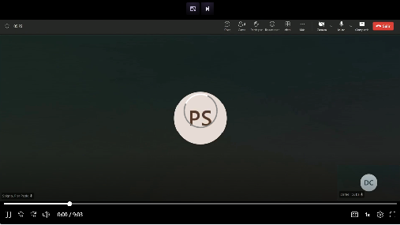

*Figura 2.5. Captura de la entrevista a Pier Paolo Spigno, gerente general del Hotel Meliá Lima Miraflores.*

| Dato | Detalle |
| --- | --- |
| Nombres y apellidos | Pier Paolo Spigno |
| Edad | 40 años |
| Distrito y ciudad | Miraflores, Lima |
| Ocupación | Administrador de negocios turísticos y hoteleros; gerente general |
| Establecimiento | Dos sedes de una cadena internacional: Meliá Lima Miraflores y Meliá Lima San Isidro |
| URL de la entrevista | https://upcedupe-my.sharepoint.com/:v:/g/personal/u202410105_upc_edu_pe/IQCvOeF36LNrRIzEPxPdq4GpAR6at3G-kDTtjlDdXhdzrUY?nav=eyJyZWZlcnJhbEluZm8iOnsicmVmZXJyYWxBcHAiOiJPbmVEcml2ZUZvckJ1c2luZXNzIiwicmVmZXJyYWxBcHBQbGF0Zm9ybSI6IldlYiIsInJlZmVycmFsTW9kZSI6InZpZXciLCJyZWZlcnJhbFZpZXciOiJNeUZpbGVzTGlua0NvcHkifX0&e=1IQwni |
| Inicio y duración en el video | Inicio en 0:00 · duración 9:03 |

**Resumen.**

Pier Paolo Spigno, administrador de negocios turísticos y hoteleros y gerente general del Hotel Meliá Lima Miraflores, comenta sobre los principales procesos y herramientas que utiliza para supervisar las reservas, habitaciones e información de las propiedades que administra. Diariamente recibe informes de recepción, entre ellos el *Flash Manager* y el *History and Forecast*, que le permiten revisar información consolidada, histórica y proyectada. Además, el supervisor de recepción, el área de Experience y el agente de reservas realizan un seguimiento diario de las reservas y sus observaciones, considerando aspectos como el tipo de habitación, tarifa, plan de alimentación y procedencia de la reserva mediante plataformas como Booking y Expedia.

Para la gestión de reservas e inventario utiliza principalmente Opera Cloud, integrado con el CRM. El sistema permite administrar el inventario de habitaciones y realizar seguimiento de las reservas. También facilita el trabajo del *revenue manager*, quien puede modificar las tarifas de acuerdo con la disponibilidad de cada tipo de habitación. Como medida de seguridad, cada trabajador cuenta con un usuario y contraseña personal e intransferible, lo que permite realizar un *tracking* de los movimientos efectuados en las reservas, como cambios de tarifas o incorporación de información.

En situaciones de sobreventa u *overbooking*, se realiza una coordinación entre los responsables de las diferentes propiedades para derivar a los huéspedes a otra sede. Para mantener separada la información de cada hotel, cada propiedad cuenta con informes y un centro de costos o código propio. De esta manera, los usuarios autorizados pueden acceder únicamente a la información correspondiente a las sedes que tienen bajo su responsabilidad. Opera también permite realizar comparaciones entre diferentes informes y propiedades.

Respecto a la seguridad de la información, señala que Opera está configurado de acuerdo con el código de cada propiedad, evitando que otras sedes o personas externas puedan acceder a información que no les corresponde. También menciona que Opera Cloud representa una versión más moderna del sistema, utilizando almacenamiento en la nube en lugar de depender de la misma infraestructura de centros de datos.

Como solución complementaria para la administración de habitaciones, comenta que propuso implementar una plataforma destinada al área de ama de llaves. Actualmente, esta plataforma permite visualizar en tiempo real el estado de las habitaciones y realizar seguimiento de trabajos de mantenimiento y pendientes relacionados con las áreas de *Room Divisions*, incluyendo ama de llaves, recepción y mantenimiento. El costo aproximado es de 1.500 dólares anuales por propiedad, e incluye soporte 24/7 desde España. Las capacitaciones se realizan constantemente y también forman parte de la inducción de los nuevos trabajadores que utilizarán la plataforma.

Finalmente, considera importantes aspectos como la seguridad de los datos personales, el soporte permanente, la capacitación de los trabajadores y la integración continua del sistema. Señala que las actualizaciones mensuales permiten corregir errores y reducir procesos repetitivos mediante la automatización, facilitando así la gestión y supervisión de las operaciones del hotel.

**Tecnología y canales.** Utiliza Opera Cloud integrado con el CRM y recibe a diario los informes *Flash Manager* y *History and Forecast*. Las reservas llegan, entre otros canales, desde Booking y Expedia. Cada trabajador tiene usuario y contraseña personales, y el hotel usa una plataforma complementaria para housekeeping que cuesta cerca de USD 1 500 al año por propiedad, con soporte 24/7.

**Entrevista E6: Roy Ríos**


*Figura 2.6. Captura de la entrevista a Roy Ríos, subgerente del Hotel Ibis Trujillo.*

| Dato | Detalle |
| --- | --- |
| Nombres y apellidos | Roy Ríos |
| Edad | 38 años |
| Distrito y ciudad | Trujillo, Trujillo |
| Ocupación | Subgerente del Hotel Ibis Trujillo, cadena Accor |
| Establecimiento | Hotel de 112 habitaciones que forma parte de un grupo de tres hoteles Ibis en el Perú del mismo inversionista |
| URL de la entrevista | https://upcedupe-my.sharepoint.com/:v:/g/personal/u202410105_upc_edu_pe/IQBXkmw7_ruBTJOmqXxAJKrYATbAXyGpF2SWSbsb_yy0aZ0?nav=eyJyZWZlcnJhbEluZm8iOnsicmVmZXJyYWxBcHAiOiJPbmVEcml2ZUZvckJ1c2luZXNzIiwicmVmZXJyYWxBcHBQbGF0Zm9ybSI6IldlYiIsInJlZmVycmFsTW9kZSI6InZpZXciLCJyZWZlcnJhbFZpZXciOiJNeUZpbGVzTGlua0NvcHkifX0&e=i1f2oE |
| Inicio y duración en el video | Inicio en 0:51 · duración del video 16:23 |

**Resumen.**

Roy Ríos, subgerente del Hotel Ibis Trujillo, explica cómo se gestionan las reservas,
los accesos y la información de su hotel dentro de la cadena Accor. Tiene 38 años y
reside en Trujillo. Supervisa la sede de Trujillo, que cuenta con 112 habitaciones y
registró una ocupación de alrededor de 65 % en el último año, frente al 71 % del año
anterior. Su hotel forma parte de un grupo de tres hoteles Ibis en el Perú que
pertenecen al mismo inversionista.

Señala que cada hotel opera con una razón social propia, incluso cuando pertenece al
mismo inversionista, por lo que no se realizan movimientos de inventario entre sedes y
los responsables de un hotel no acceden a los ingresos de los demás. La información de
cada hotel se conserva por separado: el hotel archiva durante cinco años sus tarjetas de
registro y sus comprobantes, y no los comparte con otras sedes.

Para el acceso, los huéspedes se registran previamente y las habitaciones usan tarjetas
magnéticas que activan el ascensor solo hasta el piso asignado y abren únicamente la
habitación del huésped. Cuando apoyan reservas de otros hoteles de la cadena, las
derivan por correo electrónico y mediante ResaWeb, el portal interno de Accor, usando el
código interno de cada hotel.

Sobre el crecimiento, explica que depende del contexto político, social y de seguridad,
de los resultados de cada hotel y de las decisiones de los inversionistas. Para adoptar
una solución considera los costos frente a los márgenes operativos de la industria, la
capacitación, el soporte y la seguridad.

**Tecnología y canales.** Usa Opera Cloud como PMS, Aztec para la facturación y Oracle Symphony en las terminales táctiles del restaurante. Las reservas se derivan a otros hoteles de la cadena por correo electrónico y mediante ResaWeb. En recepción trabajan con laptops y una tablet, y los accesos se controlan con tarjetas magnéticas vinculadas al ascensor y a la habitación.

### 2.2.3. Análisis de entrevistas

Este análisis reúne las seis entrevistas registradas en la sección 2.2.2 y es la base
sobre la que se construyen los arquetipos de la sección 2.3. Las fuentes se identifican
con el código de cada entrevista: `E1` y `E2` para el segmento 1, y `E3` a `E6` para el
segmento 2. Todas las características se obtienen de lo que cada persona describe en su
video; cuando una entrevista no menciona un dato, no se cuenta.

#### Segmento 1: administradores y propietarios de hoteles independientes (n = 2)

| Característica | Resultado | Fuente |
| :--- | :---: | :--- |
| Concilia reservas, accesos o almacén en hojas de Excel | 2 de 2 | E1, E2 |
| Coordina la operación por mensajes, WhatsApp o llamadas | 2 de 2 | E1, E2 |
| Reconstruye a mano el estado de la operación a partir de varias fuentes | 2 de 2 | E1, E2 |
| Pide una vista única de reservas, habitaciones, almacén y accesos | 2 de 2 | E1, E2 |
| Condiciona la adopción al costo, la capacitación o el financiamiento | 2 de 2 | E1, E2 |
| Registra las reservas en un sistema de reservas | 1 de 2 | E1 |
| Controla el acceso a las habitaciones con tarjeta | 1 de 2 | E1 |
| Detecta los faltantes del almacén solo en el inventario periódico | 1 de 2 | E1 |
| Recibe a sus huéspedes principalmente por redes sociales | 1 de 2 | E2 |

El segmento está formado por quienes responden por la operación completa de un solo
establecimiento, con cargos de administrador y de accionista. Su rasgo común no es la
herramienta que utilizan, sino el punto donde la información se rompe. Domínguez (`E1`)
tiene un sistema de reservas, pero lo complementa con hojas de Excel y, ante una reserva
duplicada, revisa ambas fuentes y corrige la distribución a mano; para supervisar el
hotel a distancia necesita varios minutos de llamadas y mensajes. Otto Cuba (`E2`) no
usa un sistema: registra los accesos en papel, los traslada a Excel y obtiene sus
reportes recién en el cierre de caja. En los dos casos el trabajo manual aparece como
consecuencia de la desconexión entre registros, no de la ausencia total de herramientas.

El nivel de digitalización dentro del segmento es desigual y conviene no promediarlo:
uno de los entrevistados ya trabaja con un sistema de reservas y tarjetas de acceso,
mientras que el otro opera con papel, hojas de cálculo y mensajería. Esa diferencia
marca dos puntos de partida para el producto: para uno, Hostera sustituye un registro
manual; para el otro, debe reunir en un solo lugar lo que hoy está repartido entre un
sistema, una hoja de cálculo y el personal.

Las condiciones de adopción son coincidentes. Domínguez (`E1`) pide un costo accesible,
facilidad de uso, capacitación inicial, seguridad y respaldo de la información, y Otto
Cuba (`E2`) condiciona la implementación a un financiamiento bancario proyectado para la
temporada 2027, lo que muestra que en este segmento la inversión se evalúa contra el
ciclo del negocio y no como un gasto corriente.

#### Segmento 2: gerentes o responsables de operaciones de pequeñas cadenas hoteleras (n = 4)

| Característica | Resultado | Fuente |
| :--- | :---: | :--- |
| Forma parte de una operación de dos a cinco establecimientos | 4 de 4 | E3, E4, E5, E6 |
| Usa un PMS o sistema hotelero | 4 de 4 | E3, E4, E5, E6 |
| Usa un PMS corporativo (Opera u Opera Cloud) | 3 de 4 | E4, E5, E6 |
| Supervisa procesos que ejecutan otros departamentos | 3 de 4 | E4, E5, E6 |
| Menciona Booking, Expedia u otras agencias en línea como canal de reservas | 2 de 4 | E3, E5 |
| Deriva huéspedes o reservas a otra sede | 2 de 4 | E5, E6 |
| Mantiene separada la información de cada sede por decisión de la organización | 2 de 4 | E5, E6 |
| Declara que consolidar la información entre sedes es una dificultad central | 1 de 4 | E3 |
| Coordina el inventario entre sedes por WhatsApp | 1 de 4 | E3 |
| Señala la falta de un registro centralizado de accesos | 1 de 4 | E3 |
| Cuenta con usuario y permisos individuales por trabajador | 1 de 4 | E5 |

El segmento reúne a quienes forman parte de una operación con más de un
establecimiento, con cargos de gerente de operaciones, gerente general, subgerente y
Room Division Manager. A diferencia del segmento 1, en tres de los cuatro casos la
operación diaria está repartida entre departamentos (reservas, recepción, seguridad,
almacén y housekeeping), y el entrevistado supervisa en lugar de ejecutar. Rafael Prieto
(`E4`) no controla directamente las existencias del almacén, sino que aprueba los
pedidos de las áreas a su cargo, y Pier Paolo Spigno (`E5`) recibe a diario los informes
consolidados en lugar de revisar reserva por reserva.

La dificultad que define al segmento no es registrar, sino consolidar, y aparece con
fuerza donde las sedes comparten administración. Odar Quispe (`E3`) coordina tres sedes
con herramientas distintas, dos con un PMS básico y una con hojas de cálculo, dedica
alrededor de cuarenta minutos diarios a consolidar la información a mano y termina
decidiendo con datos desactualizados; además, las transferencias de inventario entre
sedes no se registran, lo que produce diferencias de stock y compras duplicadas.

La entrevista a Roy Ríos (`E6`) incorpora un caso que conviene leer en contraste. Su
hotel pertenece a un grupo de tres establecimientos de la misma cadena internacional,
pero cada uno opera con razón social propia y la información no se comparte entre ellos.
La separación es una decisión de la organización, no una limitación de sus herramientas,
y Pier Paolo Spigno (`E5`) describe el mismo criterio cuando explica que cada propiedad
tiene su centro de costos y su acceso restringido. Para estos casos, consolidar entre
sedes no es un problema por resolver, lo que delimita el alcance de Hostera: la
consolidación es decisiva para operaciones que comparten administración, como la de
`E3`, y lo valioso para las demás es mantener separada y protegida la información de
cada sede.

La madurez tecnológica es mayor que en el segmento 1, pero también es desigual. Tres de
los cuatro trabajan sobre un PMS corporativo, mientras que `E3` sostiene una operación de
tres sedes sobre un PMS básico y hojas de cálculo. Donde ya existe un PMS corporativo, el
problema se desplaza hacia la integración: Pier Paolo Spigno (`E5`) paga cerca de
USD 1 500 al año por propiedad solo por una plataforma complementaria de housekeeping, lo
que fija una referencia de precio para la categoría.

El control de accesos ocupa posiciones distintas dentro del segmento. Odar Quispe (`E3`)
señala que cada sede administra los accesos a su manera, sin un registro centralizado de
quién ingresa ni desactivación de credenciales cuando alguien deja la empresa. En cambio,
donde existe un control por usuario individual, como describe `E5` para las operaciones
sobre reservas, o un control físico cerrado, como la tarjeta magnética que en el hotel de
`E6` habilita únicamente el piso y la habitación del huésped, la trazabilidad deja de
percibirse como un problema.

#### Comparación entre los dos segmentos

El perfil tecnológico declarado en cada entrevista permite verificar que las
características de las tablas anteriores provienen de respuestas individuales y no de
una generalización del segmento.

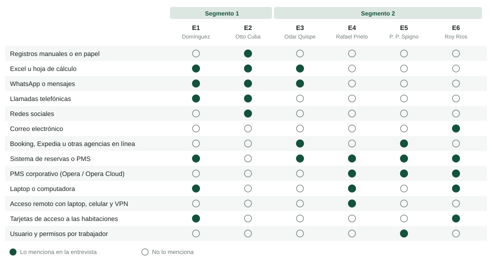

*Figura 2.7. Herramientas y canales mencionados en cada entrevista, agrupados por segmento.*

Las dificultades y necesidades declaradas separan a los dos segmentos. En el segmento 1
se concentran dentro de la sede: información repartida, traslados manuales y faltantes
detectados tarde. En el segmento 2 aparecen dos situaciones distintas: la consolidación
entre sedes que comparten administración (`E3`) y la separación deliberada de la
información en los grupos donde cada hotel es una empresa distinta (`E5`, `E6`).

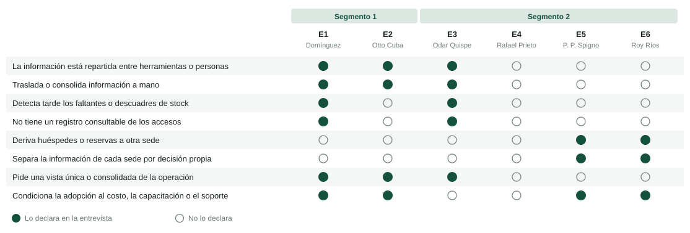

*Figura 2.8. Dificultades y necesidades declaradas en cada entrevista, agrupadas por segmento.*

De este análisis se desprenden cuatro conclusiones que alimentan los arquetipos de la
sección 2.3. La primera es que la fragmentación de la información se manifiesta de forma
distinta en cada segmento: dentro de la sede en el segmento 1 y entre sedes en el
segmento 2. La segunda es que tener a la vista las reservas y la disponibilidad es la
necesidad común a ambos, lo que sostiene su posición en el Product Backlog. La tercera es
que el nivel de digitalización es desigual dentro de cada segmento, de modo que el
producto debe funcionar tanto para quien parte de papel y Excel como para quien ya
trabaja con un PMS. La cuarta es que el control de accesos no es una prioridad uniforme:
resulta decisivo donde no hay un registro centralizado y secundario donde ya existen
permisos individuales.

Dos limitaciones acotan el alcance de estos resultados. La primera es el tamaño de la
muestra: con dos y cuatro entrevistas por segmento, los conteos describen a los
entrevistados y no permiten inferir proporciones de la población hotelera peruana. La
segunda es que el segmento 1 aún no alcanza las tres entrevistas que pide el enunciado,
por lo que sus conclusiones se revisarán cuando se registre la tercera entrevista.

## 2.3. Needfinding

### 2.3.1. User Personas

Los User Personas son los arquetipos con los que el equipo representa a cada segmento
objetivo durante el diseño del producto. Se elabora una ficha por segmento y cada
rasgo de esas fichas proviene del análisis de entrevistas de la sección 2.2.3 o del
análisis competitivo de la sección 2.1, de modo que ninguna característica se apoya en
una suposición del equipo.

Del análisis de entrevistas se toman el contexto de operación, las herramientas y los
canales que cada segmento utiliza hoy, las frustraciones que declara con mayor
frecuencia, los objetivos que sitúa en los primeros lugares de sus prioridades y la
disposición a pagar. Del análisis competitivo se toma el conjunto de alternativas que
estas personas ya conocen o evalúan, que define el punto de comparación con el que
recibirán a Hostera. La siguiente tabla indica el origen de los rasgos principales de
cada ficha.

| Rasgo de la ficha | Resultado del análisis | Fuente |
| :--- | :--- | :--- |
| Contexto de operación del segmento 1: un solo establecimiento, con responsabilidad directa sobre la operación completa | 2 de 2 entrevistas del segmento | E1, E2 |
| Ubicación de Steven: un hotel independiente en Lima | Coincide con la operación de Domínguez | E1 |
| Herramientas del segmento 1: hojas de cálculo y registros en papel | 2 de 2 usan Excel; 1 de 2 registra en papel | E1, E2 |
| Frustración del segmento 1: consultar varias fuentes para consolidar la información del día | 2 de 2 | E1, E2 |
| Frustración del segmento 1: faltantes del almacén detectados tarde | 1 de 2 | E1 |
| Frustración del segmento 1: no saber quién accedió a una habitación y reponer tarjetas perdidas | 1 de 2 | E1 |
| Objetivo del segmento 1: reunir reservas, habitaciones, almacén y accesos en un solo panel | 2 de 2 lo piden | E1, E2 |
| Contexto del segmento 2: cadena boutique de tres sedes supervisada a distancia | Coincide con la operación de Odar Quispe | E3 |
| Frustración del segmento 2: consolidar a mano la información de las sedes y decidir con datos desactualizados | 1 de 4, la operación que comparte administración | E3 |
| Objetivo del segmento 2: comparar las sedes sin mezclar la información de cada una | 1 de 4 pide el consolidado; 2 de 4 separan la información por sede | E3, E5, E6 |
| Motivación del segmento 2: transferir inventario entre sedes | 1 de 4 | E3 |
| Frustración del segmento 2: falta de trazabilidad de los accesos entre sedes | 1 de 4 | E3 |
| Supervisión remota desde laptop o celular | 2 de 4 | E3, E4 |
| Alternativas que ya conocen o evalúan | Análisis competitivo de la sección 2.1 | Nexus PMS, OkFac, SysHotel |

Dos rasgos de la ficha de Steven todavía no aparecen en las entrevistas del segmento:
las demoras en el check-in y el tamaño de su hotel, de 28 habitaciones, por encima del
límite de 10 habitaciones del plan Starter. Ambos se revisarán cuando se registre la
tercera entrevista del segmento 1.

Las fichas se elaboraron en UXPressia, la herramienta indicada para este artefacto, y
se presentan a continuación.

User Persona 1

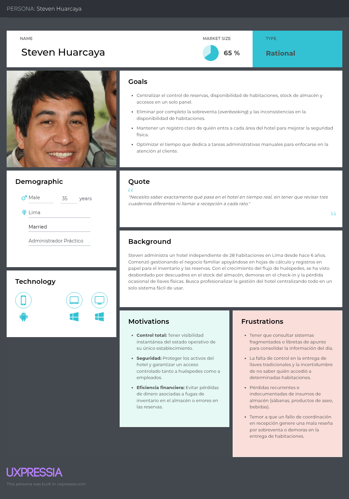

*Figura 2.9. User Persona de Steven Huarcaya, segmento de hoteles independientes de una sede.*

User Persona 2

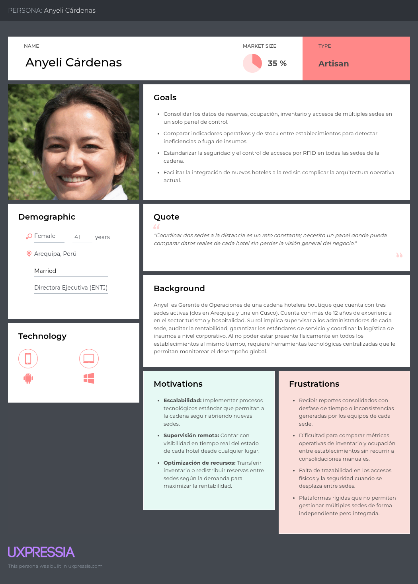

*Figura 2.10. User Persona de Anyeli Cárdenas, segmento de cadenas hoteleras pequeñas.*

### 2.3.2. User Task Matrix

El User Task Matrix reúne las tareas que los User Personas realizan para sostener la
operación de su hotel y compara, para cada tarea, con qué frecuencia la ejecutan y qué
importancia le asignan. Las tareas corresponden a actividades que ambas personas
llevan a cabo con independencia de que exista Hostera, no a opciones de la solución, y
su frecuencia e importancia se derivan de lo declarado en las entrevistas de la
sección 2.2.

Se presenta una sola matriz con una columna por persona, de modo que las coincidencias
y las diferencias entre los dos segmentos puedan leerse en la misma vista.

<table>
  <thead>
    <tr>
      <th rowspan="2">Tarea del usuario (<em>User Task</em>)</th>
      <th colspan="2">Steven Huarcaya<br>Segmento 1 · una sede</th>
      <th colspan="2">Anyeli Cárdenas<br>Segmento 2 · 2 a 5 sedes</th>
    </tr>
    <tr>
      <th>Frecuencia</th>
      <th>Importancia</th>
      <th>Frecuencia</th>
      <th>Importancia</th>
    </tr>
  </thead>
  <tbody>
    <tr><td>Supervisar el estado y la disponibilidad de las habitaciones</td><td>Alta (diaria)</td><td>Crítica</td><td>Alta (diaria)</td><td>Crítica</td></tr>
    <tr><td>Registrar y actualizar las reservas que llegan por distintos canales</td><td>Alta (diaria)</td><td>Crítica</td><td>Media (semanal)</td><td>Alta</td></tr>
    <tr><td>Atender incidencias de recepción, sobreventas y cambios de habitación</td><td>Alta (diaria)</td><td>Crítica</td><td>Baja (ocasional)</td><td>Media</td></tr>
    <tr><td>Controlar la asignación y entrega de llaves o credenciales a los huéspedes</td><td>Alta (diaria)</td><td>Crítica</td><td>Baja (ocasional)</td><td>Baja</td></tr>
    <tr><td>Verificar las existencias de insumos del almacén</td><td>Media (semanal)</td><td>Alta</td><td>Media (semanal)</td><td>Alta</td></tr>
    <tr><td>Registrar y auditar los accesos del personal autorizado</td><td>Media (semanal)</td><td>Alta</td><td>Media (semanal)</td><td>Alta</td></tr>
    <tr><td>Consolidar la información operativa de todas las sedes</td><td>No aplica</td><td>No aplica</td><td>Alta (diaria)</td><td>Crítica</td></tr>
    <tr><td>Coordinar el traslado de insumos o huéspedes entre establecimientos</td><td>No aplica</td><td>No aplica</td><td>Media (quincenal)</td><td>Media</td></tr>
    <tr><td>Revisar reportes de costos, consumos e indicadores del negocio</td><td>Baja (mensual)</td><td>Media</td><td>Baja (mensual)</td><td>Crítica</td></tr>
  </tbody>
</table>

**Coincidencias entre los dos segmentos.** Las dos personas sitúan en el primer lugar
la supervisión del estado y la disponibilidad de las habitaciones, con frecuencia
diaria e importancia crítica, lo que coincide con que las dos entrevistas del
segmento 1 pidan una vista única de reservas y habitaciones y con que los cuatro
entrevistados del segmento 2 trabajen sobre un sistema de reservas.
Ambas verifican las existencias del almacén y auditan los accesos del personal con
frecuencia semanal e importancia alta: son tareas de control que ninguna de las dos
puede abandonar, pero que tampoco ocupan su jornada. La revisión de reportes es
mensual en los dos casos.

**Diferencias entre los dos segmentos.** La diferencia principal no está en qué tareas
realizan, sino en quién las ejecuta. Steven registra las reservas, atiende la recepción
y entrega las credenciales él mismo, con frecuencia diaria e importancia crítica;
Anyeli delega esas mismas tareas en los administradores de cada sede y las realiza de
forma ocasional. Esto reproduce lo que describen las entrevistas: Rafael Prieto (`E4`)
aprueba los pedidos del almacén en lugar de controlar las existencias, y Pier Paolo
Spigno (`E5`) recibe informes consolidados en lugar de revisar reserva por reserva.

A cambio, Anyeli asume dos tareas que no existen en la operación de Steven: consolidar
la información de todas las sedes, con frecuencia diaria e importancia crítica, y
coordinar el traslado de insumos o huéspedes entre establecimientos. La primera es la
tarea más costosa de su jornada (Odar Quispe, `E3`, le dedica alrededor de cuarenta
minutos diarios) y es la que explica por qué en este segmento los reportes consolidados
pesan más que el control de accesos.

La última diferencia está en la importancia de los reportes. Para Steven son una
revisión mensual de importancia media, porque su foco está en la operación inmediata;
para Anyeli tienen importancia crítica pese a su baja frecuencia, porque son el insumo
con el que decide sobre varias sedes a la vez.

**Consecuencia para el producto.** La matriz indica que las capacidades diarias de
Hostera deben resolverse primero para el perfil de Steven, que ejecuta todas las tareas
críticas en persona, mientras que para Anyeli la capacidad decisiva es la consolidación
entre sedes. Esto sostiene el orden del Product Backlog de la sección 3.3, que sitúa el
panorama operativo y las reservas antes que los reportes y el control de accesos.

### 2.3.3. User Journey Mapping

En esta sección se presentan los User Journey Maps en su versión **As-Is** (situación actual) para cada uno de los segmentos representados. Estos mapas ilustran el flujo de trabajo de extremo a extremo (*end-to-end journey*) que experimentan los usuarios al gestionar sus operaciones hoteleras cotidianas sin la presencia de la plataforma Hostera, evidenciando los puntos de fricción, ineficiencias y dolores en sus procesos actuales.

#### Segmento 1: Steven Huarcaya

El *journey* actual de Steven abarca desde la recepción de solicitudes de reserva por canales dispersos hasta la revisión del inventario y la entrega física de llaves en el hotel. El proceso se caracteriza por una alta dependencia de registros manuales y una constante interrupción operativa para resolver incidencias.

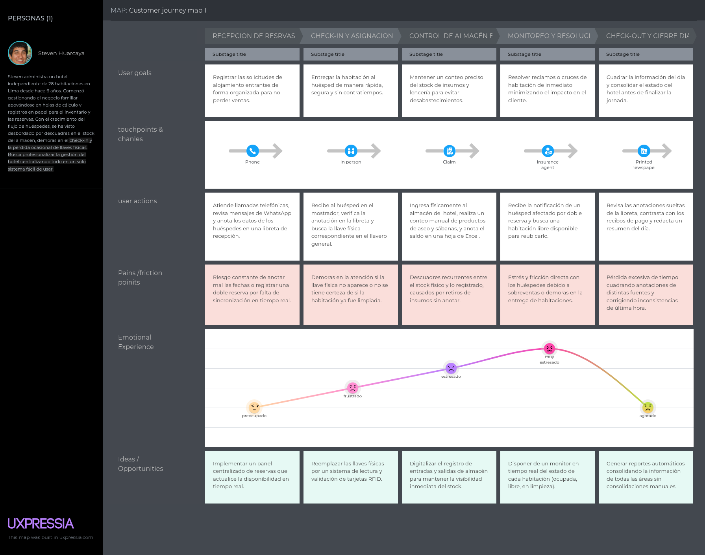

*Figura 2.11. As-Is User Journey Map de Steven Huarcaya.*

---

#### Segmento 2: Anyeli Cárdenas

El *journey* actual de Anyeli contempla el proceso de consolidación y supervisión de la operación de múltiples sedes a la distancia. Las etapas clave incluyen la solicitud de reportes a los administradores locales, la consolidación manual de datos de inventario y la verificación diferida de accesos, lo cual genera retrasos y falta de visibilidad en tiempo real.

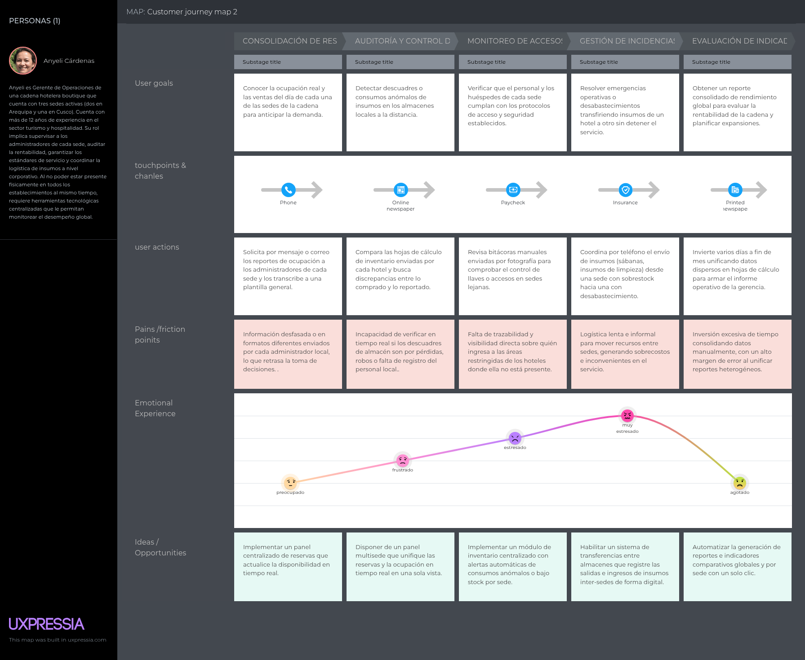

*Figura 2.12. As-Is User Journey Map de Anyeli Cárdenas.*

### 2.3.4. Empathy Mapping

Los Empathy Maps muestran, para cada User Persona, lo que dice, piensa, siente, hace,
ve y escucha en su operación actual, junto con sus dolores y lo que espera ganar. Se
elaboraron en UXPressia a partir de las fichas de la sección 2.3.1 y de los journey
maps anteriores.

Los dos mapas comparten el mismo dolor de fondo: la información de la operación está
repartida en registros distintos. Para Steven ese dolor aparece dentro de su hotel, en
los descuadres del almacén, el riesgo de sobreventa y la entrega de llaves físicas.
Para Anyeli aparece entre sedes: recibe reportes en formatos distintos y con días de
retraso, y no puede comprobar quién entra a las áreas restringidas de las sedes donde
no está.

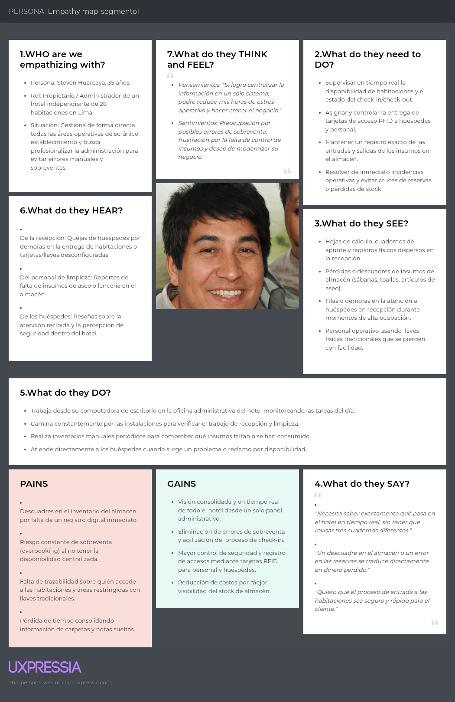

*Figura 2.13. Empathy Map de Steven Huarcaya.*

---

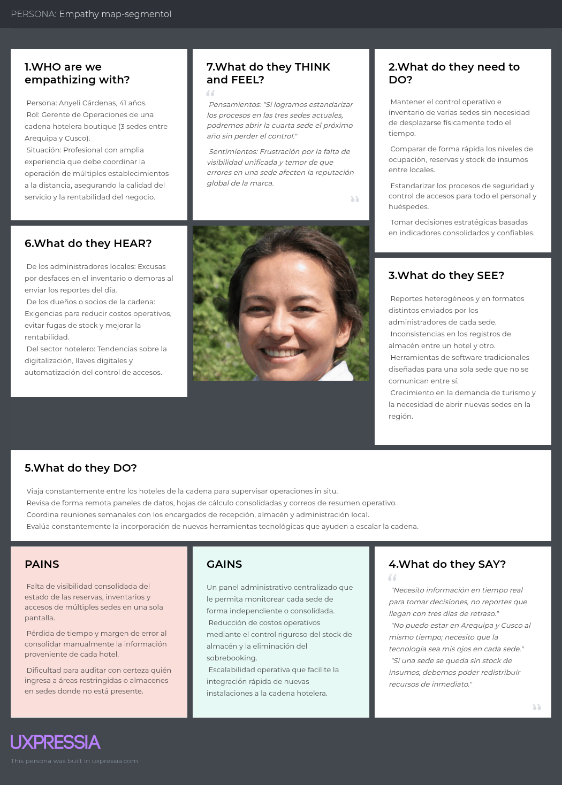

*Figura 2.14. Empathy Map de Anyeli Cárdenas.*

## 2.4. Big Picture EventStorming

El Big Picture EventStorming representa el dominio hotelero de Hostera de principio a
fin, antes de entrar en el diseño. El tablero ordena en el tiempo los eventos del
negocio, escritos en pasado y en inglés como el resto del Ubiquitous Language, junto
con los actores que los provocan, los sistemas externos que participan y los puntos
que el equipo no podía resolver todavía. La sesión se desarrolló en tres etapas.

### Etapa 1: exploración de eventos

Solapamiento masivo de información, eventos repetidos con distinta redacción, y un fuerte desorden cronológico que dificulta la lectura global.


*Figura 2.15. Etapa 1 del Big Picture EventStorming: exploración de eventos.*

### Etapa 2: línea de tiempo

Los eventos dispersos se alinean horizontalmente de izquierda a derecha siguiendo el flujo natural del negocio de Hostera, desde la reserva inicial hasta el check-out y el cierre diario.


*Figura 2.16. Etapa 2 del Big Picture EventStorming: eventos ordenados en la línea de tiempo.*

### Etapa 3: fases, actores y hotspots

Se introducen los eventos negativos en rojo (problemas como conflictos de overbooking o fallas de stock) y se sitúan los elementos de control superior (cabeceras amarillas de fases y notas de actores o comandos que desencadenan los eventos), tal como se aprecia organizado en filas horizontales en la imagen.

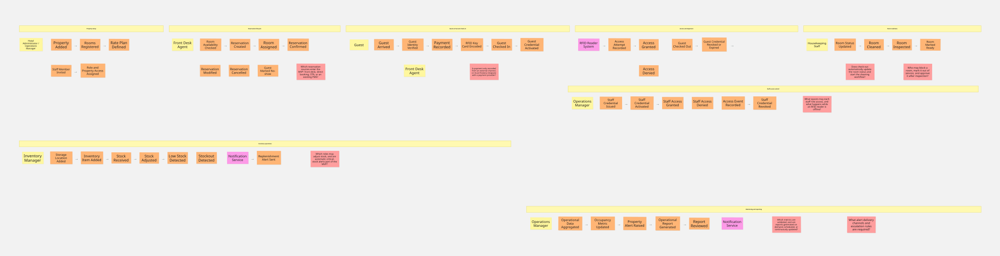

*Figura 2.17. Etapa 3 del Big Picture EventStorming: tablero final con fases, actores, sistemas externos y hotspots.*

El tablero se organiza en ocho flujos. Los cinco primeros siguen la vida de una
estadía: la configuración de la propiedad (`Property Added`, `Rooms Registered`,
`Rate Plan Defined`), el ciclo de la reserva (`Reservation Created`,
`Room Assigned`, `Reservation Confirmed`, con sus alternativas de modificación,
cancelación y no-show), la llegada y el check-in (`Guest Identity Verified`,
`Payment Recorded`, `RFID Key Card Encoded`, `Guest Checked In`), el acceso y la
salida (`Access Granted` o `Access Denied`, `Guest Checked Out`,
`Guest Credential Revoked or Expired`) y la preparación de la habitación
(`Room Status Updated`, `Room Cleaned`, `Room Inspected`, `Room Marked Ready`). Los
otros tres flujos corren en paralelo a la estadía: el acceso del personal, las
operaciones de inventario y el monitoreo con reportes.

Tres eventos marcan el paso de un flujo al siguiente y funcionan como eventos pivote:
`Reservation Confirmed` cierra la reserva y abre la espera de la llegada,
`Guest Checked In` activa la credencial del huésped y `Guest Checked Out` revoca esa
credencial y pone en marcha la preparación de la habitación.

Los actores que aparecen en el tablero son el administrador o responsable de
operaciones, el agente de recepción, el huésped, el personal de housekeeping y el
encargado del inventario. Participan dos sistemas externos: el sistema de lectores
RFID, que concede o deniega cada acceso, y un servicio de notificaciones, que envía
las alertas de reposición del inventario y las alertas de la propiedad.

Los hotspots registran las preguntas que la sesión dejó abiertas. Algunas se
respondieron en el trabajo posterior y otras siguen pendientes.

| Hotspot | Estado al cierre de TB1 |
|---|---|
| ¿Qué fuentes de reserva entran al MVP: recepción, reserva directa, agencias en línea o un PMS existente? | La primera versión registra las reservas desde la aplicación. La integración con agencias en línea queda fuera de esta versión, aunque las entrevistas muestran que es un canal frecuente. |
| ¿El pago solo se registra desde un canal externo o Hostera debe integrarse con un proveedor de pagos? | La aplicación registra los pagos recibidos con su método (efectivo, terminal de tarjeta o transferencia) y su referencia, sin integrarse con un proveedor de pagos. |
| ¿El check-out actualiza el estado de la habitación e inicia la limpieza? | El check-out registra la condición en que queda la habitación. El inicio automático del flujo de limpieza sigue pendiente. |
| ¿Quién puede bloquear una habitación, marcarla fuera de servicio y aprobarla después de la inspección? | La aplicación maneja los estados bloqueada y fuera de servicio. Los permisos por rol dependen del inicio de sesión, previsto para después de los flujos principales. |
| ¿A qué espacios accede cada rol del personal y qué pasa si un lector RFID queda sin conexión? | Pendiente. |
| ¿Qué roles pueden ajustar stock y las alertas automáticas de stock crítico forman parte del MVP? | Las alertas automáticas se ofrecen en el plan Professional; el plan Starter controla el almacén sin ellas. Los roles quedan pendientes junto con el inicio de sesión. |
| ¿Qué métricas se validan y los reportes se generan bajo demanda, programados o en tiempo real? ¿Por qué canales se envían las alertas? | Pendiente. Los reportes operativos (`US031`, `US032`) no forman parte de la primera versión del frontend. |

## 2.5. Ubiquitous Language

El lenguaje ubicuo define los términos y conceptos del dominio hotelero de Hostera.
Las definiciones establecen un significado común para describir sus operaciones,
actores, recursos y procesos.

| Term | Equivalent in Spanish | Business-domain definition |
| :--- | :--- | :--- |
| **Property** | Establecimiento / sede | A physical hotel location managed as an operational unit, with its own rooms, staff, reservations, inventory and access rules. |
| **Active Property** | Propiedad activa | The property an operator is currently working on. Every view and operation in the application is scoped to it until the operator selects another one. |
| **Hotel Group** | Grupo hotelero | An organization that operates or coordinates multiple hotel properties under a common business structure. |
| **Independent Hotel** | Hotel independiente | A hotel that operates as a single property rather than as part of a larger hotel group. |
| **Small Hotel Chain** | Cadena hotelera pequeña | A hotel operation that coordinates several properties on a limited scale; in Hostera, this segment covers operations with two to five locations. |
| **Hotel Operation** | Operación hotelera | The coordinated activities required to manage properties, rooms, guests, reservations, staff, inventory and access. |
| **Guest** | Huésped | A person who stays at or uses the accommodation services of a hotel. |
| **Staff Member** | Miembro del personal | A person who performs operational or administrative activities for a property, such as reception, housekeeping or management. |
| **Booking** | Reserva | A record that holds a guest's request or confirmed arrangement for accommodation, including dates, room information and applicable conditions. The application, its demonstration API and the Technical Stories expose it as the `bookings` resource. |
| **Stay** | Estancia | The period during which a guest occupies or uses accommodation at a property, from arrival through departure. |
| **Room** | Habitación | An accommodation unit offered by a property and managed according to its availability, status, type and assigned guest. |
| **Room Type** | Tipo de habitación | A classification of rooms that share relevant characteristics, such as capacity, bed configuration or service category. |
| **Room Availability** | Disponibilidad de habitaciones | The set of rooms that can be offered or assigned for a specific date or period. |
| **Room Status** | Estado de la habitación | The operational condition of a room, such as available, occupied, dirty, clean, inspected, blocked or out of service. |
| **Status Period** | Periodo de estado | A date range during which a room is blocked, out of service or needs cleaning, recorded separately from the bookings that occupy it. |
| **Room Assignment** | Asignación de habitación | The act of associating an available room with a reservation or guest stay. |
| **Check-in** | Registro de entrada | The process through which a property confirms a guest's arrival, verifies the reservation and enables the stay. |
| **Check-out** | Registro de salida | The process through which a property confirms a guest's departure, closes the stay and settles the corresponding account. |
| **No-show** | No presentado | The outcome of a booking whose guest neither arrived nor cancelled. It releases the room for other bookings. |
| **Front Desk** | Recepción | The hotel operation responsible for welcoming guests and coordinating reservations, arrivals, departures, room assignments and guest requests. |
| **Housekeeping** | Limpieza y mantenimiento de habitaciones | The operation responsible for preparing rooms, updating their condition and reporting cleaning or maintenance needs. |
| **Rate Plan** | Plan tarifario | A set of pricing and selling conditions associated with a room or accommodation offer, such as dates, restrictions and included services. |
| **Daily Rate** | Tarifa diaria | The price of a room type for a specific night under a rate plan. It replaces the base nightly rate for that night. |
| **Inventory** | Inventario | The supplies, assets and operational resources that a property needs to monitor, replenish and use during its activities. |
| **Inventory Item** | Artículo de inventario | A tracked supply, such as linen, amenities or cleaning products, identified by a code and described by its category, unit and replenishment thresholds. |
| **Storage Location** | Ubicación de almacén | A physical area of a property where inventory items are stored and counted separately, such as housekeeping, main storage or the front desk. |
| **Stock Adjustment** | Ajuste de existencias | A recorded entry, exit or transfer of an inventory item between storage locations. Adjustments form the history that explains the quantity on hand. |
| **Stock Condition** | Condición de stock | The state of an inventory item compared with its thresholds: in stock, low stock when it reaches the replenishment level, or out of stock when its quantity is zero. |
| **Folio** | Cuenta del huésped | The account associated with a guest stay that records charges, payments, adjustments and the balance to be settled. |
| **Payment** | Pago | An amount received for a booking, recorded with its method, reference and the operator who registered it. The payments of a booking determine its balance due. |
| **Property Management System (PMS)** | Sistema de gestión hotelera | A business operations system used by a hotel or hotel group to manage reservations, check-in and check-out, room assignment, rates, billing and related operational information. Its traditional hotel scope is described by Oracle Hospitality (s.f.). |
| **Online Travel Agency (OTA)** | Agencia de viajes en línea | A third-party booking channel through which guests can search for and reserve accommodation offered by a property. |
| **Access Control** | Control de acceso | The set of operational rules and actions that determine who can enter a property, room or restricted area and under what conditions. |
| **Credential** | Credencial | An RFID authorization that grants a guest or a staff member access to specific rooms or areas for a validity period. A credential can be revoked before it expires. |
| **Key Card** | Tarjeta de acceso | The physical RFID card encoded with a credential and handed to a guest at check-in or to a staff member. |
| **Access Event** | Evento de acceso | A record of a granted or denied attempt to open a door or reader, with the credential, the room or area and the moment it happened. |
| **Occupancy** | Ocupación | The percentage of available rooms that are occupied or sold during a specified period. It is calculated by dividing rooms sold by rooms available (STR, s.f.). |
| **Average Daily Rate (ADR)** | Tarifa diaria promedio | The average room rate paid for rooms sold during a specified period, calculated by dividing room revenue by rooms sold (STR, s.f.). |
| **Revenue per Available Room (RevPAR)** | Ingreso por habitación disponible | A hotel performance measure calculated by dividing room revenue by the total number of available rooms for a specified period (STR, s.f.). |

# Capítulo III: Requirements Specification

## 3.1. User Stories

Las siguientes historias especifican los requisitos del producto digital de Hostera a
partir de las necesidades de sus segmentos objetivo y de los flujos operativos
identificados para el Landing Page y la Web Application. Cada Epic agrupa un conjunto
coherente de capacidades y cada Story incluye criterios de aceptación comprobables.
Las Technical Stories describen requisitos de integración del RESTful API desde la
perspectiva de un Developer y no generan Wireflow User Goals.

| Epic / Story ID | Título | Descripción | Criterios de aceptación | Relacionado con (Epic ID) |
| :--- | :--- | :--- | :--- | :--- |
| EP001 | Landing Page Experience | As a visitor, I want to explore Hostera's value proposition, operating-scale pathways, plans, and supporting content, so that I can identify the experience that fits my hotel operation and choose an appropriate next step. | **Scenario: Complete Landing Page experience**<br>**Given** a visitor accesses the Landing Page<br>**When** the visitor explores the product proposition, operating-scale options, plans, supporting content, and available actions<br>**Then** the visitor obtains the information needed to evaluate Hostera and continue with the plan or contact that fits the operation. | No aplica |
| EP002 | Account Access and Operational Overview | As a hotel administrator or operations manager, I want to register, sign in, choose a property, and review its operational overview, so that I can start working with the information of the property I am responsible for. | **Scenario: Access the operational application**<br>**Given** a user has valid account information and access to at least one property<br>**When** the user completes account access and chooses a property<br>**Then** the application opens the operational overview scoped to the selected property. | No aplica |
| EP003 | Booking and Stay Management | As a front-desk operator, I want to find, create, update, and complete bookings, including payments, check-in, and check-out, so that each guest stay is recorded consistently from booking to departure. | **Scenario: Manage a guest stay**<br>**Given** an operator is working within the active property<br>**When** the user manages a booking through its supported stay operations<br>**Then** the system preserves the booking details, payment state, and applicable lifecycle status. | No aplica |
| EP004 | Room, Room Type, and Rate Management | As a hotel administrator, I want to manage rooms, room types, rate plans, availability, and operational room status, so that accommodation information stays accurate for bookings and daily operations. | **Scenario: Manage accommodation configuration**<br>**Given** an authorized user is working within a selected property<br>**When** the user views or updates rooms, room types, rates, availability, or operational status<br>**Then** the application presents and retains the accommodation information needed for room operations. | No aplica |
| EP005 | Inventory Management | As an inventory operator or hotel administrator, I want to monitor items, record stock adjustments, and manage storage locations, so that supplies remain available and their movements are traceable. | **Scenario: Maintain property inventory**<br>**Given** an authorized user is working within a selected property<br>**When** the user monitors items, records a stock adjustment, or manages a storage location<br>**Then** the application reflects the current quantities and valid storage assignments for the property. | No aplica |
| EP006 | RFID Access Control | As a hotel administrator or authorized front-desk operator, I want to encode, replace, revoke, and review RFID credentials and access events, so that room and operational access remains valid only for authorized people and periods. | **Scenario: Control property access credentials**<br>**Given** an authorized user is working within a selected property<br>**When** the user manages RFID credentials or reviews access events<br>**Then** the system applies the configured access scope and makes the resulting credential activity available for review. | No aplica |
| EP007 | Operational Reporting | As a hotel administrator or operations manager, I want to find, analyze, and export operational reports by property and period, so that I can evaluate hotel performance and share the results. | **Scenario: Analyze operational information**<br>**Given** an authorized user chooses a property, report type, and supported period<br>**When** the user views or exports the report<br>**Then** the application provides results corresponding to the selected scope and period. | No aplica |
| EP008 | API Reliability and Integration | As a developer integrating with Hostera, I want the API to apply consistent errors and shared integration behavior, so that every client can handle the product capabilities in a predictable way. | **Scenario: Process an API request consistently**<br>**Given** a client sends a supported or invalid request to the API<br>**When** the API processes the request<br>**Then** it returns a predictable response with the appropriate result or standardized error information. | No aplica |
| US001 | Understand the hotel-operations proposition | As a visitor, I want to understand what Hostera offers for hotel operations, so that I can decide whether Hostera is relevant to my hotel. | **Scenario: The visitor identifies the value proposition**<br>**Given** a visitor evaluates Hostera for the first time<br>**When** the visitor requests the value proposition<br>**Then** the visitor learns that Hostera allows running the whole hotel operation from one place.<br><br>**Scenario: The visitor identifies the operational areas covered**<br>**Given** the visitor is reviewing the value proposition<br>**When** the visitor looks for the scope of the product<br>**Then** the visitor finds that Hostera covers reservations, rooms, inventory, and access across every property.<br><br>**Scenario: The visitor recognizes the problem Hostera addresses**<br>**Given** the visitor continues reviewing the content<br>**When** the visitor reads about current hotel operations<br>**Then** the visitor learns that operations break when information is kept in different places and that Hostera connects reservations, rooms, inventory, and guest access in the same operational picture.<br><br>**Scenario: The visitor continues to the entry plan**<br>**Given** the visitor wants to evaluate Hostera after reading the value proposition<br>**When** the visitor chooses to continue<br>**Then** the system provides the Starter plan information. | EP001 |
| US002 | Find information about Hostera | As a visitor, I want to request information about the topic I am interested in, so that I can learn about Hostera and understand the available next steps. | **Scenario: The visitor requests information about a topic**<br>**Given** a visitor wants information about a specific topic<br>**When** the visitor chooses solutions, features, pricing, product, or team information<br>**Then** the system provides information about the requested topic.<br><br>**Scenario: The visitor changes topic from any point**<br>**Given** the visitor is consulting information about Hostera<br>**When** the visitor wants to consult another topic<br>**Then** the system provides the requested topic independently of the topic previously consulted.<br><br>**Scenario: The visitor finds support and the service terms**<br>**Given** the visitor has reviewed the main content<br>**When** the visitor looks for support or for the conditions of the service<br>**Then** the visitor finds the frequently asked questions and the Terms and Conditions of Hostera.<br><br>**Scenario: The visitor identifies who offers the product**<br>**Given** the visitor wants to know who is responsible for Hostera<br>**When** the visitor reviews the company information<br>**Then** the visitor identifies Hostera, its statement “Hotel operations, connected.”, and Team Coworkers as the copyright holder. | EP001 |
| US003 | Find the independent-hotel path | As a visitor from the independent-hotel segment, I want to identify the Hostera option for one property with up to 10 rooms, so that I can confirm that it fits my operation and continue with the corresponding plan. | **Scenario: The visitor identifies the independent-hotel option**<br>**Given** a visitor operates one independent hotel with up to 10 rooms<br>**When** the visitor reviews the options by operating scale<br>**Then** the visitor identifies the “Independent hotel” option for one property with up to 10 rooms, focused on reservations, availability, and room operations with consistent operational information.<br><br>**Scenario: The visitor reviews the Starter plan conditions**<br>**Given** the visitor evaluates the Starter plan<br>**When** the visitor reviews its conditions<br>**Then** the visitor learns that it costs S/39 per property per month and includes basic reservations and availability, inventory without automatic alerts, one simulated RFID reader, one administrator, and community and documentation support.<br><br>**Scenario: The visitor continues with the Starter plan**<br>**Given** the visitor considers that the independent-hotel option fits the operation<br>**When** the visitor decides to continue<br>**Then** the system opens the account creation view of the Hostera web application with the Starter plan selected and its conditions. | EP001 |
| US004 | Find the small-chain path | As a small-chain hotel operations manager, I want an option for coordinating 2 to 5 locations, so that I can identify the plan and estimated cost intended for a multi-property operation. | **Scenario: The visitor identifies the small-chain option**<br>**Given** the visitor is responsible for a hotel chain with 2 to 5 locations<br>**When** the visitor reviews the options by operating scale<br>**Then** the visitor identifies the “Small hotel chain” option for coordinating rooms, stock, and reports across every property.<br><br>**Scenario: The visitor reviews the Professional plan conditions**<br>**Given** the visitor evaluates the Professional plan<br>**When** the visitor reviews its conditions<br>**Then** the visitor learns that it is intended for hotel chains with 2 to 5 locations, costs S/8 per room per month, and includes unlimited rooms across locations, automatic critical-stock alerts, up to 25 RFID readers, reports by location, five administrators with roles, and priority chat and email support.<br><br>**Scenario: The visitor estimates the monthly cost**<br>**Given** the visitor knows the total number of rooms across the chain's hotels<br>**When** the visitor provides that number of rooms<br>**Then** the system calculates the estimated monthly cost at S/8 per room, so 25 rooms correspond to S/200.<br><br>**Scenario: The visitor provides an invalid number of rooms**<br>**Given** the visitor provides a value that is not a whole number of 1 or more<br>**When** the estimate is calculated<br>**Then** the system does not calculate the cost and indicates that a whole number of rooms of 1 or more is required.<br><br>**Scenario: The visitor continues with the Professional plan**<br>**Given** the visitor considers that the small-chain option fits the operation<br>**When** the visitor decides to continue<br>**Then** the system opens the account creation view of the Hostera web application with the Professional plan selected and its monthly estimate. | EP001 |
| US005 | Understand the product benefits and operating flow | As a visitor, I want to understand the benefits and the high-level operating flow described by Hostera, so that I can relate the proposition to hotel work. | **Scenario: The visitor learns the benefit of connected operations**<br>**Given** the visitor wants to know the benefits of Hostera<br>**When** the visitor reviews them<br>**Then** the visitor learns that Hostera coordinates occupancy, room readiness, inventory, and guest access across every property with consistent operational information.<br><br>**Scenario: The visitor reviews specific benefits**<br>**Given** the visitor looks for examples of those benefits<br>**When** the visitor reviews them<br>**Then** the visitor finds RFID guest access designed for hospitality, centralized inventory by property with automatic flagging of critical shortages, and access controls that give staff access only to the properties they need.<br><br>**Scenario: The visitor learns how to start operating**<br>**Given** the visitor wants to know how a hotel starts using Hostera<br>**When** the visitor reviews the operating flow<br>**Then** the visitor learns the four steps: add hotels and define their rooms, set up the team and assign access by role, connect RFID readers and configure inventory workflows, and manage reservations, room status, access, and stock from one place. | EP001 |
| US006 | Compare plans and choose a next step | As a visitor, I want to compare the plans and understand the available next steps, including the open Hotel group / Enterprise commercial option, so that I can choose the path that matches my operating scale. | **Scenario: The visitor compares the plans by operating scale**<br>**Given** the visitor wants to compare the available plans<br>**When** the visitor reviews the pricing information<br>**Then** the visitor finds Starter for one property with up to 10 rooms at S/39 per property per month, Professional for chains with 2 to 5 locations at S/8 per room per month, and Enterprise for large or multinational hotel groups, each with its included capabilities.<br><br>**Scenario: The visitor reviews the Enterprise conditions**<br>**Given** the visitor manages a large or multi-country hotel group<br>**When** the visitor evaluates the Enterprise plan<br>**Then** the visitor learns that it includes unlimited locations and RFID readers, an open API for PMS integrations, dedicated onboarding, unlimited users and roles, a guaranteed availability SLA, and dedicated 24/7 support, and that it is requested through the sales team.<br><br>**Scenario: Each plan leads to its next step**<br>**Given** the visitor has chosen a plan<br>**When** the visitor decides to continue<br>**Then** Starter and Professional open the account creation view of the web application with that plan selected, and Enterprise leads to the sales contact.<br><br>**Scenario: The visitor contacts the sales team**<br>**Given** a visitor from a hotel group wants to talk to sales<br>**When** the visitor sends their name, the hotel or group they represent, and a message<br>**Then** the request is registered and the visitor is informed that a Hostera teammate will follow up.<br><br>**Scenario: The visitor leaves a sales request incomplete**<br>**Given** the visitor wants to contact the sales team<br>**When** the visitor tries to send the request without the name, the hotel or group, or the message<br>**Then** the request is not sent and the visitor is asked to complete the missing information.<br><br>**Scenario: The visitor decides after reviewing all the content**<br>**Given** the visitor has reviewed the information of Hostera<br>**When** the visitor is ready to choose<br>**Then** the visitor can continue with the Starter plan or contact the sales team. | EP001 |
| US007 | Explore product, team, and support content | As a visitor, I want product, team, and support information about Hostera, so that I can learn more before choosing a plan. | **Scenario: The visitor watches the product presentation**<br>**Given** the visitor wants to understand how Hostera operates<br>**When** the visitor requests the product presentation<br>**Then** the system provides the product video explaining how Hostera works in daily hotel operations.<br><br>**Scenario: The visitor watches the team presentation**<br>**Given** the visitor wants to know who is building Hostera<br>**When** the visitor requests the team presentation<br>**Then** the system provides the team video explaining who builds Hostera and the reasons behind the product.<br><br>**Scenario: The visitor identifies the engineering team**<br>**Given** the visitor wants to know the people behind Hostera<br>**When** the visitor reviews the team information<br>**Then** the visitor identifies Mateo Leon, Jose Rudas, Darnell Cuba, Juan Flores, and José Santana as software engineers, with a short description of each person's contribution.<br><br>**Scenario: The visitor resolves questions before choosing a plan**<br>**Given** the visitor has questions about the service<br>**When** the visitor consults the frequently asked questions<br>**Then** the visitor finds answers about starting with one hotel, what changes with Professional, and the availability of Hostera in English and Latin American Spanish. | EP001 |
| US008 | Consult Hostera information in English or Spanish | As a visitor, I want to choose English or Spanish, so that I can understand Hostera information in the language I understand best. | **Scenario: The visitor chooses the language**<br>**Given** a visitor prefers to read in English or in Spanish<br>**When** the visitor chooses that language<br>**Then** the topics, value proposition, options by operating scale, plans, next steps, and support content are presented in the selected language.<br><br>**Scenario: The Spanish variant preserves the offer**<br>**Given** the visitor consults Hostera information in Spanish<br>**When** the visitor reviews the options and plans<br>**Then** the visitor finds the options “Hotel independiente”, “Cadena hotelera pequeña”, and “Grupo hotelero”, and the plans “Starter”, “Profesional”, and “Empresarial”, with the same prices and conditions as the English variant.<br><br>**Scenario: The visitor changes language at any moment**<br>**Given** the visitor is reading either language variant<br>**When** the visitor chooses the other language<br>**Then** the content the visitor was consulting is presented in the newly selected language. | EP001 |
| US009 | Register a hotel operation | As an independent hotel administrator or small-chain operations manager, I want to create an account with an initial property so that I can begin configuring my hotel operation in Hostera. | **Scenario: Register with valid information**<br>**Given** the administrator provides a name, a unique work email, a property name, and a valid password<br>**When** the administrator submits the registration<br>**Then** the system creates the account, associates the initial property, and identifies the administrator as its first authorized operator.<br><br>**Scenario: Reject an email that is already registered**<br>**Given** an account already exists for the provided work email<br>**When** the administrator submits the registration<br>**Then** the system rejects the request and indicates that the email is already associated with an account.<br><br>**Scenario: Reject incomplete or invalid registration data**<br>**Given** one or more required registration values are missing or invalid<br>**When** the administrator submits the registration<br>**Then** the system does not create the account and identifies the values that require correction. | EP002 |
| US010 | Sign in to Hostera | As an authorized hotel operator, I want to sign in with my work account so that I can access the properties and operational information assigned to me. | **Scenario: Sign in with valid credentials**<br>**Given** the operator has an active account<br>**When** the operator provides valid credentials<br>**Then** the system starts an authenticated session and grants access to the assigned properties.<br><br>**Scenario: Reject invalid credentials**<br>**Given** the provided email or password does not match an active account<br>**When** the operator attempts to sign in<br>**Then** the system denies access without revealing which credential is incorrect.<br><br>**Scenario: Keep an authenticated session**<br>**Given** the operator chooses to remain signed in on a trusted device<br>**When** the operator returns before the persistent session expires or is revoked<br>**Then** the system restores the authorized session. | EP002 |
| US011 | Monitor operations across properties | As a hotel administrator or operations manager, I want to monitor room revenue, occupancy, arrivals, and room conditions across properties and change the active property so that I can identify operational conditions that require attention. | **Scenario: Review the active property's performance**<br>**Given** the active property has room and booking records<br>**When** the operator requests the last 7 days, last 30 days, or next 30 days<br>**Then** the system provides room revenue and occupancy for each day, period totals, and variation against the preceding period of equal duration, counting confirmed, checked-in, and checked-out bookings as room revenue.<br><br>**Scenario: Compare properties tonight**<br>**Given** properties have room and booking records<br>**When** the operator requests tonight's property comparison<br>**Then** the system provides occupancy, available rooms, and rooms requiring attention because they are needs cleaning, blocked, or out of service for each property tonight.<br><br>**Scenario: Review today's arrivals**<br>**Given** pending, confirmed, or checked-in bookings have a check-in date of today<br>**When** the operator requests today's arrivals<br>**Then** the system provides the active property's qualifying bookings and indicates whether each guest has arrived, the booking awaits confirmation, an outstanding balance remains, or the booking is ready for check-in.<br><br>**Scenario: Review today's room statuses**<br>**Given** rooms exist for the active property<br>**When** the operator requests today's room conditions<br>**Then** the system provides the number of rooms that are available, booked, occupied, needs cleaning, blocked, or out of service today.<br><br>**Scenario: Change the active property**<br>**Given** more than one property exists<br>**When** the operator chooses another property<br>**Then** the system updates the operational information for that property without combining records from other properties.<br><br>**Scenario: Find a booking**<br>**Given** bookings exist for the active property<br>**When** the operator searches by guest name or booking code<br>**Then** the system returns matching bookings from the active property.<br><br>**Scenario: Report unavailable information**<br>**Given** one or more operational data sources do not respond<br>**When** the operator requests operational information<br>**Then** the system identifies the affected information, preserves the available information, and accepts a renewed request for the affected information. | EP002 |
| US012 | Find and review bookings | As a front-desk operator or hotel administrator, I want to find bookings by guest name or booking code, stay period, and status so that I can review the correct booking before taking an operational action. | **Scenario: Review bookings for a property**<br>**Given** bookings exist for the active property<br>**When** the operator requests the booking collection<br>**Then** the system provides each booking's guest, code, stay period, assigned room, lifecycle status, and payment status of unpaid, partially paid, or paid.<br><br>**Scenario: Find bookings by operational criteria**<br>**Given** bookings have different guests, codes, stay periods, and statuses<br>**When** the operator searches by guest name or booking code and applies a current, upcoming, or past stay-period criterion and a lifecycle-status criterion<br>**Then** the system returns only bookings that satisfy all active criteria.<br><br>**Scenario: Find no matching bookings**<br>**Given** no booking satisfies the active criteria<br>**When** the operator performs the search<br>**Then** the system returns an empty result without changing existing bookings. | EP003 |
| US013 | Create a booking | As a front-desk operator, I want to create a booking for a guest and an available room, including from a cancelled or no-show booking, so that the requested stay is recorded with its applicable rate. | **Scenario: Create a valid booking**<br>**Given** the room is available for every requested night, the guest count is within room-type capacity, and the active rate plan sells that room type<br>**When** the operator provides the guest's name, email, phone, preferred language, check-in and check-out dates, guest count, room type, room, and rate plan<br>**Then** the system creates a pending booking with an unpaid payment status, a code unique within the property, and a total equal to the sum of the rate plan's nightly prices for the room type across the stay.<br><br>**Scenario: Reject an unavailable room**<br>**Given** another booking holds the room or the room is blocked or out of service for at least one requested night<br>**When** the operator attempts to create the booking<br>**Then** the system rejects the request and preserves existing room assignments.<br><br>**Scenario: Reject an invalid stay period**<br>**Given** the check-out date does not occur after the check-in date<br>**When** the operator attempts to create the booking<br>**Then** the system rejects the request and identifies the invalid stay period.<br><br>**Scenario: Reject a guest count above capacity**<br>**Given** the guest count exceeds the room-type capacity<br>**When** the operator attempts to create the booking<br>**Then** the system rejects the request without creating a booking.<br><br>**Scenario: Reject an inapplicable rate plan**<br>**Given** the rate plan is inactive or does not sell the requested room type<br>**When** the operator attempts to create the booking<br>**Then** the system rejects the request without creating a booking.<br><br>**Scenario: Create a booking from a cancelled or no-show booking**<br>**Given** a cancelled or no-show booking exists and its copied stay satisfies booking-creation rules<br>**When** the operator requests a new booking based on that booking<br>**Then** the system copies the guest and stay information into a new pending booking with a new code and unpaid payment status, calculates its applicable total, and preserves the original booking. | EP003 |
| US014 | Review and update a booking | As a front-desk operator, I want to review booking details and update pending or confirmed bookings so that guest and stay changes remain consistent with room availability and applicable rates. | **Scenario: Review complete booking information**<br>**Given** the booking exists in the active property<br>**When** the operator requests its details<br>**Then** the system provides the guest, stay, room, rate, request, payment, and lifecycle information associated with the booking.<br><br>**Scenario: Update information without changing the agreed total**<br>**Given** the booking is pending or confirmed and the proposed room and dates are available<br>**When** the operator updates guest information or the assigned room without changing dates, room type, or rate plan<br>**Then** the system saves the changes, updates affected availability, and preserves the agreed total.<br><br>**Scenario: Recalculate the total for a stay or pricing change**<br>**Given** the booking is pending or confirmed and the proposed stay, room type, and rate plan satisfy booking-creation rules<br>**When** the operator changes dates, room type, or rate plan<br>**Then** the system saves the changes, recalculates the total from the applicable nightly rates, and updates affected availability.<br><br>**Scenario: Reject a conflicting update**<br>**Given** the proposed update conflicts with another room assignment<br>**When** the operator attempts to save the change<br>**Then** the system rejects the update and preserves the previous booking information.<br><br>**Scenario: Reject an update outside editable statuses**<br>**Given** the booking is neither pending nor confirmed<br>**When** the operator attempts to update the booking<br>**Then** the system rejects the update and preserves its information. | EP003 |
| US015 | Manage the booking lifecycle | As a front-desk operator, I want to confirm, cancel, restore, or mark a booking as a no-show so that its status and room assignment reflect the pre-arrival outcome. | **Scenario: Confirm a pending booking**<br>**Given** the booking is pending<br>**When** the operator confirms the booking<br>**Then** the system changes its status to confirmed and retains the assigned stay information.<br><br>**Scenario: Cancel a pending or confirmed booking**<br>**Given** the booking is pending or confirmed<br>**When** the operator records a cancellation reason and a note when the reason is other<br>**Then** the system changes the booking to cancelled, records the reason and note when provided, and releases its room assignment.<br><br>**Scenario: Reject an incomplete cancellation reason**<br>**Given** the cancellation reason is missing or the reason is other without a note<br>**When** the operator attempts to cancel the booking<br>**Then** the system rejects the cancellation and preserves the booking and its room assignment.<br><br>**Scenario: Mark a confirmed booking as a no-show**<br>**Given** the booking is confirmed and today is on or after its check-in date<br>**When** the operator records the guest as a no-show<br>**Then** the system changes its status to no-show and releases its remaining room assignment.<br><br>**Scenario: Restore a cancelled booking**<br>**Given** the booking is cancelled, its stay has not started, and its room remains available for every booked night<br>**When** the operator restores the booking<br>**Then** the system changes its status to pending and reinstates its room assignment.<br><br>**Scenario: Reject an invalid lifecycle transition**<br>**Given** the requested transition is not allowed from the current status, a no-show precedes the check-in date, or a restoration fails the stay or availability conditions<br>**When** the operator attempts the transition<br>**Then** the system rejects the request and preserves the current status and room assignments. | EP003 |
| US016 | Record a booking payment | As a front-desk operator, I want to record a payment received for a pending, confirmed, or checked-in booking so that the amount paid and remaining balance are accurate. | **Scenario: Record a valid payment**<br>**Given** the booking is pending, confirmed, or checked-in and has an outstanding balance<br>**When** the operator records an amount greater than zero and no greater than the balance, a method of cash, card terminal, bank transfer, or other, a receipt date, and an optional reference<br>**Then** the system adds the payment record and recalculates the paid amount, balance, and payment status.<br><br>**Scenario: Complete the booking balance**<br>**Given** the booking accepts payments and the received amount equals the outstanding balance<br>**When** the operator records the payment<br>**Then** the system reduces the balance to zero and changes the payment status to paid.<br><br>**Scenario: Reject an invalid payment amount**<br>**Given** the amount is zero, negative, or greater than the outstanding balance<br>**When** the operator attempts to record the payment<br>**Then** the system rejects the request and preserves the previous balance.<br><br>**Scenario: Reject a payment outside supported statuses**<br>**Given** the booking is neither pending, confirmed, nor checked-in<br>**When** the operator attempts to record a payment<br>**Then** the system rejects the request and preserves existing payment records. | EP003 |
| US017 | Complete guest check-in | As a front-desk operator, I want to verify the guest identity, record any arrival payments, and encode room access when completing check-in for a confirmed booking so that the guest can begin the stay with a verified identity and valid key cards. | **Scenario: Verify the arriving guest**<br>**Given** the booking is confirmed and today is one of its booked nights<br>**When** the operator records the guest's document type of DNI, passport, or foreign resident card and its number and confirms verification of the original document<br>**Then** the system records the document information and identity verification for the booking.<br><br>**Scenario: Record an arrival payment**<br>**Given** the confirmed booking has an outstanding balance and today is one of its booked nights<br>**When** the operator records a payment that satisfies booking-payment rules<br>**Then** the system records the payment and updates the balance without requiring full settlement for check-in.<br><br>**Scenario: Encode room access**<br>**Given** the booking is confirmed, today is one of its booked nights, and a compatible RFID encoder and at least one blank key card are available<br>**When** the operator encodes the guest key cards<br>**Then** the system associates at least one encoded RFID key card with the booking and room, valid until 11:00 on the check-out date.<br><br>**Scenario: Complete check-in with or without an outstanding balance**<br>**Given** the booking is confirmed, today is one of its booked nights, identity is verified, and at least one associated key card is encoded<br>**When** the operator completes check-in<br>**Then** the system changes the booking to checked-in and records the room as occupied for the remaining booked nights, retaining any balance for settlement before check-out.<br><br>**Scenario: Reject check-in when a required condition fails**<br>**Given** identity is not verified, no key card is encoded, the booking is not confirmed, or today is outside its booked nights<br>**When** the operator attempts to complete check-in<br>**Then** the system rejects check-in, preserves the booking status, and identifies the unmet condition. | EP003 |
| US018 | Complete guest check-out | As a front-desk operator, I want to complete check-out for a checked-in booking with a settled balance and record the room condition so that the stay closes, key cards end, and unused nights become available. | **Scenario: Review departure conditions**<br>**Given** the booking is checked-in<br>**When** the operator requests departure information<br>**Then** the system provides the booking's stay, balance, assigned room, and key cards.<br><br>**Scenario: Complete check-out with a settled balance**<br>**Given** the booking is checked-in and its balance is zero<br>**When** the operator completes check-out with a room condition of no issues or needs attention and an optional note<br>**Then** the system changes the booking to checked-out, records the room condition and note when provided, ends its key cards, and releases remaining booked nights if the guest departs early.<br><br>**Scenario: Prevent check-out with an outstanding balance**<br>**Given** the checked-in booking has an outstanding balance<br>**When** the operator attempts to complete check-out<br>**Then** the system rejects check-out, preserves the active stay, and identifies the outstanding balance. | EP003 |
| US019 | Review room availability for a selected date | As a front-desk operator or hotel administrator, I want to review daily room availability from a chosen date and find rooms by number, room type, or status so that I can plan assignments and operational work. | **Scenario: Review the default planning period**<br>**Given** rooms exist for the active property<br>**When** the operator requests room availability without requesting another date<br>**Then** the system provides the current date and the following six days with each room's daily status.<br><br>**Scenario: Review a specific future period**<br>**Given** the operator chooses a valid date<br>**When** availability is requested<br>**Then** the system provides the selected date and the following six days.<br><br>**Scenario: Filter by the selected day's room status**<br>**Given** rooms have different statuses on the selected date<br>**When** the operator applies a room-status criterion<br>**Then** the system returns rooms whose status matches on that selected date.<br><br>**Scenario: Find rooms by number and room type**<br>**Given** rooms with different numbers and room types exist for the active property<br>**When** the operator searches by room number or filters by room type<br>**Then** the system returns only rooms that satisfy the active criteria with their daily statuses for the requested period. | EP004 |
| US020 | Create a room | As a hotel administrator, I want to create a room within a property so that it can participate in availability planning and booking assignment. | **Scenario: Create a valid room**<br>**Given** the room number is unique within the property and the room type is active<br>**When** the administrator provides the room number, an integer floor, and the room type<br>**Then** the system creates the room with the capacity and configuration associated with its room type.<br><br>**Scenario: Reject a duplicate room number**<br>**Given** another room in the property already uses the provided number<br>**When** the administrator attempts to create the room<br>**Then** the system rejects the request without changing the existing room.<br><br>**Scenario: Reject an inactive room type**<br>**Given** the requested room type is inactive<br>**When** the administrator attempts to create the room<br>**Then** the system rejects the request without creating a room.<br><br>**Scenario: Reject an invalid floor**<br>**Given** the provided floor is not an integer<br>**When** the administrator attempts to create the room<br>**Then** the system rejects the request and identifies the invalid floor. | EP004 |
| US021 | Maintain room information and operational status | As a hotel administrator or authorized staff member, I want to review and update room information and operational status for a period so that room conditions remain accurate without overriding booking-controlled days. | **Scenario: Review room information and daily statuses**<br>**Given** the room exists in the active property<br>**When** the operator requests its details for a chosen month<br>**Then** the system provides its number, floor, room type, capacity, and status for each day of that month, including days controlled by bookings.<br><br>**Scenario: Update room information**<br>**Given** the proposed room number remains unique, the floor is an integer, and the room type is active<br>**When** the operator changes the room number, floor, or room type<br>**Then** the system saves valid room information without changing historical bookings.<br><br>**Scenario: Change a controllable room status**<br>**Given** no booking or stay controls the room during the requested period<br>**When** the operator requests blocked or out of service with a reason, needs cleaning, or a return to available for that period<br>**Then** the system records the requested status for those days and retains the required reason for blocked or out of service.<br><br>**Scenario: Reject a missing operational reason**<br>**Given** the requested status is blocked or out of service and no reason is provided<br>**When** the operator attempts to change the status<br>**Then** the system rejects the change and preserves the prior daily statuses.<br><br>**Scenario: Protect booking-controlled statuses**<br>**Given** a booking or stay controls at least one day in the requested period<br>**When** the operator attempts to replace the status directly<br>**Then** the system rejects the change and preserves the booking-controlled days. | EP004 |
| US022 | Manage room types | As a hotel administrator, I want to manage room types with unique names, valid capacities, bed configurations, and positive base rates so that rooms share consistent accommodation information and room types in use remain protected. | **Scenario: Create a room type**<br>**Given** the room-type name is unique within the property<br>**When** the administrator provides its name, capacity, bed configuration, base nightly rate, and status<br>**Then** the system creates the room type for future room assignments and rate configuration.<br><br>**Scenario: Update a room type**<br>**Given** the room type exists<br>**When** the administrator changes supported configuration values<br>**Then** the system applies the new values to future operations without rewriting completed-stay records.<br><br>**Scenario: Protect a room type that remains in use**<br>**Given** one or more rooms use the room type<br>**When** the administrator attempts to remove it<br>**Then** the system prevents destructive removal and allows the room type to be made inactive.<br><br>**Scenario: Reject invalid room-type information**<br>**Given** the proposed name duplicates another room type in the property, capacity is not an integer from 1 to 12, or the base nightly rate is not greater than zero<br>**When** the administrator attempts to create or update the room type<br>**Then** the system rejects the request and preserves existing room-type information. | EP004 |
| US023 | Manage rate plans and daily rates | As a hotel administrator or operations manager, I want to define rate plans and daily room-type prices so that booking totals reflect the applicable commercial conditions. | **Scenario: Create a rate plan**<br>**Given** supported room types and a property currency exist<br>**When** the operator provides a unique plan name, included services, cancellation conditions, refundability, and applicable room types<br>**Then** the system creates the rate plan with its commercial conditions.<br><br>**Scenario: Set daily rates**<br>**Given** a rate plan and room type are active<br>**When** the operator sets valid nightly prices for a date range<br>**Then** the system records the prices for booking calculations in that period.<br><br>**Scenario: Preserve a booking's agreed rate**<br>**Given** a booking already records an agreed price<br>**When** a future room-type price or rate-plan condition changes<br>**Then** the system preserves the existing booking total unless a valid booking update changes dates, room type, or rate plan.<br><br>**Scenario: Reject a refundable plan without a cancellation policy**<br>**Given** the rate plan is refundable and no cancellation policy is provided<br>**When** the operator attempts to create or update the rate plan<br>**Then** the system rejects the request without saving an incomplete refundable plan.<br><br>**Scenario: Make a rate plan inactive**<br>**Given** a rate plan exists<br>**When** the operator stops offering that plan<br>**Then** the system makes it inactive instead of deleting it and preserves existing booking totals.<br><br>**Scenario: Return nights to the room-type base rate**<br>**Given** daily rates exist for a room type and rate plan within a date range<br>**When** the operator requests removal of those daily-rate overrides<br>**Then** the system uses the room-type base nightly rate for those nights in future booking calculations and preserves existing agreed booking totals. | EP004 |
| US024 | Monitor property inventory | As a hotel administrator or inventory operator, I want to monitor item quantities and stock conditions by storage location so that I can identify supplies that require attention. | **Scenario: Review inventory status**<br>**Given** inventory items exist for the active property<br>**When** the operator requests the inventory collection<br>**Then** the system provides each item's category, storage location, on-hand quantity, and stock condition.<br><br>**Scenario: Find items by operational criteria**<br>**Given** items belong to different categories, storage locations, and stock conditions<br>**When** the operator searches or filters the inventory<br>**Then** the system returns only items that satisfy the active criteria.<br><br>**Scenario: Identify stock requiring attention**<br>**Given** an item's quantity reaches or falls below its configured threshold<br>**When** inventory status is calculated<br>**Then** the system identifies the item as low stock or out of stock as applicable. | EP005 |
| US025 | Manage inventory item records | As an inventory operator, I want to create and update inventory items while preserving their units after stock movements so that tracked supplies and their movement history remain consistent. | **Scenario: Create an inventory item**<br>**Given** the item code is unique within the property and the storage location exists<br>**When** the operator provides the item name, code, category, unit, storage location, and stock threshold<br>**Then** the system creates the inventory item with its initial tracked quantity.<br><br>**Scenario: Update inventory item information**<br>**Given** the inventory item exists<br>**When** the operator changes supported descriptive or control information<br>**Then** the system saves the changes without rewriting prior stock movements.<br><br>**Scenario: Review item history**<br>**Given** stock adjustments exist for the item<br>**When** the operator requests its details<br>**Then** the system provides current stock information and an ordered history of recorded movements.<br><br>**Scenario: Protect the unit after stock movements**<br>**Given** the item already has recorded stock movements<br>**When** the operator attempts to change its unit<br>**Then** the system rejects the unit change and preserves the movement history. | EP005 |
| US026 | Adjust inventory stock | As an inventory operator, I want to record stock entering, leaving, or transferring between storage locations so that on-hand quantities and their audit history remain accurate. | **Scenario: Record stock entering a location**<br>**Given** the inventory item and storage location exist<br>**When** the operator records a positive stock-in quantity with a supported reason<br>**Then** the system increases the on-hand quantity and records the operator, date, location, reason, and optional note.<br><br>**Scenario: Record stock leaving a location**<br>**Given** the requested quantity does not exceed available stock<br>**When** the operator records a stock-out quantity with a supported reason<br>**Then** the system decreases the on-hand quantity and records the corresponding audit entry.<br><br>**Scenario: Prevent negative stock**<br>**Given** the requested stock-out quantity exceeds available stock<br>**When** the operator submits the adjustment<br>**Then** the system rejects the request and preserves the current quantity.<br><br>**Scenario: Transfer stock between storage locations**<br>**Given** the source and destination locations exist, are different, and the positive transfer quantity does not exceed available source stock<br>**When** the operator requests a stock transfer<br>**Then** the system decreases source stock, increases destination stock by the same quantity, and records linked stock-out and stock-in audit entries.<br><br>**Scenario: Reject an invalid stock transfer**<br>**Given** the destination equals the source or the transfer quantity is not positive or exceeds available source stock<br>**When** the operator attempts the transfer<br>**Then** the system rejects the request and preserves both quantities.<br><br>**Scenario: Require a note for the other reason**<br>**Given** the adjustment or transfer reason is other and no note is provided<br>**When** the operator attempts to record the movement<br>**Then** the system rejects the request and preserves stock quantities. | EP005 |
| US027 | Manage storage locations | As a hotel administrator or inventory operator, I want to manage storage locations while preserving existing codes and locations with assigned items so that stock remains associated with the correct physical area and responsible team. | **Scenario: Create a storage location**<br>**Given** the location name or code is unique within the property<br>**When** the operator provides its name, type, floor or area, responsible team, and description<br>**Then** the system creates the storage location for item assignment and stock adjustments.<br><br>**Scenario: Update a storage location**<br>**Given** the storage location exists<br>**When** the operator changes supported location information<br>**Then** the system saves the changes while preserving prior stock-adjustment history.<br><br>**Scenario: Protect a location with assigned items**<br>**Given** items remain assigned to the storage location<br>**When** the operator attempts to remove it<br>**Then** the system prevents removal while items remain assigned.<br><br>**Scenario: Preserve an existing location code**<br>**Given** the storage location already exists<br>**When** the operator attempts to change its code<br>**Then** the system rejects the code change and preserves the existing code. | EP005 |
| US028 | Review and manage RFID credentials | As a hotel administrator or authorized front-desk operator, I want to find RFID credentials by card, person, room, status, or holder type and review or revoke them with a recorded reason so that access remains valid only for the intended person and period. | **Scenario: Find a credential**<br>**Given** credentials exist for guests and staff in the active property<br>**When** the operator searches by card, person, or room and filters by status or holder type<br>**Then** the system returns matching credentials and their assignment, scope, validity, and current status.<br><br>**Scenario: Review credential details**<br>**Given** a credential exists<br>**When** the operator requests its details<br>**Then** the system provides its assignee, type, room or access scope, validity period, status, and recent access events.<br><br>**Scenario: Revoke a credential**<br>**Given** an active or scheduled credential exists<br>**When** the operator revokes it with a reason of lost card, damaged card, security risk, staff left, or other and a note when the reason is other<br>**Then** the system prevents subsequent access with that credential and records the revocation.<br><br>**Scenario: End guest access at check-out**<br>**Given** a guest credential is associated with a stay<br>**When** the stay is checked out or reaches the end of its validity period<br>**Then** the system ends the credential's room access.<br><br>**Scenario: Require a note for the other revocation reason**<br>**Given** the revocation reason is other and no note is provided<br>**When** the operator attempts to revoke the credential<br>**Then** the system rejects the request and preserves its current status. | EP006 |
| US029 | Encode or replace an RFID key card | As an authorized front-desk operator, I want to encode RFID key cards with valid access periods or replace them with the same end of validity, limiting each staff member to one usable credential, so that guests and staff receive access appropriate to their role or stay. | **Scenario: Encode a guest key card**<br>**Given** a booking, assigned room, access period, compatible encoder, and blank card are available<br>**When** the operator encodes the guest credential<br>**Then** the system associates the card with the guest's room and stay validity period.<br><br>**Scenario: Encode a staff credential**<br>**Given** the staff member has no usable credential and the property access scope, valid period, compatible encoder, and blank card are available<br>**When** the operator encodes the staff credential<br>**Then** the system associates the card with the authorized areas and validity period.<br><br>**Scenario: Replace a credential**<br>**Given** a credential eligible for replacement, a compatible encoder, and a blank card are available<br>**When** the operator encodes a replacement card<br>**Then** the system revokes the previous card with reason replaced and issues a new credential with the same end of validity.<br><br>**Scenario: Report an encoding failure**<br>**Given** the encoder or card cannot complete the encoding operation<br>**When** the operator attempts to encode the credential<br>**Then** the system reports the failure and does not mark the credential as active.<br><br>**Scenario: Prevent multiple usable staff credentials**<br>**Given** the staff member already has a usable credential<br>**When** the operator attempts to issue an additional staff credential<br>**Then** the system rejects the request and preserves the existing credential.<br><br>**Scenario: Reject an invalid temporary validity period**<br>**Given** the proposed temporary credential end is missing or does not occur after its start<br>**When** the operator attempts to issue the temporary credential<br>**Then** the system rejects the request without issuing a credential. | EP006 |
| US030 | Review RFID access events | As a hotel administrator or security-authorized operator, I want to find granted and denied RFID access events by date, result, access point, person, or card so that I can investigate activity at rooms and access points. | **Scenario: Review recent access events**<br>**Given** access events exist for the active property<br>**When** the operator requests the event collection<br>**Then** the system provides each event's timestamp, result, access point, credential, and associated person when available.<br><br>**Scenario: Filter access events**<br>**Given** events differ by date, result, person, credential, and access point<br>**When** the operator filters by date, result, or access point and searches by person or card<br>**Then** the system returns only events that satisfy all active criteria.<br><br>**Scenario: Review a denied event**<br>**Given** an access attempt was denied<br>**When** the operator requests the event details<br>**Then** the system provides the recorded denial reason and credential condition without changing the event. | EP006 |
| US031 | Find and review an operational report | As a hotel administrator or operations manager, I want to find and review operational reports by property and period so that I can evaluate hotel performance and activity. | **Scenario: Find a report by operational area**<br>**Given** the operator is authorized for the active property<br>**When** the operator searches or filters the report catalog<br>**Then** the system provides available reports for arrivals and departures, reservations, occupancy and availability, revenue and payments, inventory, and access activity.<br><br>**Scenario: Review a report for a selected period**<br>**Given** a report, property, and valid period are selected<br>**When** the operator requests the report<br>**Then** the system calculates and provides the report measures and supporting records for that scope.<br><br>**Scenario: Compare occupancy with a previous period**<br>**Given** occupancy and availability information exists for the selected and previous comparable periods<br>**When** the operator requests the occupancy report<br>**Then** the system provides occupancy rate, occupied room nights, average daily rate, revenue per available room, room-status distribution, and period comparison.<br><br>**Scenario: Report an empty period**<br>**Given** no qualifying operational records exist for the selected scope<br>**When** the operator requests the report<br>**Then** the system returns an empty report state without using records from another property or period. | EP007 |
| US032 | Export an operational report | As a hotel administrator or operations manager, I want to export the currently scoped report so that I can share or archive the operational results. | **Scenario: Export a report with data**<br>**Given** a report has been calculated for an authorized property and period<br>**When** the operator requests a supported export format<br>**Then** the system produces a file that identifies the report type, property, period, generation time, measures, and supporting data.<br><br>**Scenario: Preserve the selected scope**<br>**Given** filters define the current report scope<br>**When** the operator exports the report<br>**Then** the generated file contains the same authorized scope and values as the reviewed report.<br><br>**Scenario: Reject an unauthorized export**<br>**Given** the operator is not authorized for the requested property or report<br>**When** the operator requests the export<br>**Then** the system denies the operation without exposing protected report data. | EP007 |
| US033 | Navigate between operational areas | As an authorized hotel operator, I want to work across the operational overview, bookings, rooms, inventory, and access control so that I can perform hotel-management tasks without losing the active property context. | **Scenario: Work in an operational area**<br>**Given** an active property exists<br>**When** the operator requests the operational overview, bookings, rooms, inventory, or access control<br>**Then** the system provides the information and operations for the requested area within the active property.<br><br>**Scenario: Preserve the active property context**<br>**Given** the operator has chosen an active property<br>**When** the operator begins work in another operational area<br>**Then** the system preserves the active property and scopes the requested information to it.<br><br>**Scenario: Continue working from a mobile device**<br>**Given** the operator works with Hostera from a mobile phone or tablet<br>**When** the operator begins work in another operational area<br>**Then** the system provides the requested information and operations while preserving the active property context. | EP002 |
| TS001 | Register an account through the API | As a developer, I want to register an administrator and initial property through the API so that client applications can initialize an authorized hotel operation. | **Scenario: Create a valid registration**<br>**Given** a valid and unique registration payload<br>**When** the developer sends `POST /api/v1/auth/register`<br>**Then** the API returns `201 Created` with account, initial property, and authorization identifiers.<br><br>**Scenario: Reject a duplicate email**<br>**Given** the submitted work email already belongs to an account<br>**When** the developer sends `POST /api/v1/auth/register`<br>**Then** the API returns `409 Conflict` with a stable error code and does not create duplicate resources.<br><br>**Scenario: Reject invalid registration data**<br>**Given** the registration payload is incomplete or invalid<br>**When** the developer sends `POST /api/v1/auth/register`<br>**Then** the API returns `400 Bad Request` with validation details. | EP002 |
| TS002 | Authenticate an operator through the API | As a developer, I want to authenticate an operator and refresh an authorized session through the API so that clients can access protected hotel resources securely. | **Scenario: Authenticate valid credentials**<br>**Given** an active operator account and valid credentials<br>**When** the developer sends `POST /api/v1/auth/sessions`<br>**Then** the API returns `200 OK` with an access token, refresh information, expiration, and authorized account context.<br><br>**Scenario: Reject invalid credentials**<br>**Given** the submitted credentials do not match an active account<br>**When** the developer sends `POST /api/v1/auth/sessions`<br>**Then** the API returns `401 Unauthorized` without identifying which credential failed.<br><br>**Scenario: Refresh an active session**<br>**Given** a valid refresh credential<br>**When** the developer sends `POST /api/v1/auth/sessions/refresh`<br>**Then** the API returns `200 OK` with renewed session credentials and invalidates the replaced refresh credential. | EP002 |
| TS003 | Enforce property-scoped authorization | As a developer, I want protected API resources to enforce property-scoped authorization so that one hotel operation cannot access another property's data. | **Scenario: Allow an authorized property request**<br>**Given** the authenticated operator has the required permission for the requested property<br>**When** the developer requests a protected property resource<br>**Then** the API processes the request within that property scope.<br><br>**Scenario: Deny an unauthorized property request**<br>**Given** the authenticated operator is not authorized for the requested property<br>**When** the developer requests a protected property resource<br>**Then** the API returns `403 Forbidden` without exposing the property's protected data.<br><br>**Scenario: Reject a missing authentication credential**<br>**Given** no valid access credential accompanies a protected request<br>**When** the developer requests the resource<br>**Then** the API returns `401 Unauthorized`. | EP002 |
| TS004 | Retrieve the operational dashboard through the API | As a developer, I want to retrieve a property-scoped operational overview through the API so that clients can present current hotel conditions. | **Scenario: Retrieve a current overview**<br>**Given** the requester is authorized for the property<br>**When** the developer sends `GET /api/v1/properties/{propertyId}/dashboard`<br>**Then** the API returns `200 OK` with booking, occupancy, room, inventory, access, and upcoming-arrival summaries.<br><br>**Scenario: Return a partial-data condition**<br>**Given** one contributing service cannot provide current data<br>**When** the developer requests the dashboard<br>**Then** the API returns the available overview data with a machine-readable indication of the unavailable section. | EP002 |
| TS005 | Query bookings through the API | As a developer, I want to query property bookings with supported criteria so that clients can retrieve the required subset predictably. | **Scenario: Retrieve a paginated booking collection**<br>**Given** the requester is authorized for the property<br>**When** the developer sends `GET /api/v1/properties/{propertyId}/bookings`<br>**Then** the API returns `200 OK` with a paginated collection and booking summary fields.<br><br>**Scenario: Apply booking criteria**<br>**Given** valid date, status, guest, room, or search criteria are provided<br>**When** the developer requests the booking collection<br>**Then** the API returns `200 OK` with records satisfying all supplied criteria.<br><br>**Scenario: Reject invalid query criteria**<br>**Given** one or more query values are invalid<br>**When** the developer requests the booking collection<br>**Then** the API returns `400 Bad Request` with validation details. | EP003 |
| TS006 | Create and update bookings through the API | As a developer, I want to create and update bookings through the API so that clients can maintain valid guest stays without conflicting room assignments. | **Scenario: Create a valid booking**<br>**Given** a valid guest, stay period, room, and rate payload<br>**When** the developer sends `POST /api/v1/properties/{propertyId}/bookings`<br>**Then** the API returns `201 Created` with the booking resource, unique code, calculated total, and initial statuses.<br><br>**Scenario: Update a modifiable booking**<br>**Given** the booking exists and the proposed changes satisfy availability and lifecycle rules<br>**When** the developer sends `PATCH /api/v1/bookings/{bookingId}`<br>**Then** the API returns `200 OK` with the updated booking and recalculated values.<br><br>**Scenario: Reject a room conflict**<br>**Given** the requested room is already assigned during the proposed period<br>**When** the developer creates or updates the booking<br>**Then** the API returns `409 Conflict` and preserves existing assignments. | EP003 |
| TS007 | Transition booking status through the API | As a developer, I want to execute explicit booking-status transitions through the API so that clients cannot bypass lifecycle rules. | **Scenario: Execute an allowed transition**<br>**Given** the requested transition is valid from the booking's current status<br>**When** the developer sends `POST /api/v1/bookings/{bookingId}/transitions` with the target status and required reason<br>**Then** the API returns `200 OK` with the updated status and transition record.<br><br>**Scenario: Reject an invalid transition**<br>**Given** the requested transition is not valid from the current status<br>**When** the developer submits the transition<br>**Then** the API returns `409 Conflict` with the current status and allowed transitions.<br><br>**Scenario: Protect concurrent updates**<br>**Given** the booking changed after the client retrieved it<br>**When** the developer submits a transition using stale concurrency information<br>**Then** the API returns `409 Conflict` without overwriting the newer state. | EP003 |
| TS008 | Record payments through the API | As a developer, I want to record payments against bookings through the API so that clients can maintain paid amounts and balances without duplicating records. | **Scenario: Record a valid payment**<br>**Given** a booking with an outstanding balance and a valid payment payload<br>**When** the developer sends `POST /api/v1/bookings/{bookingId}/payments` with an idempotency key<br>**Then** the API returns `201 Created` with the payment record and updated booking balance.<br><br>**Scenario: Repeat an idempotent request**<br>**Given** a payment was already created with the submitted idempotency key<br>**When** the developer repeats the same request<br>**Then** the API returns the original successful result without creating another payment.<br><br>**Scenario: Reject an invalid amount**<br>**Given** the amount violates the booking's payment rules<br>**When** the developer submits the payment<br>**Then** the API returns `422 Unprocessable Content` and preserves the previous balance. | EP003 |
| TS009 | Complete check-in and check-out through the API | As a developer, I want to complete check-in and check-out through explicit API operations so that stay, room, payment, and credential states change consistently. | **Scenario: Complete valid check-in**<br>**Given** the booking satisfies identity, payment, room, and credential requirements<br>**When** the developer sends `POST /api/v1/bookings/{bookingId}/check-in`<br>**Then** the API returns `200 OK` with the checked-in booking, occupied room, and active-stay information.<br><br>**Scenario: Reject incomplete check-in**<br>**Given** one or more required check-in conditions remain unresolved<br>**When** the developer submits the check-in request<br>**Then** the API returns `409 Conflict` with the unresolved conditions.<br><br>**Scenario: Complete valid check-out**<br>**Given** the active stay satisfies the check-out conditions<br>**When** the developer sends `POST /api/v1/bookings/{bookingId}/check-out`<br>**Then** the API returns `200 OK` with the checked-out booking, ended credentials, and room status set to needs cleaning. | EP003 |
| TS010 | Retrieve room availability through the API | As a developer, I want to retrieve room availability from a selected date through the API so that clients can plan assignments using consistent daily statuses. | **Scenario: Retrieve a seven-day room period**<br>**Given** the requester is authorized for the property and supplies a valid start date<br>**When** the developer sends `GET /api/v1/properties/{propertyId}/room-availability?startDate={date}`<br>**Then** the API returns `200 OK` with the selected date and following six days for each matching room.<br><br>**Scenario: Filter by the selected day's status**<br>**Given** a supported room status is supplied<br>**When** the developer requests room availability<br>**Then** the API returns rooms whose status on the start date matches the criterion.<br><br>**Scenario: Reject an invalid date**<br>**Given** the start date is invalid or outside the supported planning range<br>**When** the developer requests room availability<br>**Then** the API returns `400 Bad Request`. | EP004 |
| TS011 | Manage rooms, room types, and rates through the API | As a developer, I want to manage rooms, room types, rate plans, and daily prices through the API so that clients can maintain consistent accommodation and pricing configuration. | **Scenario: Create a unique room**<br>**Given** a valid room payload with a unique number and existing room type<br>**When** the developer sends `POST /api/v1/properties/{propertyId}/rooms`<br>**Then** the API returns `201 Created` with the room resource.<br><br>**Scenario: Create a room type**<br>**Given** a valid and unique room-type payload<br>**When** the developer sends `POST /api/v1/properties/{propertyId}/room-types`<br>**Then** the API returns `201 Created` with capacity, bed, base-rate, and status information.<br><br>**Scenario: Create a rate plan**<br>**Given** a valid rate-plan payload and applicable room types<br>**When** the developer sends `POST /api/v1/properties/{propertyId}/rate-plans`<br>**Then** the API returns `201 Created` with its currency, conditions, services, and applicability.<br><br>**Scenario: Set daily room-type prices**<br>**Given** the rate plan, room type, and dates are valid<br>**When** the developer sends `PUT /api/v1/rate-plans/{ratePlanId}/daily-rates`<br>**Then** the API returns `200 OK` with the resulting prices and effective dates. | EP004 |
| TS012 | Manage inventory and stock adjustments through the API | As a developer, I want to manage inventory records and append stock adjustments through the API so that clients can maintain auditable quantities. | **Scenario: Retrieve filtered inventory**<br>**Given** the requester is authorized for the property<br>**When** the developer sends `GET /api/v1/properties/{propertyId}/inventory-items` with supported criteria<br>**Then** the API returns `200 OK` with a paginated inventory collection and calculated stock conditions.<br><br>**Scenario: Create an inventory item**<br>**Given** a valid item payload with a unique code and existing storage location<br>**When** the developer sends `POST /api/v1/properties/{propertyId}/inventory-items`<br>**Then** the API returns `201 Created` with the inventory item resource.<br><br>**Scenario: Append a stock adjustment**<br>**Given** a valid item, location, operation, quantity, and reason<br>**When** the developer sends `POST /api/v1/inventory-items/{itemId}/stock-adjustments`<br>**Then** the API returns `201 Created` with the immutable adjustment and resulting quantity.<br><br>**Scenario: Prevent negative stock**<br>**Given** a stock-out request exceeds the available quantity<br>**When** the developer submits the adjustment<br>**Then** the API returns `409 Conflict` and preserves the current quantity. | EP005 |
| TS013 | Manage storage locations through the API | As a developer, I want to manage property storage locations through the API so that inventory items and movements remain associated with valid operational areas. | **Scenario: Create a storage location**<br>**Given** a valid and unique location payload<br>**When** the developer sends `POST /api/v1/properties/{propertyId}/storage-locations`<br>**Then** the API returns `201 Created` with the storage-location resource.<br><br>**Scenario: Update a storage location**<br>**Given** the location exists and the requester is authorized<br>**When** the developer sends `PATCH /api/v1/storage-locations/{locationId}`<br>**Then** the API returns `200 OK` with the updated location while preserving movement history.<br><br>**Scenario: Reject removal of a location in use**<br>**Given** items or stock remain assigned to the location<br>**When** the developer sends `DELETE /api/v1/storage-locations/{locationId}`<br>**Then** the API returns `409 Conflict` and preserves the location. | EP005 |
| TS014 | Manage RFID credentials through the API | As a developer, I want to encode, retrieve, replace, and revoke RFID credentials through the API so that clients and compatible encoders maintain controlled access. | **Scenario: Encode an authorized credential**<br>**Given** a valid person, access scope, validity period, compatible encoder, and blank card<br>**When** the developer sends `POST /api/v1/properties/{propertyId}/rfid-credentials/encode`<br>**Then** the API returns `201 Created` with the credential reference, assignment, scope, validity, and active status.<br><br>**Scenario: Report an encoder failure**<br>**Given** the selected encoder or blank card cannot complete the operation<br>**When** the developer submits the encoding request<br>**Then** the API returns `503 Service Unavailable` with a machine-readable device condition and does not activate the credential.<br><br>**Scenario: Revoke a credential**<br>**Given** an active credential and a valid revocation reason<br>**When** the developer sends `POST /api/v1/rfid-credentials/{credentialId}/revoke`<br>**Then** the API returns `200 OK` with the revoked status and audit information.<br><br>**Scenario: Replace a revoked credential**<br>**Given** the previous credential is revoked and a compatible blank card is available<br>**When** the developer submits a replacement encoding request<br>**Then** the API returns `201 Created` with a new credential linked to the replacement history. | EP006 |
| TS015 | Record and query RFID access events through the API | As a developer, I want to record and query RFID access events through the API so that authorized clients can investigate granted and denied access attempts. | **Scenario: Record an access event**<br>**Given** a registered access point submits a valid credential attempt<br>**When** the developer sends `POST /api/v1/access-events`<br>**Then** the API returns `201 Created` with the immutable timestamp, credential, access point, result, and reason information.<br><br>**Scenario: Query property access events**<br>**Given** the requester is authorized for the property<br>**When** the developer sends `GET /api/v1/properties/{propertyId}/access-events` with supported criteria<br>**Then** the API returns `200 OK` with a paginated collection satisfying the date, result, person, credential, and access-point criteria.<br><br>**Scenario: Reject an unregistered access point**<br>**Given** the event source is not registered or authorized<br>**When** the developer attempts to record an event<br>**Then** the API returns `403 Forbidden` and does not create the event. | EP006 |
| TS016 | Retrieve and export operational reports through the API | As a developer, I want to retrieve and export property-scoped operational reports through the API so that clients can analyze and share consistent results. | **Scenario: Retrieve a calculated report**<br>**Given** the requester is authorized and provides a supported report type and valid period<br>**When** the developer sends `GET /api/v1/properties/{propertyId}/reports/{reportType}`<br>**Then** the API returns `200 OK` with the report scope, generation time, measures, comparison values when applicable, and supporting data.<br><br>**Scenario: Export the current report scope**<br>**Given** a supported export format and valid report criteria<br>**When** the developer sends `GET /api/v1/properties/{propertyId}/reports/{reportType}/export`<br>**Then** the API returns `200 OK` with the exported file and content type for the same authorized scope.<br><br>**Scenario: Reject an unsupported report or format**<br>**Given** the requested report type or export format is not supported<br>**When** the developer requests the report or export<br>**Then** the API returns `400 Bad Request` with the supported values. | EP007 |
| TS017 | Return standardized API errors | As a developer, I want the API to return consistent validation and domain-error responses so that client applications can handle failures predictably. | **Scenario: Return validation details**<br>**Given** a request contains invalid input<br>**When** the developer sends the request<br>**Then** the API returns `400 Bad Request` using a consistent problem-details structure with field-level information when applicable.<br><br>**Scenario: Return a missing-resource error**<br>**Given** an authorized request targets a resource that does not exist<br>**When** the developer sends the request<br>**Then** the API returns `404 Not Found` using the same problem-details structure.<br><br>**Scenario: Return a domain-conflict error**<br>**Given** a valid request violates a current business-state rule<br>**When** the developer sends the request<br>**Then** the API returns `409 Conflict` with a stable error code and actionable context. | EP008 |

## 3.2. Impact Mapping

El Impact Mapping de Hostera conecta las hipótesis estratégicas del modelo de negocio digital con los cambios de comportamiento esperados en los usuarios y las características del producto a desarrollar. Esta sección toma como base los criterios de éxito definidos en el proceso de Lean UX, las definiciones de los segmentos objetivo y los requisitos funcionales documentados para la Landing Page y la Web Application.

### Business Goals (SMART)

Los objetivos de negocio reflejan las metas comerciales y de adopción de Team Coworkers como plataforma B2B SaaS (Software as a Service) monetizada desde el inicio.

*   **BG1 (adquisición en el plan Starter):** Alcanzar 50 suscripciones de pago activas en el plan *Starter* (facturadas a S/39 mensuales) durante los primeros 4 meses de lanzamiento.
*   **BG2 (expansión al plan Professional):** Lograr que 20 cadenas hoteleras pequeñas contraten el plan *Professional* (S/8 por habitación) y que el 10% de los clientes *Starter* actualicen a este plan al superar la restricción de una sola propiedad en un periodo de 6 meses.
*   **BG3 (Retención y Uso Diario):** Alcanzar una tasa de retención mensual del 90%, garantizada mediante el uso diario (al menos 5 días a la semana) de las funciones críticas como codificación RFID y control de reservas por parte de los operadores del hotel.

### Actores (Actors)

Se consideran exclusivamente los dos User Personas identificados como segmentos objetivo para el modelo de negocio digital. Las tareas del personal operativo (recepción, almacén) se consideran acciones subordinadas a la coordinación de estos responsables.

*   **A1. Steven Huarcaya (Administrador de Hotel Independiente):** Cliente objetivo del plan *Starter* que gestiona una sola propiedad de hasta 10 habitaciones y requiere una administración centralizada con un lector RFID.
*   **A2. Anyeli Cárdenas (Gerente de Operaciones de Cadena):** Cliente objetivo del plan *Professional* que requiere consolidar la operación de 2 a 5 locaciones, gestionar reportes por sede y obtener alertas automáticas de inventario.

### Mapeo Completo (Impacts, Deliverables y User Stories)

La siguiente matriz detalla cómo cada meta del negocio digital se apoya en un cambio de comportamiento del usuario (Impact), qué debe construir la startup para provocarlo (Deliverable) y qué historias de usuario guiarán dicho desarrollo.

| Business Goal | Actor | Impact (Cambio de comportamiento esperado) | Deliverables (¿Qué puedo hacer como negocio digital para provocar el impacto?) | User Stories (Derivadas del Impact Mapping) |
| :--- | :--- | :--- | :--- | :--- |
| **BG1** (50 suscripciones *Starter* a S/39/mes) | A1 (Steven Huarcaya) | El administrador abandona el uso de múltiples herramientas gratuitas y adquiere directamente la suscripción *Starter* desde la web para centralizar las reservas de su única sede. | Desarrollar un portal de adquisición (Landing Page) con un flujo de registro automatizado que comunique claramente los límites y beneficios del plan Starter para hoteles de 1 sede (EP001, EP002). | **US003:** Como visitante del segmento de hoteles independientes, deseo identificar la opción de Hostera para una propiedad con hasta 10 habitaciones para poder confirmar que se ajusta a mi operación y continuar con el plan correspondiente.<br><br>**US009:** Como administrador de hotel independiente, deseo crear una cuenta con una propiedad inicial para poder comenzar a configurar mi operación hotelera en Hostera. |
| **BG2** (20 suscripciones *Professional* a S/8/habitación) | A2 (Anyeli Cárdenas) | La gerente de operaciones contrata el plan *Professional* en lugar de un ERP tradicional, para aprovechar los cinco administradores con roles y obtener reportes independientes por locación. | Implementar un módulo de analítica operativa multi-sede y un sistema de control de inventario capaz de generar alertas críticas de stock automáticamente (EP007, EP005). | **US031:** Como gerente de operaciones, deseo encontrar y revisar reportes operativos por propiedad y periodo para poder evaluar el rendimiento y la actividad de cada hotel de la cadena.<br><br>**US024:** Como gerente de operaciones, deseo monitorear las cantidades de inventario y condiciones de stock por ubicación para poder identificar rápidamente los suministros críticos que requieren atención. |
| **BG3** (90% retención por uso diario) | A1, A2 (Steven y Anyeli) | Los responsables y su equipo confían exclusivamente en Hostera para su operación diaria, utilizándolo para emitir todas las llaves físicas y confirmar los check-ins diarios. | Proveer un sistema de gestión de estancias que esté directamente integrado con una API de codificación de tarjetas de proximidad (RFID) en la misma interfaz web (EP003, EP006). | **US017:** Como operador de recepción, deseo verificar la identidad del huésped, registrar los pagos de llegada que correspondan y codificar el acceso a la habitación al completar el check-in de una reserva confirmada para que el huésped pueda iniciar su estancia con una identidad verificada y tarjetas válidas.<br><br>**US029:** Como operador autorizado de recepción, deseo codificar tarjetas RFID con periodos de acceso válidos o reemplazarlas conservando el mismo fin de validez, limitando a cada miembro del personal a una credencial utilizable, para que los huéspedes y el personal reciban acceso adecuado para su rol o estancia. |

### Resumen Visual

El mapa de impacto fue consolidado en la herramienta UXPressia, ilustrando la jerarquía completa desde los Business Goals hasta las User Stories establecidas para el producto mínimo viable de Hostera.

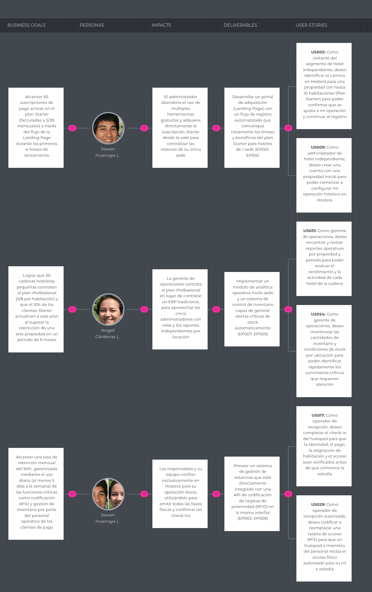

*Figura 3.1. Impact Mapping de Hostera para los hoteles independientes y las pequeñas cadenas hoteleras.*

<div style="page-break-before: always;"></div>

## 3.3. Product Backlog

El Product Backlog es una lista priorizada y evolutiva de los requisitos del producto
digital de Hostera. Reúne las User Stories y las Technical Stories, y conforme avance el proyecto podrá
incorporar tareas y otros elementos necesarios para desarrollar,
validar y desplegar la solución. La priorización se establece según el valor para el
negocio, las necesidades de los User Personas, las dependencias y los riesgos del
producto. Los Story Points representan una estimación relativa del esfuerzo, la
complejidad y la incertidumbre mediante la escala Fibonacci de 1, 2, 3, 5 y 8.

La siguiente escala establece el criterio común utilizado para estimar las historias
del producto digital. Los puntos expresan complejidad relativa.

| Puntos | Nivel de esfuerzo | Características |
| :---: | :--- | :--- |
| 1 | Muy bajo | Cambio aislado o contenido estático, sin lógica de negocio ni dependencias externas. |
| 2 | Bajo | Funcionalidad sencilla con interacción limitada y validaciones básicas. |
| 3 | Medio | Flujo con manejo de estados, reglas de complejidad media o interacción con servicios. |
| 5 | Alto | Lógica condicional compleja, integración de datos, comunicación con dispositivos o coordinación entre varios componentes. |
| 8 | Muy alto | Funcionalidad crítica o transversal que involucra tiempo real, seguridad, alta incertidumbre o gestión compleja entre múltiples componentes. |

<div style="page-break-before: always;"></div>

Las primeras ocho posiciones se mantienen para las historias de la Landing Page,
que deben considerarse desde el primer Sprint. A continuación se priorizan las
experiencias y flujos operativos de la Web Application por su valor visible para los
usuarios. Las historias de registro e inicio de sesión se ubican después de esas
capacidades. Las Technical Stories del RESTful API, correspondientes al trabajo
backend, se agrupan al final; las relacionadas con identidad, autenticación y
autorización ocupan las últimas posiciones.

| # Orden | User Story ID | Título | Descripción | Story Points |
| :---: | :---: | :--- | :--- | :---: |
| 1 | US001 | Understand the hotel-operations proposition | As a visitor, I want to understand what Hostera offers for hotel operations, so that I can decide whether Hostera is relevant to my hotel. | 5 |
| 2 | US003 | Find the independent-hotel path | As a visitor from the independent-hotel segment, I want to identify the Hostera option for one property with up to 10 rooms, so that I can confirm that it fits my operation and continue with the corresponding plan. | 3 |
| 3 | US004 | Find the small-chain path | As a small-chain hotel operations manager, I want an option for coordinating 2 to 5 locations, so that I can identify the plan and estimated cost intended for a multi-property operation. | 3 |
| 4 | US006 | Compare plans and choose a next step | As a visitor, I want to compare the plans and understand the available next steps, including the open Hotel group / Enterprise commercial option, so that I can choose the path that matches my operating scale. | 5 |
| 5 | US005 | Understand the product benefits and operating flow | As a visitor, I want to understand the benefits and the high-level operating flow described by Hostera, so that I can relate the proposition to hotel work. | 5 |
| 6 | US002 | Find information about Hostera | As a visitor, I want to request information about the topic I am interested in, so that I can learn about Hostera and understand the available next steps. | 5 |
| 7 | US008 | Consult Hostera information in English or Spanish | As a visitor, I want to choose English or Spanish, so that I can understand Hostera information in the language I understand best. | 8 |
| 8 | US007 | Explore product, team, and support content | As a visitor, I want product, team, and support information about Hostera, so that I can learn more before choosing a plan. | 8 |
| 9 | US011 | Monitor operations across properties | As a hotel administrator or operations manager, I want to monitor room revenue, occupancy, arrivals, and room conditions across properties and change the active property so that I can identify operational conditions that require attention. | 8 |
| 10 | US033 | Navigate between operational areas | As an authorized hotel operator, I want to work across the operational overview, bookings, rooms, inventory, and access control so that I can perform hotel-management tasks without losing the active property context. | 3 |
| 11 | US012 | Find and review bookings | As a front-desk operator or hotel administrator, I want to find bookings by guest name or booking code, stay period, and status so that I can review the correct booking before taking an operational action. | 3 |
| 12 | US019 | Review room availability for a selected date | As a front-desk operator or hotel administrator, I want to review daily room availability from a chosen date and find rooms by number, room type, or status so that I can plan assignments and operational work. | 5 |
| 13 | US013 | Create a booking | As a front-desk operator, I want to create a booking for a guest and an available room, including from a cancelled or no-show booking, so that the requested stay is recorded with its applicable rate. | 8 |
| 14 | US014 | Review and update a booking | As a front-desk operator, I want to review booking details and update pending or confirmed bookings so that guest and stay changes remain consistent with room availability and applicable rates. | 5 |
| 15 | US015 | Manage the booking lifecycle | As a front-desk operator, I want to confirm, cancel, restore, or mark a booking as a no-show so that its status and room assignment reflect the pre-arrival outcome. | 5 |
| 16 | US016 | Record a booking payment | As a front-desk operator, I want to record a payment received for a pending, confirmed, or checked-in booking so that the amount paid and remaining balance are accurate. | 3 |
| 17 | US017 | Complete guest check-in | As a front-desk operator, I want to verify the guest identity, record any arrival payments, and encode room access when completing check-in for a confirmed booking so that the guest can begin the stay with a verified identity and valid key cards. | 8 |
| 18 | US018 | Complete guest check-out | As a front-desk operator, I want to complete check-out for a checked-in booking with a settled balance and record the room condition so that the stay closes, key cards end, and unused nights become available. | 5 |
| 19 | US020 | Create a room | As a hotel administrator, I want to create a room within a property so that it can participate in availability planning and booking assignment. | 3 |
| 20 | US021 | Maintain room information and operational status | As a hotel administrator or authorized staff member, I want to review and update room information and operational status for a period so that room conditions remain accurate without overriding booking-controlled days. | 5 |
| 21 | US022 | Manage room types | As a hotel administrator, I want to manage room types with unique names, valid capacities, bed configurations, and positive base rates so that rooms share consistent accommodation information and room types in use remain protected. | 5 |
| 22 | US023 | Manage rate plans and daily rates | As a hotel administrator or operations manager, I want to define rate plans and daily room-type prices so that booking totals reflect the applicable commercial conditions. | 5 |
| 23 | US024 | Monitor property inventory | As a hotel administrator or inventory operator, I want to monitor item quantities and stock conditions by storage location so that I can identify supplies that require attention. | 5 |
| 24 | US025 | Manage inventory item records | As an inventory operator, I want to create and update inventory items while preserving their units after stock movements so that tracked supplies and their movement history remain consistent. | 5 |
| 25 | US027 | Manage storage locations | As a hotel administrator or inventory operator, I want to manage storage locations while preserving existing codes and locations with assigned items so that stock remains associated with the correct physical area and responsible team. | 5 |
| 26 | US026 | Adjust inventory stock | As an inventory operator, I want to record stock entering, leaving, or transferring between storage locations so that on-hand quantities and their audit history remain accurate. | 5 |
| 27 | US031 | Find and review an operational report | As a hotel administrator or operations manager, I want to find and review operational reports by property and period so that I can evaluate hotel performance and activity. | 5 |
| 28 | US032 | Export an operational report | As a hotel administrator or operations manager, I want to export the currently scoped report so that I can share or archive the operational results. | 3 |
| 29 | US028 | Review and manage RFID credentials | As a hotel administrator or authorized front-desk operator, I want to find RFID credentials by card, person, room, status, or holder type and review or revoke them with a recorded reason so that access remains valid only for the intended person and period. | 5 |
| 30 | US029 | Encode or replace an RFID key card | As an authorized front-desk operator, I want to encode RFID key cards with valid access periods or replace them with the same end of validity, limiting each staff member to one usable credential, so that guests and staff receive access appropriate to their role or stay. | 8 |
| 31 | US030 | Review RFID access events | As a hotel administrator or security-authorized operator, I want to find granted and denied RFID access events by date, result, access point, person, or card so that I can investigate activity at rooms and access points. | 5 |
| 32 | US009 | Register a hotel operation | As an independent hotel administrator or small-chain operations manager, I want to create an account with an initial property so that I can begin configuring my hotel operation in Hostera. | 5 |
| 33 | US010 | Sign in to Hostera | As an authorized hotel operator, I want to sign in with my work account so that I can access the properties and operational information assigned to me. | 3 |
| 34 | TS017 | Return standardized API errors | As a developer, I want the API to return consistent validation and domain-error responses so that client applications can handle failures predictably. | 5 |
| 35 | TS004 | Retrieve the operational dashboard through the API | As a developer, I want to retrieve a property-scoped operational overview through the API so that clients can present current hotel conditions. | 5 |
| 36 | TS005 | Query bookings through the API | As a developer, I want to query property bookings with supported criteria so that clients can retrieve the required subset predictably. | 3 |
| 37 | TS010 | Retrieve room availability through the API | As a developer, I want to retrieve room availability from a selected date through the API so that clients can plan assignments using consistent daily statuses. | 5 |
| 38 | TS011 | Manage rooms, room types, and rates through the API | As a developer, I want to manage rooms, room types, rate plans, and daily prices through the API so that clients can maintain consistent accommodation and pricing configuration. | 8 |
| 39 | TS006 | Create and update bookings through the API | As a developer, I want to create and update bookings through the API so that clients can maintain valid guest stays without conflicting room assignments. | 5 |
| 40 | TS007 | Transition booking status through the API | As a developer, I want to execute explicit booking-status transitions through the API so that clients cannot bypass lifecycle rules. | 5 |
| 41 | TS008 | Record payments through the API | As a developer, I want to record payments against bookings through the API so that clients can maintain paid amounts and balances without duplicating records. | 5 |
| 42 | TS009 | Complete check-in and check-out through the API | As a developer, I want to complete check-in and check-out through explicit API operations so that stay, room, payment, and credential states change consistently. | 8 |
| 43 | TS012 | Manage inventory and stock adjustments through the API | As a developer, I want to manage inventory records and append stock adjustments through the API so that clients can maintain auditable quantities. | 5 |
| 44 | TS013 | Manage storage locations through the API | As a developer, I want to manage property storage locations through the API so that inventory items and movements remain associated with valid operational areas. | 3 |
| 45 | TS016 | Retrieve and export operational reports through the API | As a developer, I want to retrieve and export property-scoped operational reports through the API so that clients can analyze and share consistent results. | 5 |
| 46 | TS014 | Manage RFID credentials through the API | As a developer, I want to encode, retrieve, replace, and revoke RFID credentials through the API so that clients and compatible encoders maintain controlled access. | 8 |
| 47 | TS015 | Record and query RFID access events through the API | As a developer, I want to record and query RFID access events through the API so that authorized clients can investigate granted and denied access attempts. | 5 |
| 48 | TS001 | Register an account through the API | As a developer, I want to register an administrator and initial property through the API so that client applications can initialize an authorized hotel operation. | 5 |
| 49 | TS002 | Authenticate an operator through the API | As a developer, I want to authenticate an operator and refresh an authorized session through the API so that clients can access protected hotel resources securely. | 5 |
| 50 | TS003 | Enforce property-scoped authorization | As a developer, I want protected API resources to enforce property-scoped authorization so that one hotel operation cannot access another property's data. | 8 |

La siguiente captura muestra el listado general de issues del proyecto Hostera en
YouTrack. En él se visualiza el estado del Product Backlog y los campos utilizados
para su seguimiento, priorización y estimación.

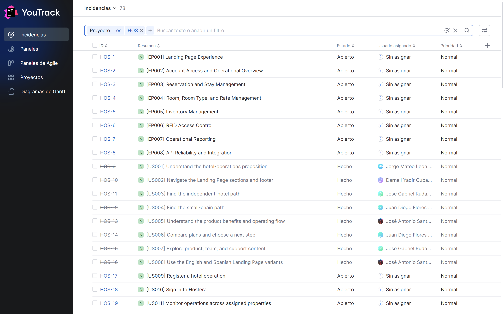

*Figura 3.2. Listado general del Product Backlog de Hostera en YouTrack.*

El Product Backlog puede consultarse en el tablero de YouTrack del proyecto (https://santanapromaster.youtrack.cloud/issues?q=project:%20HOS).

# Capítulo IV: Product Design

## 4.1. Style Guidelines

El sistema de diseño de Hostera centraliza las decisiones visuales que deben
mantenerse en el Landing Page y en las aplicaciones web. La propuesta adopta
Material Design 3 (M3) [10] y lo adapta a la identidad de Hostera mediante tokens de
color, tipografía, espaciado, forma y elevación compartidos.

### 4.1.1. General Style Guidelines

#### Branding

La identidad de Hostera utiliza el símbolo **Rising Bridge H**, una composición de
la letra H cuyas dos estructuras se conectan mediante un trazo ascendente. La marca
emplea verde evergreen como color principal y verde menta como acento. El símbolo
dispone de variantes para superficies claras y oscuras; se debe conservar su
proporción, contraste y área libre, sin deformarlo, rotarlo ni cambiar sus colores de
forma independiente.


*Figura 4.1. Variantes del símbolo Rising Bridge H extraídas del Design System de Hostera en Paper.*

| Aspecto | Lineamiento |
| :--- | :--- |
| Símbolo principal | Rising Bridge H en verde evergreen `#14523E` con acento menta `#8EDAB8`. |
| Superficie clara | Utilizar la variante principal sobre superficies blancas o neutras claras. |
| Superficie oscura | Utilizar la variante inversa clara sobre superficies oscuras para conservar el contraste. |
| Proporción | Mantener la relación original de ancho y alto; no estirar ni comprimir el símbolo. |
| Área libre | Mantener espacio alrededor del símbolo para evitar interferencias con texto, bordes u otros elementos. |

#### Color system

La paleta se organiza mediante roles semánticos de M3. Los componentes consumen
el rol correspondiente y no un tono aislado, lo que permite mantener contraste y
consistencia en toda la experiencia. El color fuente de la marca es `#14523E`,
utilizado como ancla del rol Primary. Warning es un color extendido para alertas
operativas y el rol Tertiary reutiliza Secondary para evitar una jerarquía cromática
innecesaria.

| Rol | Token | Valor | Uso principal |
| :--- | :--- | :---: | :--- |
| Primary | `--md-sys-color-primary` |  `#14523E` | Marca, acciones principales y elementos de mayor énfasis. |
| On Primary | `--md-sys-color-on-primary` |  `#FFFFFF` | Texto e iconos colocados sobre Primary. |
| Primary Container | `--md-sys-color-primary-container` |  `#9EF2CC` | Contenedores destacados con menor intensidad que Primary. |
| On Primary Container | `--md-sys-color-on-primary-container` |  `#002115` | Contenido colocado sobre Primary Container. |
| Secondary | `--md-sys-color-secondary` |  `#4E6558` | Acciones y elementos de énfasis secundario. |
| Secondary Container | `--md-sys-color-secondary-container` |  `#CFE9DA` | Contenedores secundarios y selecciones. |
| Surface | `--md-sys-color-surface` |  `#FFFFFF` | Superficie principal de páginas y vistas. |
| Surface Container | `--md-sys-color-surface-container` |  `#F3F6F4` | Agrupación de contenido y diferenciación de niveles. |
| On Surface | `--md-sys-color-on-surface` |  `#0D1613` | Texto e iconos principales sobre superficies. |
| On Surface Variant | `--md-sys-color-on-surface-variant` |  `#5B6862` | Texto secundario, metadatos y contenido de menor énfasis. |
| Outline | `--md-sys-color-outline` |  `#6E7B75` | Bordes y divisores de alta visibilidad. |
| Outline Variant | `--md-sys-color-outline-variant` |  `#C6CFCA` | Separadores y bordes sutiles. |
| Warning | `--md-extended-color-warning-color` |  `#B4650F` | Alertas operativas que requieren atención. |
| Error | `--md-sys-color-error` |  `#A32B22` | Errores, fallos de validación y acciones críticas. |

#### Typography

La familia tipográfica principal es **Geist**, utilizada en títulos, textos y
controles. **Geist Mono** se reserva para tokens, códigos, cifras y etiquetas que
requieren una lectura técnica o tabular. La escala mantiene los roles de M3: Display
y Headline usan peso Regular (`400`), Body usa Regular (`400`) y Title y Label
utilizan Medium (`500`) cuando requieren mayor énfasis.

| Grupo tipográfico | Roles y tamaños | Altura de línea | Peso |
| :--- | :--- | :--- | :---: |
| Display | Large `57px`, Medium `45px`, Small `36px` | `64px`, `52px`, `44px` | 400 |
| Headline | Large `32px`, Medium `28px`, Small `24px` | `40px`, `36px`, `32px` | 400 |
| Title | Large `22px`, Medium `16px`, Small `14px` | `28px`, `24px`, `20px` | 400 / 500 |
| Body | Large `16px`, Medium `14px`, Small `12px` | `24px`, `20px`, `16px` | 400 |
| Label | Large `14px`, Medium `12px`, Small `11px` | `20px`, `16px`, `16px` | 500 |

#### Spacing

El espaciado se construye sobre una unidad base de `4px`. La escala permite agrupar
elementos relacionados con separaciones pequeñas y diferenciar secciones mediante
intervalos mayores, manteniendo un ritmo visual consistente.

| Token | Valor | Aplicación |
| :--- | :---: | :--- |
| `--spacing-1` | `4px` | Ajustes mínimos entre elementos estrechamente relacionados. |
| `--spacing-2` | `8px` | Separación interna compacta. |
| `--spacing-3` | `12px` | Separación entre iconos, etiquetas y controles. |
| `--spacing-4` | `16px` | Padding estándar y distancia entre componentes. |
| `--spacing-6` | `24px` | Agrupación de bloques de contenido. |
| `--spacing-8` | `32px` | Separación entre grupos o subsecciones. |
| `--spacing-12` | `48px` | Espaciado amplio dentro de secciones. |
| `--spacing-16` | `64px` | Separación estructural entre áreas principales. |
| `--spacing-24` | `96px` | Ritmo vertical de secciones de gran escala. |

#### Shape and elevation

Las formas utilizan la escala de esquinas de M3. Los radios pequeños y medianos se
aplican en campos, tarjetas y contenedores; el radio Full se reserva para botones,
chips y controles de forma pill. El sistema dispone de niveles de elevación del 0 al
5 y utiliza el nivel más bajo que permita comunicar correctamente la jerarquía de
las superficies.

| Token | Radio | Aplicación principal |
| :--- | :---: | :--- |
| `--md-sys-shape-corner-none` | `0px` | Divisiones estructurales sin redondeo. |
| `--md-sys-shape-corner-extra-small` | `4px` | Elementos compactos. |
| `--md-sys-shape-corner-small` | `8px` | Chips y controles pequeños. |
| `--md-sys-shape-corner-medium` | `12px` | Tarjetas, campos y contenedores. |
| `--md-sys-shape-corner-large` | `16px` | Paneles y superficies destacadas. |
| `--md-sys-shape-corner-extra-large` | `28px` | Contenedores expresivos y modales. |
| `--md-sys-shape-corner-full` | `999px` | Botones y controles de forma pill. |

#### Communication tone

La comunicación de Hostera debe transmitir control, confianza y claridad sin perder
cercanía con los equipos hoteleros. Los mensajes presentan primero la acción o el
estado relevante y utilizan terminología coherente con el Ubiquitous Language.

| Dimensión | Posición adoptada | Aplicación |
| :--- | :--- | :--- |
| Divertido / Serio | Serio | Prioriza información operativa clara y evita expresiones que resten importancia a alertas o decisiones. |
| Formal / Casual | Formal y cercano | Utiliza lenguaje profesional, directo y fácil de comprender. |
| Respetuoso / Irreverente | Respetuoso | Evita culpabilizar al usuario y formula errores o alertas con orientación a la solución. |
| Entusiasta / Sereno | Sereno | Comunica avances y beneficios con seguridad, sin exageraciones ni urgencia innecesaria. |

#### Design principles

- **Jerarquía semántica:** color, tipografía y elevación expresan la importancia y
  el estado de cada elemento.
- **Consistencia:** los mismos tokens y patrones mantienen una experiencia coherente
  entre las vistas web de escritorio y móvil.
- **Claridad operativa:** cada vista prioriza estados, acciones y datos necesarios
  para completar una tarea hotelera.
- **Accesibilidad:** el contenido conserva contraste, legibilidad y estados visibles
  para interacción mediante puntero, teclado o pantalla táctil.
- **Uso contenido del énfasis:** los colores Warning y Error se reservan para
  situaciones que requieren atención y no como decoración.

<div style="page-break-before: always;"></div>

### 4.1.2. Web Style Guidelines

Las interfaces de Hostera se diseñan como una única experiencia web responsive que
se ejecuta en el navegador. Las vistas de escritorio, tablet y móvil comparten la
misma estructura semántica, componentes y jerarquía de acciones; únicamente cambia
su distribución según el ancho disponible. Los estándares visuales y de interacción
siguen los estados de Material Design 3 [10].

#### Responsive layout

La composición utiliza un enfoque *mobile-first*. El contenido ocupa el ancho
disponible hasta alcanzar el contenedor máximo de `1240px`; a partir de ese punto se
mantiene centrado. Las columnas son flexibles y los márgenes exteriores impiden que
el contenido quede pegado al borde del navegador.

| Rango | Breakpoint | Columnas | Márgenes y separación | Comportamiento |
| :--- | :---: | :---: | :--- | :--- |
| Compact | `< 768px` | 4 | `16px` | Contenido apilado y controles principales a ancho disponible. |
| Medium | `768px–1023px` | 8 | `24px` | Permite agrupaciones de dos columnas cuando conservan legibilidad. |
| Expanded | `1024px–1279px` | 12 | `32px` exteriores | Distribución multicolumna y navegación expandida. |
| Large | `≥ 1280px` | 12 | Contenedor centrado | El contenido no supera `1240px`; el espacio restante funciona como margen fluido. |

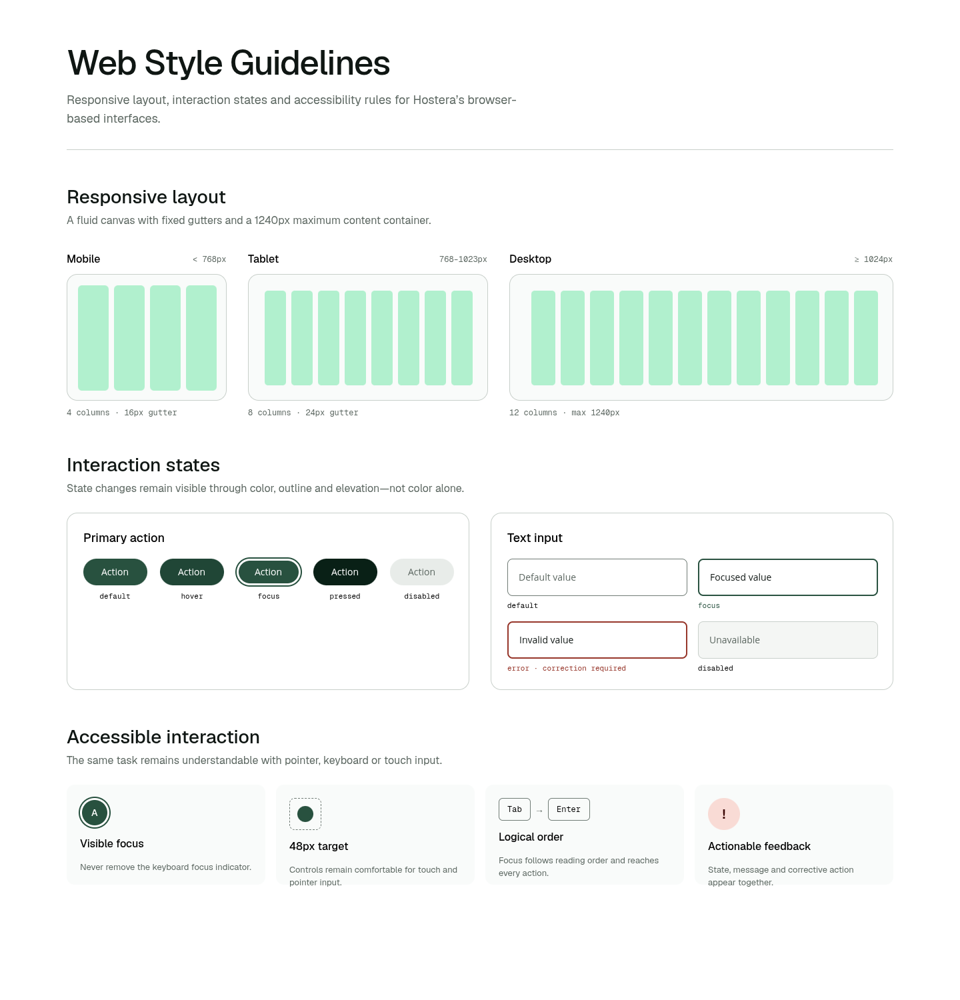

*Figura 4.2. Estándares responsive, estados de interacción y accesibilidad del sistema web de Hostera elaborados en Paper.*

La adaptación entre rangos sigue estas reglas:

- **Reflow:** las columnas se apilan sin alterar el orden de lectura ni la relación
  entre etiquetas, datos y acciones.
- **Wrap:** grupos de controles y filtros pasan a nuevas líneas antes de reducir su
  tamaño por debajo de una medida legible.
- **Prioridad:** la acción principal permanece visible; las acciones secundarias
  pueden agruparse en un menú cuando el ancho es limitado.
- **Tablas:** conservan encabezados y asociación entre celdas. Cuando no puedan
  reorganizarse, utilizan desplazamiento horizontal dentro de su propio contenedor,
  sin provocar desplazamiento en toda la página.
- **Contenido visual:** imágenes, gráficos y diagramas mantienen su proporción y no
  exceden el ancho de su contenedor.

#### Web components

Los componentes utilizan los tokens definidos en 4.1.1 y conservan el mismo nombre,
propósito y comportamiento en todos los rangos responsive. Las variantes se eligen
según la jerarquía de la tarea y no únicamente por preferencia estética.

| Componente | Estándar visual | Uso |
| :--- | :--- | :--- |
| Buttons | Altura visual de `40px`, forma `corner-full` y texto Label Large. | Filled para la acción principal; tonal, outlined o text para acciones de menor jerarquía. |
| Chips | Altura de `32px` y radio de `8px`. | Filtros, selecciones breves y estados; el texto acompaña siempre al color. |
| Text fields | Altura de `56px`, etiqueta persistente y texto de apoyo cuando sea necesario. | Captura y validación de datos; el error incluye explicación y forma de corrección. |
| Cards | Radio de `12px`; la variante outlined es la opción predeterminada. | Agrupación de información relacionada sin convertir toda la interfaz en tarjetas. |
| List items | Altura base de `72px` para elementos de dos líneas. | Presentación de registros con título, información secundaria y acción o estado final. |

En la Frontend Web Application estos componentes se implementan con Angular Material,
la biblioteca oficial de componentes de Material Design para Angular: los botones con
`mat-flat-button`, `mat-stroked-button` y `mat-button`; los campos con `mat-form-field`
en su variante outlined; las tablas con `mat-table` y `mat-paginator`; la navegación
con `mat-sidenav`; los filtros y el selector de idioma con `mat-button-toggle-group`; y
los formularios laterales y las confirmaciones con `MatDialog` y `MatSnackBar`. Los
tokens de Hostera se aplican sobre el tema de Angular Material, de modo que la
aplicación y la Landing Page comparten colores, tipografía y forma.

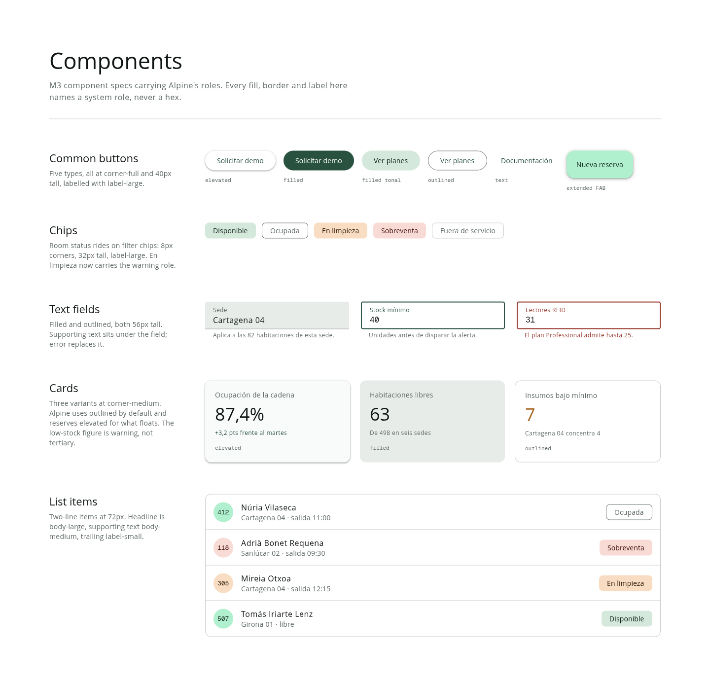

*Figura 4.3. Catálogo de componentes web aislados del Design System de Hostera en Paper.*

#### Interaction states

Todo control interactivo comunica su estado mediante al menos dos señales, como
color, contorno, texto, forma o elevación. Esta redundancia permite reconocer el
estado incluso cuando el color no puede distinguirse por sí solo.

| Estado | Lineamiento |
| :--- | :--- |
| Default | Presenta el componente disponible sin énfasis adicional. |
| Hover | Refuerza visualmente el área bajo el puntero sin modificar su tamaño ni desplazar contenido. |
| Focus | Muestra un indicador continuo de `2px`, visible alrededor del componente y diferente de sus bordes normales. |
| Pressed | Confirma de forma inmediata que la acción está siendo activada. |
| Selected | Mantiene una señal persistente de selección mediante contenedor, icono o texto. |
| Disabled | Reduce el énfasis y evita la interacción, pero conserva una etiqueta legible que permita identificar el control. |
| Error | Utiliza el rol Error junto con un mensaje que explique el problema y la corrección esperada. |

Las transiciones deben ser breves y funcionales. No deben bloquear una tarea ni ser
el único medio para comunicar un cambio. Cuando el navegador indique
`prefers-reduced-motion`, se eliminan desplazamientos y efectos no esenciales.

#### Accessibility and input methods

Hostera toma como referencia WCAG 2.2 (*Web Content Accessibility Guidelines 2.2*)
[11] para mantener interfaces perceptibles, operables y comprensibles. Los criterios
se aplican tanto a la interacción mediante puntero como al teclado y a la pantalla
táctil.

- El orden de foco coincide con el orden visual y permite alcanzar todas las acciones
  sin utilizar el mouse.
- El foco permanece visible y no queda oculto detrás de encabezados, diálogos u otras
  superficies superpuestas.
- Los controles tienen un área interactiva mínima de `48px × 48px`, aunque su forma
  visible pueda ser menor.
- El texto normal mantiene una relación de contraste mínima de `4.5:1`, y el texto
  grande una relación mínima de `3:1` respecto de su fondo.
- Los errores, advertencias y selecciones utilizan texto o iconografía además del
  color.
- Las etiquetas visibles se mantienen asociadas a sus controles y los mensajes de
  estado pueden ser interpretados por tecnologías de asistencia.

## 4.2. Information Architecture

### 4.2.1. Organization Systems

Los sistemas de organización definen cómo se agrupa y relaciona la información de
Hostera para que cada persona pueda reconocer qué contenido está consultando y qué
acción puede realizar a continuación. Estas decisiones se aplican a la Landing Page
y a las aplicaciones web responsive, tanto en una ventana amplia como en una vista
reducida del navegador. La organización se determina por el objetivo de la persona,
su rol y el contexto operativo; no se basa únicamente en la estructura interna del
software.

#### Estructuras de información

Hostera combina tres estructuras. La estructura jerárquica permite pasar de una
visión general a información más específica; la secuencial guía tareas que deben
completarse en un orden reconocible; y la matricial permite comparar dos
dimensiones, como el rol de la persona y el dominio operativo.

| Estructura | Aplicación en Hostera | Criterio de uso |
| :--- | :--- | :--- |
| **Jerárquica** | La Landing Page parte de la propuesta de valor y conduce hacia segmentos, beneficios, producto, planes y soporte. En la aplicación web, el panel general conduce a módulos y luego al detalle de cada registro. | Se utiliza cuando la persona necesita explorar desde un resumen hasta una información específica sin perder el contexto. |
| **Secuencial** | Los flujos operativos se organizan como seleccionar el contexto, configurar la información y ejecutar o revisar la operación. Este orden se aplica, por ejemplo, al preparar una operación del hotel antes de consultarla en el panel. | Se utiliza cuando una tarea tiene pasos dependientes y el siguiente paso requiere completar o confirmar el anterior. |
| **Matricial** | La información se cruza por audiencia y dominio operativo: un responsable de un hotel independiente consulta reservas y habitaciones, mientras que una persona responsable de una cadena consulta inventario, accesos y el estado de varias propiedades. | Se utiliza cuando una misma operación debe consultarse desde más de un rol o dimensión sin duplicar el contenido. |

La combinación de estas estructuras evita que todas las decisiones de organización
dependan de un único menú. La jerarquía sirve para orientar, la secuencia para
acompañar una tarea y la matriz para comparar alternativas o contextos de operación.

#### Esquemas de organización

Los esquemas se eligen según el tipo de necesidad. Cuando la persona conoce el
elemento que busca, se emplean esquemas exactos; cuando todavía está explorando o
aprendiendo qué puede hacer con Hostera, se emplean esquemas ambiguos y combinados.

| Esquema | Uso en Hostera | Ejemplo de información organizada |
| :--- | :--- | :--- |
| **Temático** | Es el esquema principal para presentar la propuesta de valor y los módulos del producto. | Reservas, disponibilidad de habitaciones, inventario y control de accesos. |
| **Por audiencia** | Organiza las alternativas según las responsabilidades de cada segmento objetivo. | Operación de un hotel independiente frente a la gestión de una cadena pequeña. |
| **Por tarea** | Agrupa funciones según la acción que la persona desea completar. | Crear o revisar una reserva, consultar disponibilidad o verificar un acceso. |
| **Cronológico** | Ordena eventos y registros cuando el momento de ocurrencia ayuda a entender la operación. | Historial de reservas, movimientos de inventario y eventos de acceso. |
| **Alfabético** | Se reserva para listas donde la persona conoce el nombre del elemento y necesita localizarlo rápidamente. | Búsqueda de huéspedes, habitaciones, propiedades o usuarios por nombre. |
| **Geográfico** | Se utiliza cuando una cadena necesita distinguir propiedades por ubicación. | Comparación de operaciones entre hoteles o sedes. |

El esquema temático se utiliza como punto de partida porque refleja los dominios
principales de Hostera. El esquema por audiencia conduce a los dos caminos de la
Landing Page, mientras que el esquema por tarea organiza el trabajo dentro de la
aplicación. Los esquemas cronológico, alfabético y geográfico se aplican a listas o
registros cuando aportan una forma más directa de localizar o comparar datos; no
reemplazan la organización temática de todo el producto.

#### Decisiones de organización por entorno

| Entorno | Persona y objetivo | Estructura dominante | Esquema principal | Resultado esperado |
| :--- | :--- | :--- | :--- | :--- |
| Landing Page | Visitante que desea entender la propuesta y elegir un siguiente paso. | Jerárquica | Temático + audiencia | Reconoce el valor de Hostera y encuentra el camino correspondiente a su escala operativa. |
| Aplicación web | Responsable que necesita ejecutar una operación concreta. | Jerárquica + secuencial | Tarea + audiencia | Accede al módulo adecuado y completa la operación con un orden predecible. |
| Registros operativos | Persona que revisa información histórica o localiza un registro conocido. | Matricial | Cronológico + tarea, con apoyo alfabético | Encuentra, filtra y compara información según la acción y el momento relevantes. |
| Gestión de varias propiedades | Responsable de una cadena que compara el mismo dominio entre sedes. | Matricial | Geográfico + temático | Mantiene el mismo modelo operativo y permite distinguir la propiedad involucrada. |

### 4.2.2. Labeling Systems

El sistema de etiquetado define las palabras que Hostera utiliza para representar
secciones, funciones, datos y acciones. Las etiquetas deben permitir que una
persona anticipe el contenido de un destino o el resultado de un control sin tener
que aprender la estructura interna del producto. Por ello, se priorizan términos
habituales de la operación hotelera, expresiones breves y asociaciones consistentes
entre la Landing Page y la aplicación web.

#### Principios de etiquetado

| Principio | Aplicación en Hostera |
| :--- | :--- |
| **Lenguaje orientado a la persona** | Las etiquetas describen el objetivo o la información que la persona reconoce, no el nombre técnico del componente o del servicio interno. |
| **Brevedad con significado** | Se utilizan una o pocas palabras cuando el contexto es suficiente. Cuando una etiqueta puede resultar ambigua, se añade una descripción breve en lugar de crear un nombre extenso. |
| **Consistencia gramatical** | Los destinos y módulos se expresan principalmente como sustantivos; las acciones se expresan como verbos en modo imperativo o infinitivo, según el contexto del control. |
| **Consistencia de nivel** | Elementos que pertenecen al mismo nivel de la estructura mantienen una granularidad comparable. Un módulo no se mezcla con una acción específica dentro del mismo grupo. |
| **Correspondencia entre etiqueta y contenido** | El contenido de una sección, página o control debe cumplir la expectativa creada por su etiqueta. No se reutiliza una etiqueta para destinos con objetivos diferentes. |
| **Asociación visible** | Las etiquetas se mantienen próximas al contenido o control que describen, y los iconos funcionan como apoyo visual, no como sustituto del texto. |
| **Reutilización controlada** | Un mismo concepto conserva la misma etiqueta en la Landing Page, la aplicación web, los mensajes de estado y los textos de apoyo. |

#### Etiquetas de la Landing Page

La Landing Page utiliza etiquetas de descubrimiento para ayudar a comprender la
propuesta de valor y elegir un camino. Los destinos se expresan como conceptos del
producto, mientras que los botones se expresan como siguientes acciones.

| Área | Etiquetas definidas | Tipo de etiqueta | Asociación esperada |
| :--- | :--- | :--- | :--- |
| Navegación primaria | `Solutions`, `Features`, `Pricing`, `Product`, `About` | Destinos temáticos | La persona anticipa el tipo de información que encontrará en cada sección. |
| Segmentos objetivo | `Independent hotel`, `Small hotel chain` | Etiquetas de audiencia | La persona identifica el camino que corresponde a su escala de operación. |
| Propuesta de valor | `Hotel operations, connected.` | Mensaje de posicionamiento | Resume la promesa de conectar la operación hotelera sin presentarse como una función aislada. |
| Llamadas a la acción | `Explore Starter`, `Explore Professional`, `Talk to sales`, `Sign in` | Acciones | Expresan el siguiente paso y distinguen entre iniciar una experiencia, evaluar un plan o solicitar contacto. |
| Soporte y contenido complementario | `Support`, `Discover Hostera`, `Meet the team`, `Frequently asked questions` | Destinos y puntos de entrada | Indican si la persona conocerá ayuda, el producto, el equipo o respuestas a dudas frecuentes. |

Las etiquetas de navegación se mantienen como nombres de destinos, mientras que las
llamadas a la acción se reservan para acciones concretas. Esta diferencia evita que
una persona confunda, por ejemplo, la sección `Pricing` con el botón que inicia la
evaluación de un plan.

#### Etiquetas de la aplicación web

En la aplicación web, las etiquetas se organizan alrededor de los dominios que
Hostera centraliza y de las tareas que una persona responsable debe completar. La
misma terminología se conserva al cambiar entre una vista amplia y una vista
reducida del navegador.

| Uso en la interfaz | Etiqueta definida | Qué representa |
| :--- | :--- | :--- |
| Entrada de navegación o sección del dashboard | `Reservations` | El conjunto de reservas y sus operaciones. |
| Entrada de navegación o sección del dashboard | `Rooms` | Las habitaciones y su disponibilidad. |
| Entrada de navegación o sección del dashboard | `Inventory` | El inventario del almacén y sus movimientos. |
| Entrada de navegación o sección del dashboard | `Access control` | Las tarjetas, los lectores y los eventos RFID. |
| Entrada de navegación o sección del dashboard | `Reports` | Los resultados agregados y las comparaciones operativas. |
| Acción dentro de un área funcional | `Create reservation`, `Check availability` | La operación que la persona puede ejecutar. |
| Acción dentro de un área funcional | `Add item`, `Review access event` | La operación sobre inventario o registros de acceso. |
| Estado de un registro o evento | `Available`, `Occupied`, `Pending`, `Access granted` | La condición actual del dato o evento. |

Las entradas de navegación expresan áreas de información y las acciones expresan
operaciones sobre esa información. Por ejemplo, `Reservations` identifica el
destino, mientras que `Create reservation` identifica una acción dentro de ese
destino. Esta relación hace explícita la asociación entre el área funcional, el dato y la
tarea de la persona.

#### Reglas de consistencia y validación

Antes de incorporar una nueva etiqueta se comprueba que:

- representa una sola idea y no combina un área funcional con una acción;
- utiliza el mismo término que el resto del producto para el mismo concepto;
- permite inferir el contenido o resultado sin depender únicamente de un icono;
- conserva una longitud razonable para no romper la lectura en pantallas reducidas;
- diferencia estados, acciones y destinos mediante su forma gramatical;
- mantiene la misma asociación semántica en títulos, botones, tablas, filtros y
  mensajes de estado.

Estas reglas permiten que el sistema de etiquetas sea reconocible y escalable a
medida que Hostera incorpore nuevas funciones, propiedades o integraciones.

### 4.2.3. SEO Tags and Meta Tags

Los metadatos de Hostera describen cada página de forma consistente para que los
usuarios y los agentes de búsqueda puedan identificar su propósito. Se definen los
campos mínimos solicitados para las páginas principales: `Title`, `Description`,
`Keywords` y `Author`. Los valores se adaptan al contexto de cada página y no se
reutiliza un título genérico en todo el producto.

#### Criterios para los metadatos

| Campo | Criterio de definición |
| :--- | :--- |
| **Title** | Identifica de forma única la página y coloca `Hostera` como referencia de la marca. Debe describir el contenido o la tarea principal de la vista. |
| **Description** | Resume el valor o propósito de la página en una frase clara. En la Landing Page comunica la propuesta de valor; en la aplicación web describe el espacio operativo. |
| **Keywords** | Reúne términos relacionados con el dominio hotelero y el contenido de la página. Se mantiene como apoyo semántico y no sustituye el contenido visible ni la estructura de encabezados. |
| **Author** | Identifica a `Team Coworkers` como equipo responsable del producto y del contenido publicado. |
| **Robots** | La Landing Page puede ser descubierta por buscadores. Las vistas internas de la aplicación web se marcan como `noindex, nofollow` para evitar que un espacio operativo aparezca como resultado público. |

#### Metadatos de la Landing Page

La Landing Page tiene una variante en inglés y otra en español. Cada variante
conserva el mismo propósito y la misma identidad de producto, pero utiliza valores
localizados para que el título y la descripción coincidan con el contenido visible.

| Variante | Title | Description | Keywords | Author |
| :--- | :--- | :--- | :--- | :--- |
| English | `Hostera \| Hotel operations, connected` | `Run reservations, rooms, inventory and access across every property from one place.` | `hotel operations, hotel management platform, reservations, room availability, inventory, RFID access` | `Team Coworkers` |
| Español | `Hostera \| Operación hotelera, conectada` | `Gestiona reservas, habitaciones, inventario y accesos en todos tus hoteles desde un solo lugar.` | `operación hotelera, plataforma de gestión hotelera, reservas, disponibilidad de habitaciones, inventario, accesos RFID` | `Team Coworkers` |

Las páginas de contacto comercial (`sales.html`) y de términos y condiciones
(`terms.html`) tienen sus propios valores, con el mismo autor, y la página principal
declara además la URL canónica y las etiquetas Open Graph. Al cambiar de idioma, la
página actualiza el título, la descripción y las keywords con los valores de la variante
elegida.

El título y la descripción de cada variante reflejan la propuesta de valor sin
confundir la Landing Page con una pantalla operativa. Los términos de `Keywords`
se relacionan con las capacidades que el proyecto declara dentro de su alcance
inicial: reservas, habitaciones, inventario y control de accesos.

#### Metadatos de la aplicación web

La aplicación web tiene un objetivo operativo y no funciona como una página pública
de adquisición. Sus metadatos identifican el espacio de trabajo y mantienen la
misma terminología del producto, pero evitan presentarlo como contenido indexable.

| Vista principal | Title | Description | Keywords | Author | Robots |
| :--- | :--- | :--- | :--- | :--- | :--- |
| Hostera web application | `Hostera - <vista>`, por ejemplo `Hostera - Bookings` | `Hostera web application: manage bookings, room availability, warehouse inventory and RFID room access for every property from one workspace.` | `Hostera, hotel operations, hotel management, bookings, room availability, inventory, RFID access control` | `Team Coworkers` | `noindex` |

El título de la aplicación se compone en cada navegación: `HosteraTitleStrategy`
antepone `Hostera` al título de la ruta activa. Los demás metadatos están en
`src/index.html` del repositorio `hostera-frontend`, junto con `theme-color`.

#### Implementación mínima

Cada página debe renderizar sus propios valores en el elemento `head`. La Landing
Page utiliza los valores de su variante correspondiente y la aplicación web utiliza
los valores operativos definidos anteriormente.

```html
<title>Hostera | Hotel operations, connected</title>
<meta
  name="description"
  content="Run reservations, rooms, inventory and access across every property from one place."
>
<meta
  name="keywords"
  content="hotel operations, hotel management platform, reservations, room availability, inventory, RFID access"
>
<meta name="author" content="Team Coworkers">
```

En la aplicación web, el valor de `robots` se añade junto con sus propios
metadatos:

```html
<meta
  name="description"
  content="Hostera web application: manage bookings, room availability, warehouse inventory and RFID room access for every property from one workspace."
/>
<meta
  name="keywords"
  content="Hostera, hotel operations, hotel management, bookings, room availability, inventory, RFID access control"
/>
<meta name="author" content="Team Coworkers" />
<meta name="robots" content="noindex" />
```

Los metadatos se mantienen alineados con el contenido visible, la estructura de
etiquetas y los nombres definidos en esta arquitectura. Cuando se agregue una nueva
página principal, deberá contar con un `Title`, `Description`, `Keywords` y `Author`
propios antes de incorporarse al producto.

### 4.2.4. Searching Systems

El sistema de búsqueda de Hostera ayuda a localizar información operativa dentro
de la aplicación web. La búsqueda se organiza por área funcional para conservar el
contexto del dato, respetar las responsabilidades de cada persona y evitar que una
consulta mezcle reservas, inventario y eventos de acceso sin una interpretación
clara. La Landing Page no incorpora un buscador global porque su contenido es breve
y se encuentra mediante la organización temática, las etiquetas y la navegación
entre secciones.

#### Zonas de búsqueda

Cada zona utiliza un campo de búsqueda relacionado con los datos que la persona está
consultando. El texto puede coincidir parcialmente y no depende de diferencias
entre mayúsculas y minúsculas; cuando corresponda, también se normalizan tildes para
facilitar la localización de nombres en español.

| Zona | Campos de búsqueda | Filtros complementarios |
| :--- | :--- | :--- |
| **Reservations** | Nombre del huésped, código de reserva y contacto asociado. | Propiedad, rango de fechas, estado de la reserva y tipo de habitación. |
| **Rooms** | Número o nombre de habitación y propiedad. | Fecha de consulta, estado de ocupación, tipo de habitación y disponibilidad. |
| **Inventory** | Nombre del artículo, código o categoría. | Propiedad, ubicación de almacén, nivel de stock y estado del artículo. |
| **Access control** | Persona, tarjeta, lector o identificador del evento. | Propiedad, rango de fecha y hora, lector y resultado del acceso. |
| **Reports** | Nombre del reporte o dominio operativo. | Propiedad, periodo, área funcional y estado del procesamiento. |

La búsqueda libre se utiliza para localizar un elemento conocido o reducir una lista
grande. Los filtros se utilizan para acotar los resultados cuando la persona conoce
el contexto operativo, pero no el valor exacto que debe escribir. Ambos mecanismos
pueden combinarse sin sustituir la información visible del área funcional.

#### Opciones y filtros

La interfaz presenta un campo de texto, una acción para ejecutar la consulta y una
acción para limpiar los criterios. Los filtros permanecen asociados al área en la
que fueron aplicados y se pueden retirar individualmente para revisar cómo cambia
el resultado.

| Opción | Comportamiento definido |
| :--- | :--- |
| Consulta por texto | Busca coincidencias parciales en los campos relevantes de la zona activa. |
| Coincidencia conocida | Permite localizar un código, identificador o nombre exacto cuando la persona ya conoce el elemento. |
| Filtros combinados | Aplica dos o más condiciones al mismo tiempo, como propiedad, fecha y estado. |
| Ordenamiento | Permite ordenar los resultados por el criterio útil para la zona, como fecha, nombre o nivel de stock. |
| Limpiar búsqueda | Elimina el texto y los filtros activos, y devuelve la lista inicial de la zona. |
| Filtros responsive | En una vista amplia se muestran junto a los resultados; en una vista reducida se agrupan en un control desplegable o panel de filtros. |

Los filtros disponibles deben corresponder a atributos reales de los resultados.
No se muestran opciones que no puedan modificar la consulta o que no tengan una
representación comprensible para la persona.

#### Presentación de resultados

Los resultados se muestran dentro de la misma zona de información para conservar el
contexto de la consulta. Cada resultado presenta primero el dato que permite
reconocerlo y luego los atributos necesarios para decidir qué hacer con él.

| Tipo de resultado | Información principal | Acción asociada |
| :--- | :--- | :--- |
| Reserva | Huésped, código, fechas, habitación y estado. | Abrir el detalle o revisar la disponibilidad relacionada. |
| Habitación | Número, tipo, propiedad y estado de disponibilidad. | Abrir el detalle o revisar las reservas relacionadas. |
| Artículo de inventario | Nombre, código, ubicación, stock y estado. | Abrir el detalle o registrar una operación de inventario. |
| Evento de acceso | Persona o tarjeta, lector, fecha, hora y resultado. | Abrir el detalle y revisar el contexto del evento. |
| Reporte | Nombre, periodo, propiedad y estado de procesamiento. | Abrir, filtrar o revisar el resultado del reporte. |

La lista de resultados comunica el total encontrado, conserva los criterios activos y
permite distinguir entre un resultado disponible, una consulta sin coincidencias y
un error de procesamiento. Cuando no hay coincidencias, se explica qué se buscó y se
ofrece limpiar o modificar los criterios; no se presenta una lista vacía sin
contexto.

#### Flujo de búsqueda

El flujo de búsqueda sigue cuatro pasos consistentes:

1. La persona entra al área funcional que contiene el dato que necesita.
2. Escribe un término o selecciona uno o más filtros.
3. Ejecuta la consulta y revisa el total, los criterios activos y los resultados.
4. Abre el registro requerido o modifica los criterios para realizar otra consulta.

Este flujo mantiene la relación entre intención, consulta y resultado. Además, evita
que la búsqueda se convierta en una navegación paralela que oculte la estructura de
la aplicación. La información mostrada debe respetar el alcance de la propiedad y
los permisos de la persona autenticada.

### 4.2.5. Navigation Systems

El sistema de navegación define las acciones y técnicas que permiten recorrer la
información de Hostera, reconocer la ubicación actual y llegar a la siguiente tarea
sin perder el contexto. La navegación se diseña de manera distinta para la Landing
Page y para la aplicación web, porque la primera acompaña el descubrimiento del
producto y la segunda acompaña la operación hotelera.

#### Tipos de navegación

Hostera combina navegación global, local, contextual y de utilidad. Cada tipo tiene
una responsabilidad específica y evita que un solo menú tenga que resolver todas las
necesidades de recorrido.

| Tipo | Aplicación en Hostera | Propósito |
| :--- | :--- | :--- |
| **Global** | Encabezado de la Landing Page y menú principal de la aplicación web. | Permite cambiar entre las áreas principales sin importar dónde se encuentra la persona. |
| **Local** | Enlaces ancla dentro de la Landing Page y pestañas o subsecciones dentro de un área funcional. | Permite recorrer el contenido relacionado con la sección actual. |
| **Contextual** | Enlaces, tarjetas, botones y acciones que aparecen junto al contenido consultado. | Conduce al siguiente paso relacionado con la decisión o tarea actual. |
| **De utilidad** | Control de idioma de la Landing Page y acciones de cuenta, ayuda o configuración cuando correspondan a la vista. | Resuelve necesidades transversales sin mezclarlas con los destinos principales. |
| **De retorno** | Breadcrumbs, acción de volver y retorno al listado después de consultar un detalle. | Permite regresar a un nivel anterior conservando el contexto de la consulta. |

#### Navegación de la Landing Page

La Landing Page utiliza una navegación jerárquica y por anclas. El encabezado
presenta los destinos principales `Solutions`, `Features`, `Pricing`, `Product` y
`About`. Cada etiqueta lleva a su sección correspondiente dentro de la misma página.
El pie de página repite los destinos relevantes y añade `Support` y `Terms and
Conditions` para que la persona pueda continuar el recorrido desde el final del
contenido.

El recorrido principal sigue esta secuencia:

1. La persona reconoce la propuesta de valor en el hero y elige un siguiente paso.
2. Revisa segmentos, funciones y planes para comparar la propuesta con su contexto.
3. Selecciona una llamada a la acción, como `Explore Starter`, `Explore Professional`
   o `Talk to sales`.
4. Puede continuar hacia el producto, el equipo o el soporte mediante los enlaces
   contextuales y el pie de página.

Los caminos de `Independent hotel` y `Small hotel chain` funcionan como navegación
contextual. No crean dos productos separados; orientan a la persona hacia el plan y
la acción que corresponden a su escala operativa.

#### Navegación de la aplicación web

La aplicación web utiliza un menú global persistente para las áreas funcionales de
Hostera: `Reservations`, `Rooms`, `Inventory`, `Access control` y
`Reports`. El menú permite cambiar de área sin reiniciar la tarea y comunica la
sección activa mediante una señal visual y textual.

Dentro de cada área, la navegación local lleva de la lista al detalle y del detalle
a las acciones relacionadas. Las acciones que cambian el estado de un registro se
mantienen próximas al contenido que modifican, mientras que la acción de retorno
permite volver a la lista sin perder los filtros o el contexto de la propiedad.

| Nivel | Ejemplo de recorrido | Regla de navegación |
| :--- | :--- | :--- |
| Área funcional | Menú principal → `Reservations` | La persona identifica dónde se encuentra mediante el destino activo. |
| Colección | `Reservations` → lista de reservas | La lista permite revisar el conjunto y utilizar la búsqueda o los filtros del área. |
| Detalle | Lista → detalle de una reserva | El detalle conserva el nombre del área y ofrece una acción clara para regresar. |
| Acción contextual | Detalle → revisar disponibilidad relacionada | La acción aparece junto al dato que explica por qué es relevante. |
| Cambio de contexto | Selector de propiedad → otra propiedad | El cambio informa qué propiedad está activa antes de actualizar el contenido. |

La aplicación no utiliza enlaces aislados que lleven a una pantalla sin contexto. Cada
destino conserva una relación visible con el área, la propiedad y el registro desde
el que se inició el recorrido.

#### Navegación responsive

Las experiencias web de Hostera se adaptan al ancho disponible del navegador. En una
vista amplia, el menú global puede permanecer visible junto al contenido; en una
vista reducida se transforma en un control desplegable o panel lateral. La
transformación cambia la disposición, pero conserva el orden, los nombres y la
jerarquía de las opciones.

| Situación | Vista amplia | Vista reducida |
| :--- | :--- | :--- |
| Navegación global | Menú visible junto al contenido principal. | Menú agrupado en un control que puede abrirse y cerrarse. |
| Navegación local | Enlaces o pestañas visibles en la sección. | Pestañas desplazables o selector que mantiene la sección activa. |
| Retorno | Breadcrumbs o acción de volver junto al título. | Acción de volver visible antes del título o en la barra superior. |
| Filtros y contexto | Panel de filtros y selector de propiedad visibles. | Panel desplegable que muestra los filtros activos y permite retirarlos individualmente. |

Cuando una persona abre un menú responsive, el foco permanece dentro del panel hasta
que lo cierra o selecciona un destino. Al cambiar de sección, el encabezado, la
señal de ubicación activa y el contenido principal se actualizan de forma coherente.
La navegación por teclado conserva el mismo orden lógico que la navegación visual.

#### Señales de ubicación y continuidad

Cada pantalla comunica dónde se encuentra la persona mediante una combinación de
nombre de sección, estado activo, título de contenido y acción de retorno. Los
enlaces visitados no sustituyen estas señales, porque la ubicación actual debe ser
comprensible incluso cuando la persona llega directamente a una vista.

La navegación de Hostera se considera consistente cuando una persona puede responder
estas tres preguntas en cualquier momento: dónde estoy, qué puedo hacer aquí y cómo
regreso al contexto anterior. Estas señales mantienen la continuidad entre la
Landing Page, la selección de segmento y la aplicación web.

## 4.3. Landing Page UI Design

La propuesta de interfaz del Landing Page traduce el sistema de diseño y la
arquitectura de información de Hostera en una experiencia web coherente y
responsive. La composición establece una jerarquía que inicia con la propuesta de
valor, orienta a cada visitante hacia su segmento, explica el problema y la solución,
presenta las capacidades y planes del producto, y culmina con contenido de confianza,
preguntas frecuentes y acciones de conversión. Este recorrido conserva el mismo orden
y significado en navegadores de escritorio y móviles, aunque adapta la distribución,
la navegación y el tamaño de los elementos al espacio disponible.

La versión `v0.5.0` publicada en el Sprint 2 presenta los planes con sus precios: Starter
a S/39 por propiedad al mes para un hotel de hasta 10 habitaciones, y Professional a S/8
por habitación al mes para cadenas de 2 a 5 sedes, con una calculadora que estima el
costo mensual a partir del total de habitaciones. Los grupos hoteleros mayores pasan a
una página de contacto comercial (`sales.html`). El encabezado de todas las páginas
incluye el enlace `Sign in`, y la llamada a la acción de cada segmento abre su vista en
la aplicación web: el camino del hotel independiente y el plan Starter abren el registro
con Starter seleccionado (`/sign-up?plan=starter`), y el camino de la cadena pequeña y el
plan Professional lo abren con Professional seleccionado (`/sign-up?plan=professional`).

### 4.3.1. Landing Page Wireframe

Los wireframes definen la estructura, la prioridad del contenido y las relaciones
entre los elementos antes de aplicar el acabado visual. Las áreas de texto, imágenes,
videos, tarjetas, controles y acciones se representan mediante formas simples para
concentrar la evaluación en la organización de la experiencia. Los labels visibles,
el orden predecible de lectura y la diferenciación entre contenido y controles
permiten reconocer cada función sin depender únicamente del color.

#### Desktop Web Browser

La versión de escritorio aprovecha el ancho disponible para mantener la navegación
global visible, presentar el hero como punto focal y organizar en columnas los
segmentos, características, pasos, planes y perfiles del equipo. Esta distribución
facilita la comparación de contenido relacionado y mantiene un ritmo vertical claro
entre las secciones. Los encabezados, agrupaciones, divisores y llamadas a la acción
refuerzan la jerarquía definida por los sistemas de organización, etiquetado y
navegación.


*Figura 4.4. Wireframe del Landing Page de Hostera para Desktop Web Browser.*

#### Mobile Web Browser

La versión móvil conserva el contenido y su secuencia, pero transforma la navegación
en un control compacto y reorganiza las composiciones en una columna. Las tarjetas y
los bloques multimedia se apilan para evitar desplazamiento horizontal, mientras que
los márgenes laterales mantienen una línea de lectura estable. Los controles
interactivos principales tienen una altura mínima de 48 px y permanecen claramente
identificados, lo que favorece su uso táctil y mediante tecnologías de asistencia.


*Figura 4.5. Wireframe del Landing Page de Hostera para Mobile Web Browser.*

### 4.3.2. Landing Page Mock-up

Los mock-ups incorporan el Design System de Hostera sobre la estructura validada en
los wireframes. La interfaz utiliza la tipografía Geist, los roles de color definidos
para superficies, contenido, contornos y acciones, así como componentes y patrones de
Material Design 3. La consistencia de espaciado, forma, contraste y jerarquía permite
reconocer qué elementos informan, cuáles agrupan contenido y cuáles permiten continuar
el recorrido.

#### Desktop Web Browser

En escritorio, el mock-up conserva composiciones amplias para comunicar la propuesta
de valor y mostrar relaciones entre alternativas. Las tarjetas de segmentos y planes
permiten comparar opciones en paralelo; las secciones de producto, funcionamiento,
evidencia y equipo alternan texto y contenido visual para mantener el ritmo de lectura.
Los botones principales emplean un énfasis uniforme y las acciones secundarias se
distinguen sin competir con el objetivo principal de cada sección.


*Figura 4.6. Mock-up del Landing Page de Hostera para Desktop Web Browser.*

#### Mobile Web Browser

En móvil, la propuesta aplica el mismo lenguaje visual con una composición adaptada a
una sola columna. El encabezado reduce sus opciones visibles a un control de menú, las
acciones principales ocupan un ancho fácilmente alcanzable y los grupos de tarjetas se
apilan sin alterar su prioridad. La escala tipográfica, el contraste entre contenido y
superficie, los labels explícitos y el tamaño de los controles mantienen la lectura y
la interacción accesibles. De esta manera, la adaptación responsive conserva la
identidad y la arquitectura de información sin tratar la vista móvil como un producto
distinto.


*Figura 4.7. Mock-up del Landing Page de Hostera para Mobile Web Browser.*

## 4.4. Web Applications UX/UI Design

### 4.4.1. Web Applications Wireframes

Los wireframes de Hostera representan la estructura de la aplicación web responsive en
el breakpoint móvil. Aunque la solución se ejecuta en el navegador, esta vista permite
comprobar cómo se reorganizan los contenidos y controles cuando el ancho disponible es
reducido. La propuesta conserva la jerarquía de la información y apila los grupos de
contenido para priorizar la lectura vertical y la interacción táctil.

El conjunto cubre el acceso a la aplicación, el dashboard, las reservas, las
habitaciones, el inventario, el control de acceso RFID y los reportes operativos. La
navegación principal se concentra en un drawer móvil, mientras que cada vista mantiene
el selector de propiedad, un encabezado identificable y acciones relacionadas con el
contexto actual. Las listas, formularios y áreas de resumen utilizan contenedores
simples y labels explícitos para diferenciar información, controles y estados sin
depender únicamente del color.

#### Acceso, dashboard y reservas

Las primeras vistas muestran el acceso, el registro, el resumen operativo, la consulta
de reservas y el formulario para crear una nueva reserva. La composición mantiene los
campos y acciones dentro de una sola columna, mientras que el dashboard prioriza el
resumen de ocupación, el estado de las habitaciones y las próximas llegadas.

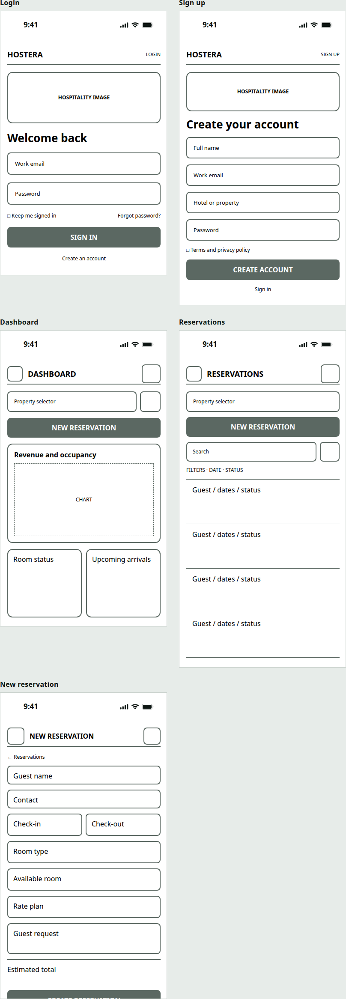

*Figura 4.8. Wireframes móviles de acceso, dashboard y reservas.*

#### Reservación, habitaciones e inventario

Este grupo representa el detalle de una reserva, el listado de habitaciones, el detalle
de una habitación, el inventario y el ajuste de stock. La información contextual se
mantiene cerca de las acciones correspondientes: el estado de la reserva acompaña sus
datos principales, la habitación expone sus atributos operativos y el ajuste de stock
separa la cantidad, la ubicación y el motivo de la operación.


*Figura 4.9. Wireframes móviles de reservación, habitaciones e inventario.*

#### Control de acceso, reportes y navegación

Las últimas vistas cubren las credenciales RFID, los eventos de acceso, la biblioteca de
reportes, el reporte de ocupación y el drawer de navegación. Los indicadores resumidos
preceden a los listados para facilitar el escaneo, y los filtros se ubican antes del
contenido que afectan. El drawer conserva las áreas funcionales principales y permite
cambiar de contexto sin perder la orientación dentro de la aplicación.


*Figura 4.10. Wireframes móviles de control de acceso, reportes y navegación.*

### 4.4.2. Web Applications Wireflow Diagrams

Los Web Application Wireflows representan las rutas principales de interacción de
Hostera a partir de los User Goals definidos para la Web Application. Cada Wireflow
considera el User Persona correspondiente, utiliza los Wireframes de las pantallas
como estados del flujo y agrega un nuevo estado cuando una interacción modifica el
contenido o la condición de la pantalla. Los estados de validación, ausencia de
resultados, restricciones y errores se muestran como pasos alternativos dentro del
recorrido correspondiente.

Los diagramas fueron elaborados en FigJam utilizando las pantallas diseñadas en el
archivo de Paper `Team-Coworkers`. El board editable con los 25 Wireflows se conserva
en el espacio de trabajo del equipo; sus diagramas se presentan a continuación como
capturas.

#### Objetivos de usuario y recorridos especificados

| User Goal | User Persona | Recorrido representado |
| :--- | :--- | :--- |
| Create an account with an initial property. | Independent hotel administrator / small-chain operations manager | Sign up → validation errors when the registration data is incomplete or invalid. |
| Sign in with an authorized work account. | Authorized hotel operator | Login → invalid credentials state when authentication fails. |
| Monitor current operations for an assigned property. | Hotel administrator / operations manager | Dashboard → property selection → operational search results → no results or partial-data state. |
| Navigate to another authorized operational area. | Authorized hotel operator | Dashboard context → restricted navigation state that preserves the active property scope. |
| Find and review a reservation. | Front-desk operator / hotel administrator | Reservations list → empty result state when no reservation matches the criteria. |
| Create a reservation for an available room. | Front-desk operator | Create reservation → validation errors or invalid-period state when the requested stay cannot be recorded. |
| Review and update an existing reservation. | Front-desk operator | Reservation detail → edit reservation → availability-conflict state when the proposed change is not valid. |
| Update a reservation according to its pre-arrival outcome. | Front-desk operator | Pending reservation → status actions → confirmation, no-show, or cancelled state. |
| Record a payment received for a reservation. | Front-desk operator | Record payment → invalid-amount state when the payment cannot be accepted. |
| Complete guest check-in for a confirmed reservation. | Front-desk operator | Verify guest → payment → encode key card → encoded card → completed check-in, with an unresolved-identity alternative. |
| Complete guest check-out for an occupied room. | Front-desk operator | Checked-in reservation → check-out review → completed check-out, with an unresolved-balance alternative. |
| Review room availability from a selected date. | Front-desk operator / hotel administrator | Rooms list → room detail with the selected-date monthly availability view. |
| Create a room within an assigned property. | Hotel administrator | Rooms list → new-room drawer → duplicate-number validation state. |
| Review and maintain a room's operational information. | Hotel administrator / operations manager | Room availability context → room detail → edit room state. |
| Create or update a room type. | Hotel administrator | Room types list → new room type → edit-in-use type state. |
| Define a rate plan and its daily room-type prices. | Hotel administrator / operations manager | Rates list → new rate plan → daily rate configuration. |
| Monitor inventory quantities and stock conditions. | Inventory operator / hotel administrator | Inventory overview with current quantities and stock conditions. |
| Create or update an inventory item. | Inventory operator | Item detail → add item or edit item drawer. |
| Record a stock adjustment for an inventory item. | Inventory operator | Item detail → adjust stock drawer → insufficient-stock state when the adjustment is not allowed. |
| Create or update an inventory storage location. | Hotel administrator / inventory operator | Storage locations → location detail → add or edit location → removal-blocked state when the location is in use. |
| Review and manage an RFID credential. | Hotel administrator / authorized front-desk operator | Access control → credential detail → revoke or replace card. |
| Encode an RFID key card with an authorized access scope. | Authorized front-desk operator | Issue staff credential → encoding reference → encoding-failed state when the device operation is unsuccessful. |
| Find and review RFID access events. | Hotel administrator / security-authorized operator | Access events → denied-event detail for investigation. |
| Find and review an operational report for a property and period. | Hotel administrator / operations manager | Reports library → occupancy and availability report → empty-period state. |
| Export an operational report for the selected scope. | Hotel administrator / operations manager | Occupancy report → export options → completed export or unauthorized-export state. |

#### Wireflow diagrams

**User goal: Create an account with an initial property.**


*Figura 4.11. Wireflow para crear una cuenta con una propiedad inicial.*

**User goal: Sign in with an authorized work account.**

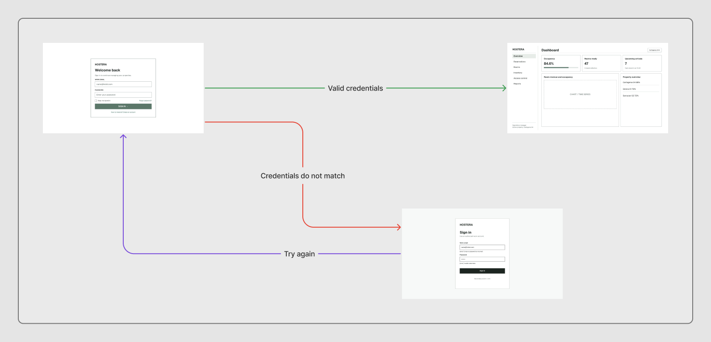

*Figura 4.12. Wireflow para iniciar sesión con una cuenta de trabajo autorizada.*

**User goal: Monitor current operations for an assigned property.**


*Figura 4.13. Wireflow para monitorear las operaciones de una propiedad asignada.*

**User goal: Navigate to another authorized operational area.**

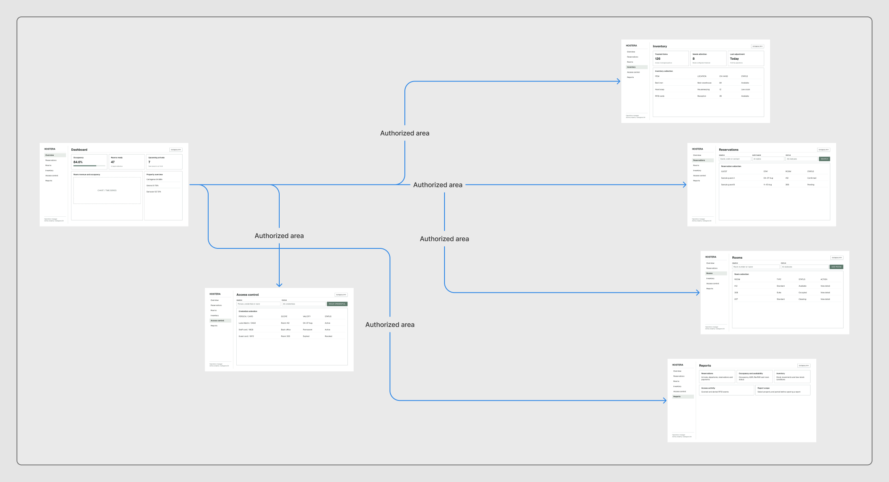

*Figura 4.14. Wireflow para navegar a otra área operativa autorizada.*

**User goal: Find and review a reservation.**

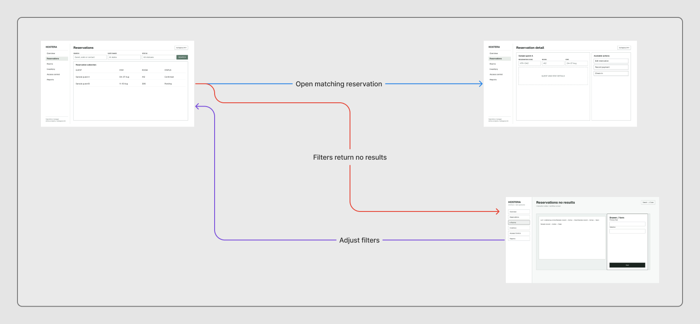

*Figura 4.15. Wireflow para encontrar y revisar una reserva.*

**User goal: Create a reservation for an available room.**


*Figura 4.16. Wireflow para crear una reserva de habitación disponible.*

**User goal: Review and update an existing reservation.**

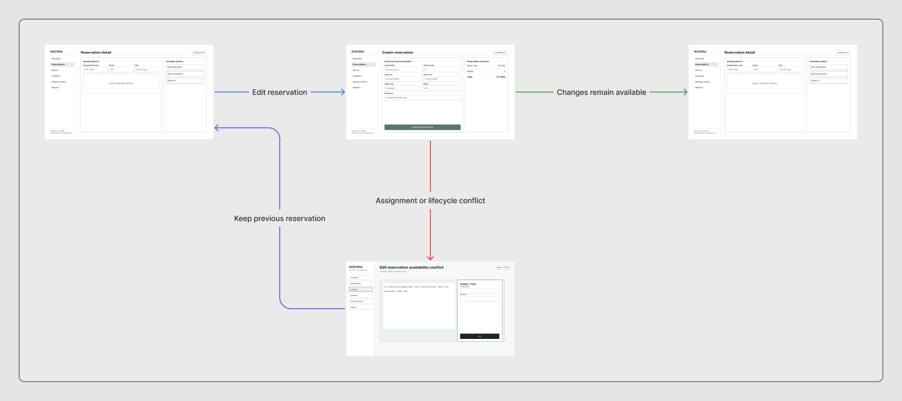

*Figura 4.17. Wireflow para revisar y actualizar una reserva existente.*

**User goal: Update a reservation according to its pre-arrival outcome.**

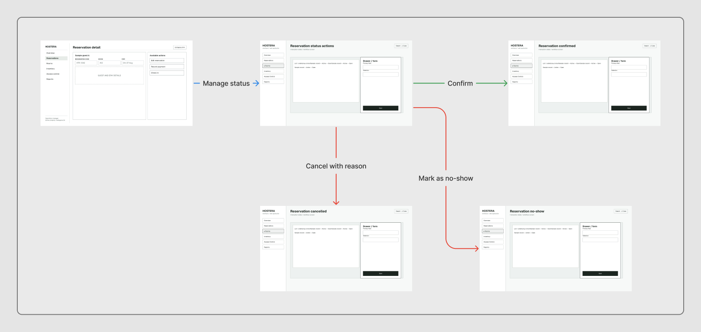

*Figura 4.18. Wireflow para actualizar una reserva según el resultado previo a la llegada.*

**User goal: Record a payment received for a reservation.**


*Figura 4.19. Wireflow para registrar un pago de reserva.*

**User goal: Complete guest check-in for a confirmed reservation.**


*Figura 4.20. Wireflow para completar el check-in de un huésped.*

**User goal: Complete guest check-out for an occupied room.**

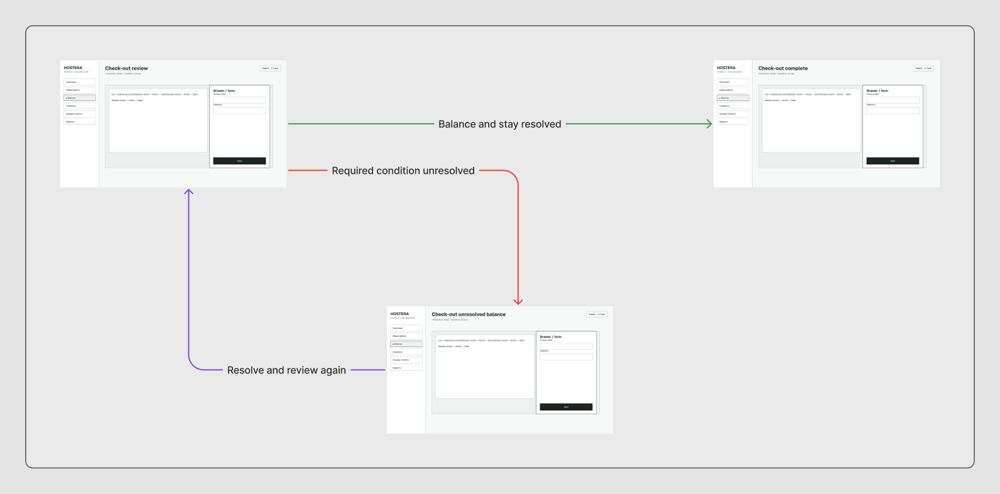

*Figura 4.21. Wireflow para completar el check-out de una habitación ocupada.*

**User goal: Review room availability from a selected date.**


*Figura 4.22. Wireflow para revisar disponibilidad desde una fecha seleccionada.*

**User goal: Create a room within an assigned property.**

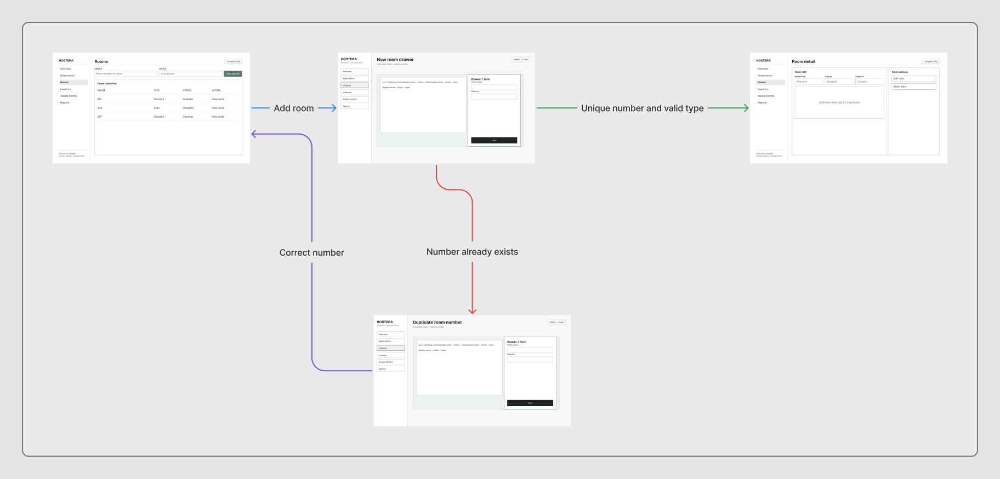

*Figura 4.23. Wireflow para crear una habitación dentro de una propiedad asignada.*

**User goal: Review and maintain a room's operational information.**

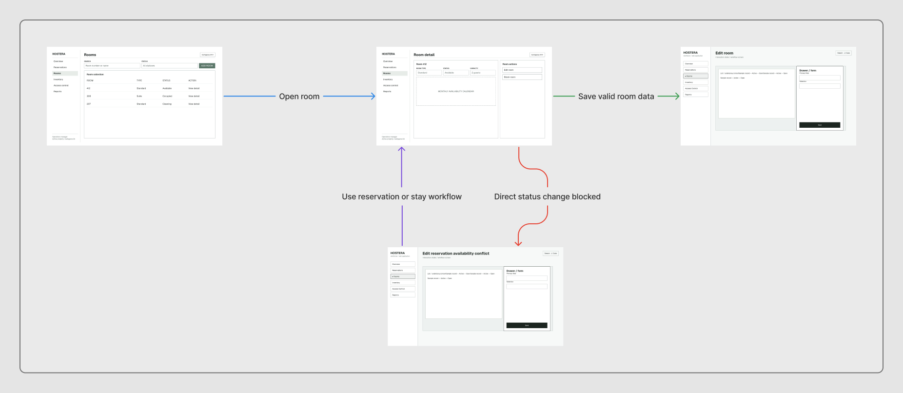

*Figura 4.24. Wireflow para revisar y mantener información operativa de una habitación.*

**User goal: Create or update a room type.**


*Figura 4.25. Wireflow para crear o actualizar un tipo de habitación.*

**User goal: Define a rate plan and its daily room-type prices.**

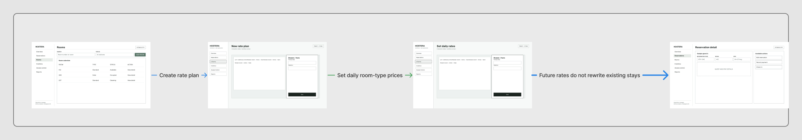

*Figura 4.26. Wireflow para definir un plan tarifario y precios diarios.*

**User goal: Monitor inventory quantities and stock conditions.**


*Figura 4.27. Wireflow para monitorear cantidades y condiciones de inventario.*

**User goal: Create or update an inventory item.**


*Figura 4.28. Wireflow para crear o actualizar un ítem de inventario.*

**User goal: Record a stock adjustment for an inventory item.**


*Figura 4.29. Wireflow para registrar un ajuste de stock.*

**User goal: Create or update an inventory storage location.**

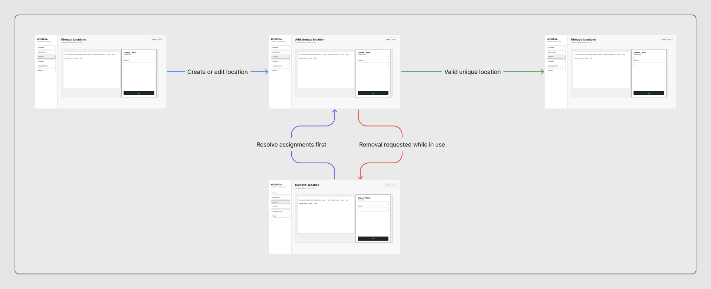

*Figura 4.30. Wireflow para crear o actualizar una ubicación de almacenamiento.*

**User goal: Review and manage an RFID credential.**


*Figura 4.31. Wireflow para revisar y gestionar una credencial RFID.*

**User goal: Encode an RFID key card with an authorized access scope.**

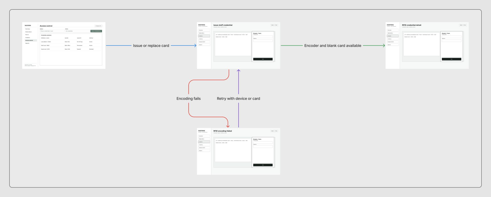

*Figura 4.32. Wireflow para codificar una tarjeta RFID con alcance autorizado.*

**User goal: Find and review RFID access events.**

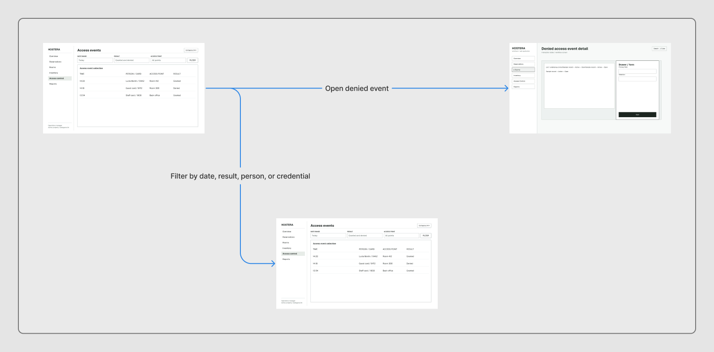

*Figura 4.33. Wireflow para encontrar y revisar eventos de acceso RFID.*

**User goal: Find and review an operational report for a property and period.**


*Figura 4.34. Wireflow para encontrar y revisar un reporte operativo.*

**User goal: Export an operational report for the selected scope.**


*Figura 4.35. Wireflow para exportar un reporte operativo del alcance seleccionado.*

### 4.4.3. Web Applications Mock-ups

Los mock-ups de alta fidelidad de la aplicación web representan las vistas y estados
principales de Hostera para la gestión operativa de una propiedad hotelera. El diseño
se encuentra organizado en la página `Web Application` del archivo de Paper
`Team-Coworkers` y mantiene una composición consistente entre autenticación, monitoreo,
reservas, habitaciones, inventario, control de acceso RFID y reportes.

#### Acceso y panorama operativo

Las pantallas de autenticación establecen el punto de entrada para el personal
autorizado. El formulario se presenta junto con una imagen asociada al contexto de
hospitalidad, mientras que el dashboard prioriza el estado operativo mediante
indicadores de ocupación, habitaciones listas, próximas llegadas, ingresos y
resumen por propiedad.

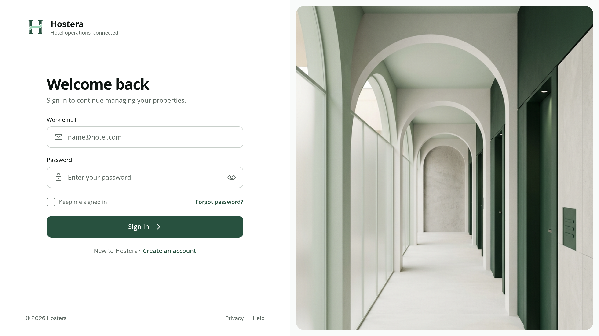

*Figura 4.36. Mock-up de inicio de sesión.*


*Figura 4.37. Mock-up de registro de cuenta.*


*Figura 4.38. Mock-up del dashboard operativo.*

#### Reservas y operación de estancias

El módulo de reservas utiliza una lista con filtros, estados y acciones claramente
identificables para facilitar la búsqueda y revisión de una reserva. La creación de
una reserva se separa en bloques de información del huésped, fechas de estancia,
habitación, tarifa y solicitudes, con acciones de guardado visibles y estados de
validación para prevenir errores antes de confirmar la operación.


*Figura 4.39. Mock-up de revisión de reservas.*

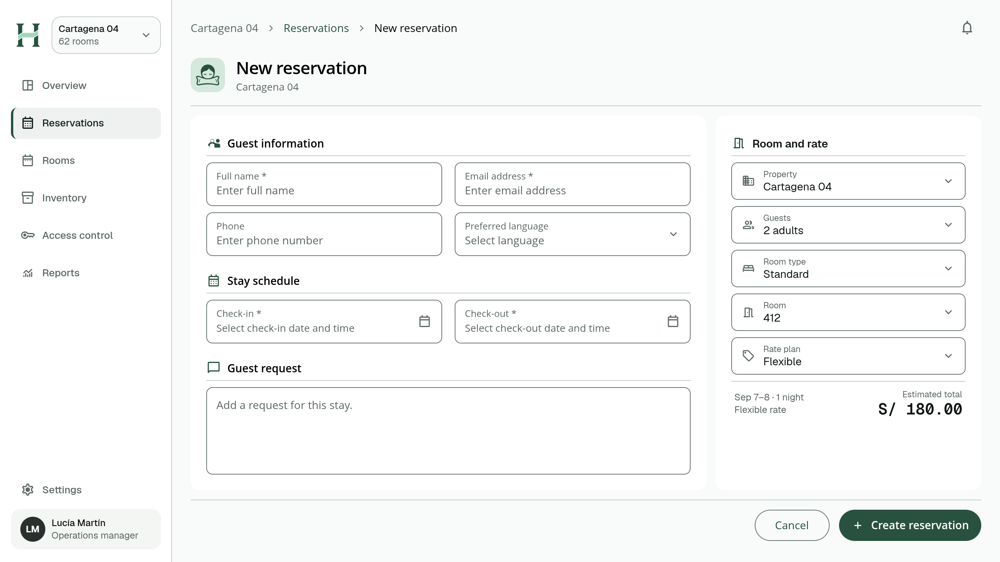

*Figura 4.40. Mock-up de creación de una reserva.*


*Figura 4.41. Mock-up de verificación de huésped para check-in.*


*Figura 4.42. Mock-up de revisión de check-out.*

#### Administración de habitaciones, inventario y accesos

Las vistas operativas mantienen una navegación lateral común y un área de trabajo
con jerarquía consistente. La vista de habitaciones presenta la disponibilidad en un
calendario, inventario combina indicadores resumidos con una tabla de ítems y
control de acceso muestra credenciales y permisos en una estructura escaneable.
Esta reutilización de patrones reduce la carga cognitiva y permite que el personal
transfiera lo aprendido entre módulos.


*Figura 4.43. Mock-up de habitaciones y disponibilidad.*


*Figura 4.44. Mock-up de monitoreo de inventario.*

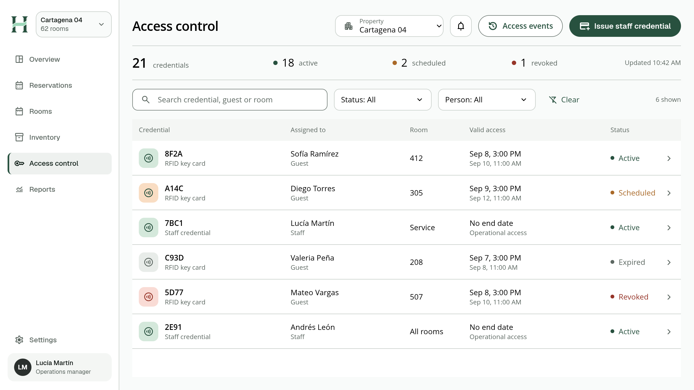

*Figura 4.45. Mock-up de control de acceso RFID.*

#### Reportes operativos

El módulo de reportes separa la selección del reporte de la visualización de sus
resultados. La biblioteca permite localizar el reporte requerido y la vista de
ocupación presenta métricas, series temporales y datos de disponibilidad para apoyar
la toma de decisiones del administrador.

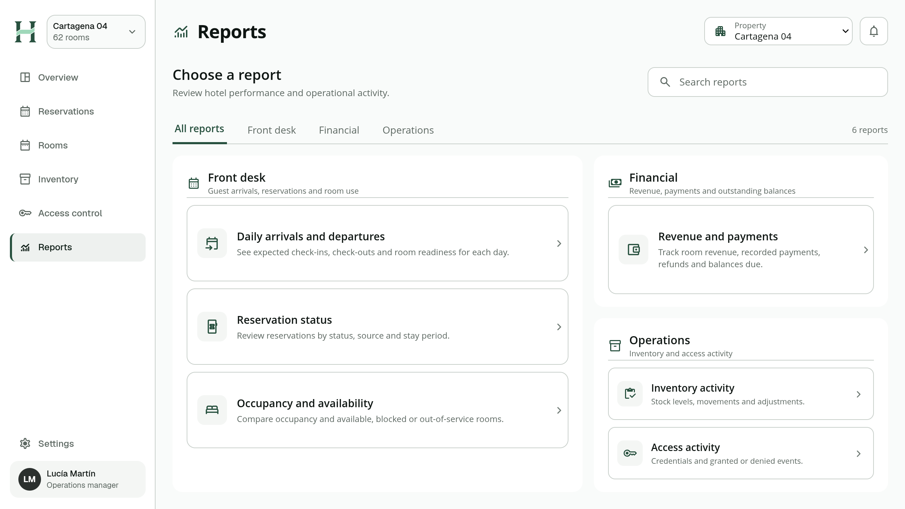

*Figura 4.46. Mock-up de biblioteca de reportes.*


*Figura 4.47. Mock-up de reporte de ocupación y disponibilidad.*

#### Diseño inclusivo y adaptación responsive

La propuesta contempla diferentes tamaños de pantalla. En móvil, la navegación se
reduce a una barra superior y los contenidos se reorganizan verticalmente, sin
eliminar las acciones principales ni los indicadores operativos. Los filtros, estados
y controles conservan etiquetas textuales además del color, lo que evita depender
únicamente de diferencias cromáticas para interpretar la información.

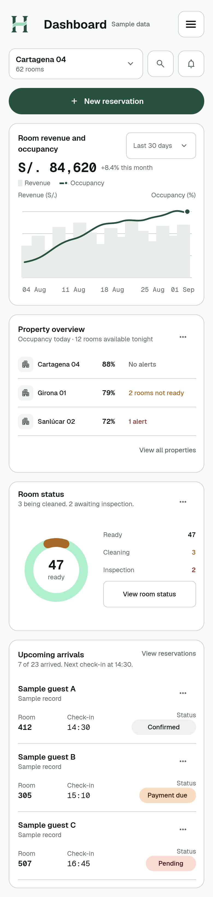

*Figura 4.48. Mock-up móvil del dashboard operativo.*


*Figura 4.49. Mock-up móvil de reservas.*

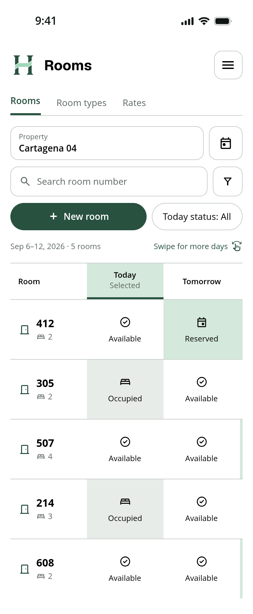

*Figura 4.50. Mock-up móvil de habitaciones.*


*Figura 4.51. Mock-up móvil del reporte de ocupación.*

#### Principios visuales y Design System

Estos mock-ups aplican el sistema de diseño definido en [4.1. Style
Guidelines](#41-style-guidelines), por lo que no introducen una solución visual
aislada para la aplicación web. En particular, retoman los lineamientos de
[General Style Guidelines](#411-general-style-guidelines) para branding, color,
tipografía, espaciado, forma, elevación y principios de diseño, y los patrones de
[Web Style Guidelines](#412-web-style-guidelines) para layout responsive,
componentes web, estados de interacción y accesibilidad.

La interfaz utiliza superficies claras, la paleta verde asociada a la identidad de
Hostera y una jerarquía tipográfica basada en Geist. Los componentes se repiten con
estados diferenciados para botones, campos, tablas, chips, drawers, diálogos y
mensajes de validación. La organización de los módulos también se relaciona con la
[arquitectura de información](#42-information-architecture) definida para Hostera:
la navegación persistente y las etiquetas de la aplicación web permiten orientar al
personal entre dashboard, reservas, habitaciones, inventario, accesos y reportes.
De esta manera, el espaciado, contraste, etiquetado, estados explícitos y adaptación
responsive se aplican como una extensión del Design System existente y no como
decisiones independientes de cada pantalla.

### 4.4.4. Web Applications User Flow Diagrams

Esta sección presenta los User Flow Diagrams de la aplicación web de Hostera. Cada
diagrama incorpora las vistas de los mock-ups de alta fidelidad y muestra la ruta
esperada (happy path) junto con las rutas alternativas (unhappy paths) que pueden
ocurrir bajo las condiciones previstas para la operación hotelera. Los flujos se
organizan alrededor de los objetivos operativos de los administradores, responsables
de recepción, personal de inventario y personal de control de accesos. Las capturas
corresponden únicamente al diagrama de flujo y al objetivo que documenta cada
interacción.

#### Goal: Create an account with an initial property


*Figura 4.52. User Flow para crear una cuenta con una propiedad inicial.*

El flujo inicia en el formulario de registro y termina en el dashboard cuando la
información es válida. La ruta alternativa muestra los errores de validación para
campos faltantes, datos inválidos o un correo ya registrado. La persona puede volver
al formulario, corregir los datos y reenviar la solicitud.

#### Goal: Sign in with an authorized work account


*Figura 4.53. User Flow para iniciar sesión con una cuenta de trabajo autorizada.*

Las credenciales autorizadas llevan al dashboard operativo. Si las credenciales no
son válidas, el sistema conserva al usuario en el contexto de autenticación, muestra
el error y permite corregir los datos e intentar nuevamente.

#### Goal: Monitor current operations for an assigned property


*Figura 4.54. User Flow para monitorear las operaciones de una propiedad asignada.*

El administrador parte del dashboard, selecciona una propiedad asignada y obtiene el
contexto operativo correspondiente. La ruta alternativa representa una demora o
degradación del servicio de datos: el dashboard informa la condición y permite
continuar con la información disponible o reintentar la consulta.

#### Goal: Navigate to another authorized operational area

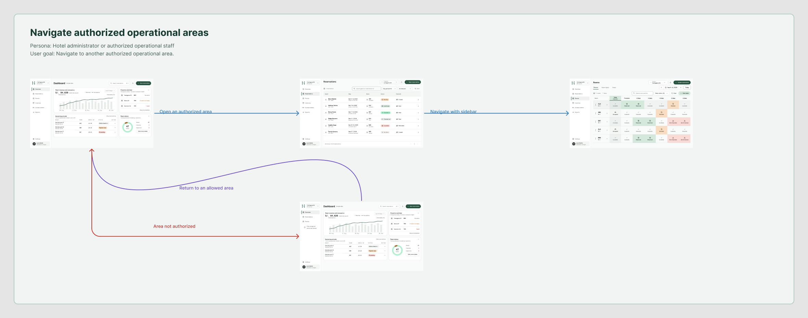

*Figura 4.55. User Flow para navegar a otra área operativa autorizada.*

La navegación persistente permite pasar del dashboard a reservas y posteriormente a
habitaciones. Cuando se intenta abrir un área no autorizada, se muestra el estado de
restricción y se ofrece el retorno a un área permitida.

#### Goal: Find and review a reservation

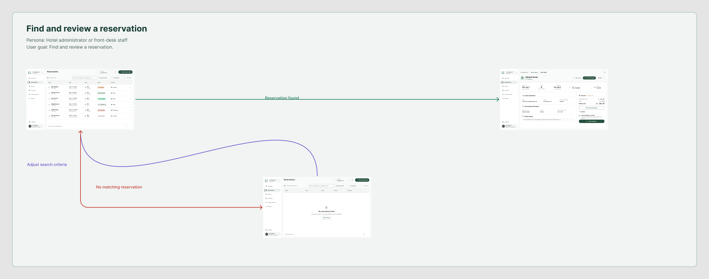

*Figura 4.56. User Flow para encontrar y revisar una reserva.*

El personal abre la lista de reservas, aplica los criterios de búsqueda y revisa el
detalle de la reserva encontrada. Si no existen coincidencias, el estado vacío
indica la condición y permite ajustar los criterios para realizar una nueva búsqueda.

#### Goal: Create a reservation for an available room

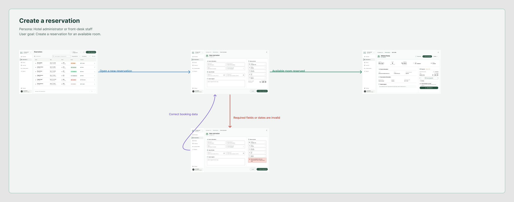

*Figura 4.57. User Flow para crear una reserva de una habitación disponible.*

La ruta esperada lleva desde la lista de reservas al formulario de creación y luego al
detalle de la reserva creada para una habitación disponible. La ruta alternativa
presenta errores cuando faltan datos o el período no es válido; la operación puede
corregirse desde el mismo formulario.

#### Goal: Review and update an existing reservation


*Figura 4.58. User Flow para revisar y actualizar una reserva existente.*

Desde el detalle, el personal abre el formulario de edición y vuelve al detalle con
los cambios guardados. Si la habitación o el período seleccionado dejó de estar
disponible, el flujo muestra el conflicto y permite elegir una alternativa.

#### Goal: Update a reservation according to its pre-arrival outcome


*Figura 4.59. User Flow para actualizar una reserva según su resultado previo a la llegada.*

El detalle de la reserva abre las acciones de ciclo de vida disponibles. Según el
resultado previo a la llegada, el personal puede cancelar la reserva o marcarla como
no-show; cada opción se confirma mediante su diálogo correspondiente.

#### Goal: Record a payment received for a reservation


*Figura 4.60. User Flow para registrar un pago recibido de una reserva.*

El personal abre el registro de pago desde el detalle, introduce el importe recibido
y vuelve al detalle con el balance actualizado. Un importe inválido activa el estado
de error y permite corregir el valor antes de guardar.

#### Goal: Complete guest check-in for a confirmed reservation


*Figura 4.61. User Flow para completar el check-in de un huésped.*

La ruta principal verifica la identidad, revisa el balance, codifica la tarjeta RFID
y confirma el check-in. Si la identidad no puede resolverse, el proceso se detiene en
un estado explícito y permite resolver la información antes de reintentar.

#### Goal: Complete guest check-out for an occupied room

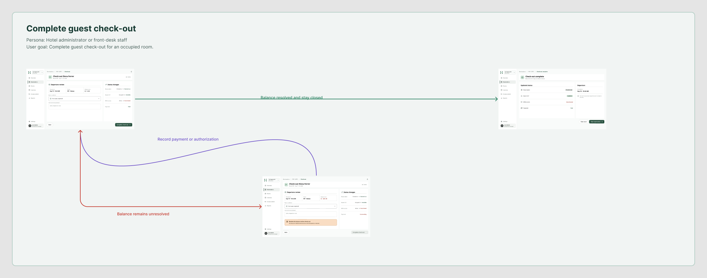

*Figura 4.62. User Flow para completar el check-out de una habitación ocupada.*

El flujo revisa la salida y finaliza el check-out cuando el balance está resuelto. Si
queda un balance pendiente, se muestra el estado alternativo y se puede registrar el
pago o la autorización necesaria antes de cerrar la estadía.

#### Goal: Review room availability from a selected date


*Figura 4.63. User Flow para revisar la disponibilidad de habitaciones desde una fecha seleccionada.*

El personal consulta habitaciones usando una fecha seleccionada y revisa el detalle
de disponibilidad. La condición alternativa indica que una habitación protegida no
puede modificarse desde ese contexto operativo.

#### Goal: Create a room within an assigned property

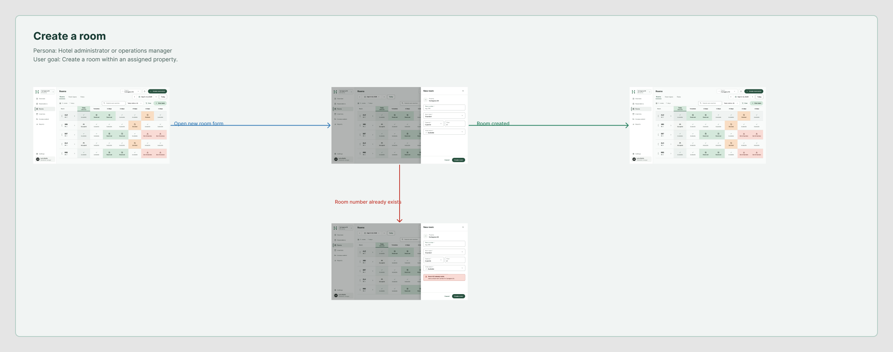

*Figura 4.64. User Flow para crear una habitación dentro de una propiedad asignada.*

Desde habitaciones se abre el formulario, se registra la información y se vuelve a
la lista actualizada. Si el número de habitación ya existe, el sistema muestra el
conflicto y permite corregir el dato antes de crearla.

#### Goal: Review and maintain a room's operational information


*Figura 4.65. User Flow para revisar y mantener información operativa de una habitación.*

El flujo abre el detalle de una habitación, permite editar su información operativa y
regresa a la lista con los cambios guardados. Un estado protegido impide la edición
cuando la condición operativa no permite modificarla.

#### Goal: Create or update a room type

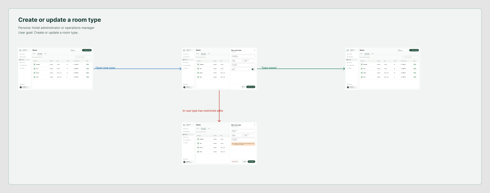

*Figura 4.66. User Flow para crear o actualizar un tipo de habitación.*

La lista de tipos abre el formulario de creación o actualización y muestra la lista
con el tipo guardado. Cuando el tipo está en uso, la alternativa comunica las
restricciones que limitan sus modificaciones.

#### Goal: Define a rate plan and its daily room-type prices


*Figura 4.67. User Flow para definir un plan tarifario y sus precios diarios.*

El administrador crea el plan tarifario y continúa a la configuración de los precios
diarios por tipo de habitación. La secuencia termina cuando la matriz de precios
queda lista para su uso operativo.

#### Goal: Monitor inventory quantities and stock conditions

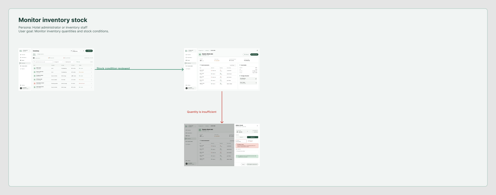

*Figura 4.68. User Flow para monitorear cantidades y condiciones de inventario.*

El personal abre inventario, revisa el detalle de un ítem y consulta su condición de
stock. Cuando la cantidad es insuficiente, el estado alternativo hace visible la
alerta para que pueda tomarse una acción de reposición.

#### Goal: Create or update an inventory item

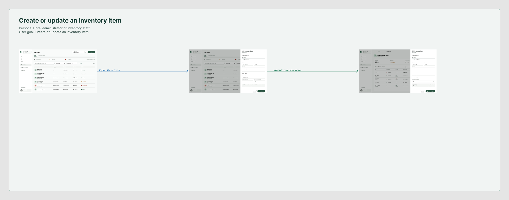

*Figura 4.69. User Flow para crear o actualizar un ítem de inventario.*

La lista de inventario abre el formulario para crear un ítem y permite continuar al
formulario de actualización de su información. Las dos rutas representan el alta y
el mantenimiento de los datos del ítem dentro del mismo módulo.

#### Goal: Record a stock adjustment for an inventory item


*Figura 4.70. User Flow para registrar un ajuste de stock.*

Desde el detalle del ítem se registra el ajuste y se actualiza la cantidad. Si el
ajuste supera el stock disponible, el sistema muestra la condición de insuficiencia
y evita confirmar una operación inconsistente.

#### Goal: Create or update an inventory storage location

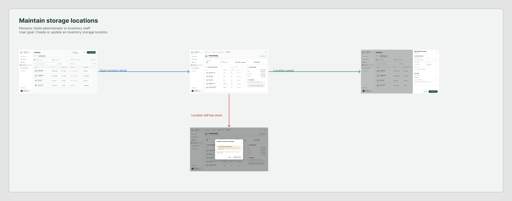

*Figura 4.71. User Flow para crear o actualizar una ubicación de almacenamiento.*

El flujo permite localizar una ubicación, revisar sus detalles y crear una nueva
ubicación. La eliminación queda bloqueada cuando todavía existen existencias
asociadas, condición que se muestra como ruta alternativa.

#### Goal: Review and manage an RFID credential

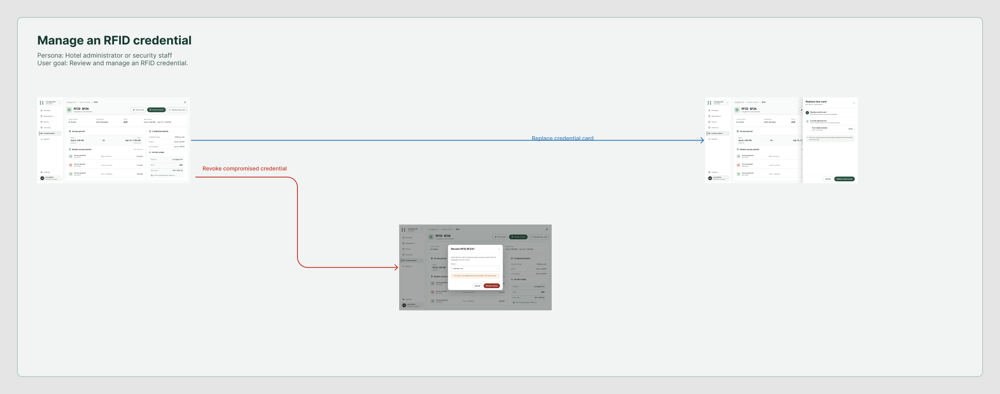

*Figura 4.72. User Flow para revisar y administrar una credencial RFID.*

El detalle de la credencial ofrece las acciones de revocar el acceso o reemplazar la
tarjeta. Las dos rutas representan decisiones operativas distintas ante una
credencial comprometida, perdida o que requiere renovación.

#### Goal: Encode an RFID key card with an authorized access scope

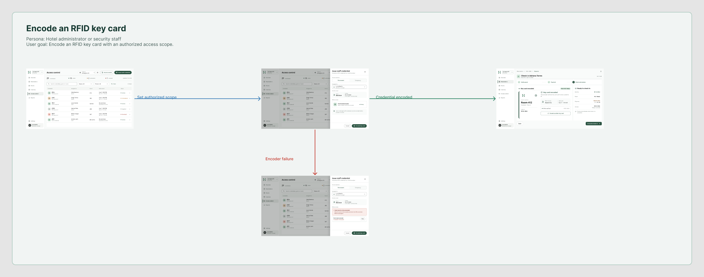

*Figura 4.73. User Flow para codificar una tarjeta RFID con un alcance autorizado.*

El personal configura el alcance de acceso, inicia la emisión y llega al estado de
tarjeta codificada. Si el encoder falla, el estado alternativo conserva el contexto
del proceso y hace visible la necesidad de reintentar o revisar el dispositivo.

#### Goal: Find and review RFID access events


*Figura 4.74. User Flow para encontrar y revisar eventos de acceso RFID.*

La lista de eventos permite filtrar los registros y abrir el detalle de un evento
denegado. La ruta final concentra la evidencia necesaria para revisar el intento de
acceso y su motivo.

#### Goal: Find and review an operational report for a property and period


*Figura 4.75. User Flow para encontrar y revisar un reporte operativo para una propiedad y período.*

La biblioteca de reportes conduce al reporte de ocupación y disponibilidad cuando
existen datos para la propiedad y el período seleccionados. Si el período no contiene
datos, se presenta un estado vacío en lugar de un resultado engañoso.

#### Goal: Export an operational report for the selected scope


*Figura 4.76. User Flow para exportar un reporte operativo para el alcance seleccionado.*

El administrador selecciona el formato de exportación y obtiene la confirmación de
descarga cuando cuenta con permisos. La ruta alternativa comunica que la exportación
no está autorizada y evita presentar una operación como completada.

## 4.5. Web Applications Prototyping

El prototipo interactivo de Hostera se elaboró en Figma a partir de los mock-ups de
alta fidelidad y de los User Flow Diagrams presentados en la sección
[4.4.4. Web Applications User Flow Diagrams](#444-web-applications-user-flow-diagrams).
La propuesta corresponde a una sola Web Application implementada para dos contextos
de navegación: Desktop Web Browser y Mobile Web Browser. Por ello, ambos contextos
forman parte de la misma solución y deben demostrarse en el recorrido de
prototipado.

### Criterios de interacción y navegación

Las decisiones de interacción mantienen la arquitectura de información definida para
la aplicación. En Desktop, la navegación persistente conserva el contexto de la
propiedad activa y permite acceder a Overview, Reservations, Rooms, Inventory, Access
Control y Reports desde cualquier módulo operativo. Las acciones principales de cada
módulo conducen a las vistas de creación, detalle, edición y confirmación que forman
parte de los User Flows. Las rutas alternativas representan estados como errores de
validación, resultados vacíos, conflictos de disponibilidad, restricciones de acceso,
balances pendientes y fallos de codificación RFID.

En Mobile Web Browser se conserva la misma organización funcional, pero las vistas se
presentan en una composición vertical y con controles compactos adecuados para la
navegación táctil. El prototipo permite iniciar el recorrido desde el Dashboard
Mobile, acceder a Reservations, Rooms y Occupancy Report, y regresar al contexto
principal. Esta adaptación mantiene las etiquetas y la jerarquía de los módulos sin
introducir una arquitectura de navegación diferente.

La simulación utiliza interacciones de clic para representar la navegación entre
frames, transiciones entre vistas y rutas alternativas. De esta manera, el prototipo
permite demostrar los principales recorridos operativos: autenticación, monitoreo del
dashboard, gestión de reservas, disponibilidad y habitaciones, inventario, control de
accesos RFID, check-in, check-out y reportes. Los estados de error se mantienen dentro
del recorrido correspondiente para evidenciar cómo la interfaz comunica la condición
y permite continuar, corregir o regresar.

### Prototipo interactivo

El prototipo se organiza en dos puntos de inicio: Desktop flow y Mobile flow. El
Desktop flow integra las pantallas principales de la aplicación y sus estados de
interacción; el Mobile flow presenta el recorrido adaptado para navegador móvil.
Ambos recorridos quedan documentados en el video de demostración de esta sección.

### Video de demostración

El video de demostración presenta el prototipo interactivo de Hostera para Desktop y
Mobile Web Browser. En la grabación se recorren sus principales interacciones y la
navegación entre las áreas operativas, incluyendo la gestión de reservas, el check-in
y check-out, el inventario, el control de accesos y los reportes.


*Figura 4.77. Captura del video de demostración del prototipo de Hostera en Desktop Web Browser.*

**Enlace al video de Microsoft Stream:** [Ver la demostración del prototipo de Hostera](https://1drv.ms/f/c/8d4ae682dbad6a14/IgDpv3unJcdXQJ0d3eyvjDjBATcwFeKcn-JrAaMoJk2_5jQ?e=bsHpeN).

La captura y el enlace anteriores corresponden a la evidencia de navegación exigida
para esta sección: el video recorre el prototipo interactivo completo en sus dos
puntos de inicio.

## 4.6. Domain-Driven Software Architecture

### 4.6.1. Design-Level EventStorming

El Design-Level EventStorming profundiza el modelado del dominio de Hostera a partir
del Big Picture EventStorming. La sesión organiza los principales bounded contexts y
detalla, para cada flujo, los actores, comandos, modelos de lectura, reglas de
negocio, eventos de dominio y agregados involucrados. También se identifican las
políticas y los sistemas externos que participan en determinados procesos.

El resultado permite revisar el dominio desde una perspectiva orientada al diseño y
relacionar las acciones de los usuarios con los cambios de estado del negocio. El
tablero distingue los contextos de gestión de propiedades y accesos, reservas y
estadías, habitaciones, inventario, control de accesos RFID y reporting y analytics.
En cada contexto se representan flujos como registrar una propiedad, crear y
modificar una reserva, verificar la identidad del huésped, asignar una habitación,
actualizar el estado de una habitación, recibir o ajustar stock, emitir credenciales
de personal y generar reportes operativos.

La notación visual utilizada diferencia los actores, comandos, modelos de lectura,
reglas de negocio, eventos de dominio, agregados, políticas y sistemas externos. Esta
organización facilita identificar las responsabilidades de cada bounded context y
sirve como base para los diagramas de arquitectura y los modelos orientados a objetos
presentados en las siguientes secciones.


*Figura 4.78. Design-Level EventStorming del dominio de Hostera.*

### 4.6.2. Software Architecture Context Diagram

El modelo C4 de Hostera sigue la notación y los ejemplos de c4model.com (Brown, s.f.):
cada elemento indica su tipo y su tecnología entre corchetes, las relaciones dicen qué
hacen y con qué protocolo, y cada vista incluye una leyenda. El modelo completo está
escrito en Structurizr DSL en el archivo `docs/hostera-structurizr.dsl` del repositorio
del informe, y las vistas se dibujaron con una distribución manual para que ninguna
relación cruce un elemento.

El diagrama de contexto muestra a Hostera como el sistema de software en alcance y a las
personas y sistemas externos con los que se relaciona. Las tres personas corresponden a
los segmentos objetivo y a los usuarios operativos: el administrador de un hotel
independiente, el responsable de operaciones de una pequeña cadena y el personal del
hotel. Hostera se integra con tres sistemas externos con nombre: el sistema de
cerraduras RFID del hotel, que codifica las tarjetas y reporta los eventos de acceso;
Twilio SendGrid, que envía las alertas de stock bajo; y la API pública de feriados
Nager.Date, que la aplicación ya consume para marcar los feriados en la disponibilidad
de habitaciones.

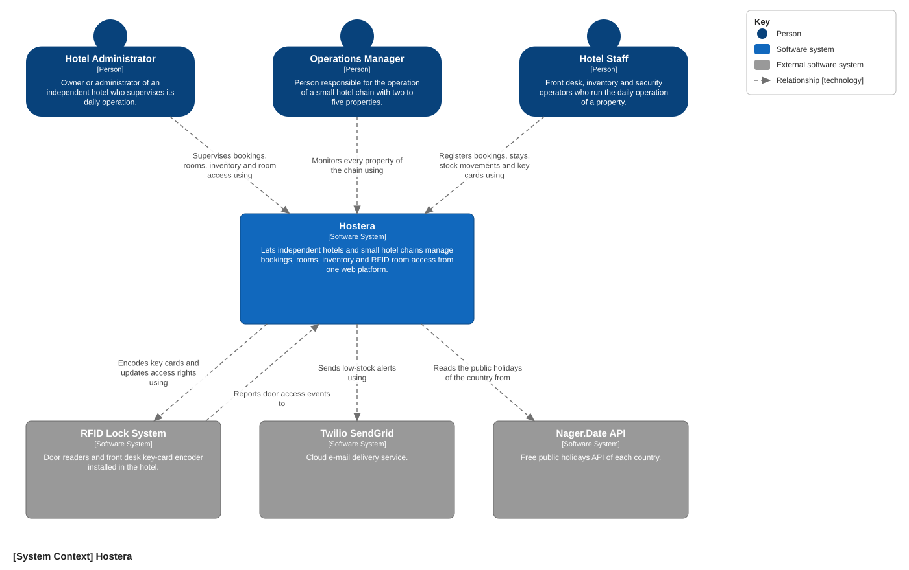

*Figura 4.79. Diagrama de contexto de Hostera.*

### 4.6.3. Software Architecture Container Diagrams

Hostera se compone de cinco contenedores, cada uno desplegable de forma independiente:

- **Landing Page** (HTML, CSS y JavaScript): presenta los planes a cada segmento y lleva
  a los visitantes a las vistas de inicio de sesión y de registro con plan de la
  aplicación. Se publica en GitHub Pages.
- **Web Application** (Angular 19, TypeScript y Angular Material): concentra las
  funciones de operación del hotel. Se publica en GitHub Pages.
- **Demo API** (Node.js y json-server): sirve los datos de demostración con los mismos
  recursos que expondrá la RESTful API mientras esta se construye. En GitHub Pages, la
  aplicación lee esos mismos datos dentro del navegador (sección 5.1.4).
- **RESTful API** (Java 21 y Spring Boot 3): expone la funcionalidad de Hostera
  organizada por bounded context y documentada con OpenAPI. Se implementa en AV2.
- **Database** (MySQL 8): almacena las cuentas, propiedades, reservas, pagos,
  habitaciones, tarifas, inventario, credenciales y eventos de acceso. Cada bounded
  context es dueño de sus tablas (sección 4.8).

La aplicación web llama directamente a Nager.Date; los demás sistemas externos se
integran desde la RESTful API, de modo que la aplicación no conoce sus credenciales.

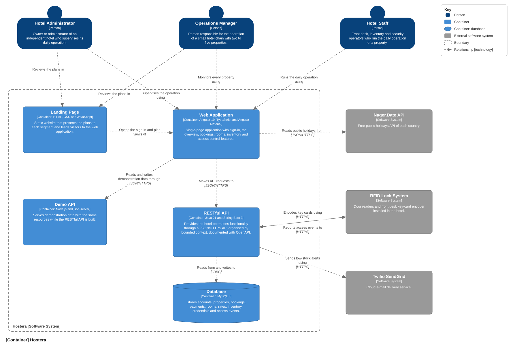

*Figura 4.80. Diagrama de contenedores de Hostera.*

### 4.6.4. Software Architecture Components Diagrams

Se presenta un diagrama de componentes para la Web Application y uno por cada bounded
context de la RESTful API. Los bounded contexts son los mismos en ambos contenedores:
IAM, Overview, Bookings, Rooms, Inventory y Access Control.

#### Web Application

Los componentes de la Web Application corresponden a la estructura del repositorio
`hostera-frontend`. Cada bounded context es una carpeta de `src/` (`iam`, `overview`,
`bookings`, `rooms`, `inventory` y `access-control`) con sus capas `domain`,
`application` (un store basado en signals), `infrastructure` (el gateway HTTP y sus
assemblers) y `presentation` (componentes standalone de Angular con Angular Material).
El App Shell reúne `app.routes.ts` y el layout compartido con la navegación lateral, el
selector de idioma y el footer; Localization agrupa `I18nService` y los archivos de
mensajes en inglés y en español latinoamericano (`es-419`); y Shared Infrastructure
contiene las clases base de los gateways HTTP. En esta versión, la codificación de
tarjetas RFID se simula en `RfidEncoderService` del contexto de control de accesos, y
el módulo Rooms consulta Nager.Date para marcar los feriados.

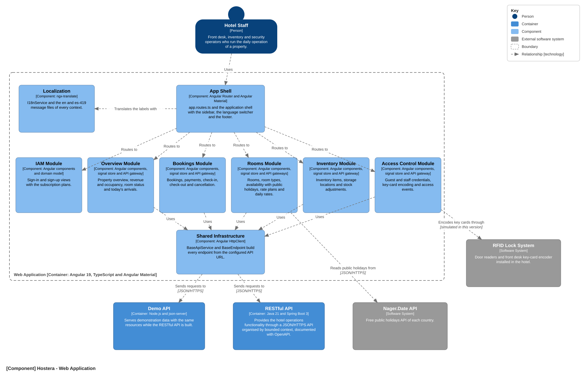

*Figura 4.81. Diagrama de componentes de la Web Application.*

#### RESTful API

Cada bounded context de la RESTful API sigue las mismas capas. En la capa de interfaces,
un controlador REST de Spring expone los endpoints; en la capa de aplicación, los
servicios separan comandos y consultas; en la capa de dominio, los agregados aplican las
reglas de negocio; y en la capa de infraestructura, los repositorios de Spring Data JPA
persisten la información en MySQL. Los contextos que dependen de un sistema externo o de
otro contexto lo hacen a través de un adaptador que actúa como capa anticorrupción
(ACL). Los nombres de los componentes coinciden con las clases de la sección 4.7.

**Bounded context IAM.** Registra las organizaciones con su plan de suscripción, crea los usuarios con su rol y las propiedades a las que acceden, e inicia sesión. Los servicios de tokens y de hashing, implementados con Spring Security, emiten el JWT y protegen las contraseñas.

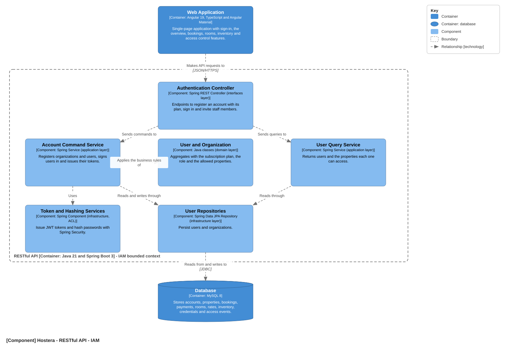

*Figura 4.82. Diagrama de componentes del bounded context IAM de la RESTful API.*

**Bounded context Overview.** Reúne en una consulta el estado de la propiedad activa: ocupación, ingresos del día, estado de las habitaciones y llegadas. No modifica datos, por lo que solo tiene servicio de consultas y modelos de lectura.

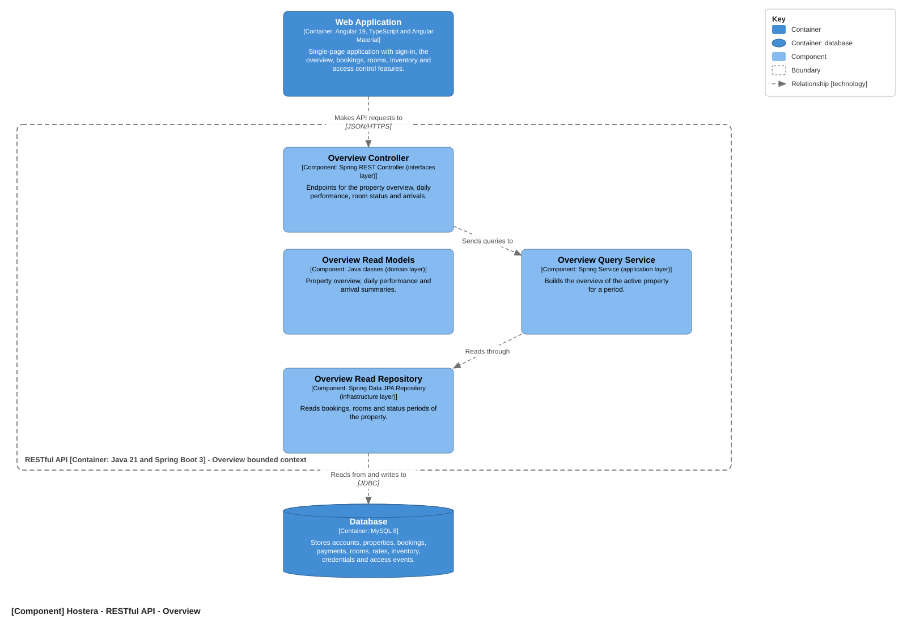

*Figura 4.83. Diagrama de componentes del bounded context Overview de la RESTful API.*

**Bounded context Bookings.** Gestiona el ciclo de vida de la reserva: creación, pago, check-in, check-out y cancelación. Consulta disponibilidad y tarifas al contexto Rooms y solicita las tarjetas del huésped al contexto Access Control mediante fachadas que actúan como capa anticorrupción (ACL).


*Figura 4.84. Diagrama de componentes del bounded context Bookings de la RESTful API.*

**Bounded context Rooms.** Administra habitaciones, tipos de habitación, planes de tarifa, tarifas diarias y periodos de estado, y responde las consultas de disponibilidad.

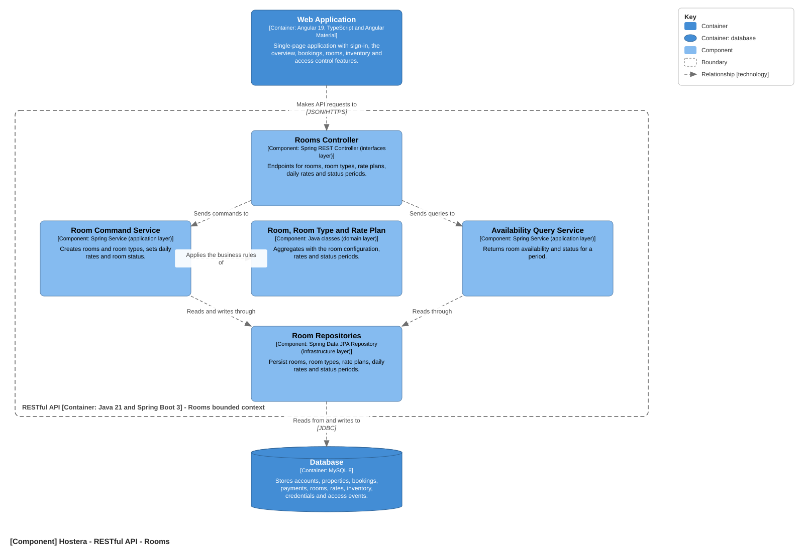

*Figura 4.85. Diagrama de componentes del bounded context Rooms de la RESTful API.*

**Bounded context Inventory.** Registra artículos, ubicaciones de almacén y ajustes de stock. Cuando un artículo baja de su umbral, envía la alerta por correo mediante Twilio SendGrid.


*Figura 4.86. Diagrama de componentes del bounded context Inventory de la RESTful API.*

**Bounded context Access Control.** Emite, reemplaza y revoca las credenciales de huéspedes y personal, y registra los eventos de acceso que reportan los lectores del sistema de cerraduras RFID.

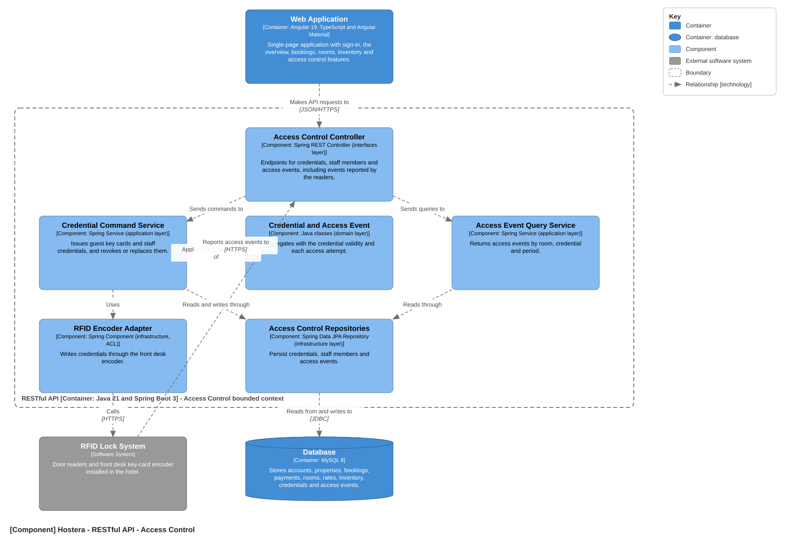

*Figura 4.87. Diagrama de componentes del bounded context Access Control de la RESTful API.*

## 4.7. Software Object-Oriented Design

### 4.7.1. Class Diagrams

Los diagramas de clases describen el modelo orientado a objetos de los RESTful Web
Services de Hostera, organizado según los seis bounded contexts del modelo C4: IAM,
Overview, Bookings, Rooms, Inventory y Access Control. Están escritos con las
convenciones de Java, el lenguaje de los Web Services, según la Google Java Style Guide:
clases en PascalCase, atributos y métodos en camelCase, enumeraciones con valores en
UPPER_SNAKE_CASE, tipos de Java como `Long`, `BigDecimal`, `LocalDate` e `Instant`,
colecciones `List<T>` y repositorios de Spring Data que devuelven `Optional<T>` al buscar
por identificador. Los atributos y los valores de cada enumeración son los mismos que usa
el dominio de la Frontend Web Application, de modo que el modelo del servidor y el del
cliente coinciden.

Cada contexto se presenta en dos diagramas. El de dominio contiene las entidades, los
objetos de valor, que se implementarán como `record` de Java, y las enumeraciones; el de
aplicación contiene los servicios de comandos y de consultas, y las interfaces de los
repositorios y de los gateways hacia otros contextos o sistemas externos. Las firmas de
los métodos muestran solo los tipos de sus parámetros. Los diagramas se elaboraron como
código Mermaid, una de las opciones de diagram-as-code que admite el enunciado del
proyecto, y sus fuentes están en la carpeta `docs/diagrams/` del repositorio del informe.

**IAM.** `Organization` guarda el plan de suscripción (`STARTER` o `PROFESSIONAL`) con la
cantidad de propiedades y habitaciones que cubre, y calcula su precio mensual, como la
clase `SubscriptionPlan` de la aplicación. `User` pertenece a una organización, tiene un
rol y la lista de propiedades a las que puede acceder.

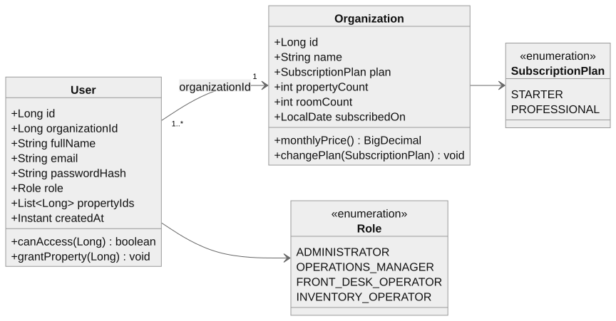

*Figura 4.88. Dominio del contexto IAM.*

`AccountCommandService` registra la organización con su primer administrador, inicia
sesión y devuelve un `AuthenticatedUser` con el token. Depende de `HashingService` y de
`TokenService`, que se implementan con Spring Security.

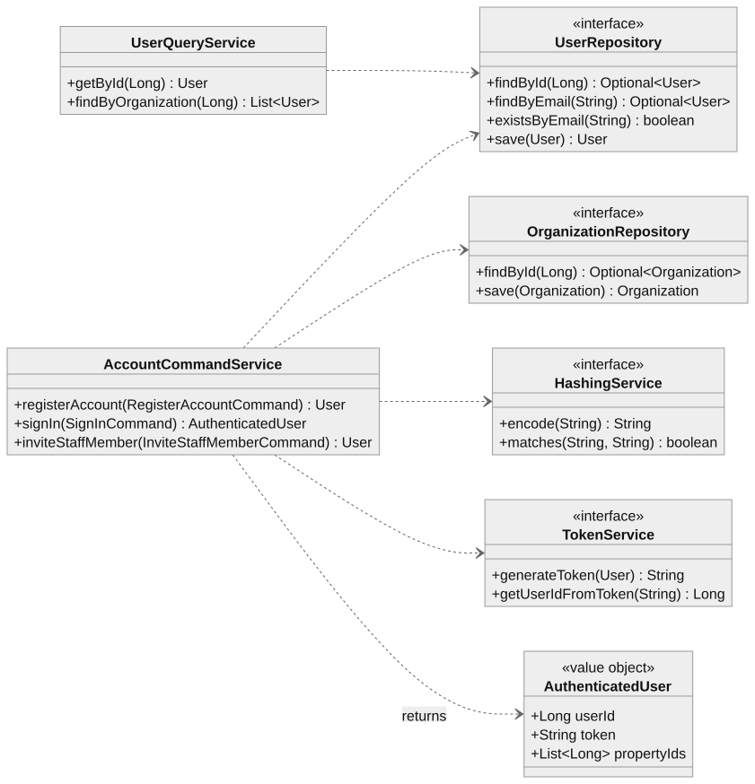

*Figura 4.89. Aplicación del contexto IAM.*

**Overview.** Es un contexto de solo lectura. `OverviewQueryService` construye el
panorama de cada propiedad, el rendimiento diario y las llegadas del día a partir de
los datos que lee `OverviewReadRepository`; no modifica ningún recurso.

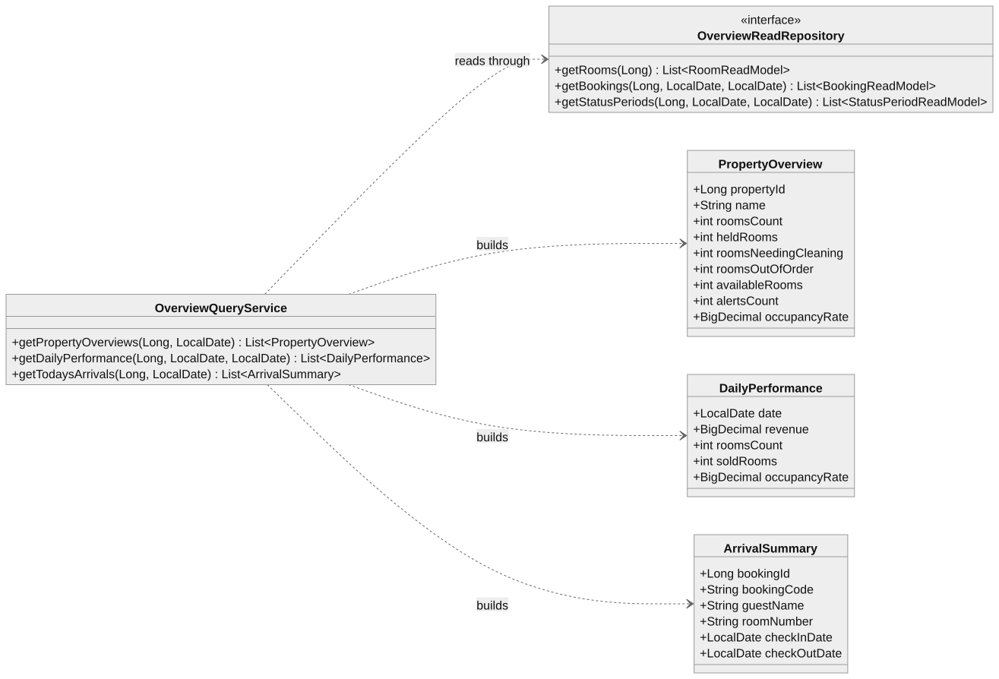

*Figura 4.90. Diagrama de clases del contexto Overview.*

**Bookings.** `Booking` es la raíz del agregado y concentra el ciclo de vida de la
reserva: la confirmación, la cancelación, el no-show, el check-in y el check-out
quedan registrados como objetos de valor con su momento y su responsable. `Payment`
es un agregado aparte que referencia a la reserva por su identificador, y el saldo
pendiente se calcula a partir de los pagos.

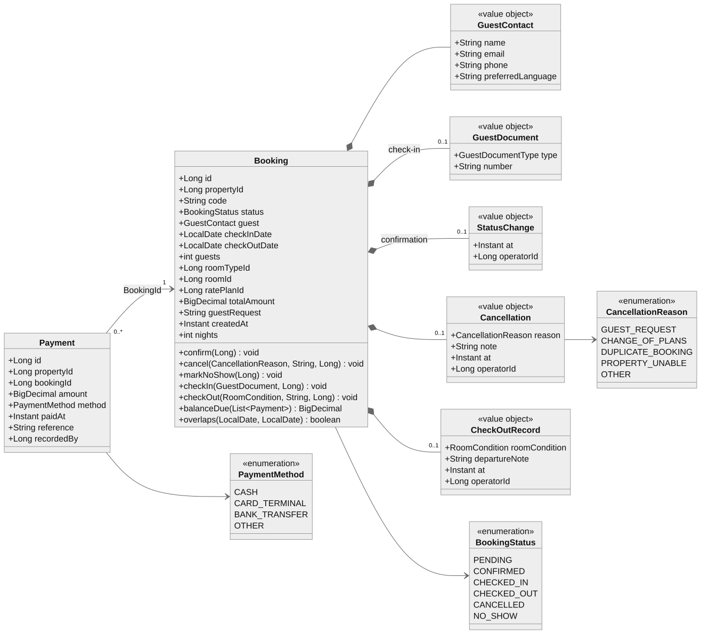

*Figura 4.91. Dominio del contexto Bookings.*

`BookingCommandService` coordina las operaciones sobre la reserva. Para verificar la
disponibilidad y calcular el precio de la estadía consulta al contexto Rooms mediante
`RoomsContextGateway`, y para emitir y vencer las tarjetas del huésped llama al
contexto Access Control mediante `AccessControlContextGateway`.

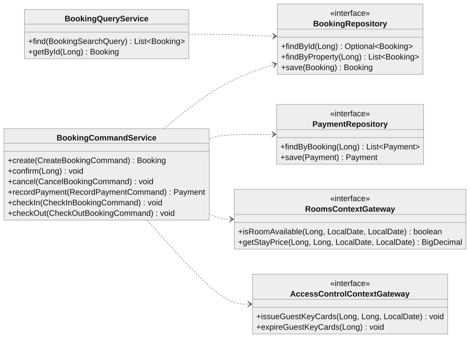

*Figura 4.92. Aplicación del contexto Bookings.*

**Rooms.** El contexto reúne la propiedad, los tipos de habitación, las habitaciones,
los planes tarifarios con sus tarifas diarias y los periodos de estado. El estado de
una habitación en un día se obtiene combinando sus periodos de estado con las
asignaciones que provienen de las reservas.

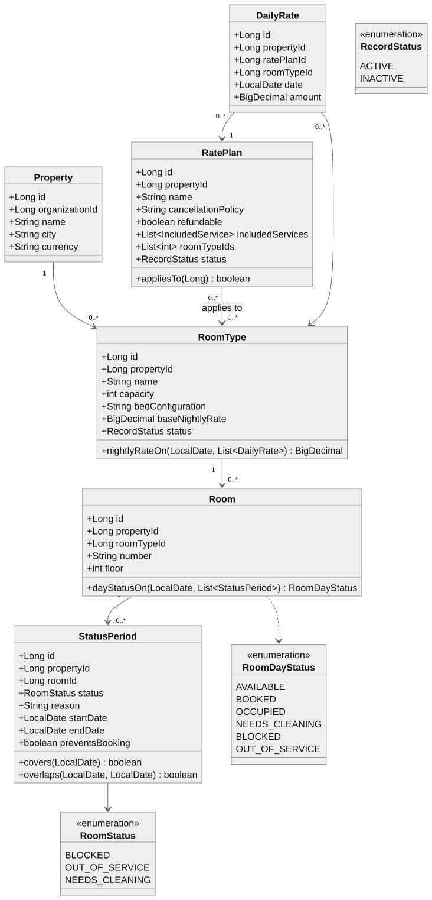

*Figura 4.93. Dominio del contexto Rooms.*

`AvailabilityQueryService` obtiene esas asignaciones del contexto Bookings mediante
`BookingsContextGateway`, sin acceder a sus tablas.

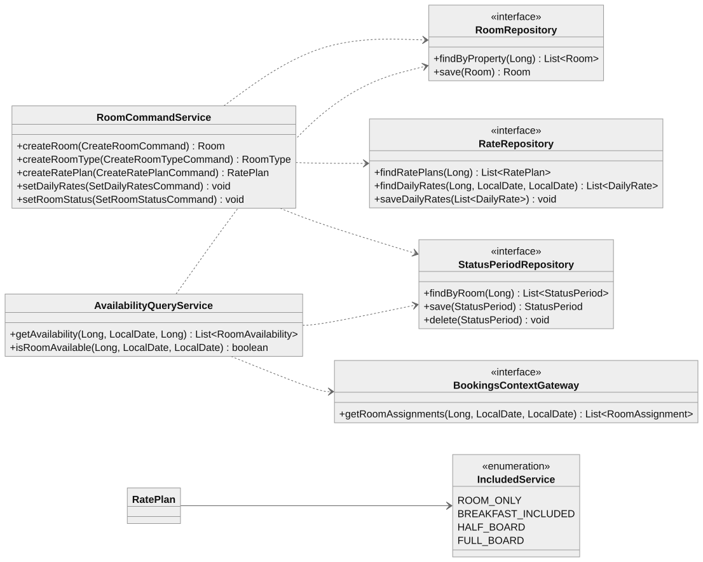

*Figura 4.94. Aplicación del contexto Rooms.*

**Inventory.** `InventoryItem` guarda sus existencias por ubicación y el historial de
ajustes que las explica, y calcula su condición de stock a partir del umbral de
reposición. `StorageLocation` solo puede eliminarse cuando ningún artículo la usa.

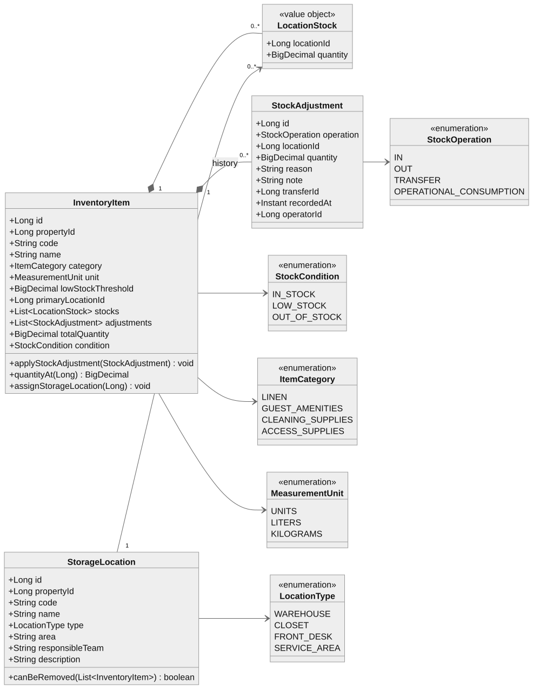

*Figura 4.95. Dominio del contexto Inventory.*

`InventoryCommandService` registra los ajustes y, cuando un artículo baja de su umbral,
envía la alerta mediante `NotificationGateway`, que corresponde al gateway de
notificaciones del modelo C4.

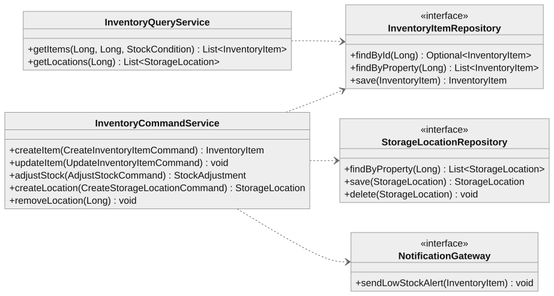

*Figura 4.96. Aplicación del contexto Inventory.*

**Access Control.** `Credential` representa tanto la tarjeta de un huésped como la
credencial de un miembro del personal; su estado en un momento dado se deriva de su
vigencia y de su revocación. `AccessEvent` registra cada intento de acceso con su
resultado y, si fue denegado, el motivo.

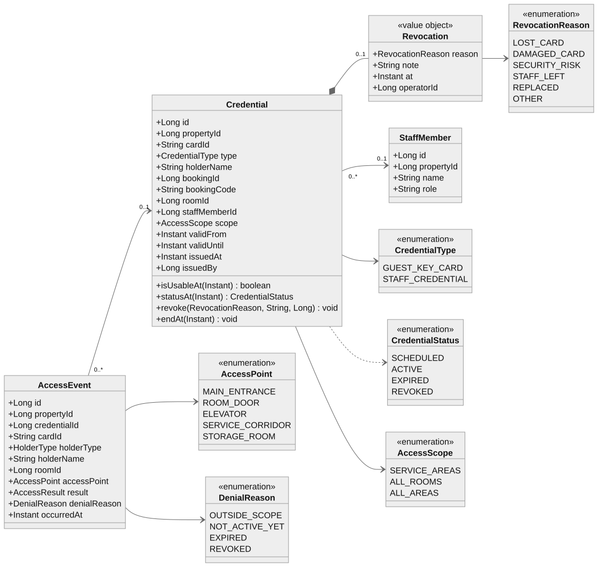

*Figura 4.97. Dominio del contexto Access Control.*

`CredentialCommandService` escribe y borra las tarjetas mediante `RfidEncoder`, que
corresponde al adaptador del codificador RFID del modelo C4.

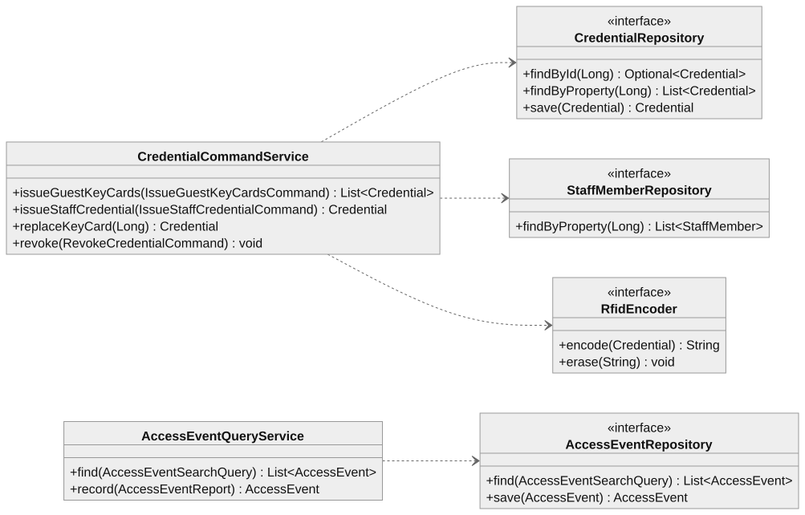

*Figura 4.98. Aplicación del contexto Access Control.*

## 4.8. Database Design

### 4.8.1. Database Diagrams

La base de datos de Hostera se implementa en MySQL 8 y se accede desde la RESTful API
con Spring Data JPA. Cada bounded context es dueño de sus tablas y solo las modifica a
través de sus propios repositorios. Dentro de un contexto, las relaciones se declaran
con claves foráneas; entre contextos, una tabla guarda el identificador del registro del
otro contexto sin clave foránea, y la consistencia se mantiene mediante los gateways
descritos en la sección 4.7. Por eso en los diagramas esas columnas aparecen con la nota
del recurso al que hacen referencia. Las tablas y columnas se nombran en inglés y en
snake_case, las claves primarias son `bigint` autoincrementales y los montos usan
`decimal`.

Se presenta un diagrama por bounded context. Se elaboraron como código Mermaid, opción de
diagram-as-code que admite el enunciado del proyecto para los diagramas de base de
datos, y sus fuentes están en `docs/diagrams/`. El contexto Overview no tiene tablas
propias, porque solo lee datos de los demás.

**IAM.** La tabla `organizations` guarda el plan de suscripción y lo que cubre, `users`
guarda las cuentas con su rol y un correo único, y `user_properties` resuelve la
relación de muchos a muchos entre usuarios y propiedades, de modo que la responsable de
operaciones de una cadena pueda trabajar con varias.

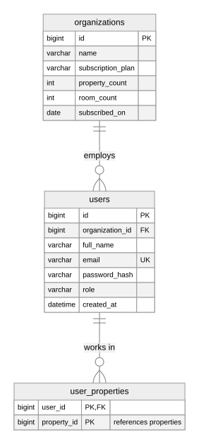

*Figura 4.99. Diagrama de base de datos del contexto IAM.*

**Rooms.** La tabla `rate_plan_room_types` resuelve la relación de muchos a muchos
entre los planes tarifarios y los tipos de habitación, y `rate_plan_services` guarda
los servicios incluidos en cada plan. Las tarifas diarias son únicas por plan, tipo de
habitación y fecha.

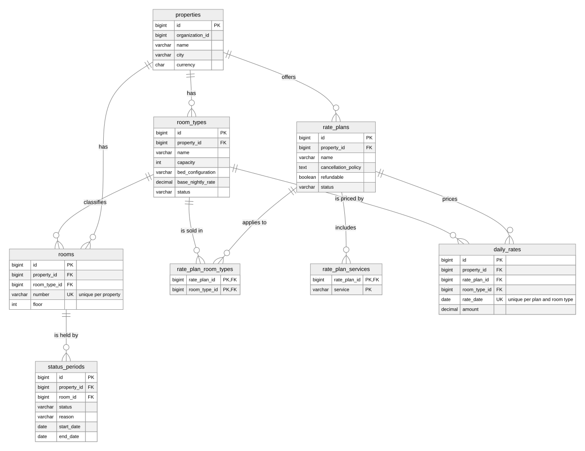

*Figura 4.100. Diagrama de base de datos del contexto Rooms.*

**Bookings.** La tabla `bookings` guarda los datos del huésped y cada etapa del ciclo
de la reserva en columnas propias, que el mapeo de JPA agrupa en los objetos de valor
del dominio mediante `@Embedded`. Los pagos se guardan en `payments`, relacionados con
su reserva.

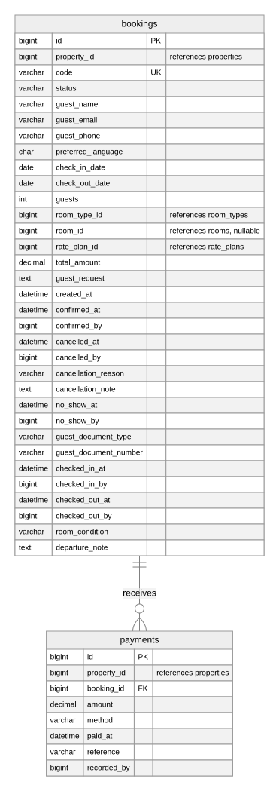

*Figura 4.101. Diagrama de base de datos del contexto Bookings.*

**Inventory.** Las existencias por ubicación se guardan en `inventory_stocks`, con una
fila por artículo y ubicación, y cada movimiento se registra en `stock_adjustments`,
que corresponde a la entidad `StockAdjustment` del dominio. Una transferencia entre
ubicaciones genera dos ajustes enlazados por `transfer_id`.

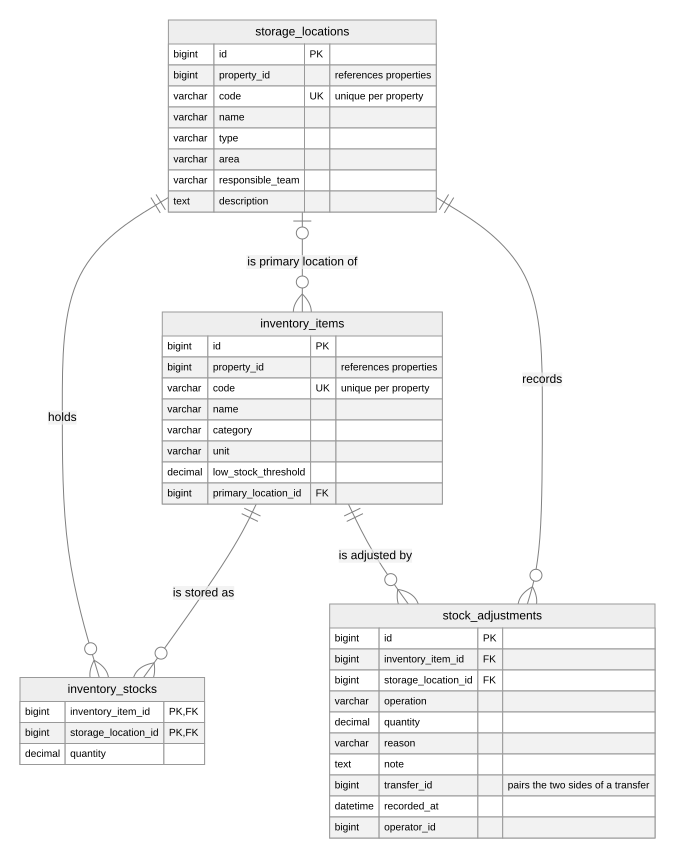

*Figura 4.102. Diagrama de base de datos del contexto Inventory.*

**Access Control.** Las credenciales de huéspedes y de personal comparten la tabla
`credentials`; las de huésped referencian la reserva y la habitación, y las de
personal referencian al miembro del personal. Los eventos de acceso se guardan en
`access_events` con su resultado y el motivo de una denegación.

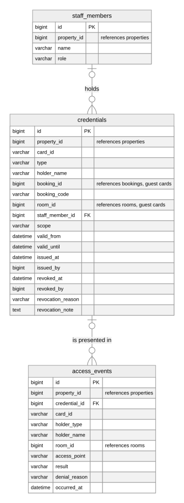

*Figura 4.103. Diagrama de base de datos del contexto Access Control.*

# Capítulo V: Product Implementation, Validation & Deployment

## 5.1. Software Configuration Management

La Gestión de la Configuración de Software (Software Configuration Management, SCM)
define las herramientas, los repositorios, las reglas de nomenclatura y los controles
de entrega que el equipo de Hostera utilizará para mantener la consistencia de la
solución durante su ciclo de vida. Estas prácticas se aplican a la Landing Page, los
RESTful Web Services, las Frontend Web Applications, los scripts de base de datos, la
documentación y los artefactos generados para el informe del proyecto.

El equipo mantendrá visibles en el control de versiones las decisiones relacionadas
con la configuración. Los cambios en el código fuente, las pruebas, la infraestructura
y la documentación deberán ser trazables a un ítem de trabajo y revisados antes de
integrarse en una rama compartida. La configuración descrita a continuación refleja
las prácticas ya establecidas en el repositorio de este informe; los detalles que
dependen de los repositorios de implementación o de su proveedor de alojamiento se
completarán cuando dichos artefactos estén disponibles.

### 5.1.1. Software Development Environment Configuration

Las siguientes herramientas forman parte del entorno actual de colaboración. Las
herramientas SaaS se utilizan mediante sus aplicaciones web oficiales, mientras que
las herramientas locales se instalan desde sus canales oficiales de distribución.
Se agrupan por el tipo de actividad que cumplen en el ciclo de vida del producto:
gestión del proyecto y de los requisitos, diseño UX/UI, desarrollo, despliegue y
documentación. Las herramientas marcadas para AV2 corresponden a los RESTful Web
Services, que se implementan en el Sprint 3.

**Project Management y Requirements Management**

| Producto | Propósito en Hostera | Ruta de referencia | Convención de configuración o uso |
| --- | --- | --- | --- |
| YouTrack | Gestiona el Product Backlog, los sprints y el seguimiento de las historias de usuario y los ítems de trabajo. | [Agile Board de Hostera](https://santanapromaster.youtrack.cloud/agiles/204-1/218-3) | El trabajo se asocia a un ítem del backlog antes de su implementación y revisión. |
| GitHub | Aloja la organización del equipo, los repositorios de producto y del informe, y su historial. | [Organización Team-Coworkers](https://github.com/Team-Coworkers) | Los cambios se realizan en ramas de trabajo y se integran mediante el flujo Git Flow descrito en la sección 5.1.2. |
| Git | Controla las versiones locales del informe y de cada producto, y ejecuta el modelo de ramas del equipo. | Instalación local desde [git-scm.com](https://git-scm.com/). | Cada integrante configura su nombre y su correo antes de su primer commit. |

**Product UX/UI Design**

| Producto | Propósito en Hostera | Ruta de referencia | Convención de configuración o uso |
| --- | --- | --- | --- |
| UXPressia | Elabora las User Personas, los journey maps, los empathy maps y el impact mapping. | [uxpressia.com](https://uxpressia.com/) | Las exportaciones se versionan en `assets/chapter-2/` y `assets/chapter-3/` del repositorio del informe. |
| Paper | Elabora el Design System, los wireframes y los mock-ups de la Landing Page y de la aplicación web. | [paper.design](https://paper.design/) | Los componentes y tokens se mantienen en el archivo compartido de Hostera y se exportan como imágenes al informe. |
| FigJam | Elabora los wireflow diagrams que conectan las pantallas con los recorridos de usuario. | [figma.com/figjam](https://www.figma.com/figjam/) | Cada recorrido se exporta como imagen independiente en `assets/chapter-4/`. |
| Structurizr DSL | Describe como código el modelo C4 de Hostera: sistema, contenedores, componentes y vistas. | [docs.structurizr.com/dsl](https://docs.structurizr.com/dsl) | `docs/hostera-structurizr.dsl` es la fuente del modelo; las vistas se versionan como SVG en `assets/chapter-4/`. |
| Mermaid | Elabora como código los diagramas de clases y de base de datos de cada bounded context. | [mermaid.js.org](https://mermaid.js.org/) | Las fuentes se versionan en `docs/diagrams/` y se exportan como SVG en `assets/chapter-4/`. |

**Software Development**

| Producto | Propósito en Hostera | Ruta de referencia | Convención de configuración o uso |
| --- | --- | --- | --- |
| JetBrains WebStorm | Edita el código de la Landing Page y de la Frontend Web Application. | Instalación local desde [jetbrains.com/webstorm](https://www.jetbrains.com/webstorm/). | La carpeta `.idea/` se excluye del control de versiones; el formato del código lo fija Prettier. |
| Node.js y npm | Ejecutan Angular CLI, las pruebas y la API de datos de demostración. | Instalación local desde [nodejs.org](https://nodejs.org/) (versión LTS 22). | Las dependencias se declaran en `package.json` y `package-lock.json` se conserva en el control de versiones. |
| Angular CLI | Crea, ejecuta, prueba y compila la Frontend Web Application (Angular 19 con Angular Material). | [angular.dev/tools/cli](https://angular.dev/tools/cli) | `npm start` levanta el servidor de desarrollo, `npm test` ejecuta las pruebas y `npm run build:pages` compila para GitHub Pages. |
| Prettier | Da formato uniforme al código TypeScript, HTML y CSS del frontend. | [prettier.io](https://prettier.io/) | `npm run format:check` verifica el formato antes de cada commit. |
| Jasmine y Karma | Ejecutan las pruebas unitarias de la Frontend Web Application. | [angular.dev/guide/testing](https://angular.dev/guide/testing) | Cada archivo `.spec.ts` está junto a la clase que prueba; el workflow `test.yml` las ejecuta en cada push. |
| json-server | Expone la API de datos de demostración mientras los RESTful Web Services no están implementados. | [github.com/typicode/json-server](https://github.com/typicode/json-server) | Los datos se versionan como un archivo JSON por recurso en `server/data/`; `server/build-db.js` los reúne en `server/db.json`, que no se versiona. |
| IntelliJ IDEA (AV2) | Edita y depura los RESTful Web Services en Java y Spring Boot. | Instalación local desde [jetbrains.com/idea](https://www.jetbrains.com/idea/). | La configuración del proyecto se toma del `pom.xml`; la carpeta `.idea/` no se versiona. |
| OpenJDK 21 y Maven (AV2) | Compilan, prueban y empaquetan los RESTful Web Services. | [openjdk.org](https://openjdk.org/) y [maven.apache.org](https://maven.apache.org/) | La versión de Java y las dependencias de Spring Boot se fijan en el `pom.xml`; se usa el Maven Wrapper del proyecto. |
| MySQL 8 (AV2) | Provee la base de datos relacional de la solución. | [dev.mysql.com/doc](https://dev.mysql.com/doc/) | El esquema se genera desde las entidades JPA; las credenciales se leen desde variables de entorno. |
| Postman (AV2) | Verifica manualmente los endpoints de los RESTful Web Services. | [postman.com](https://www.postman.com/) | Las colecciones se exportan al repositorio de Web Services para que cualquier integrante reproduzca las pruebas. |

**Software Deployment y Software Documentation**

| Producto | Propósito en Hostera | Ruta de referencia | Convención de configuración o uso |
| --- | --- | --- | --- |
| GitHub Pages | Publica la Landing Page y la Frontend Web Application. | [team-coworkers.github.io](https://team-coworkers.github.io/landing-page-main/) | La configuración de cada producto se detalla en la sección 5.1.4. |
| GitHub Actions | Construye, prueba y despliega la Frontend Web Application. | [docs.github.com/actions](https://docs.github.com/actions) | Los workflows `deploy-pages.yml` y `test.yml` se versionan en `.github/workflows/` del repositorio del frontend. |
| Render | Alternativa para publicar la API de datos de demostración como servicio web. | [render.com](https://render.com/) | El Blueprint `render.yaml` del repositorio del frontend define el servicio. |
| Microsoft Stream | Aloja los videos de exposición, de entrevistas y de demostración del producto. | Cuenta institucional de la UPC en Microsoft 365. | Cada video se enlaza desde el informe con su duración y la marca de tiempo en la que inicia el contenido referido. |
| Pandoc y WeasyPrint | Convierten `README.md` y sus recursos locales en el entregable PDF. | [pandoc.org](https://pandoc.org/) y [weasyprint.org](https://weasyprint.org/) | La compilación se ejecuta con `bash scripts/build-pdf.sh`; el archivo generado `report.pdf` no se versiona. |

Los repositorios de Landing Page, RESTful Web Services y Frontend Web Applications
mantendrán una estructura documental común. Cada repositorio incluirá un `README.md`
con las instrucciones de configuración y ejecución, un `CHANGELOG.md` para registrar
la evolución del producto y un `LICENSE.md` con la licencia aplicable. Además, cada
repositorio contará con una carpeta `docs/` que contendrá los siguientes artefactos:

- `adrs.md`: decisiones de arquitectura y las razones que las sustentan.
- `user-stories.md`: historias de usuario consideradas para el producto y su
  implementación.
- `class-diagram.puml`: diagrama de clases en formato PlantUML.

Cuando el gestor de dependencias utilizado por un repositorio genere o requiera un
lockfile, este se conservará en el control de versiones para favorecer instalaciones
reproducibles. Las variables de entorno se documentarán sin incluir secretos; las
configuraciones específicas de cada equipo, credenciales, archivos generados y
archivos del entorno local se excluirán del control de versiones.

### 5.1.2. Source Code Management

GitHub es la plataforma de gestión del código fuente requerida para los repositorios
de producto. Todos los repositorios pertenecen a la organización pública
[Team-Coworkers](https://github.com/Team-Coworkers), y cada producto tiene un
repositorio dedicado para que su implementación, pruebas y evidencias de despliegue
sean trazables. El repositorio del informe se mantiene por separado como fuente de
documentación:

| Producto | URL del repositorio | Estado al cierre de TB1 |
| --- | --- | --- |
| Landing Page | https://github.com/Team-Coworkers/landing-page-main | Versión `v0.5.0` publicada en GitHub Pages. |
| Frontend Web Applications | https://github.com/Team-Coworkers/hostera-frontend | Versión `v0.4.0` publicada en GitHub Pages, con 28 pruebas unitarias en Jasmine y Karma. |
| RESTful Web Services | Por registrar en AV2 | El repositorio incluirá el proyecto Spring Boot y sus pruebas unitarias (JUnit) y de integración y aceptación, según lo requerido por el enunciado del proyecto. |
| Informe del proyecto | https://github.com/Team-Coworkers/Hostera-Project-Report-v2 | Archivo principal `README.md`; las versiones del informe se registran en el Control de versiones. |

El equipo aplica las siguientes ramas de Git Flow:

| Rama | Propósito | Convención de nomenclatura |
| --- | --- | --- |
| `main` | Versiones estables y liberadas del producto. | Nombre fijo. |
| `develop` | Rama de integración para la siguiente versión. | Nombre fijo. |
| `feature/*` | Una funcionalidad o cambio aislado del informe. | `feature/<descripción-corta-en-kebab-case>`, por ejemplo `feature/software-configuration-management`. |
| `release/*` | Estabiliza una candidata a lanzamiento y prepara su documentación. | `release/<MAJOR>.<MINOR>.<PATCH>`. |
| `hotfix/*` | Corrige un defecto de una versión liberada. | `hotfix/<MAJOR>.<MINOR>.<PATCH>`. |

Las ramas de funcionalidad parten de `develop` y se integran nuevamente en `develop`
después de revisar los cambios. Las ramas de release se crean desde `develop`,
mientras que las ramas de hotfix se crean desde `main`. El equipo utiliza los
comandos de Git Flow para iniciar, integrar y finalizar estas ramas; no utiliza pull
requests de GitHub como mecanismo de integración. La revisión se realiza sobre la
rama de trabajo y su historial de commits antes de ejecutar el merge correspondiente.
El equipo no realizará commits directos en `main` o `develop` para el trabajo normal
de funcionalidades.

Los mensajes de commit siguen [Conventional Commits 1.0.0](https://www.conventionalcommits.org/):
`<tipo>(<alcance>): <descripción>`, con los tipos `feat`, `fix`, `docs`, `style`,
`refactor`, `test`, `build`, `ci` y `chore`, la descripción en inglés y en modo
imperativo, y un cuerpo que explica el motivo del cambio cuando no es evidente. Por
ejemplo: `feat(iam): add the sign-in and sign-up views` o
`docs(interviews): record the six video interviews by segment`. Los merges usan
`merge(develop): <descripción>` y `merge(main): release <versión>`.

Los mensajes de commit siguen [Conventional Commits 1.0.0](https://www.conventionalcommits.org/):
`<tipo>(<alcance>): <descripción>`, con los tipos `feat`, `fix`, `docs`, `style`,
`refactor`, `test`, `build`, `ci` y `chore`, la descripción en inglés y en modo
imperativo, y un cuerpo que explica el motivo del cambio cuando no es evidente. Por
ejemplo: `feat(iam): add the sign-in and sign-up views` o
`docs(interviews): record the six video interviews by segment`. Los merges usan
`merge(develop): <descripción>` y `merge(main): release <versión>`.

Los mensajes de commit siguen [Conventional Commits 1.0.0](https://www.conventionalcommits.org/):
`<tipo>(<alcance>): <descripción>`, con los tipos `feat`, `fix`, `docs`, `style`,
`refactor`, `test`, `build`, `ci` y `chore`, la descripción en inglés y en modo
imperativo, y un cuerpo que explica el motivo del cambio cuando no es evidente. Por
ejemplo: `feat(iam): add the sign-in and sign-up views` o
`docs(interviews): record the six video interviews by segment`. Los merges usan
`merge(develop): <descripción>` y `merge(main): release <versión>`.

Los releases utilizan [Semantic Versioning 2.0.0](https://semver.org/):
`MAJOR.MINOR.PATCH`. Cada release se integra en `main` con `--no-ff`, se etiqueta con
un tag anotado `v<MAJOR>.<MINOR>.<PATCH>` y se vuelve a integrar en `develop`; su
detalle queda en el `CHANGELOG.md` del repositorio, con el formato Keep a Changelog. Cada release se integra en `main` con `--no-ff`, se etiqueta con
un tag anotado `v<MAJOR>.<MINOR>.<PATCH>` y se vuelve a integrar en `develop`; su
detalle queda en el `CHANGELOG.md` del repositorio, con el formato Keep a Changelog. Cada release se integra en `main` con `--no-ff`, se etiqueta con
un tag anotado `v<MAJOR>.<MINOR>.<PATCH>` y se vuelve a integrar en `develop`; su
detalle queda en el `CHANGELOG.md` del repositorio, con el formato Keep a Changelog. El primer componente mayor permanece en `0` mientras el
producto se encuentre en desarrollo inicial; durante esta fase, los cambios
incompatibles incrementan el componente minor, y las funcionalidades compatibles o
las correcciones se registran de acuerdo con la política de releases del proyecto.

### 5.1.3. Source Code Style Guide & Conventions

Esta sección establece las convenciones para nombrar elementos y programar en los
lenguajes y frameworks utilizados por Hostera: HTML, CSS, JavaScript, TypeScript y
Java. De acuerdo con el Project Statement, los identificadores del código fuente se
escriben en inglés en todos los productos, aunque los textos visibles para los usuarios
se presentan en inglés o en español latinoamericano según el idioma de la interfaz.

El equipo adopta como referencia las guías que indica el enunciado del proyecto:

| Guía | Se aplica a | Referencia |
| --- | --- | --- |
| HTML Style Guide and Coding Conventions | HTML de la Landing Page y plantillas de Angular | https://www.w3schools.com/html/html5_syntax.asp |
| Google HTML/CSS Style Guide | HTML y CSS de la Landing Page y del frontend | https://google.github.io/styleguide/htmlcssguide.html |
| Angular coding style guide | Componentes, servicios, rutas y estructura del frontend | https://angular.dev/style-guide |
| Google TypeScript Style Guide | Código TypeScript del frontend | https://google.github.io/styleguide/tsguide.html |
| Gherkin Conventions for Readable Specifications | Criterios de aceptación de las User Stories | https://specflow.org/gherkin/gherkin-conventions-for-readable-specifications/ |
| Google Java Style Guide (AV2) | Código Java de los RESTful Web Services | https://google.github.io/styleguide/javaguide.html |
| Spring Boot Features (AV2) | Configuración, perfiles, persistencia y pruebas de los Web Services | https://docs.spring.io/spring-boot/reference/features/index.html | Las reglas de Git Flow, Conventional Commits y Semantic Versioning se
describen en la sección 5.1.2 y no se repiten aquí.

#### Convenciones generales de nomenclatura

Se utilizarán nombres descriptivos en inglés y se evitarán abreviaturas que no sean
ampliamente conocidas. La elección del formato depende del tipo de elemento:

| Elemento | Convención adoptada | Ejemplo |
| --- | --- | --- |
| Archivos y carpetas | Minúsculas; se utiliza `kebab-case` cuando el nombre contiene varias palabras. | `reservation-card.component.ts`, `user-stories.md` |
| Variables y funciones de TypeScript | `camelCase`. | `reservationCount`, `calculateTotal()` |
| Clases y componentes | `PascalCase` cuando representan una clase o un componente de Angular. | `ReservationCardComponent`, `BookingSummaryComponent` |
| Constantes | `UPPER_SNAKE_CASE` cuando son valores globales inmutables. | `MAX_RETRY_COUNT` |
| Clases CSS, atributos `data-*` e identificadores HTML | Minúsculas en `kebab-case`; las clases CSS siguen el patrón BEM cuando representan bloques, elementos y modificadores. | `site-header__nav`, `plan--professional` |
| Variables CSS personalizadas | Prefijo `--` seguido de un nombre en `kebab-case`. | `--color-primary`, `--spacing-md` |
| Rutas y recursos de API | Recursos plurales en minúsculas y versionados bajo `/api/v1/`. | `/api/v1/reservations` |
| Variables de entorno | Mayúsculas en `SCREAMING_SNAKE_CASE`; los valores secretos nunca se registran. | `SPRING_DATASOURCE_URL` |

#### Landing Page: HTML, CSS y JavaScript

La Landing Page se implementa con HTML, CSS y JavaScript sin un framework de
componentes. El HTML utilizará elementos semánticos, atributos en minúsculas y una
estructura que preserve la accesibilidad, con nombres de clases e identificadores en
inglés. Los archivos CSS se organizarán por responsabilidad y utilizarán nombres en
`kebab-case`; cuando corresponda, se aplicará BEM (`block__element--modifier`) para
mantener una relación clara entre la estructura HTML y sus estilos.

El código JavaScript seguirá el [estándar ECMAScript vigente](https://tc39.es/ecma262/)
y utilizará `const` y `let` en lugar de `var`. Los módulos se declararán explícitamente mediante
`<script type="module">` y utilizarán `import` y `export` para compartir funciones o
valores. Los imports emplearán rutas relativas claras y no se dependerá de variables
globales para comunicar módulos.

Las funciones, clases y módulos relevantes se documentarán mediante JSDoc. Como
mínimo, las funciones reutilizables deberán indicar su propósito, parámetros y valor
de retorno cuando corresponda:

```javascript
/**
 * Calculates the total amount for a reservation.
 * @param {number} nightlyRate - The nightly room rate.
 * @param {number} nights - The number of nights.
 * @returns {number} The reservation total.
 */
export function calculateReservationTotal(nightlyRate, nights) {
  return nightlyRate * nights;
}
```

#### Frontend Web Application: Angular y TypeScript

La Frontend Web Application se desarrollará con Angular y TypeScript. Angular CLI se
utilizará para crear, ejecutar, probar y compilar el proyecto, manteniendo sus scripts
y configuración en el workspace. El código de interfaz se organizará por áreas
funcionales dentro de `src` y utilizará las opciones de tipado estricto de TypeScript.

El código se organiza por bounded context, cada uno con las carpetas `domain`,
`application`, `infrastructure` y `presentation`, y los componentes son standalone.
Cada componente agrupa archivos con el mismo nombre base, por ejemplo
`booking-list.component.ts`, `booking-list.component.html` y
`booking-list.component.css`. Los componentes, servicios y directivas utilizarán
los sufijos `.component`, `.service` y `.directive`, respectivamente. Las clases se
nombrarán en `PascalCase`; las propiedades y los métodos, en `camelCase`; y los flujos
observables podrán utilizar el sufijo `$`. Los componentes se enfocarán en la
presentación, mientras que la lógica reutilizable y el acceso a datos se mantendrán en
servicios. Se evitará colocar lógica de negocio extensa directamente en las plantillas.
Las interfaces se construyen con los componentes de Angular Material y el formato del
código lo fija Prettier (comillas simples y punto y coma en TypeScript).

#### Internacionalización y accesibilidad

Los tres productos usan inglés como idioma por defecto y ofrecen español
latinoamericano, con los códigos `en` y `es-419`. En la Landing Page, cada texto tiene
un atributo `data-i18n` y sus traducciones viven en un archivo por idioma; al cambiar de
idioma se actualizan el atributo `lang` del documento y los metadatos. En la Frontend
Web Application, los mensajes se organizan en `src/locales/<idioma>/<contexto>/` y se
cargan con ngx-translate; `I18nService` cambia el idioma, el atributo `lang` del
documento y los formatos de fecha y moneda. Ningún texto visible se escribe directamente
en el código: todo pasa por una clave de traducción. Los RESTful Web Services devolverán
sus mensajes de error en inglés y en español latinoamericano según la cabecera
`Accept-Language`.

La accesibilidad sigue las pautas WCAG 2.2. Los elementos interactivos tienen nombre
accesible mediante `aria-label` o `aria-labelledby`, los mensajes de estado usan
`role="status"` o `aria-live="polite"`, el enlace de la navegación activa lleva
`aria-current="page"` y los íconos decorativos se ocultan con `aria-hidden="true"`. Al
cierre de TB1 la Landing Page tiene 68 atributos ARIA y la Frontend Web Application,
210.
Las interfaces se construyen con los componentes de Angular Material y el formato del
código lo fija Prettier (comillas simples y punto y coma en TypeScript).

#### Internacionalización y accesibilidad

Los tres productos usan inglés como idioma por defecto y ofrecen español
latinoamericano, con los códigos `en` y `es-419`. En la Landing Page, cada texto tiene
un atributo `data-i18n` y sus traducciones viven en un archivo por idioma; al cambiar de
idioma se actualizan el atributo `lang` del documento y los metadatos. En la Frontend
Web Application, los mensajes se organizan en `src/locales/<idioma>/<contexto>/` y se
cargan con ngx-translate; `I18nService` cambia el idioma, el atributo `lang` del
documento y los formatos de fecha y moneda. Ningún texto visible se escribe directamente
en el código: todo pasa por una clave de traducción. Los RESTful Web Services devolverán
sus mensajes de error en inglés y en español latinoamericano según la cabecera
`Accept-Language`.

La accesibilidad sigue las pautas WCAG 2.2. Los elementos interactivos tienen nombre
accesible mediante `aria-label` o `aria-labelledby`, los mensajes de estado usan
`role="status"` o `aria-live="polite"`, el enlace de la navegación activa lleva
`aria-current="page"` y los íconos decorativos se ocultan con `aria-hidden="true"`. Al
cierre de TB1 la Landing Page tiene 68 atributos ARIA y la Frontend Web Application,
210.

#### Web Services: Spring Boot y Java

Los Web Services se desarrollarán con Spring Boot y Java. El código seguirá las
convenciones de nomenclatura de Java y organizará los paquetes por dominio y área
funcional:

| Elemento de Java y Spring Boot | Convención | Ejemplo |
| --- | --- | --- |
| Paquetes | Minúsculas y jerarquía basada en el dominio invertido. | `com.hostera.reservations` |
| Clases, interfaces y enums | `PascalCase`. | `ReservationService`, `ReservationRepository` |
| Métodos, parámetros y variables | `camelCase`. | `getReservation()`, `reservationId` |
| Constantes | `UPPER_SNAKE_CASE`. | `MAX_RETRY_COUNT` |
| Controladores REST | Nombre del recurso en singular con el sufijo `Controller`. | `ReservationController` |
| Servicios y repositorios | Nombre del dominio con los sufijos `Service` y `Repository`. | `ReservationService`, `ReservationRepository` |
| Objetos de transferencia | Nombre descriptivo con el propósito de la solicitud o respuesta. | `CreateReservationRequest`, `ReservationResponse` |
| Archivos de configuración | Nombres establecidos por Spring Boot. | `application.yml`, `application.properties` |

Los controladores expondrán recursos plurales bajo `/api/v1/` y delegarán la lógica
de negocio a los servicios. Los DTOs, servicios, repositorios y entidades utilizarán
nombres en inglés y mantendrán una responsabilidad clara. La configuración propia de
cada entorno se gestionará mediante perfiles y variables externas; los secretos no
se registrarán en el repositorio.

Las referencias principales para estas convenciones son la [guía de estilo HTML/CSS
de Google](https://google.github.io/styleguide/htmlcssguide.html), la [guía de estilo
de Angular](https://angular.dev/style-guide), el [manual de
TypeScript](https://www.typescriptlang.org/docs/handbook/intro.html), la
[documentación de Angular CLI](https://angular.dev/tools/cli), la [documentación de
JSDoc](https://jsdoc.app/), la [guía de módulos JavaScript de
MDN](https://developer.mozilla.org/en-US/docs/Web/JavaScript/Guide/Modules), la [guía
de estilo de JavaScript de Google](https://google.github.io/styleguide/jsguide.html),
las [convenciones de nomenclatura de
Java](https://www.oracle.com/java/technologies/javase/codeconventions-namingconventions.html)
y la [documentación de referencia de Spring
Boot](https://docs.spring.io/spring-boot/reference/).

### 5.1.4. Software Deployment Configuration

La configuración de despliegue se mantendrá separada de los secretos de la aplicación
y se versionará junto con el producto que despliega. Cada repositorio de producto
documentará su entorno objetivo, variables requeridas, comando de build, comando de
inicio, health check, procedimiento de migración de base de datos y procedimiento de
rollback. Los secretos serán proporcionados por la plataforma de alojamiento o por
el entorno local y no se registrarán en GitHub.

Para el entregable del informe, el artefacto reproducible de despliegue es la
generación del PDF: `scripts/build-pdf.sh` utiliza `README.md`, el directorio local
`assets/` y el CSS del repositorio para generar `report.pdf`. El PDF es un resultado
generado y está excluido del control de versiones, mientras que la fuente y el script
de compilación sí están versionados.

La Landing Page está desplegada mediante GitHub Pages utilizando el repositorio de
Landing Page registrado en la sección 5.1.2. La configuración de publicación utiliza
la rama `main` y la carpeta `/ (root)`. La aplicación está disponible en la
[URL pública de la Landing Page](https://team-coworkers.github.io/landing-page-main/).

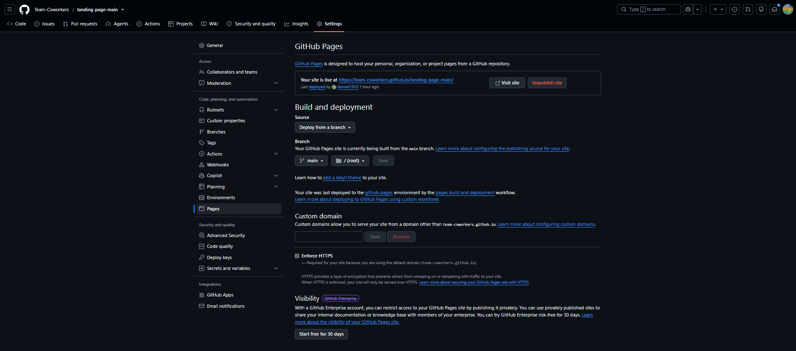

*Figura 5.1. Configuración y estado del despliegue de la Landing Page en GitHub Pages.*

Los destinos de despliegue de la Frontend Web Application y de su API de datos de
demostración se definieron en el Sprint 2. El siguiente registro resume la configuración
de despliegue de cada producto:

| Producto | Entorno objetivo | Fuente | Build | Publicación | URL pública |
| --- | --- | --- | --- | --- | --- |
| Landing Page | GitHub Pages | Rama `main` y carpeta `/ (root)` de `landing-page-main` | No requiere build: el sitio se sirve como HTML, CSS y JavaScript estáticos. | Automática al integrar un release en `main`. | https://team-coworkers.github.io/landing-page-main/ |
| Frontend Web Application | GitHub Pages | Rama `main` de `hostera-frontend` | `npm run build:pages`, que compila con `--base-href /hostera-frontend/`. | Workflow `deploy-pages.yml` de GitHub Actions, en cada push a `main`. | https://team-coworkers.github.io/hostera-frontend/ |
| API de datos de demostración | Navegador del usuario (GitHub Pages) y, como alternativa, Render | `server/data/*.json` de `hostera-frontend` | El build copia los archivos a `demo-data/`. | Se publica junto con la aplicación; el Blueprint `render.yaml` permite publicarla en Render. | Dentro de la aplicación publicada |
| RESTful Web Services | Se elegirá en el Sprint 3 (AV2). | Repositorio de Web Services, que se creará en el Sprint 3. | `./mvnw package`, que genera el JAR de Spring Boot. | Se fijará junto con el proveedor elegido. | Se publicará en AV2. |

**Frontend Web Application.** El workflow `.github/workflows/deploy-pages.yml` instala
las dependencias con `npm ci`, ejecuta `npm run build:pages` y publica `dist/browser/`
con las acciones oficiales de GitHub Pages. Antes de publicar, copia `index.html` como
`404.html`, porque GitHub Pages devuelve ese archivo para cualquier ruta desconocida y así
el router de Angular resuelve los enlaces profundos, como `/bookings` o
`/sign-up?plan=professional`, al recargar la página. El workflow `test.yml` ejecuta las
pruebas unitarias en Chrome sin interfaz en cada push y pull request a `main` y
`develop`.

**API de datos de demostración.** La aplicación consulta una única URL base,
`hosteraApiUrl`, definida en `src/environments/`. En desarrollo apunta a json-server en
`http://localhost:3000`. En producción, la opción `demoApiEnabled` activa el interceptor
`demo-api.interceptor.ts`, que responde dentro del navegador con los mismos archivos de
`server/data/` y las mismas reglas de json-server: filtros por campo, orden, límite y las
operaciones `GET`, `POST`, `PUT`, `PATCH` y `DELETE`. Los cambios duran hasta recargar la
página. Así, la aplicación publicada muestra datos sin depender de un servidor externo.
El Blueprint `render.yaml` describe el mismo servicio para Render (`npm ci
--include=dev`, inicio con json-server y health check en `/properties`); para usarlo
basta con desactivar `demoApiEnabled`. Cuando se despliegue la RESTful API, ese mismo
valor se desactiva y `hosteraApiUrl` pasa a apuntar a la API.

**Servicio externo.** La aplicación consulta la API pública Nager.Date
(`https://date.nager.at/api/v3`), que no requiere clave. Su URL base y el país se
configuran en `src/environments/`.

**Verificación y rollback.** Después de cada despliegue se comprueba que la ruta raíz de
la aplicación carga el panorama operativo con datos, que `/sign-in` y
`/sign-up?plan=starter` abren directamente y que la Landing Page lleva a esas vistas. Si
una comprobación falla, el rollback consiste en volver a publicar la versión anterior:
el workflow de GitHub Pages se puede ejecutar a mano sobre el último tag estable, y la
Landing Page se republica desde el tag anterior de `main`. Como los despliegues se hacen
siempre desde `main`, la versión restituida corresponde a un tag registrado en el
`CHANGELOG.md` del repositorio.

Los procedimientos de migración de base de datos se documentarán junto con los RESTful
Web Services, porque la API de datos de demostración no utiliza un motor de base de
datos: su estado se define por completo en los archivos versionados del repositorio del
frontend.

## 5.2. Landing Page, Services & Applications Implementation

### 5.2.1. Sprint 1

#### 5.2.1.1. Sprint Planning 1

El Sprint Planning 1 se realizó para organizar la implementación de la Landing Page
de Hostera. El alcance del sprint comprende la Epic 1, `EP001 Landing Page
Experience`, y sus ocho User Stories asociadas. El equipo definió como resultado
esperado entregar la experiencia completa de la Landing Page, incluyendo su
publicación en GitHub Pages.

| Campo | Resumen |
| --- | --- |
| Sprint # | Sprint 1 |
| Sprint Planning Background | Planificación de la implementación de la Landing Page de Hostera y de las User Stories pertenecientes a la Epic 1 (`EP001`). |
| Date | 2026-09-12 |
| Time | 12:00 PM |
| Location | Virtual |
| Prepared By | Leon Naupari, Jorge Mateo (`mateool10`) |
| Attendees (to planning meeting) | Cuba Vega, Darnell Yadir (`darnell1910`); Flores Rios, Juan Diego (`YopoFlores`); Leon Naupari, Jorge Mateo (`mateool10`); Rudas Chavarria, Jose Gabriel (`josegabriel1604`); Santana Luna, José Antonio (`JhosBy2005`). |
| Sprint 0 Review Summary | No aplica, porque este es el primer sprint del proyecto. |
| Sprint 0 Retrospective Summary | No aplica, porque este es el primer sprint del proyecto. |
| Sprint 1 Goal | Nuestro enfoque está en ofrecer a los visitantes una experiencia completa y clara de la Landing Page de Hostera. Creemos que esto les permitirá comprender la propuesta de valor, identificar la alternativa adecuada según la escala de su operación y elegir el siguiente paso. Esto se confirmará cuando las 8 User Stories de `EP001` estén implementadas y la Landing Page se encuentre publicada y accesible en GitHub Pages. |
| Sprint 1 Goal Metric | El objetivo se considerará cumplido cuando las 8 de 8 User Stories de `EP001` estén implementadas (`100 %`) y la Landing Page se encuentre publicada y accesible en GitHub Pages. |
| Sprint 1 Velocity | 42 Story Points comprometidos para el sprint. |
| Sum of Story Points | 42 Story Points. |

El Sprint Goal se definió desde la perspectiva del visitante y del resultado del
producto: entregar una Landing Page funcional y públicamente accesible que comunique
la propuesta de valor de Hostera y sus alternativas de operación. La métrica combina
el avance funcional con la disponibilidad del producto publicado, por lo que no se
considera suficiente completar únicamente el código fuente sin publicar la Landing
Page.

Las User Stories incluidas en el Sprint 1 son las siguientes. Los Story Points
corresponden a la estimación registrada en el Product Backlog de Hostera.

| User Story ID | User Story | Story Points | Estado al cierre del sprint |
| --- | --- | :---: | --- |
| US001 | Understand the hotel-operations proposition | 5 | Implementada |
| US002 | Navigate the Landing Page sections and footer | 5 | Implementada |
| US003 | Find the independent-hotel path | 3 | Implementada |
| US004 | Find the small-chain path | 3 | Implementada |
| US005 | Understand the product benefits and operating flow | 5 | Implementada |
| US006 | Compare plans and choose a next step | 5 | Implementada |
| US007 | Explore product, team, and support content | 8 | Implementada |
| US008 | Use the English and Spanish Landing Page variants | 8 | Implementada |
| **Total** | **Epic 1: Landing Page Experience** | **42** | **8/8 implementadas** |

Al cierre del Sprint 1, el objetivo se considera cumplido: las ocho User Stories de
`EP001` fueron implementadas y la Landing Page se encuentra publicada en
[GitHub Pages](https://team-coworkers.github.io/landing-page-main/).

#### 5.2.1.2. Aspect Leaders and Collaborators

Durante el Sprint 1, los aspectos de trabajo se organizaron según las ocho User
Stories de la Epic 1 (`EP001 Landing Page Experience`). Esta organización permitió
asignar una persona líder para cada funcionalidad y mantener la colaboración del
resto del equipo durante su implementación, revisión e integración mediante Git Flow.

La asignación de líderes se basa en la persona responsable de la feature branch de
cada User Story en el [repositorio de Landing Page](https://github.com/Team-Coworkers/landing-page-main).
Los cuatro integrantes restantes se registran como colaboradores en cada aspecto,
de acuerdo con la dinámica de trabajo colaborativo definida para el Sprint 1.

En la matriz Leadership-and-Collaboration (LACX), `L` representa al líder del aspecto
y `C` representa a un colaborador:

| Team Member | GitHub Username | US001<br>Proposition | US002<br>Navigation | US003<br>Independent Path | US004<br>Small Chain | US005<br>Benefits and Flow | US006<br>Plans | US007<br>Product and Support | US008<br>Language |
| --- | --- | :---: | :---: | :---: | :---: | :---: | :---: | :---: | :---: |
| Cuba Vega, Darnell Yadir | `darnell1910` | C | L | C | C | C | C | C | C |
| Flores Rios, Juan Diego | `YopoFlores` | C | C | C | L | C | L | C | C |
| Leon Naupari, Jorge Mateo | `mateool10` | L | C | C | C | C | C | C | C |
| Rudas Chavarria, Jose Gabriel | `josegabriel1604` | C | C | L | C | C | C | L | C |
| Santana Luna, José Antonio | `JhosBY2005` | C | C | C | C | L | C | C | L |

Los líderes identificados para cada aspecto son Jorge Leon para la propuesta de
valor; Darnell Cuba para la navegación; Jose Rudas para el camino del hotel
independiente y el contenido de producto; Juan Diego Flores para el camino de la
cadena hotelera pequeña y la comparación de planes; y José Santana para los
beneficios, el flujo operativo y la variante multilingüe. El reparto se definió
equilibrando las horas estimadas de los Work-Items de cada aspecto, de modo que la
carga por integrante se mantuviera entre 18 y 24 horas sobre un total de 106, según
la descomposición detallada en el Sprint Backlog 1. Medidas en Story Points, las ocho
User Stories de la Epic 1 suman los 42 puntos comprometidos como velocity del Sprint. La responsabilidad de liderazgo no
excluye la participación del resto del equipo, que colaboró en los ocho aspectos del
Sprint.

#### 5.2.1.3. Sprint Backlog 1

El Sprint Backlog 1 descompone el objetivo de implementar la experiencia completa de
la Landing Page en tareas concretas para las ocho User Stories de `EP001`. El Board
de YouTrack se utilizó para registrar las historias, sus responsables, los Story
Points y su pertenencia al Sprint 1. La [vista pública del Board de Hostera en
YouTrack](https://santanapromaster.youtrack.cloud/agiles/204-1/218-3) contiene el
seguimiento de estas User Stories.

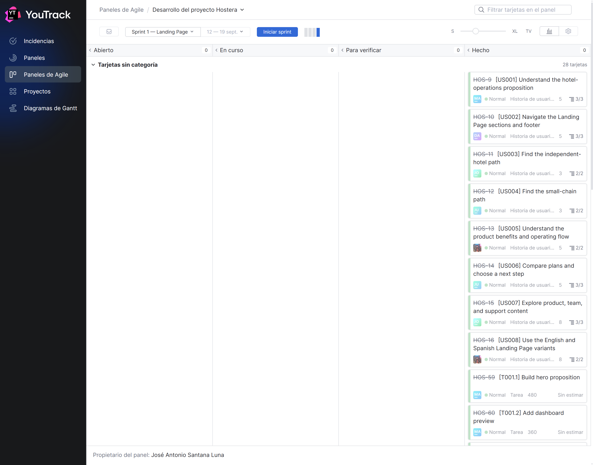

*Figura 5.2. Board de YouTrack con las User Stories asignadas al Sprint 1 de la Landing Page.*

La captura corresponde al Board al cierre del Sprint 1. La tabla siguiente
presenta la descomposición de trabajo y el estado al cierre del Sprint 1. Las horas
indicadas son estimaciones de planificación para cada Work-Item/Task y no sustituyen
la estimación relativa en Story Points de cada User Story.

<table>
  <thead>
    <tr>
      <th>Sprint #</th>
      <td colspan="7">Sprint 1</td>
    </tr>
    <tr>
      <th colspan="2">User Story</th>
      <th colspan="6">Work-Item / Task</th>
    </tr>
    <tr>
      <th>Story Id</th>
      <th>Story Title</th>
      <th>Task Id</th>
      <th>Task Title</th>
      <th>Task Description</th>
      <th>Estimation (Hours)</th>
      <th>Assigned To</th>
      <th>Status<br>(To-do / In-Process / To-Review / Done)</th>
    </tr>
  </thead>
  <tbody>
    <tr><td>US001</td><td>Understand the hotel-operations proposition</td><td>T001.1</td><td>Build hero proposition</td><td>Implementar el hero con el mensaje principal, la propuesta de valor, las áreas operativas y el CTA inicial.</td><td>8</td><td>Jorge Leon</td><td>Done</td></tr>
    <tr><td>US001</td><td>Understand the hotel-operations proposition</td><td>T001.2</td><td>Add dashboard preview</td><td>Incorporar la vista informativa del dashboard para representar reservas, habitaciones, inventario y accesos.</td><td>6</td><td>Jorge Leon</td><td>Done</td></tr>
    <tr><td>US001</td><td>Understand the hotel-operations proposition</td><td>T001.3</td><td>Explain the problem and solution</td><td>Implementar la sección que explica la fragmentación de la operación hotelera y la respuesta de Hostera.</td><td>6</td><td>Jorge Leon</td><td>Done</td></tr>
    <tr><td>US002</td><td>Navigate the Landing Page sections and footer</td><td>T002.1</td><td>Implement primary navigation</td><td>Crear el encabezado, las etiquetas de navegación, el control de idioma y el CTA principal.</td><td>5</td><td>Darnell Cuba</td><td>Done</td></tr>
    <tr><td>US002</td><td>Navigate the Landing Page sections and footer</td><td>T002.2</td><td>Implement footer navigation</td><td>Crear la navegación secundaria, el aviso de Team Coworkers y los enlaces hacia las secciones y términos.</td><td>5</td><td>Darnell Cuba</td><td>Done</td></tr>
    <tr><td>US002</td><td>Navigate the Landing Page sections and footer</td><td>T002.3</td><td>Add mobile navigation and terms page</td><td>Implementar el menú de navegación responsive y la página de términos y condiciones.</td><td>8</td><td>Darnell Cuba</td><td>Done</td></tr>
    <tr><td>US003</td><td>Find the independent-hotel path</td><td>T003.1</td><td>Add independent-hotel pathway</td><td>Implementar la tarjeta y el contenido del camino para un hotel independiente con hasta 10 habitaciones.</td><td>4</td><td>Jose Rudas</td><td>Done</td></tr>
    <tr><td>US003</td><td>Find the independent-hotel path</td><td>T003.2</td><td>Add Free plan details</td><td>Incorporar la información del plan Free y su CTA para iniciar la experiencia correspondiente.</td><td>4</td><td>Jose Rudas</td><td>Done</td></tr>
    <tr><td>US004</td><td>Find the small-chain path</td><td>T004.1</td><td>Add small-chain pathway</td><td>Implementar la tarjeta y el contenido del camino para una cadena hotelera pequeña de 2 a 5 ubicaciones.</td><td>4</td><td>Juan Diego Flores</td><td>Done</td></tr>
    <tr><td>US004</td><td>Find the small-chain path</td><td>T004.2</td><td>Add Professional plan details</td><td>Incorporar la información del plan Professional y su CTA para explorar la experiencia correspondiente.</td><td>4</td><td>Juan Diego Flores</td><td>Done</td></tr>
    <tr><td>US005</td><td>Understand the product benefits and operating flow</td><td>T005.1</td><td>Add connected-operations benefits</td><td>Implementar la sección de beneficios y las tarjetas de inventario centralizado y control de accesos.</td><td>5</td><td>José Santana</td><td>Done</td></tr>
    <tr><td>US005</td><td>Understand the product benefits and operating flow</td><td>T005.2</td><td>Add four-step operating flow</td><td>Implementar el flujo de cuatro pasos: añadir hoteles, configurar el equipo, conectar sistemas y operar.</td><td>4</td><td>José Santana</td><td>Done</td></tr>
    <tr><td>US006</td><td>Compare plans and choose a next step</td><td>T006.1</td><td>Add hotel-group pathway</td><td>Implementar el camino comercial para grupos hoteleros y la opción Enterprise.</td><td>5</td><td>Juan Diego Flores</td><td>Done</td></tr>
    <tr><td>US006</td><td>Compare plans and choose a next step</td><td>T006.2</td><td>Add plan comparison</td><td>Completar la comparación de planes, capacidades y CTA para Free, Professional y Enterprise.</td><td>6</td><td>Juan Diego Flores</td><td>Done</td></tr>
    <tr><td>US006</td><td>Compare plans and choose a next step</td><td>T006.3</td><td>Add closing actions and sales contact</td><td>Implementar el panel de cierre, las acciones principales y el siguiente paso de contacto comercial.</td><td>4</td><td>Juan Diego Flores</td><td>Done</td></tr>
    <tr><td>US007</td><td>Explore product, team, and support content</td><td>T007.1</td><td>Add product discovery content</td><td>Implementar el área de producto y el punto de entrada para descubrir Hostera.</td><td>5</td><td>Jose Rudas</td><td>Done</td></tr>
    <tr><td>US007</td><td>Explore product, team, and support content</td><td>T007.2</td><td>Add team content</td><td>Implementar la sección del equipo, sus integrantes y el punto de entrada para conocerlo.</td><td>6</td><td>Jose Rudas</td><td>Done</td></tr>
    <tr><td>US007</td><td>Explore product, team, and support content</td><td>T007.3</td><td>Add support FAQ</td><td>Implementar las preguntas frecuentes con estados expandido y contraído.</td><td>5</td><td>Jose Rudas</td><td>Done</td></tr>
    <tr><td>US008</td><td>Use the English and Spanish Landing Page variants</td><td>T008.1</td><td>Implement English and Spanish content</td><td>Incorporar las variantes de contenido, navegación, caminos, planes y CTA en inglés y español.</td><td>8</td><td>José Santana</td><td>Done</td></tr>
    <tr><td>US008</td><td>Use the English and Spanish Landing Page variants</td><td>T008.2</td><td>Preserve language selection</td><td>Mantener el idioma seleccionado al navegar hacia los términos y corregir la transición visual del cambio de idioma.</td><td>4</td><td>José Santana</td><td>Done</td></tr>
  </tbody>
</table>

#### 5.2.1.4. Development Evidence for Sprint Review

La evidencia de desarrollo del Sprint 1 corresponde al repositorio público de la
[Landing Page de Hostera](https://github.com/Team-Coworkers/landing-page-main).
Los commits funcionales se organizaron en once ramas `feature/*`, una por
sección construida, siguiendo el flujo Git Flow del equipo: cada rama se creó a
partir de `develop`, acumuló los commits de su sección y se integró mediante un
merge explícito. La tabla registra los 28 commits de implementación del sprint;
los commits de merge y de release no se repiten porque únicamente integran o
documentan estos cambios.

| Repository | Branch | Commit Id | Commit Message | Commit Message Body | Committed on (Date) |
|---|---|---|---|---|---|
| [landing-page-main](https://github.com/Team-Coworkers/landing-page-main) | `feature/site-shell` | [`5351dbd`](https://github.com/Team-Coworkers/landing-page-main/commit/5351dbd4dd0bb04b0c1faeba8490254b29f24fb6) | `feat(shell): add semantic landing page structure` | Define la estructura semántica completa de la página en `index.html`, con las secciones de propuesta de valor, segmentos, beneficios, flujo operativo, planes, producto, equipo y soporte. | 2026-09-19 |
| [landing-page-main](https://github.com/Team-Coworkers/landing-page-main) | `feature/site-shell` | [`61914a0`](https://github.com/Team-Coworkers/landing-page-main/commit/61914a08213983fd78e20b82636c2feb914110a0) | `style(shell): build responsive site header` | Construye la cabecera con la navegación principal, el selector de idioma y la acción Start for free, con comportamiento responsivo. | 2026-09-19 |
| [landing-page-main](https://github.com/Team-Coworkers/landing-page-main) | `feature/site-shell` | [`84b0ce0`](https://github.com/Team-Coworkers/landing-page-main/commit/84b0ce08ebd9fb96b726341c359e1a8c37fb2bb1) | `style(shell): complete navigation footer` | Completa el pie de página con la navegación secundaria, los enlaces legales y la línea editorial de Team Coworkers. | 2026-09-19 |
| [landing-page-main](https://github.com/Team-Coworkers/landing-page-main) | `feature/hero` | [`2869a48`](https://github.com/Team-Coworkers/landing-page-main/commit/2869a485c806f635f0f80ea257ca92397f3ca00a) | `style(hero): create responsive hero presentation` | Presenta la propuesta de valor principal con titular, subtítulo y llamada a la acción adaptados a escritorio y móvil. | 2026-09-19 |
| [landing-page-main](https://github.com/Team-Coworkers/landing-page-main) | `feature/hero` | [`da0e497`](https://github.com/Team-Coworkers/landing-page-main/commit/da0e4973e0fb67c01b51e0d50b8c6360b87fc91d) | `feat(hero): add product dashboard preview` | Incorpora la vista previa del panel operativo con reservas, habitaciones, inventario y accesos. | 2026-09-19 |
| [landing-page-main](https://github.com/Team-Coworkers/landing-page-main) | `feature/solutions` | [`9e12ae4`](https://github.com/Team-Coworkers/landing-page-main/commit/9e12ae4f70dad2d1bc1c2dfcb2d3796a214f00b7) | `style(solutions): present hotel segments` | Presenta los tres caminos según la escala del hotel: propiedad independiente, cadena pequeña y grupo hotelero. | 2026-09-19 |
| [landing-page-main](https://github.com/Team-Coworkers/landing-page-main) | `feature/solutions` | [`b737752`](https://github.com/Team-Coworkers/landing-page-main/commit/b73775275905e579e957bd5cb8337b53c0864828) | `feat(solutions): add hotel operations visual` | Agrega el recurso visual que acompaña la explicación de la operación hotelera diaria. | 2026-09-19 |
| [landing-page-main](https://github.com/Team-Coworkers/landing-page-main) | `feature/solutions` | [`cf72b04`](https://github.com/Team-Coworkers/landing-page-main/commit/cf72b043e06367ec3bb0c020a699021980539207) | `style(problem): explain disconnected operations` | Explica el problema de la operación fragmentada y posiciona a Hostera como el punto de conexión entre reservas, habitaciones, inventario y acceso. | 2026-09-19 |
| [landing-page-main](https://github.com/Team-Coworkers/landing-page-main) | `feature/benefits-workflow` | [`892d7b0`](https://github.com/Team-Coworkers/landing-page-main/commit/892d7b01440eb45275bfb38628f1087efde384f7) | `style(benefits): lay out operational benefits` | Organiza los beneficios operativos: ocupación, preparación de habitaciones, inventario y acceso de huéspedes. | 2026-09-19 |
| [landing-page-main](https://github.com/Team-Coworkers/landing-page-main) | `feature/benefits-workflow` | [`85a2bfe`](https://github.com/Team-Coworkers/landing-page-main/commit/85a2bfeacbce5b62a231ec1671ff21c51a3a9013) | `feat(benefits): add RFID access visual` | Incorpora el recurso visual del control de acceso RFID de huéspedes. | 2026-09-19 |
| [landing-page-main](https://github.com/Team-Coworkers/landing-page-main) | `feature/benefits-workflow` | [`105d047`](https://github.com/Team-Coworkers/landing-page-main/commit/105d047e28c2859b7411fc28dce56e9739ca1b3e) | `style(workflow): build onboarding sequence` | Construye la secuencia de cuatro pasos: agregar hoteles, configurar el equipo, conectar sistemas y operar. | 2026-09-19 |
| [landing-page-main](https://github.com/Team-Coworkers/landing-page-main) | `feature/pricing` | [`0469398`](https://github.com/Team-Coworkers/landing-page-main/commit/046939823c1da9b706eed78c960c823a5ea55da6) | `style(pricing): add free plan presentation` | Presenta el plan Free para una propiedad de hasta 10 habitaciones con las prestaciones incluidas. | 2026-09-19 |
| [landing-page-main](https://github.com/Team-Coworkers/landing-page-main) | `feature/pricing` | [`b514c06`](https://github.com/Team-Coworkers/landing-page-main/commit/b514c0601d630c489b55d56a3e1dd2d09e97cdb5) | `style(pricing): add professional and enterprise plans` | Agrega los planes Professional para 2 a 5 sedes y Enterprise para grupos hoteleros grandes o multinacionales. | 2026-09-19 |
| [landing-page-main](https://github.com/Team-Coworkers/landing-page-main) | `feature/pricing` | [`09ac561`](https://github.com/Team-Coworkers/landing-page-main/commit/09ac561efcdd0a0fb7e34990c3cf39331a524bbe) | `feat(pricing): connect sales contact actions` | Conecta las acciones Talk to sales con el paso de contacto comercial del plan Enterprise. | 2026-09-19 |
| [landing-page-main](https://github.com/Team-Coworkers/landing-page-main) | `feature/product-discovery` | [`3c21f63`](https://github.com/Team-Coworkers/landing-page-main/commit/3c21f637b07a51e8944146682a93cc199daadffa) | `style(product): create discovery section` | Crea la sección de descubrimiento del producto con el área multimedia y el control de reproducción. | 2026-09-19 |
| [landing-page-main](https://github.com/Team-Coworkers/landing-page-main) | `feature/product-discovery` | [`05abe59`](https://github.com/Team-Coworkers/landing-page-main/commit/05abe59445eb5509dfb18df80b690147882b5c5e) | `feat(motion): add guided scroll transitions` | Añade las transiciones guiadas por desplazamiento que revelan progresivamente el contenido de cada sección. | 2026-09-19 |
| [landing-page-main](https://github.com/Team-Coworkers/landing-page-main) | `feature/team` | [`255a442`](https://github.com/Team-Coworkers/landing-page-main/commit/255a44225ab6ac7316ada563b712932f667da337) | `style(team): build team member grid` | Construye la grilla del equipo con retrato, nombre, rol y descripción de cada integrante. | 2026-09-19 |
| [landing-page-main](https://github.com/Team-Coworkers/landing-page-main) | `feature/team` | [`12dad83`](https://github.com/Team-Coworkers/landing-page-main/commit/12dad83b04b54fb0c5a2a985c7aef69c0f7263fa) | `feat(team): add optimized member portraits` | Incorpora los retratos optimizados de los integrantes para la sección de equipo. | 2026-09-19 |
| [landing-page-main](https://github.com/Team-Coworkers/landing-page-main) | `feature/team` | [`a4c8acf`](https://github.com/Team-Coworkers/landing-page-main/commit/a4c8acfceef65b43187759e12794e20c636e848d) | `assets(team): preserve original profile images` | Conserva las imágenes de perfil en su resolución original como respaldo de los retratos publicados. | 2026-09-19 |
| [landing-page-main](https://github.com/Team-Coworkers/landing-page-main) | `feature/support-closing` | [`4711665`](https://github.com/Team-Coworkers/landing-page-main/commit/4711665cfae9426f96e443c5b6797b6ba70e8450) | `style(support): add FAQ and support layout` | Agrega la sección de soporte con las preguntas frecuentes desplegables. | 2026-09-19 |
| [landing-page-main](https://github.com/Team-Coworkers/landing-page-main) | `feature/support-closing` | [`0caf07b`](https://github.com/Team-Coworkers/landing-page-main/commit/0caf07b8a05538428ecaeb5441ed13ea5c5c2bc2) | `style(closing): complete final call to action` | Completa el cierre de la página repitiendo Start for free y Talk to sales. | 2026-09-19 |
| [landing-page-main](https://github.com/Team-Coworkers/landing-page-main) | `feature/localization` | [`49f96c2`](https://github.com/Team-Coworkers/landing-page-main/commit/49f96c2659ef2135a350d9153143de7ef26eb9f3) | `feat(i18n): add English and Spanish content` | Implementa el intercambio de contenido entre inglés y español sobre una única página. | 2026-09-19 |
| [landing-page-main](https://github.com/Team-Coworkers/landing-page-main) | `feature/localization` | [`47b2092`](https://github.com/Team-Coworkers/landing-page-main/commit/47b20920748bc9ef12a0a15862d5f00ba61e6f2c) | `feat(navigation): add responsive menu behavior` | Habilita el menú de navegación para pantallas pequeñas manteniendo los mismos destinos. | 2026-09-19 |
| [landing-page-main](https://github.com/Team-Coworkers/landing-page-main) | `feature/legal` | [`2bc0b7f`](https://github.com/Team-Coworkers/landing-page-main/commit/2bc0b7fbc31b30841a844f6e656573504ae48905) | `feat(legal): add terms and conditions page` | Publica la página de Términos y Condiciones como destino propio enlazado desde el pie. | 2026-09-19 |
| [landing-page-main](https://github.com/Team-Coworkers/landing-page-main) | `feature/legal` | [`2935767`](https://github.com/Team-Coworkers/landing-page-main/commit/29357673986f9b960ff7fbbb2a2955745dfd28c1) | `style(legal): format terms content` | Da formato al contenido legal para mantener la legibilidad y la consistencia visual. | 2026-09-19 |
| [landing-page-main](https://github.com/Team-Coworkers/landing-page-main) | `feature/documentation` | [`8086b73`](https://github.com/Team-Coworkers/landing-page-main/commit/8086b7347ece137e67f942278af40690db5ee560) | `docs: define landing page user stories` | Documenta las User Stories que delimitan el alcance de la Landing Page. | 2026-09-19 |
| [landing-page-main](https://github.com/Team-Coworkers/landing-page-main) | `feature/documentation` | [`4217b56`](https://github.com/Team-Coworkers/landing-page-main/commit/4217b569bf07426a18920a56d29180dbb7c4ca36) | `docs: add project setup and product overview` | Documenta la configuración del proyecto y el panorama general del producto. | 2026-09-19 |
| [landing-page-main](https://github.com/Team-Coworkers/landing-page-main) | `feature/documentation` | [`02f7866`](https://github.com/Team-Coworkers/landing-page-main/commit/02f7866ce5d06eb248dff469209cbcb3b19e991f) | `docs: record initial landing page release` | Registra la primera publicación de la Landing Page en el changelog. | 2026-09-19 |

#### 5.2.1.5. Execution Evidence for Sprint Review

Durante el Sprint 1 se completó la experiencia principal de la Landing Page para
las ocho User Stories de `EP001`. La versión ejecutable está disponible en
[https://team-coworkers.github.io/landing-page-main/](https://team-coworkers.github.io/landing-page-main/).
La navegación permite recorrer la propuesta de valor, los caminos según la
escala del hotel, los beneficios operativos, el flujo de trabajo, los planes,
la información del producto y del equipo, las preguntas frecuentes y el
formulario de contacto comercial. También se verificó la disponibilidad de las
variantes en inglés y español.

Las siguientes capturas muestran las principales vistas alcanzadas en el Sprint
Review:

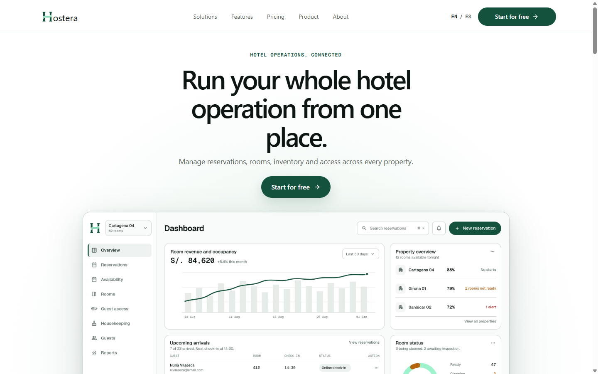

*Figura 5.3. Vista principal de la Landing Page desplegada en GitHub Pages.*

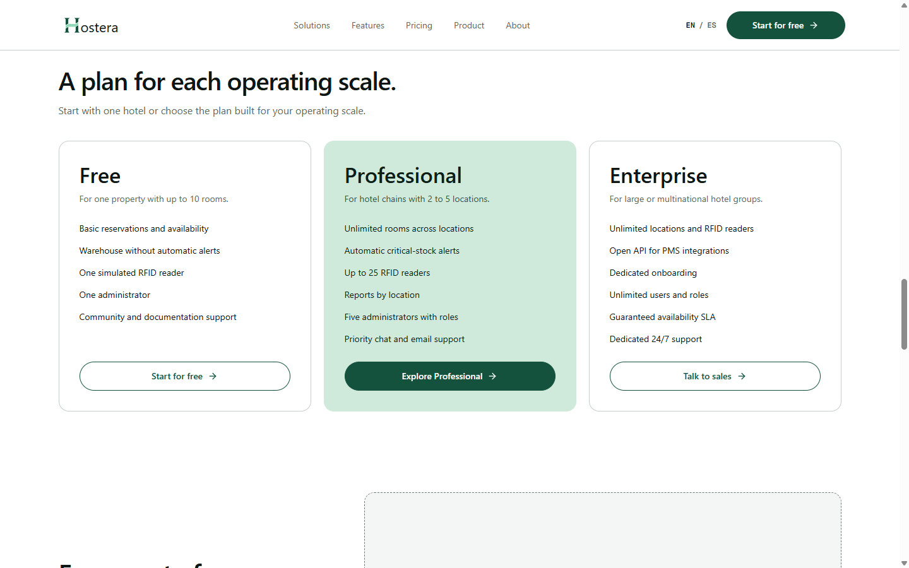

*Figura 5.4. Vista de comparación de planes Free, Professional y Enterprise.*

Como evidencia de navegación, se incorpora el [video de demostración de
Hostera](https://1drv.ms/f/c/8d4ae682dbad6a14/IgDpv3unJcdXQJ0d3eyvjDjBATcwFeKcn-JrAaMoJk2_5jQ?e=bsHpeN).
El video muestra los principales recorridos de navegación de la Landing Page,
incluyendo la propuesta de valor, los caminos según la escala del hotel, los
beneficios, el flujo operativo, la comparación de planes, el contenido del
producto y del equipo, las preguntas frecuentes y el cambio entre inglés y
español.

#### 5.2.1.6. Services Documentation Evidence for Sprint Review

El alcance del Sprint 1 estuvo concentrado en la implementación de la Landing
Page. Por ese motivo, durante este sprint no se implementaron Web Services ni
endpoints HTTP, y no se generó documentación OpenAPI asociada. El repositorio de
la Landing Page contiene la experiencia web estática y se encuentra disponible en
el [repositorio de Landing Page de Hostera](https://github.com/Team-Coworkers/landing-page-main).
La documentación de endpoints y sus evidencias se incorporará en el sprint en
el que se implemente el repositorio de Web Services.

| Repository | Endpoint | Actions / HTTP Verb | OpenAPI Documentation | Documentation Commit |
|---|---|---|---|---|
| [landing-page-main](https://github.com/Team-Coworkers/landing-page-main) | — | — | — | — |

Por lo tanto, no corresponde incluir capturas de interacción con Swagger u otra
documentación de servicios para el Sprint 1.

#### 5.2.1.7. Software Deployment Evidence for Sprint Review

Durante el Sprint 1 se completó el despliegue de la Landing Page en GitHub Pages.
El procedimiento consistió en seleccionar **Deploy from a branch** como fuente de
publicación, elegir la rama `main`, seleccionar la carpeta `/ (root)` y guardar la
configuración. GitHub Pages ejecutó posteriormente su flujo de build and deployment
y publicó el sitio en el entorno `github-pages`.

| Product | Repository | Deployment Platform | Source | Public URL | Sprint Status |
|---|---|---|---|---|---|
| Landing Page | [landing-page-main](https://github.com/Team-Coworkers/landing-page-main) | GitHub Pages | `main` / `/ (root)` | [Open Landing Page](https://team-coworkers.github.io/landing-page-main/) | Deployed |
| Web Services | — | — | — | — | Not in Sprint 1 scope |
| Frontend Web Applications | — | — | — | — | Not in Sprint 1 scope |

La configuración y el estado publicado se evidencian en la siguiente captura:


*Figura 5.5. Evidencia del despliegue de la Landing Page mediante GitHub Pages.*

La Landing Page quedó accesible públicamente en la URL indicada. Los destinos de
despliegue de Web Services y Frontend Web Applications se documentarán en el sprint
correspondiente a su implementación.

#### 5.2.1.8. Team Collaboration Insights during Sprint

La colaboración del Sprint 1 se organizó alrededor de la implementación de las
ocho User Stories de `EP001`. Todos los integrantes participaron en la
implementación de la Landing Page mediante ramas de trabajo y commits asociados
a las User Stories, mientras que la integración se realizó siguiendo Git Flow.
La reunión de planificación se realizó de forma virtual el 12 de septiembre de
2026 y contó con la asistencia de todos los integrantes.

La siguiente relación resume los 28 commits funcionales registrados en la
sección 5.2.1.4, sin contar los commits de merge ni los commits posteriores de
release. El trabajo se distribuyó entre las once ramas de la Epic 1 y varios
integrantes contribuyeron sobre una misma rama, por lo que la relación se
presenta por rama de trabajo y no por atribución exclusiva de una User Story:

| Integrante | Ramas de la Epic 1 en las que registró commits | Commits funcionales del Sprint 1 |
|---|---|---:|
| Darnell Cuba (`darnell1910`) | `feature/site-shell`, `feature/solutions`, `feature/benefits-workflow`, `feature/product-discovery`, `feature/support-closing`, `feature/documentation` | 6 |
| Juan Diego Flores (`YopoFlores`) | `feature/site-shell`, `feature/solutions`, `feature/pricing`, `feature/team`, `feature/localization`, `feature/documentation` | 6 |
| Jorge Leon (`mateool10`) | `feature/site-shell`, `feature/solutions`, `feature/pricing`, `feature/team`, `feature/localization`, `feature/documentation` | 6 |
| Jose Rudas (`josegabriel1604`) | `feature/hero`, `feature/benefits-workflow`, `feature/pricing`, `feature/team`, `feature/legal` | 5 |
| José Santana (`JhosBy2005`) | `feature/hero`, `feature/benefits-workflow`, `feature/product-discovery`, `feature/support-closing`, `feature/legal` | 5 |
| **Total** | **Once ramas de la Epic 1** | **28** |

La captura del analítico de GitHub muestra la actividad de contribución del
repositorio de la Landing Page. El historial de commits permite complementar
este analítico con la identificación de las ramas, autores y mensajes asociados
con cada User Story.

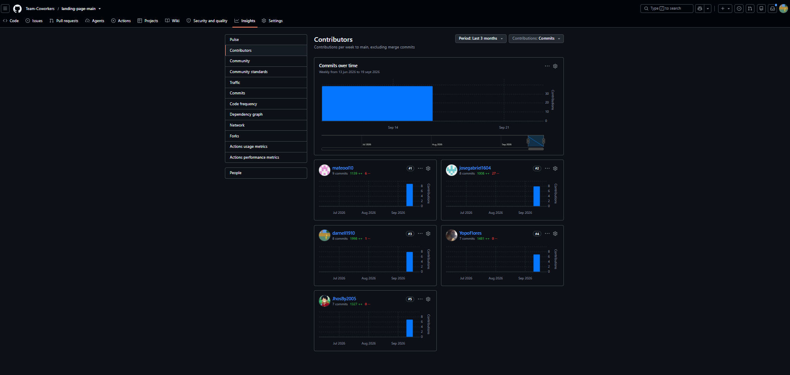

*Figura 5.6. Analítico de contribuciones del repositorio de la Landing Page en GitHub.*

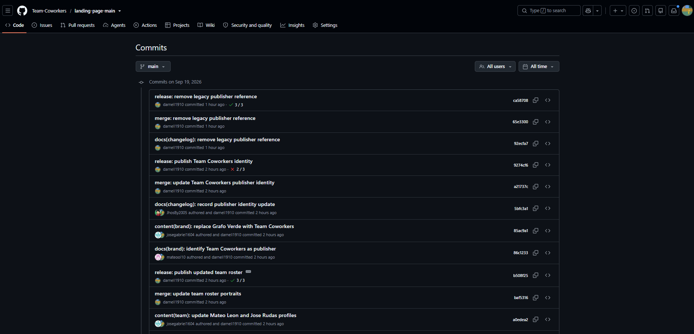

*Figura 5.7. Historial de commits del repositorio de la Landing Page en la rama `main`.*

La evidencia muestra una participación repartida entre los cinco integrantes,
con una carga de entre cinco y seis commits por persona, y una integración
progresiva de los cambios rama por rama. A diferencia del Sprint Backlog, donde
cada Work-Item se asignó a un responsable único, la ejecución fue colaborativa:
la mayoría de las ramas reúne commits de más de un integrante. Cada
contribución queda respaldada por los commits detallados en la evidencia de
desarrollo del Sprint Review.

# Conclusiones

## Conclusiones y recomendaciones

El trabajo realizado permitió convertir la propuesta inicial de Hostera en una
Landing Page funcional y públicamente accesible. Al cierre del Sprint 1 se
implementaron las ocho User Stories de `EP001`, con 42 Story Points completados,
y se publicó la Landing Page mediante GitHub Pages. La entrega comunica la
propuesta de valor, diferencia los caminos para hoteles independientes, cadenas
pequeñas y grupos hoteleros, presenta los beneficios y planes de Hostera, y
ofrece navegación en inglés y español.

**Conclusión sobre el Problem Statement.** La Landing Page responde al problema
identificado al comunicar la necesidad de coordinar reservas, habitaciones,
inventario y accesos desde una visión común. También hace explícita la promesa de
Hostera de conectar estas áreas. Sin embargo, esta entrega demuestra la
comunicación de la solución y no todavía la resolución operativa del problema:
la reducción de conciliación manual, la actualización de datos, la trazabilidad
RFID y la coordinación entre sedes deberán comprobarse cuando estén disponibles
la Web Application, los Web Services y los escenarios de validación.

**Conclusión sobre los segmentos y assumptions.** La estructura de la Landing
Page refleja los segmentos priorizados en el proyecto: hoteles independientes,
cadenas pequeñas y grupos hoteleros. Esta decisión permitió organizar una
experiencia de descubrimiento y orientar cada segmento hacia un siguiente paso.
No obstante, los supuestos sobre las necesidades, hábitos de trabajo, disposición
de pago y valor percibido por cada segmento deben mantenerse como hipótesis de
negocio que se seguirán contrastando durante la evolución del producto. La
priorización actual ofrece una base coherente para organizar el roadmap y definir
los siguientes experimentos de producto.

**Conclusión sobre los Hypothesis Statements.** Las hipótesis relacionadas con
el panel centralizado, la gestión de reservas, el inventario, la trazabilidad RFID
y la administración de una o varias sedes reciben respaldo inicial en la propuesta
de valor y en la organización de los recorridos del producto. La Landing Page
presenta estos beneficios, pero todavía se necesitan la interacción operativa y
los datos de uso de las aplicaciones para comparar una línea base. Por tanto, los
umbrales de mejora del 5 % definidos en los Hypothesis Statements permanecen
pendientes de medición.

| Hypothesis Statement | Resultado al cierre del Sprint 1 | Evidencia necesaria para evaluarlo |
|---|---|---|
| Panel administrativo centralizado | La propuesta comunica el valor de una visión común, pero el panel operativo aún forma parte del roadmap. | Web Application funcional, tareas representativas y comparación con una línea base. |
| Gestión de reservas y disponibilidad | La necesidad está reflejada en la propuesta; faltan los servicios y flujos operativos para medir el resultado. | Escenarios de consulta y actualización, tiempo de tarea e inconsistencias detectadas. |
| Registro y consulta del inventario | La Landing Page comunica el beneficio de la centralización, mientras que la operación de inventario se implementará posteriormente. | Movimientos registrados, consultas de existencias y pruebas de control. |
| Control y trazabilidad de accesos RFID | La propuesta reconoce la trazabilidad como capacidad prioritaria; la integración RFID aún no forma parte del Sprint 1. | Eventos relacionados con tarjeta, habitación y usuario, además del tiempo de consulta. |
| Administración de una o varias sedes | Los caminos y planes de la Landing Page representan distintas escalas; falta comprobar la operación multi-sede. | Escenarios de una y varias sedes sin duplicidad ni pérdida de contexto. |

**Conclusión sobre los criterios de éxito.** El criterio de entrega definido para
el Sprint 1 se cumplió: las ocho User Stories de `EP001` fueron implementadas y
la Landing Page quedó publicada y accesible. Este resultado confirma el avance de
implementación del producto y del trabajo colaborativo, pero no sustituye los
criterios de éxito del Lean UX, que requieren observar tareas reales con
información centralizada, actualizada y relacionada. Esos indicadores deberán
medirse después de implementar los productos operativos y realizar las
evaluaciones de uso correspondientes.

**Recomendaciones para el roadmap.**

| Prioridad | Siguiente paso recomendado | Resultado esperado |
|---:|---|---|
| 1 | Implementar la primera versión de la Web Application a partir de las User Stories de acceso y operación, comenzando por registro, autenticación, dashboard y navegación operacional (`US009`, `US010`, `US011` y `US033`). | Permitir que un usuario autorizado consulte la operación y conserve el contexto de su propiedad. |
| 2 | Implementar los Web Services correspondientes y documentar cada endpoint con OpenAPI, incluyendo acciones, verbos HTTP, parámetros y respuestas. | Proporcionar una base verificable para la Web Application y para futuras integraciones. |
| 3 | Incorporar progresivamente reservas, habitaciones, inventario, reportes y control de accesos RFID con pruebas de escenarios normales y alternativos. | Generar la evidencia necesaria para evaluar las cinco hipótesis y sus metas del 5 %. |
| 4 | Conectar los CTA de la Landing Page con las experiencias implementadas y desplegar los productos en sus entornos correspondientes. | Mantener una experiencia consistente entre el descubrimiento en la Landing Page y la operación en las aplicaciones. |
| 5 | Mantener Git Flow, Conventional Commits, documentación en cada repositorio y analíticos de colaboración por sprint. | Conservar trazabilidad de cambios, responsabilidades, integración y evolución del producto. |

En síntesis, el Sprint 1 logró una primera entrega publicable y coherente con la
propuesta de Hostera. La principal conclusión del ciclo actual es que la
comunicación del producto ya puede ser evaluada públicamente, mientras que el
valor operativo y las hipótesis de negocio todavía requieren implementación y
validación con usuarios reales.

## Video About-the-Team

This is program for AV2 (not in AV1)

# Bibliografía

[1] Progressa Lean. (2021, 13 de mayo). [_5W+2H: Técnica de análisis de problemas_](https://www.progressalean.com/5w2h-tecnica-de-analisis-de-problemas/).

[2] Gothelf, J., & Seiden, J. (2021). _Lean UX: Creating Great Products with Agile Teams_ (3rd ed.). O'Reilly Media.

[3] Universidad Peruana de Ciencias Aplicadas. (2021). _Lean & Hypothesis-Driven Development_ [Material de clase].

[4] Ministerio de Comercio Exterior y Turismo. (2025, 6 de junio). [_Perú: Oferta y Demanda de Establecimientos de Hospedaje - Año 2024_](https://www.gob.pe/institucion/mincetur/informes-publicaciones/6844713-informe-peru-oferta-y-demanda-de-establecimientos-de-hospedaje-ano-2024).

[5] HotelClick. (s. f.). [_Sistema de Administración y Gestión Hotelera para Perú: Nexus PMS_](https://hotelclick.net.pe/). Recuperado el 4 de septiembre de 2026.

[6] Montalvo Soluciones Tecnológicas S.A.C. (s. f.). [_Sistema hotelero para hoteles en Perú: PMS con facturación SUNAT — OkFac_](https://okfac.pe/sistema-hotelero-peru). Recuperado el 4 de septiembre de 2026.

[7] SysHotel. (s. f.). [_PMS hotelero en Perú: software de gestión hotelera_](https://syshotel.app/). Recuperado el 4 de septiembre de 2026.

[8] Oracle Hospitality. (s. f.). [_What is a Hotel PMS (Property Management System)?_](https://www.oracle.com/ca-en/hospitality/what-is-hotel-pms/). Recuperado el 5 de septiembre de 2026.

[9] STR. (s. f.). [_How to calculate RevPAR_](https://str.com/sites/default/files/The-Ultimate-Guide-to-Hotel-Benchmarking.pdf). Recuperado el 5 de septiembre de 2026.

[10] Google. (s. f.). [_Material Design 3_](https://m3.material.io/). Recuperado el 5 de septiembre de 2026.

[11] World Wide Web Consortium. (2024). [_Web Content Accessibility Guidelines (WCAG) 2.2_](https://www.w3.org/TR/WCAG22/). Recuperado el 5 de septiembre de 2026.

[12] Driessen, V. (2010). [_A successful Git branching model_](https://nvie.com/posts/a-successful-git-branching-model/). Recuperado el 16 de septiembre de 2026.

[13] Preston-Werner, T. (s. f.). [_Semantic Versioning 2.0.0_](https://semver.org/). Recuperado el 16 de septiembre de 2026.

[14] Conventional Commits. (s. f.). [_Conventional Commits 1.0.0_](https://www.conventionalcommits.org/en/v1.0.0/). Recuperado el 16 de septiembre de 2026.

[15] Google. (s. f.). [_Google HTML/CSS Style Guide_](https://google.github.io/styleguide/htmlcssguide.html). Recuperado el 16 de septiembre de 2026.

[16] Angular. (s. f.). [_Angular coding style guide_](https://angular.dev/style-guide). Recuperado el 16 de septiembre de 2026.

[17] Microsoft. (s. f.). [_The TypeScript Handbook_](https://www.typescriptlang.org/docs/handbook/intro.html). Recuperado el 16 de septiembre de 2026.

[18] Angular. (s. f.). [_Angular CLI_](https://angular.dev/tools/cli). Recuperado el 16 de septiembre de 2026.

[19] JSDoc. (s. f.). [_JSDoc Documentation_](https://jsdoc.app/). Recuperado el 16 de septiembre de 2026.

[20] Mozilla Developer Network. (s. f.). [_JavaScript modules_](https://developer.mozilla.org/en-US/docs/Web/JavaScript/Guide/Modules). Recuperado el 16 de septiembre de 2026.

[21] ECMA International. (s. f.). [_ECMAScript® Language Specification_](https://tc39.es/ecma262/). Recuperado el 16 de septiembre de 2026.

[22] Google. (s. f.). [_Google JavaScript Style Guide_](https://google.github.io/styleguide/jsguide.html). Recuperado el 16 de septiembre de 2026.

[23] Oracle. (s. f.). [_Code Conventions for the Java Programming Language: Naming Conventions_](https://www.oracle.com/java/technologies/javase/codeconventions-namingconventions.html). Recuperado el 16 de septiembre de 2026.

[24] Spring. (s. f.). [_Spring Boot Reference Documentation_](https://docs.spring.io/spring-boot/reference/). Recuperado el 16 de septiembre de 2026.

<div style="page-break-before: always;"></div>

# Anexos

## Anexo A. Videos de exposiciones

- **AV1 – Sprint Review – Semana 4.** Exposición del informe y revisión del Sprint 1. [Enlace al video de exposición](https://1drv.ms/f/c/8d4ae682dbad6a14/IgCXbQYBxh5ZQLSHCeblDgTkAbiAPQvF9cBxkcFff5XFl_A?e=BxNv39).

<div style="page-break-before: always;"></div>

## Anexo B. Documentos y artefactos complementarios

- **Final Project Individual Member Performance Report (by Team Leader).** Documento independiente que debe enviarse junto con la entrega.
- **Final Project Keynote.** Archivo independiente de la presentación de la entrega.
- **Repositorio del informe.** [Hostera Project Report en GitHub](https://github.com/Team-Coworkers/Hostera-Project-Report-v2)
- **Repositorio de la Landing Page.** [Landing Page de Hostera en GitHub](https://github.com/Team-Coworkers/landing-page-main)
- **Landing Page desplegada.** [Abrir Landing Page](https://team-coworkers.github.io/landing-page-main/)
- **Board de seguimiento.** [Hostera en YouTrack](https://santanapromaster.youtrack.cloud/agiles/204-1/218-3)
